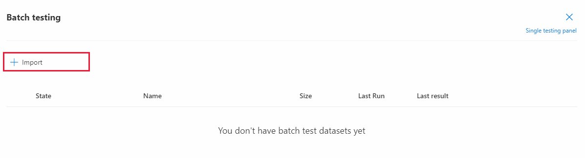
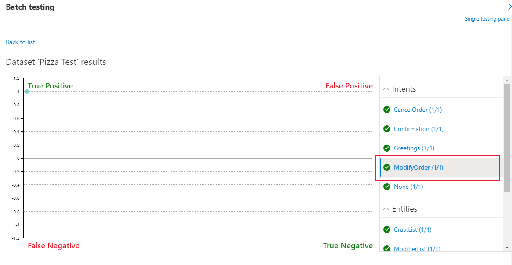
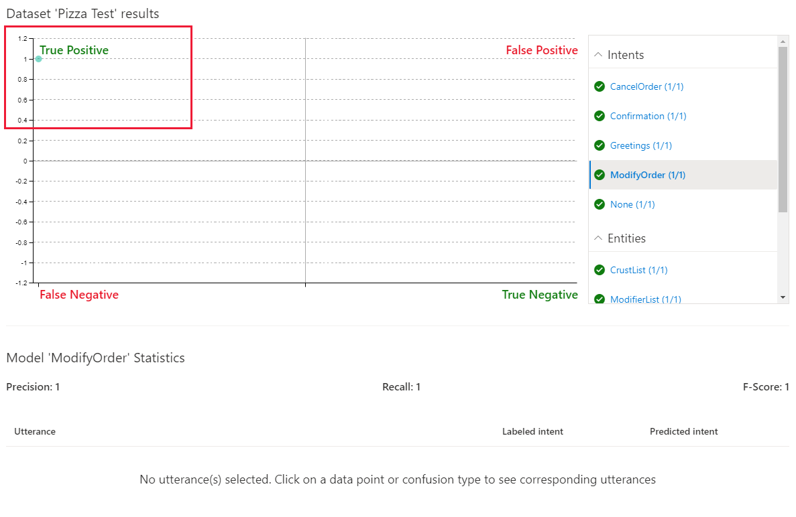
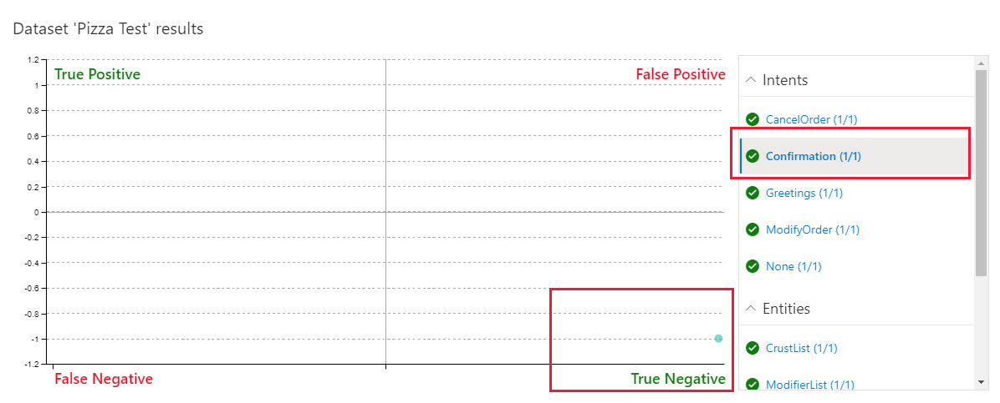

# Tutorial: Batch test data sets

This tutorial demonstrates how to use batch testing to validate the quality of your Language Understanding (LUIS) app.

Batch testing allows you to validate the active, trained model's state with a known set of labeled utterances and entities. In the JSON-formatted batch file, add the utterances and set the entity labels you need predicted inside the utterance.

Requirements for batch testing:

* Maximum of 1000 utterances per test.
* No duplicates.
* Entity types allowed: only machined-learned entities.

When using an app other than this tutorial, do *not* use the example utterances already added to your app.

**In this tutorial, you learn how to:**

<!-- green checkmark -->
> [!div class="checklist"]
> * Import example app
> * Create a batch test file
> * Run a batch test
> * Review test results

[!INCLUDE [LUIS Free account](../../../includes/cognitive-services-luis-free-key-short.md)]

## Import example app

Import an app that takes a pizza order such as `1 pepperoni pizza on thin crust`.

1.  Download and save [app JSON file](https://github.com/Azure-Samples/cognitive-services-sample-data-files/blob/master/luis/apps/pizza-with-machine-learned-entity.json?raw=true).

1. Sign in to the [LUIS portal](https://www.luis.ai), and select your **Subscription** and **Authoring resource** to see the apps assigned to that authoring resource.
1. Import the JSON into a new app, name the app `Pizza app`.

1. Select **Train** in the top-right corner of the navigation to train the app.

## What should the batch file utterances include

The batch file should include utterances with top-level machine-learning entities labeled including start and end position. The utterances should not be part of the examples already in the app. They should be utterances you want to positively predict for intent and entities.

You can separate out tests by intent and/or entity or have all the tests (up to 1000 utterances) in the same file.

## Batch file

The example JSON includes one utterance with a labeled entity to illustrate what a test file looks like. In your own tests, you should have many utterances with correct intent and machine-learning entity labeled.

1. Create `pizza-with-machine-learned-entity-test.json` in a text editor or [download](https://github.com/Azure-Samples/cognitive-services-sample-data-files/blob/master/luis/batch-tests/pizza-with-machine-learned-entity-test.json?raw=true) it.

2. In the JSON-formatted batch file, add an utterance with the **Intent** you want predicted in the test.

   [!code-json[Add the intents to the batch test file](~/samples-cognitive-services-data-files/luis/batch-tests/pizza-with-machine-learned-entity-test.json "Add the intent to the batch test file")]

## Run the batch

1. Select **Test** in the top navigation bar.

2. Select **Batch testing panel** in the right-side panel.

3. Select **Import dataset**.

    > [!div class="mx-imgBorder"]
    > 

4. Choose the file location of the `pizza-with-machine-learned-entity-test.json` file.

5. Name the dataset `pizza test` and select **Done**.

    > [!div class="mx-imgBorder"]
    > 

6. Select the **Run** button.

7. Select **See results**.

8. Review results in the graph and legend.

## Review batch results for intents

The test results show graphically how the test utterances were predicted against the active version.

The batch chart displays four quadrants of results. To the right of the chart is a filter. The filter contains intents and entities. When you select a [section of the chart](luis-concept-batch-test.md#batch-test-results) or a point within the chart, the associated utterance(s) display below the chart.

While hovering over the chart, a mouse wheel can enlarge or reduce the display in the chart. This is useful when there are many points on the chart clustered tightly together.

The chart is in four quadrants, with two of the sections displayed in red.

1. Select the **ModifyOrder** intent in the filter list.

    > [!div class="mx-imgBorder"]
    > 

    The utterance is predicted as a **True Positive** meaning the utterance successfully matched its positive prediction listed in the batch file.

    > [!div class="mx-imgBorder"]
    > 

    The green checkmarks in the filters list also indicate the success of the test for each intent. All the other intents are listed with a 1/1 positive score because the utterance was tested against each intent, as a negative test for any intents not listed in the batch test.

1. Select the **Confirmation** intent. This intent isn't listed in the batch test so this is a negative test of the utterance that is listed in the batch test.

    > [!div class="mx-imgBorder"]
    > 

    The negative test was successful, as noted with the green text in the filter, and the grid.

## Review batch test results for entities

The ModifyOrder entity, as a machine entity with subentities, displays if the top-level entity matched and display how the subentities are predicted.

1. Select the **ModifyOrder** entity in the filter list then select the circle in the grid.

1. The entity prediction displays below the chart. The display includes solid lines for predictions that match the expectation and dotted lines for predictions that don't match the expectation.

    > [!div class="mx-imgBorder"]
    > 

## Finding errors with a batch test

This tutorial showed you how to run a test and interpret results. It didn't cover test philosophy or how to respond to failing tests.

* Make sure to cover both positive and negative utterances in your test, including utterances that may be predicted for a different but related intent.
* For failing utterances, perform the following tasks then run the tests again:
    * Review current examples for intents and entities, validate the example utterances of the active version are correct both for intent and entity labeling.
    * Add features that help your app predict intents and entities
    * Add more positive example utterances
    * Review balance of example utterances across intents

## Clean up resources

[!INCLUDE [LUIS How to clean up resources](./includes/cleanup-resources-preview-portal.md)]

## Next step

The tutorial used a batch test to validate the current model.

> [!div class="nextstepaction"]
> [Learn about patterns](luis-tutorial-pattern.md)

