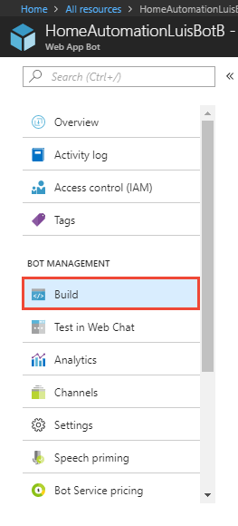
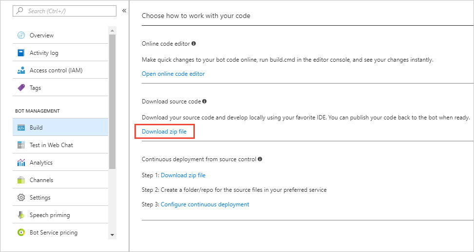
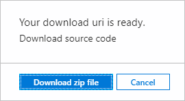
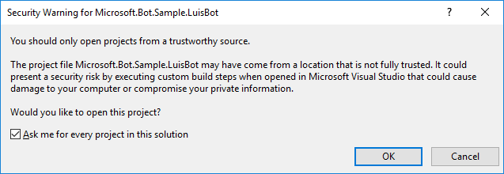
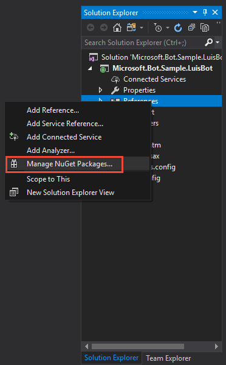
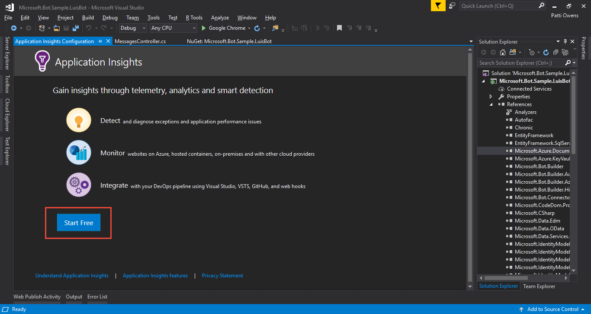
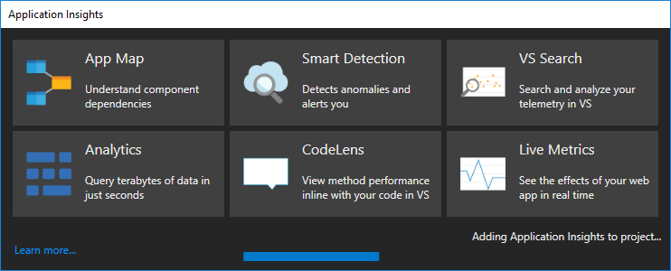
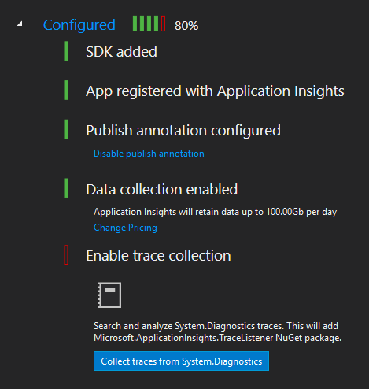
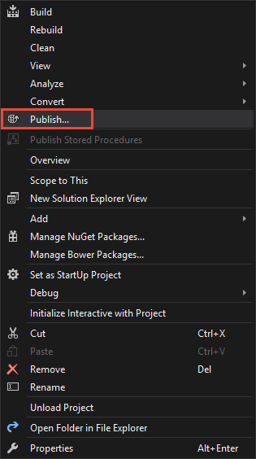

# Add LUIS results to Application Insights from a web app bot
This tutorial adds LUIS request and response information to [Application Insights](https://azure.microsoft.com/services/application-insights/) telemetry data storage. Once you have that data, you can query it with the Kusto language or PowerBi to analyze, aggregate, and report on intents, and entities of the utterance in real-time. This analysis helps you determine if you should add or edit the intents and entities of your LUIS app.

In this tutorial, you learn how to:

> [!div class="checklist"]
* Add Application Insights library to a web app bot
* Capture and send LUIS query results to Application Insights
* Query Application Insights for top intent, score, and utterance

## Prerequisites

* Your LUIS web app bot from the **[previous tutorial](luis-csharp-tutorial-build-bot-framework-sample.md)** with Application Insights turned on. 

> [!Tip]
> If you do not already have a subscription, you can register for a [free account](https://azure.microsoft.com/free/).

All of the code in this tutorial is available on the [LUIS-Samples github repository](https://github.com/Microsoft/LUIS-Samples/tree/master/documentation-samples/tutorial-web-app-bot-application-insights/csharp) and each line associated with this tutorial is commented with `//LUIS Tutorial:`. 

## Web app bot with LUIS
This tutorial assumes you have code that looks like the following or that you have completed the [other tutorial](luis-csharp-tutorial-build-bot-framework-sample.md): 

   [!code-csharp[Web app bot with LUIS](~/samples-luis/documentation-samples/tutorial-web-app-bot/csharp/BasicLuisDialog.cs "Web app bot with LUIS")]

## Add Application Insights library to web app bot
Currently, the Application Insights service, used in this web app bot, collects general state telemetry for the bot. It does not collect LUIS request and response information. In order to analyze and improve LUIS, you need the LUIS response information.  

In order to capture the LUIS request and response, the web app bot needs the **[Application Insights](https://www.nuget.org/packages/Microsoft.ApplicationInsights/)** NuGet package installed and configured in the **BasicLuisDialog.cs** file. Then the intent dialog handlers need to send the LUIS request and response information to Application Insights. 

### Download web app bot
Visual Studio 2017 is the tool to add Application Insights NuGet package to the web app bot. In order to use the web app bot in Visual Studio, use the following steps to download the web app bot code.

1. In the Azure portal, for the web app bot, select **Build**.

    

2. Select **Download zip file** and wait until the file is prepared.

    

3. Select **Download zip file** in the pop up window. Remember the location on your computer, you will need it in the next section.

    

### Open solution in Visual Studio 2017

1. Extract the file into a folder. 

2. Open Visual Studio 2017 and open the solution file, `Microsoft.Bot.Sample.LuisBot.sln`. If the security warning pops up, select "OK".

    

3. Visual Studio needs to add dependencies to the solution if they don't already exist. In the **Solution Explorer**, right-click on **References**, and select **Manage NuGet Packages...**. 

    

4. The NuGet Package manager shows a list of installed packages. Select **Restore** in the yellow bar. Wait for restore process to finish.

    

### Add ApplicationInsights to project
Configure the Visual Studio solution to know about Application Insights. 

1. In Visual Studio 2017, on the top menu, select **Project**, then select **Add Application Insights Telemetry...**.

2. In the **Application Insights Configuration** window, select **Start Free**

    

3. Register your app with Application Insights. You may have to use your Azure portal credentials. 

    

    Visual Studio adds Application Insights to the project, displaying status as it does this. 

    

    When the process completes, the **Application Insights Configuration** shows the progress status. 

    

    The **Enable trace collection** is red, meaning it is not enabled. This tutorial doesn't use this feature. 

### Build and resolve errors

1. Build the solution. Select **Build** menu, then select **Rebuild Solution**. Wait for the build to finish. 

2. If the build fails with `CS0104` errors, in the `Controllers` folder, in the `MessagesController.cs file`, fix the ambiguous usage of `Activity` type by prefixing the Activity type with the Connector type. 

    Change the name Activity on lines 22 and 36 from `Activity` to `Connector.Activity`. Build the solution again. There should be no more build errors.

    The full source of that file follows:

    [!code-csharp[MessagesController.cs file](~/samples-luis/documentation-samples/tutorial-web-app-bot-application-insights/csharp/MessagesController.cs "MessagesController.cs file")]

### Publish project back to Azure
The ApplicationInsights package is now in the project and configured correctly for your credentials in the Azure portal. The changes for the project need to be send back to Azure.

1. In the **Solution Explorer**, right-click the project name, then select **Publish**.

    

2. In the **Publish** window, select **Create new profile**.
3. Select **Import profile**, and select **OK**.
4. In the **Import Publish Settings File** windows, navigate to your project folder, navigate to the `PostDeployScripts` folder, select the file that ends in `.PublishSettings`, and select `Open`.You have now configured publishing for this project. 5. Publish your local source code to Bot Service: select the **Publish** button. The **Output** window shows status. 

    The rest of the work is done in the Azure portal. You can close Visual Studio 2017. 

## Capture and send LUIS query results to Application Insights
1. In the App Service Editor browser tab, open the **BasicLuisDialog.cs** file.

2. Add the following NuGet dependency under the existing `using` lines:

   [!code-csharp[Add using statement](~/samples-luis/documentation-samples/tutorial-web-app-bot-application-insights/csharp/BasicLuisDialog.cs?range=12 "Add dependency to file")]

3. Create the Application Insights object and use the web app bot application setting **BotDevInsightsKey**: 

   [!code-csharp[Create the Application Insights object](~/samples-luis/documentation-samples/tutorial-web-app-bot-application-insights/csharp/BasicLuisDialog.cs?range=64-65 "Create the Application Insights object")]

4. Add the **LogToApplicationInsights** function:

   [!code-csharp[Add the LogToApplicationInsights function](~/samples-luis/documentation-samples/tutorial-web-app-bot-application-insights/csharp/BasicLuisDialog.cs?range=61-92 "Add the LogToApplicationInsights function")]

    The last line of the function is where the data is added to Application Insights. The event's name is **LUIS-results**, a unique name apart from any other telemetry data collected by this web app bot. 

5. Use the **appInsightsLog** function. You add it to every intent dialog:

   [!code-csharp[Use the appInsightsLog function](~/samples-luis/documentation-samples/tutorial-web-app-bot-application-insights/csharp/BasicLuisDialog.cs?range=114-115 "Use the appInsightsLog function")]

6. To test your web app bot, use the **Test in Web Chat** feature. You should see no difference because all the work is in Application Insights, not in the bot responses.

## View LUIS entries in Application Insights
Open Application Insights to see the LUIS entries. 

1. In the portal, select **All resources** then filter by the web app bot name. Click on the resource with the type **Application Insights**. The icon for Application Insights is a light bulb. 

    


2. When the resource opens, click on the **Search** icon of the magnifying glass in the far right panel. A new panel to the right displays. Depending on how much telemetry data is found, the panel may take a second to display. Search for `LUIS-results` and hit enter on the keyboard. The list is narrowed to just LUIS query results added with this tutorial.

    

3. Select the top entry. A new window displays more detailed data including the custom data for the LUIS query at the far-right. The data includes the top intent, and its score.

    

    When you are done, select the far-right top **X** to return to the list of dependency items. 


> [!Tip]
> If you want to save the dependency list and return to it later, click on **...More** and click **Save favorite**.

## Query Application Insights for intent, score, and utterance
Application Insights gives you the power to query the data with the [Kusto](https://docs.microsoft.com/azure/application-insights/app-insights-analytics#query-data-in-analytics) language, as well as export it to [PowerBI](https://powerbi.microsoft.com). 

1. Click on **Analytics** at the top of the dependency listing, above the filter box. 

    

2. A new window opens with a query window at the top and a data table window below that. If you have used databases before, this arrangement is familiar. The query includes all items from the last 24 hours beginning with the name `LUIS-results`. The **CustomDimensions** column has the LUIS query results as name/value pairs.

    

3. To pull out the top intent, score, and utterance, add the following just above the last line in the query window:

    ```SQL
    | extend topIntent = tostring(customDimensions.LUIS_intent_intent)
    | extend score = todouble(customDimensions.LUIS_intent_score)
    | extend utterance = tostring(customDimensions.LUIS_text)
    ```

4. Run the query. Scroll to the far right in the data table. The new columns of topIntent, score, and utterance are available. Click on the topIntent column to sort.

    


Learn more about the [Kusto query language](https://docs.loganalytics.io/docs/Learn/Getting-Started/Getting-started-with-queries) or [export the data to PowerBi](https://docs.microsoft.com/azure/application-insights/app-insights-export-power-bi). 

## Next steps

Other information you may want to add to the application insights data includes app ID, version ID, last model change date, last train date, last publish date. These values can either be retrieved from the endpoint URL (app ID and version ID), or from an [authoring API](https://westus.dev.cognitive.microsoft.com/docs/services/5890b47c39e2bb17b84a55ff/operations/5890b47c39e2bb052c5b9c3d) call then set in the web app bot settings and pulled from there.  

If you are using the same endpoint subscription for more than one LUIS app, you should also include the subscription ID and a property stating that it is a shared key. 

> [!div class="nextstepaction"]
> [Learn more about example utterances](Add-example-utterances.md)
