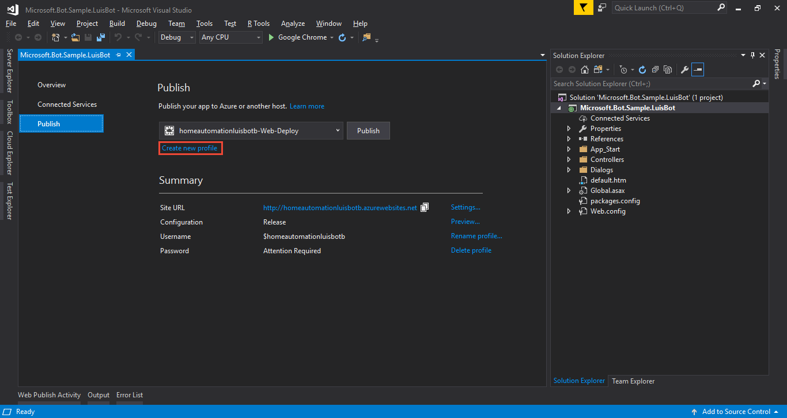
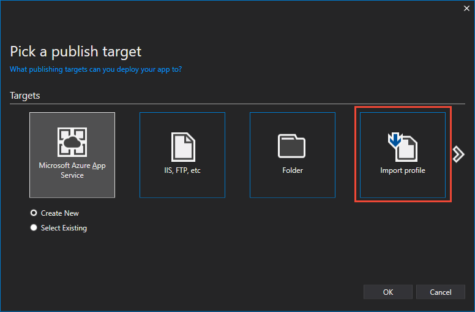
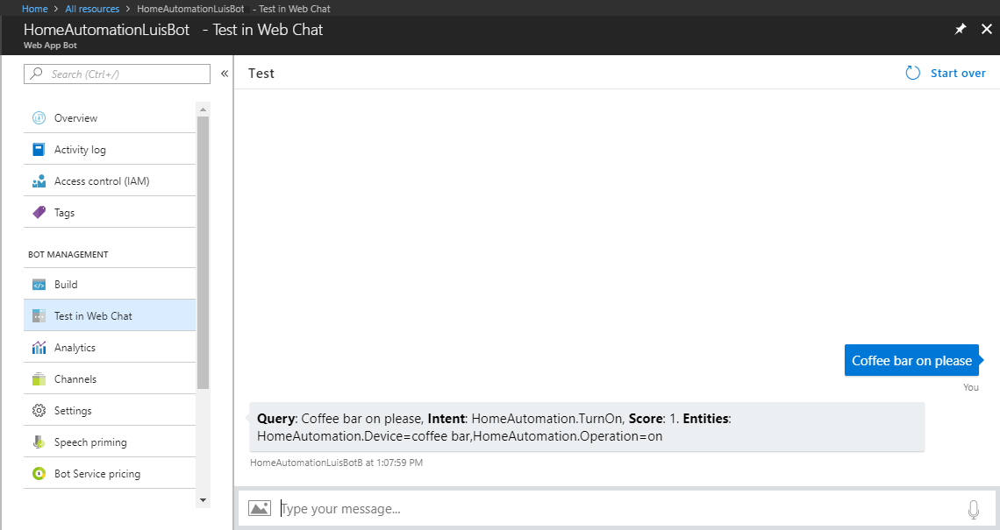
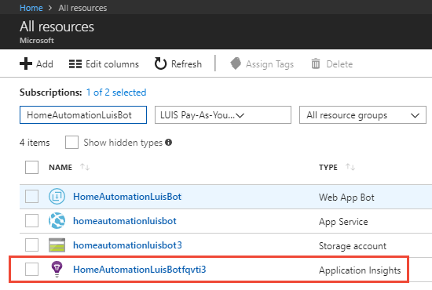
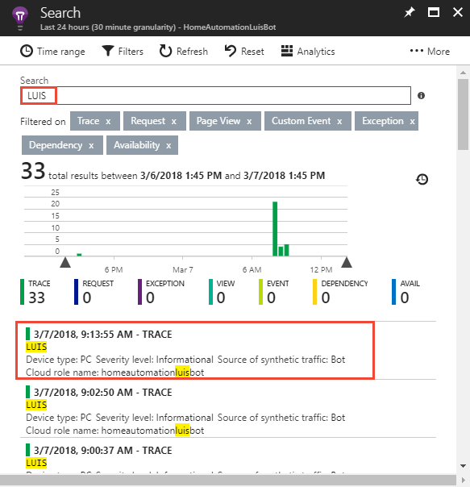
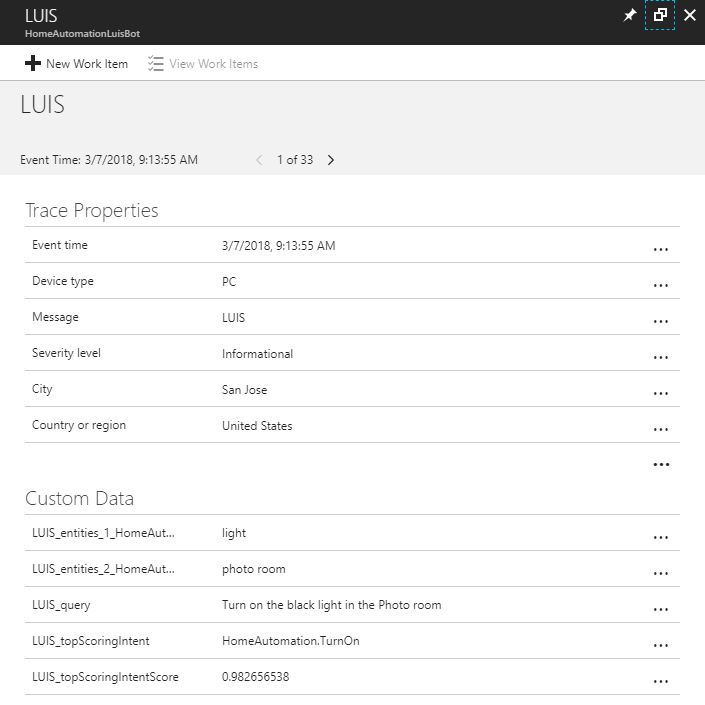
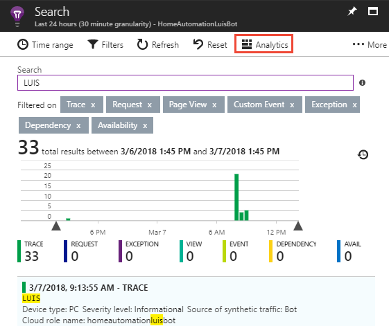
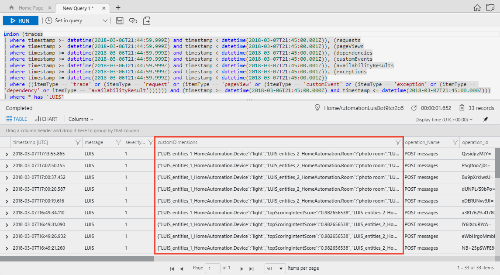
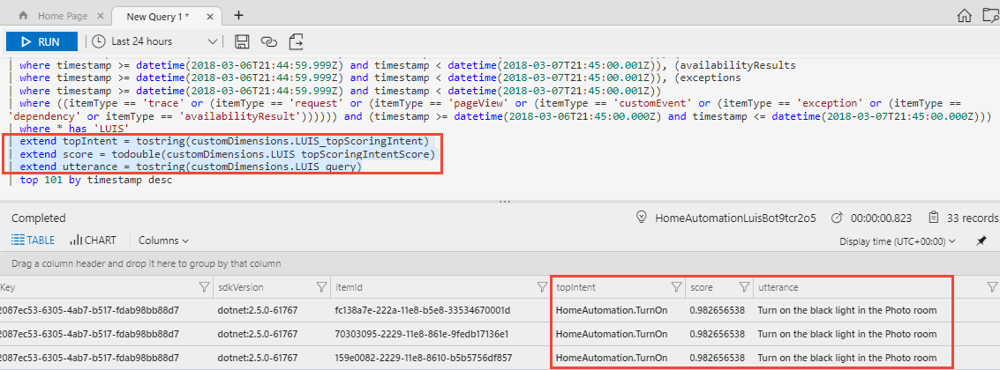

# Add LUIS results to Application Insights with a Bot in C#

This tutorial adds bot and Language Understanding information to [Application Insights](https://azure.microsoft.com/services/application-insights/) telemetry data storage. Once you have that data, you can query it with the Kusto language or Power BI to analyze, aggregate, and report on intents, and entities of the utterance in real-time. This analysis helps you determine if you should add or edit the intents and entities of your LUIS app.

In this tutorial, you learn how to:

> [!div class="checklist"]
> * Add Application Insights library to a web app bot
> * Query Application Insights for top intent, score, and utterance

## Prerequisites

* A downloaded and running LUIS web app bot from the previous bot **[tutorial](luis-csharp-tutorial-bf-v4.md)** with Application Insights enabled. 
* [Bot emulator](https://aka.ms/abs/build/emulatordownload)
* [Visual Studio](https://visualstudio.microsoft.com/downloads/)

All of the code in this tutorial is available on the [Azure-Samples GitHub repository](https://github.com/Azure-Samples/cognitive-services-language-understanding/tree/master/documentation-samples/tutorial-web-app-bot-application-insights/v4/luis-csharp-bot-johnsmith-src-telemetry). 

## Add Application Insights to web app bot project

Currently, the Application Insights service, used in this web app bot, collects general state telemetry for the bot. It does not collect LUIS information. 

In order to capture the LUIS information, the web app bot needs the **[Microsoft.ApplicationInsights](https://www.nuget.org/packages/Microsoft.ApplicationInsights/)** NuGet package installed and configured.  

1. From Visual Studio, add the dependency to the solution. In the **Solution Explorer**, right-click on the project name and select **Manage NuGet Packages...**. The NuGet Package manager shows a list of installed packages. 
1. Select **Browse** then search for **Microsoft.ApplicationInsights**.
1. Install the package. 

## Build and resolve errors

1. Build the solution by selecting the **Build** menu, then select **Rebuild Solution**. Wait for the build to finish.

2. If the build fails with `CS0104` errors, you need to fix them. In the `Controllers` folder, in the `MessagesController.cs file`, fix the ambiguous usage of `Activity` type by prefixing the Activity type with the Connector type. To do this, change the name `Activity` on lines 22 and 36 from `Activity` to `Connector.Activity`. Build the solution again. There should be no more build errors.

    The full source of that file is:

    [!code-csharp[MessagesController.cs file](~/samples-luis/documentation-samples/tutorial-web-app-bot-application-insights/csharp/MessagesController.cs "MessagesController.cs file")]

## Publish project to Azure

The **Application Insights** package is now in the project and configured correctly for your credentials in the Azure portal. The changes for the project need to be published back to Azure.

1. In the **Solution Explorer**, right-click the project name, then select **Publish**.

    

2. In the **Publish** window, select **Create new profile**.

    

3. Select **Import profile**, and select **OK**.

    

4. In the **Import Publish Settings File** windows, navigate to your project folder, navigate to the `PostDeployScripts` folder, select the file that ends in `.PublishSettings`, and select `Open`. You have now configured publishing for this project.

5. Publish your local source code to Bot Service by selecting the **Publish** button. The **Output** window shows status. The rest of the tutorial is completed in the Azure portal. Close Visual Studio 2017.

## Open three browser tabs

In the Azure portal, find the web app bot and open it. The following steps use three different views of the web app bot. It may be easier to have three separate tabs open in the browser:
  
>  * Test in Web Chat
>  * Build/Open online code editor -> App Service Editor
>  * App Service Editor/Open Kudu console -> Diagnostic Console

## Modify BasicLuisDialog.cs code

1. In the **App Service Editor** browser tab, open the `BasicLuisDialog.cs` file.

2. Add the following NuGet dependency under the existing `using` lines:

   [!code-csharp[Add using statement](~/samples-luis/documentation-samples/tutorial-web-app-bot-application-insights/csharp/BasicLuisDialog.cs?range=11-12 "Add using statement")]

3. Add the `LogToApplicationInsights` function:

   [!code-csharp[Add the LogToApplicationInsights function](~/samples-luis/documentation-samples/tutorial-web-app-bot-application-insights/csharp/BasicLuisDialog.cs?range=61-92 "Add the LogToApplicationInsights function")]

    The Application Insights instrumentation key is already in the web app bot's application setting named `BotDevInsightsKey`.

    The last line of the function adds the data to Application Insights. The trace's name is `LUIS`, a unique name apart from any other telemetry data collected by this web app bot. All the properties are also prefixed with `LUIS_` so you can see what data this tutorial adds compared to information that is given by the web app bot.

4. Call the `LogToApplicationInsights` function at the top of the `ShowLuisResult` function:

   [!code-csharp[Use the LogToApplicationInsights function](~/samples-luis/documentation-samples/tutorial-web-app-bot-application-insights/csharp/BasicLuisDialog.cs?range=114-115 "Use the LogToApplicationInsights function")]

## Build web app bot

1. Build the web app bot in one of two ways. The first method is to right-click on `build.cmd` in the **App Service Editor**, then select **Run from Console**. The output of the console displays and completes with `Finished successfully.`

2. If this doesn't complete successfully, you need to open the console, navigate to the  script, and run it using the following steps. In the **App Service Editor**, on the top blue bar, select the name of your bot, then select **Open Kudu Console** in the drop-down list.

    

3. In the console window, enter the following command:

    ```console
    cd site\wwwroot && build.cmd
    ```

    Wait for the build to complete with `Finished successfully.`

## Test the web app bot

1. To test your web app bot, open the **Test in Web Chat** feature in the portal.

2. Enter the phrase `Coffee bar on please`.  

    

3. You should see no difference in the chatbot response. The change is sending data to Application Insights, not in the bot responses. Enter a few more utterances so there is a little more data in Application Insights:

|Utterances|
|--|
|Please deliver a pizza|
|Turn off all the lights|
|Turn on the hall light|


## View LUIS entries in Application Insights

Open Application Insights to see the LUIS entries.

1. In the portal, select **All resources** then filter by the web app bot name. Click on the resource with the type **Application Insights**. The icon for Application Insights is a light bulb.

    

2. When the resource opens, click on the **Search** icon of the magnifying glass in the far right panel. A new panel to the right displays. Depending on how much telemetry data is found, the panel may take a second to display. Search for `LUIS`. The list is narrowed to just LUIS query results added with this tutorial.

    

3. Select the top entry. A new window displays more detailed data including the custom data for the LUIS query at the far-right. The data includes the top intent, and its score.

    

    When you are done, select the far-right top **X** to return to the list of dependency items.

> [!Tip]
> If you want to save the dependency list and return to it later, click on **...More** and click **Save favorite**.

## Query Application Insights for intent, score, and utterance

Application Insights gives you the power to query the data with the [Kusto](https://docs.microsoft.com/azure/application-insights/app-insights-analytics#query-data-in-analytics) language, as well as export it to [Power BI](https://powerbi.microsoft.com).

1. Click on **Analytics** at the top of the dependency listing, above the filter box.

    

2. A new window opens with a query window at the top and a data table window below that. If you have used databases before, this arrangement is familiar. The query includes all items from the last 24 hours beginning with the name `LUIS`. The **CustomDimensions** column has the LUIS query results as name/value pairs.

    

3. To pull out the top intent, score, and utterance, add the following just above the last line in the query window:

    ```kusto
    | extend topIntent = tostring(customDimensions.LUIS_topScoringIntent)
    | extend score = todouble(customDimensions.LUIS_topScoringIntentScore)
    | extend utterance = tostring(customDimensions.LUIS_query)
    ```

4. Run the query. Scroll to the far right in the data table. The new columns of topIntent, score, and utterance are available. Click on the topIntent column to sort.

    

Learn more about the [Kusto query language](https://docs.microsoft.com/azure/log-analytics/query-language/get-started-queries) or [export the data to Power BI](https://docs.microsoft.com/azure/application-insights/app-insights-export-power-bi).

## Learn more about Bot Framework

Learn more about [Bot Framework](https://dev.botframework.com/).

## Next steps

Other information you may want to add to the application insights data includes app ID, version ID, last model change date, last train date, last publish date. These values can either be retrieved from the endpoint URL (app ID and version ID), or from an [authoring API](https://westus.dev.cognitive.microsoft.com/docs/services/5890b47c39e2bb17b84a55ff/operations/5890b47c39e2bb052c5b9c3d) call then set in the web app bot settings and pulled from there.  

If you are using the same endpoint subscription for more than one LUIS app, you should also include the subscription ID and a property stating that it is a shared key.

> [!div class="nextstepaction"]
> [Learn more about example utterances](luis-how-to-add-example-utterances.md)
