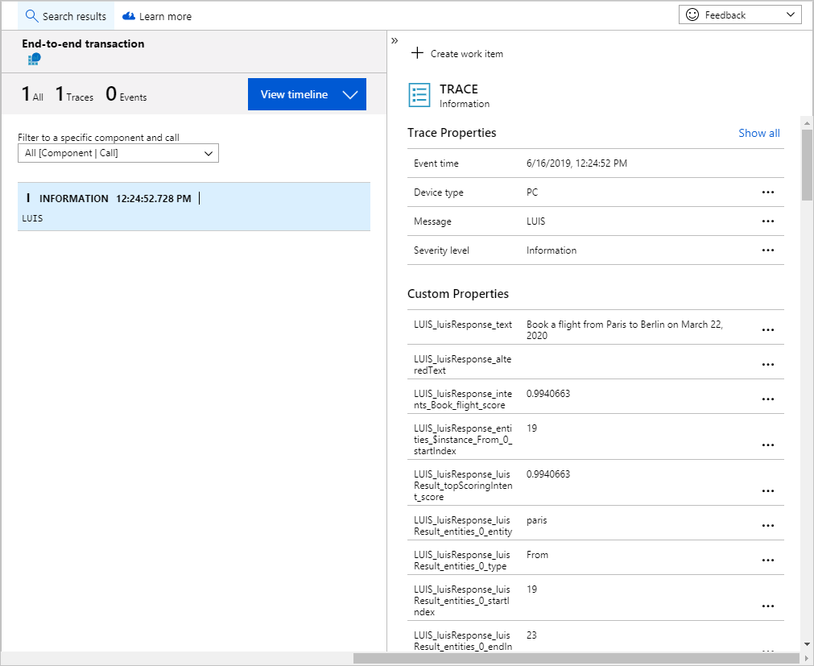

# Add LUIS results to Application Insights from a Bot in Node.js
This tutorial adds bot and Language Understanding information to [Application Insights](https://azure.microsoft.com/services/application-insights/) telemetry data storage. Once you have that data, you can query it with the Kusto language or Power BI to analyze, aggregate, and report on intents, and entities of the utterance in real-time. This analysis helps you determine if you should add or edit the intents and entities of your LUIS app.

In this tutorial, you learn how to:

> [!div class="checklist"]
> * Capture bot and Language understanding data in Application Insights
> * Query Application Insights for Language Understanding data

## Prerequisites

* An Azure bot service bot, created with Application Insights enabled.
* Downloaded bot code from the previous bot **[tutorial](luis-nodejs-tutorial-bf-v4.md)**. 
* [Bot emulator](https://aka.ms/abs/build/emulatordownload)
* [Visual Studio Code](https://code.visualstudio.com/Download)

All of the code in this tutorial is available on the [Azure-Samples Language Understanding GitHub repository](https://github.com/Azure-Samples/cognitive-services-language-understanding/tree/master/documentation-samples/tutorial-web-app-bot-application-insights/v4/luis-nodejs-bot-johnsmith-src-telemetry). 

## Add Application Insights to web app bot project
Currently, the Application Insights service, used in this web app bot, collects general state telemetry for the bot. It does not collect LUIS information. 

In order to capture the LUIS information, the web app bot needs the **[Application Insights](https://www.npmjs.com/package/applicationinsights)** NPM package installed and configured.  

1. In the VSCode integrated terminal, at the root for the bot project, add the following NPM packages using the command shown: 

    ```console
    npm install applicationinsights && npm install underscore
    ```
    
    The **underscore** package is used to flatten the LUIS JSON structure so it is easier to see and use in Application Insights.
    


## Capture and send LUIS query results to Application Insights

1. In VSCode, create a new file **appInsightsLog.js** and add the following code:

    ```javascript
    const appInsights = require('applicationinsights');
    const _ = require("underscore");
    
    // Log LUIS results to Application Insights
    // must flatten as name/value pairs
    var appInsightsLog = (botContext,luisResponse) => {

        appInsights.setup(process.env.MicrosoftApplicationInsightsInstrumentationKey).start();
        const appInsightsClient = appInsights.defaultClient;

        // put bot context and LUIS results into single object
        var data = Object.assign({}, {'botContext': botContext._activity}, {'luisResponse': luisResponse});
    
        // Flatten data into name/value pairs
        flatten = (x, result, prefix) => {
            if(_.isObject(x)) {
                _.each(x, (v, k) => {
                    flatten(v, result, prefix ? prefix + '_' + k : k)
                })
            } else {
                result["LUIS_" + prefix] = x
            }
            return result;
        }
    
        // call fn to flatten data
        var flattenedData = flatten(data, {});
    
        // ApplicationInsights Trace 
        console.log(JSON.stringify(flattenedData));
    
        // send data to Application Insights
        appInsightsClient.trackTrace({message: "LUIS", severity: appInsights.Contracts.SeverityLevel.Information, properties: flattenedData});
    }
    
    module.exports.appInsightsLog = appInsightsLog;
    ```

    This file takes the bot context and the luis response, flattens both objects and inserts them into a **Trace** event in application insights. The event's name is **LUIS**. 

1. Open the **dialogs** folder, then the **luisHelper.js** file. Include the new **appInsightsLog.js** as a required file and capture the bot context and LUIS response. The complete code for this file is: 

    ```javascript
    // Copyright (c) Microsoft Corporation. All rights reserved.
    // Licensed under the MIT License.
    
    const { LuisRecognizer } = require('botbuilder-ai');
    const { appInsightsLog } = require('../appInsightsLog');
    
    class LuisHelper {
        /**
         * Returns an object with preformatted LUIS results for the bot's dialogs to consume.
         * @param {*} logger
         * @param {TurnContext} context
         */
        static async executeLuisQuery(logger, context) {
            const bookingDetails = {};
    
            try {
                const recognizer = new LuisRecognizer({
                    applicationId: process.env.LuisAppId,
                    endpointKey: process.env.LuisAPIKey,
                    endpoint: `https://${ process.env.LuisAPIHostName }`
                }, {}, true);
    
                const recognizerResult = await recognizer.recognize(context);
    
                // APPINSIGHT: Log results to Application Insights
                appInsightsLog(context,recognizerResult);
    
    
                const intent = LuisRecognizer.topIntent(recognizerResult);
    
                bookingDetails.intent = intent;
    
                if (intent === 'Book_flight') {
                    // We need to get the result from the LUIS JSON which at every level returns an array
    
                    bookingDetails.destination = LuisHelper.parseCompositeEntity(recognizerResult, 'To', 'Airport');
                    bookingDetails.origin = LuisHelper.parseCompositeEntity(recognizerResult, 'From', 'Airport');
    
                    // This value will be a TIMEX. And we are only interested in a Date so grab the first result and drop the Time part.
                    // TIMEX is a format that represents DateTime expressions that include some ambiguity. e.g. missing a Year.
                    bookingDetails.travelDate = LuisHelper.parseDatetimeEntity(recognizerResult);
                }
            } catch (err) {
                logger.warn(`LUIS Exception: ${ err } Check your LUIS configuration`);
            }
            return bookingDetails;
        }
    
        static parseCompositeEntity(result, compositeName, entityName) {
            const compositeEntity = result.entities[compositeName];
            if (!compositeEntity || !compositeEntity[0]) return undefined;
    
            const entity = compositeEntity[0][entityName];
            if (!entity || !entity[0]) return undefined;
    
            const entityValue = entity[0][0];
            return entityValue;
        }
    
        static parseDatetimeEntity(result) {
            const datetimeEntity = result.entities['datetime'];
            if (!datetimeEntity || !datetimeEntity[0]) return undefined;
    
            const timex = datetimeEntity[0]['timex'];
            if (!timex || !timex[0]) return undefined;
    
            const datetime = timex[0].split('T')[0];
            return datetime;
        }
    }
    
    module.exports.LuisHelper = LuisHelper;
    ```

## Add Application Insights instrumentation key 

In order to add data to application insights, you need the instrumentation key.

1. In a browser, in the [Azure portal](https://portal.azure.com), find your bot's **Application Insights** resource. Its name will have most of the bot's name, then random characters at the end of the name, such as `luis-nodejs-bot-johnsmithxqowom`. 
1. On the Application Insights resource, on the **Overview** page, copy the **Instrumentation Key**.
1. In VSCode, open the **.env** file at the root of the bot project. This file holds all your environment variables.  
1. Add a new variable, `MicrosoftApplicationInsightsInstrumentationKey` with the value of your instrumentation key. Do no put the value in quotes. 

## Start the bot

1. From the VSCode integrated terminal, start the bot:
    
    ```console
    npm start
    ```

1. Start the bot emulator and open the bot. This [step](luis-nodejs-tutorial-bf-v4.md#use-the-bot-emulator-to-test-the-bot) is provided in the previous tutorial.

1. Ask the bot a question. This [step](luis-nodejs-tutorial-bf-v4.md#ask-bot-a-question-for-the-book-flight-intent) is provided in the previous tutorial.

## View LUIS entries in Application Insights

Open Application Insights to see the LUIS entries. It can take a few minutes for the data to appear in Application Insights.

1. In the [Azure portal](https://portal.azure.com), open the bot's Application Insights resource. 
1. When the resource opens, select **Search** and search for all data in the last **30 minutes** with the event type of **Trace**. Select the trace named **LUIS**. 
1. The bot and LUIS information is available under **Custom Properties**. 

    

## Query Application Insights for intent, score, and utterance
Application Insights gives you the power to query the data with the [Kusto](https://docs.microsoft.com/azure/azure-monitor/log-query/log-query-overview#what-language-do-log-queries-use) language, as well as export it to [Power BI](https://powerbi.microsoft.com). 

1. Select **Log (Analytics)**. A new window opens with a query window at the top and a data table window below that. If you have used databases before, this arrangement is familiar. The query represents your previous filtered data. The **CustomDimensions** column has the bot and LUIS information.
1. To pull out the top intent, score, and utterance, add the following just above the last line (the `|top...` line) in the query window:

    ```kusto
    | extend topIntent = tostring(customDimensions.LUIS_luisResponse_luisResult_topScoringIntent_intent)
    | extend score = todouble(customDimensions.LUIS_luisResponse_luisResult_topScoringIntent_score)
    | extend utterance = tostring(customDimensions.LUIS_luisResponse_text)
    ```

1. Run the query. The new columns of topIntent, score, and utterance are available. Select topIntent column to sort.

Learn more about the [Kusto query language](https://docs.microsoft.com/azure/log-analytics/query-language/get-started-queries) or [export the data to Power BI](https://docs.microsoft.com/azure/application-insights/app-insights-export-power-bi). 

## Next steps

Other information you may want to add to the application insights data includes app ID, version ID, last model change date, last train date, last publish date. These values can either be retrieved from the endpoint URL (app ID and version ID), or from an authoring API call then set in the web app bot settings and pulled from there.  

If you are using the same endpoint subscription for more than one LUIS app, you should also include the subscription ID and a property stating that it is a shared key. 

> [!div class="nextstepaction"]
> [Learn more about example utterances](luis-how-to-add-example-utterances.md)
