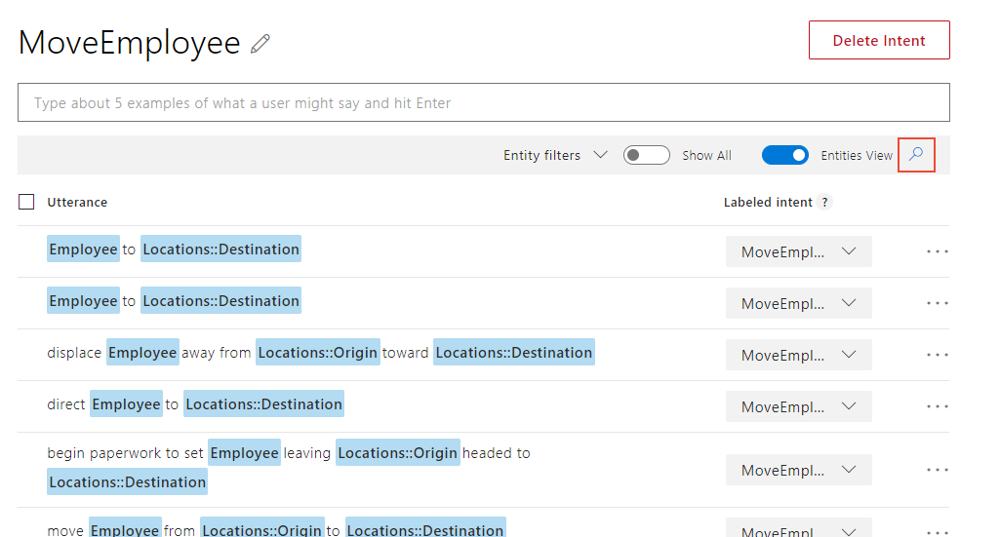
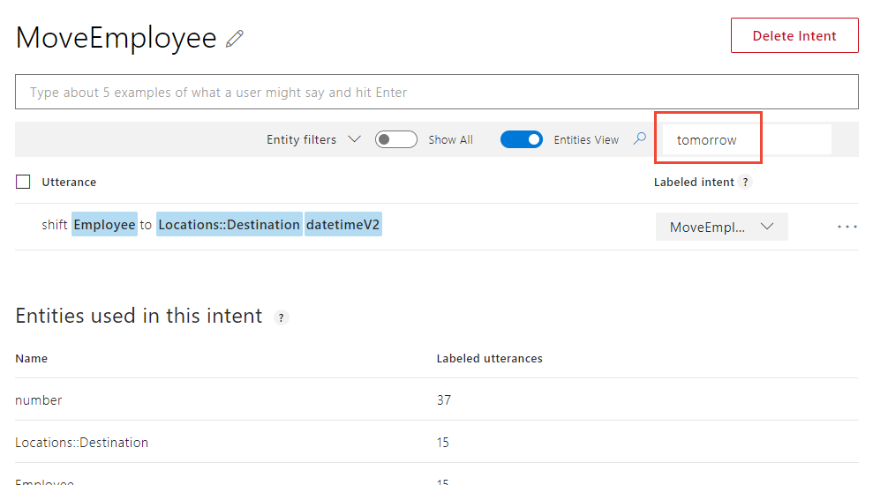
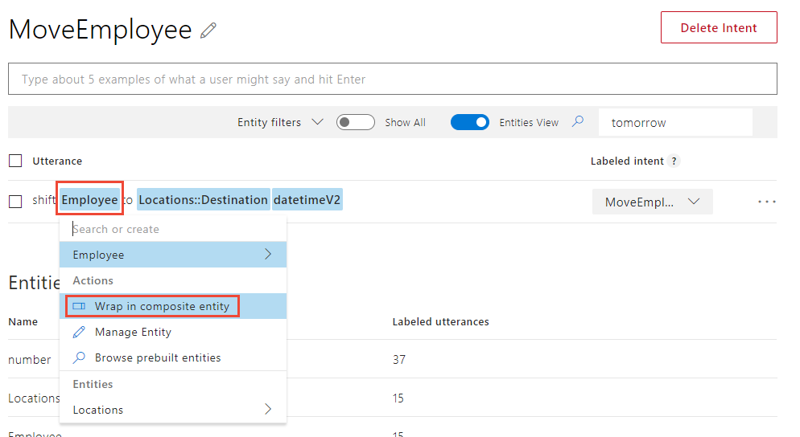
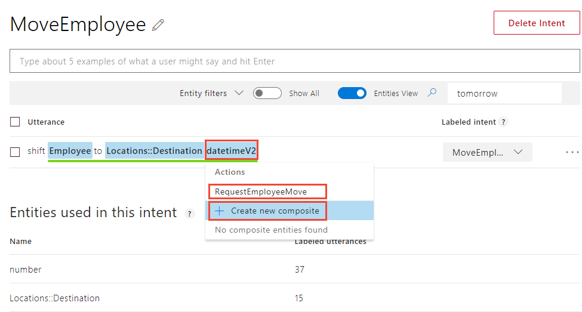
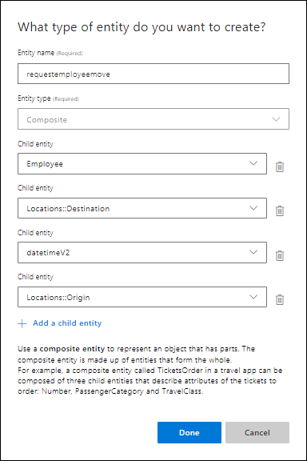
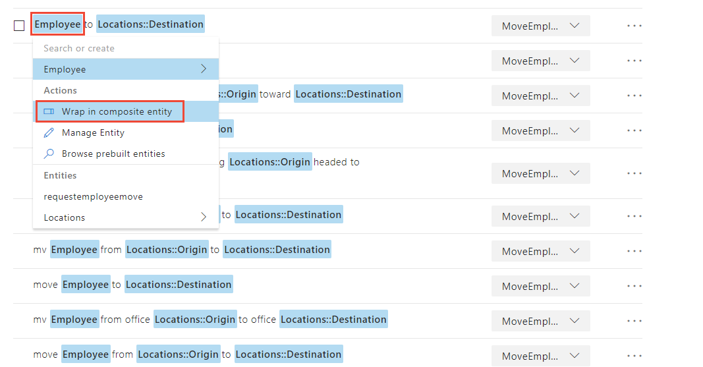
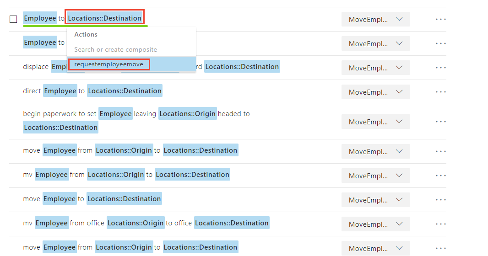
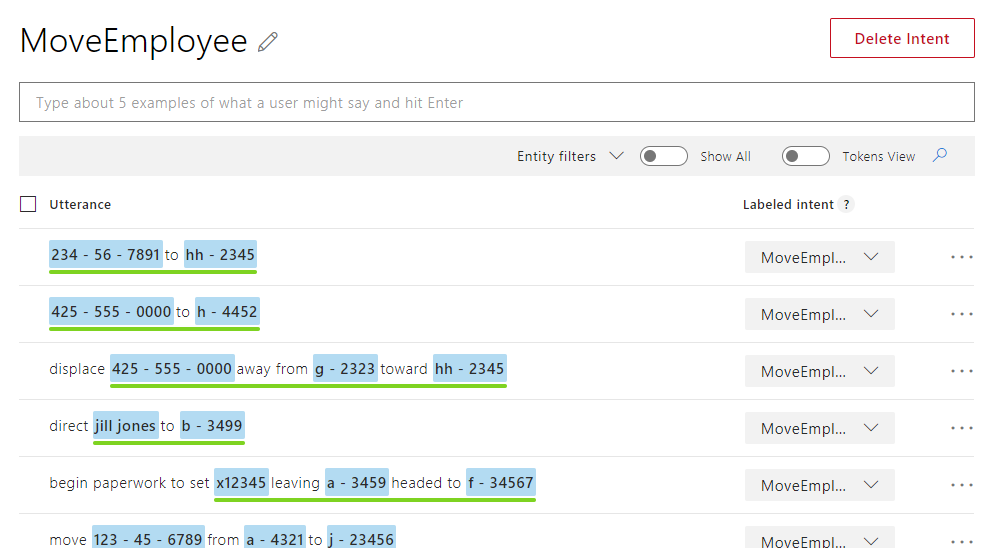

---
title: Tutorial creating a composite entity to extract complex data - Azure | Microsoft Docs 
description: Learn how to create a composite entity in your LUIS app to extract different types of entity data. 
services: cognitive-services
author: diberry
manager: cjgronlund 

ms.service: cognitive-services
ms.component: luis
ms.topic: article
ms.date: 08/02/2018
ms.author: diberry
--- 

# Tutorial: 6. Add Composite entity 
In this tutorial, add a composite entity to bundle extracted data into a containing entity.

In this tutorial, you learn how to:

<!-- green checkmark -->
> [!div class="checklist"]
> * Understand composite entities 
> * Add composite entity to extract data
> * Train, and publish app
> * Query endpoint of app to see LUIS JSON response

[!INCLUDE [LUIS Free account](../../../includes/cognitive-services-luis-free-key-short.md)]

## Before you begin
If you don't have the Human Resources app from the [hierarchical entity](luis-quickstart-intent-and-hier-entity.md) tutorial, [import](luis-how-to-start-new-app.md#import-new-app) the JSON into a new app in the [LUIS](luis-reference-regions.md#luis-website) website. The app to import is found in the [LUIS-Samples](https://github.com/Microsoft/LUIS-Samples/blob/master/documentation-samples/quickstarts/custom-domain-hier-HumanResources.json) Github repository.

If you want to keep the original Human Resources app, clone the version on the [Settings](luis-how-to-manage-versions.md#clone-a-version) page, and name it `composite`. Cloning is a great way to play with various LUIS features without affecting the original version.  

## Composite entity is a logical grouping 
The purpose of the composite entity is to group related entities into a parent category entity. The information exists as separate entities before a composite is created. It is similar to hierarchical entity but can contain more types of entities. 

 Create a composite entity when the separate entities can be logically grouped and this logical grouping is helpful to the client application. 

In this app, the employee name is defined in the **Employee** list entity and includes synonyms of name, email address, company phone extension, mobile phone number, and U.S. Federal tax ID. 

The **MoveEmployee** intent has example utterances to request an employee be moved from one building and office to another. Building names are alphabetic: "A", "B", etc. while offices are numeric: "1234", "13245". 

Example utterances in the **MoveEmployee** intent include:

|Example utterances|
|--|
|Move John W . Smith to a-2345|
|shift x12345 to h-1234 tomorrow|
 
The move request should include at least the employee (using any synonym), and the final building and office location. The request can also include the originating office as well as a date the move should happen. 

The extracted data from the endpoint should contain this information and return it at in a `RequestEmployeeMove` composite entity. 

## Create composite entity
1. Make sure your Human Resources app is in the **Build** section of LUIS. You can change to this section by selecting **Build** on the top, right menu bar. 

2. On the **Intents** page, select **MoveEmployee** intent. 

3. Select the magnifying glass icon on the tool bar to filter the utterances list. 

    [](media/luis-tutorial-composite-entity/hr-moveemployee-magglass.png#lightbox)

4. Enter `tomorrow` in the filter textbox to find the utterance `shift x12345 to h-1234 tomorrow`.

    [](media/luis-tutorial-composite-entity/hr-filter-by-tomorrow.png#lightbox)

    Another method is to filter the entity by datetimeV2, by selecting **Entity filters** then select **datetimeV2** from the list. 

5. Select the first entity, `Employee`, then select **Wrap in composite entity** in the pop-up menu list. 

    [](media/luis-tutorial-composite-entity/hr-create-entity-1.png#lightbox)


6. Then immediately select the last entity, `datetimeV2` in the utterance. A green bar is drawn under the selected words indicating a composite entity. In the pop-up menu, enter the composite name `RequestEmployeeMove` then select **Create new composite** on in the pop-up menu. 

    [](media/luis-tutorial-composite-entity/hr-create-entity-2.png#lightbox)

7. In **What type of entity do you want to create?**, almost all the fields required are in the list. Only the originating location is missing. Select **Add a child entity**, select **Locations::Origin** from the list of existing entities, then select **Done**. 

    

8. Select the magnifying glass on the toolbar to remove the filter. 

## Label example utterances with composite entity
1. In each example utterance, select the left-most entity that should be in the composite. Then select **Wrap in composite entity**.

    [](media/luis-tutorial-composite-entity/hr-label-entity-1.png#lightbox)

2. Select the last word in the composite entity then select **RequestEmployeeMove** from the pop-up menu. 

    [](media/luis-tutorial-composite-entity/hr-label-entity-2.png#lightbox)

3. Verify all utterances in the intent are labeled with the composite entity. 

    [](media/luis-tutorial-composite-entity/hr-all-utterances-labeled.png#lightbox)

## Train the LUIS app

[!INCLUDE [LUIS How to Train steps](../../../includes/cognitive-services-luis-tutorial-how-to-train.md)]

## Publish the app to get the endpoint URL

[!INCLUDE [LUIS How to Publish steps](../../../includes/cognitive-services-luis-tutorial-how-to-publish.md)]

## Query the endpoint 

1. [!INCLUDE [LUIS How to get endpoint first step](../../../includes/cognitive-services-luis-tutorial-how-to-get-endpoint.md)]

2. Go to the end of the URL in the address and enter `Move Jill Jones from a-1234 to z-2345 on March 3 2 p.m.`. The last querystring parameter is `q`, the utterance query. 

    Since this test is to verify the composite is extracted correctly, a test can either include an existing sample utterance or a new utterance. A good test is to include all the child entities in the composite entity.

    ```JSON
    {
      "query": "Move Jill Jones from a-1234 to z-2345 on March 3  2 p.m",
      "topScoringIntent": {
        "intent": "MoveEmployee",
        "score": 0.9959525
      },
      "intents": [
        {
          "intent": "MoveEmployee",
          "score": 0.9959525
        },
        {
          "intent": "GetJobInformation",
          "score": 0.009858314
        },
        {
          "intent": "ApplyForJob",
          "score": 0.00728598563
        },
        {
          "intent": "FindForm",
          "score": 0.0058053555
        },
        {
          "intent": "Utilities.StartOver",
          "score": 0.005371796
        },
        {
          "intent": "Utilities.Help",
          "score": 0.00266987388
        },
        {
          "intent": "None",
          "score": 0.00123299169
        },
        {
          "intent": "Utilities.Cancel",
          "score": 0.00116407464
        },
        {
          "intent": "Utilities.Confirm",
          "score": 0.00102653319
        },
        {
          "intent": "Utilities.Stop",
          "score": 0.0006628214
        }
      ],
      "entities": [
        {
          "entity": "march 3 2 p.m",
          "type": "builtin.datetimeV2.datetime",
          "startIndex": 41,
          "endIndex": 54,
          "resolution": {
            "values": [
              {
                "timex": "XXXX-03-03T14",
                "type": "datetime",
                "value": "2018-03-03 14:00:00"
              },
              {
                "timex": "XXXX-03-03T14",
                "type": "datetime",
                "value": "2019-03-03 14:00:00"
              }
            ]
          }
        },
        {
          "entity": "jill jones",
          "type": "Employee",
          "startIndex": 5,
          "endIndex": 14,
          "resolution": {
            "values": [
              "Employee-45612"
            ]
          }
        },
        {
          "entity": "z - 2345",
          "type": "Locations::Destination",
          "startIndex": 31,
          "endIndex": 36,
          "score": 0.9690751
        },
        {
          "entity": "a - 1234",
          "type": "Locations::Origin",
          "startIndex": 21,
          "endIndex": 26,
          "score": 0.9713137
        },
        {
          "entity": "-1234",
          "type": "builtin.number",
          "startIndex": 22,
          "endIndex": 26,
          "resolution": {
            "value": "-1234"
          }
        },
        {
          "entity": "-2345",
          "type": "builtin.number",
          "startIndex": 32,
          "endIndex": 36,
          "resolution": {
            "value": "-2345"
          }
        },
        {
          "entity": "3",
          "type": "builtin.number",
          "startIndex": 47,
          "endIndex": 47,
          "resolution": {
            "value": "3"
          }
        },
        {
          "entity": "2",
          "type": "builtin.number",
          "startIndex": 50,
          "endIndex": 50,
          "resolution": {
            "value": "2"
          }
        },
        {
          "entity": "jill jones from a - 1234 to z - 2345 on march 3 2 p . m",
          "type": "requestemployeemove",
          "startIndex": 5,
          "endIndex": 54,
          "score": 0.4027723
        }
      ],
      "compositeEntities": [
        {
          "parentType": "requestemployeemove",
          "value": "jill jones from a - 1234 to z - 2345 on march 3 2 p . m",
          "children": [
            {
              "type": "builtin.datetimeV2.datetime",
              "value": "march 3 2 p.m"
            },
            {
              "type": "Locations::Destination",
              "value": "z - 2345"
            },
            {
              "type": "Employee",
              "value": "jill jones"
            },
            {
              "type": "Locations::Origin",
              "value": "a - 1234"
            }
          ]
        }
      ],
      "sentimentAnalysis": {
        "label": "neutral",
        "score": 0.5
      }
    }
    ```

  This utterance returns a composite entities array. Each entity is given a type and value. To find more precision for each child entity, use the combination of type and value from the composite array item to find the corresponding item in the entities array.  

## What has this LUIS app accomplished?
This app identified a natural language query intention and returned the extracted data as a named group. 

Your chatbot now has enough information to determine the primary action and the related details in the utterance. 

## Where is this LUIS data used? 
LUIS is done with this request. The calling application, such as a chatbot, can take the topScoringIntent result and the data from the entity to take the next step. LUIS doesn't do that programmatic work for the bot or calling application. LUIS only determines what the user's intention is. 

## Clean up resources

[!INCLUDE [LUIS How to clean up resources](../../../includes/cognitive-services-luis-tutorial-how-to-clean-up-resources.md)]

## Next steps
> [!div class="nextstepaction"] 
> [Learn how to add a simple entity with a phrase list](luis-quickstart-primary-and-secondary-data.md)  