---
title: Create a composite entity to extract complex data - Azure | Microsoft Docs 
description: Learn how to create a composite entity in your LUIS app to extract different types of entity data. 
services: cognitive-services
author: v-geberr
manager: kaiqb 

ms.service: cognitive-services
ms.technology: luis
ms.topic: article
ms.date: 03/28/2018
ms.author: v-geberr;
--- 

# Use composite entity to extract complex data
This simple app has two [intents](luis-concept-intent.md) and several entities. Its purpose is to book flights such as '1 ticket from Seattle to Cairo on Friday` and return all the specifics of the reservation as a single piece of data. 

In this tutorial, you learn how to:

> [!div class="checklist"]
* Add prebuilt entities datetimeV2 and number
* Create a composite entity
* Query LUIS and receive composite entity data

## Before you begin
* Your LUIS app from the **[hierarchical quickstart](luis-tutorial-composite-entity.md)**. 

> [!Tip]
> If you do not already have a subscription, you can register for a [free account](https://azure.microsoft.com/free/).

## Composite entity is a logical grouping 
The purpose of the entity is to find and categorize parts of the text in the utterance. 
A [composite](luis-concept-entity-types.md) entity is composed of other entity types learned from context. For this travel app that takes flight reservations, there are several pieces of information such as dates, locations, and number of seats. 

The information exists as separate entities before a composite is created. Create a composite entity when the separate entities can be logically grouped and this logical grouping is helpful to the chat bot or other LUIS-consuming application. 

Simple example utterances from users include:

```
Book a flight to London for next Monday
2 tickets from Dallas to Dublin this weekend
Reserve a seat from New York to Paris on the first of April
```
 
The composite entity matches seat count, origin location, destination location, and date. 

## What LUIS does
When the intent and entities of the utterance are identified, [extracted](luis-concept-data-extraction.md#list-entity-data), and returned in JSON from the [endpoint](https://aka.ms/luis-endpoint-apis), LUIS is done. The calling application or chat bot takes that JSON response and fulfills the request -- in whatever way the app or chat bot is designed to do. 

## Add prebuilt entities number and datetimeV2
1. Select the `MyTravelApp` app from the list of apps on the [LUIS][LUIS] website.

2. When the app opens, select the **Entities** left navigation link.

    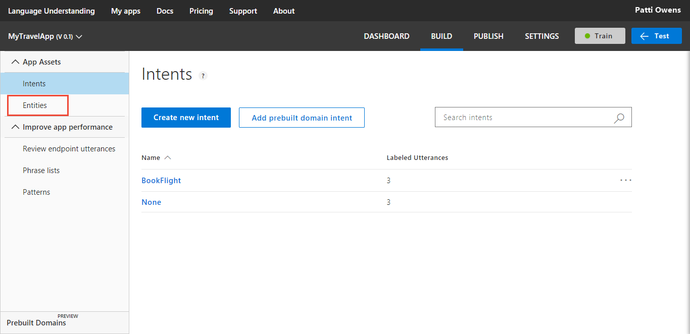    

3. Select **Manage prebuilt entities**.

    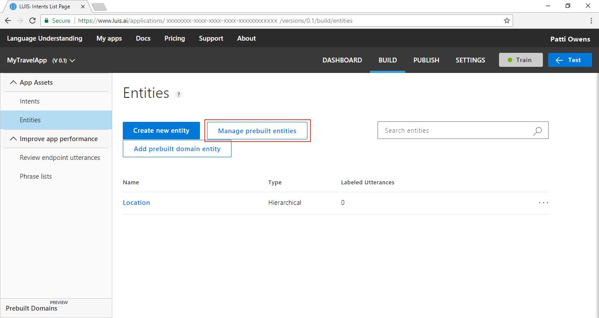

4. In the pop-up box, select **number** and **datetimeV2**.

    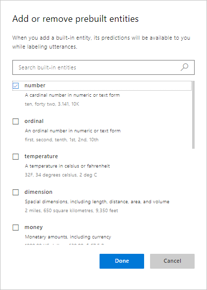

5. In order for the new entities to be extracted, select **Train** in the top navigation bar.

    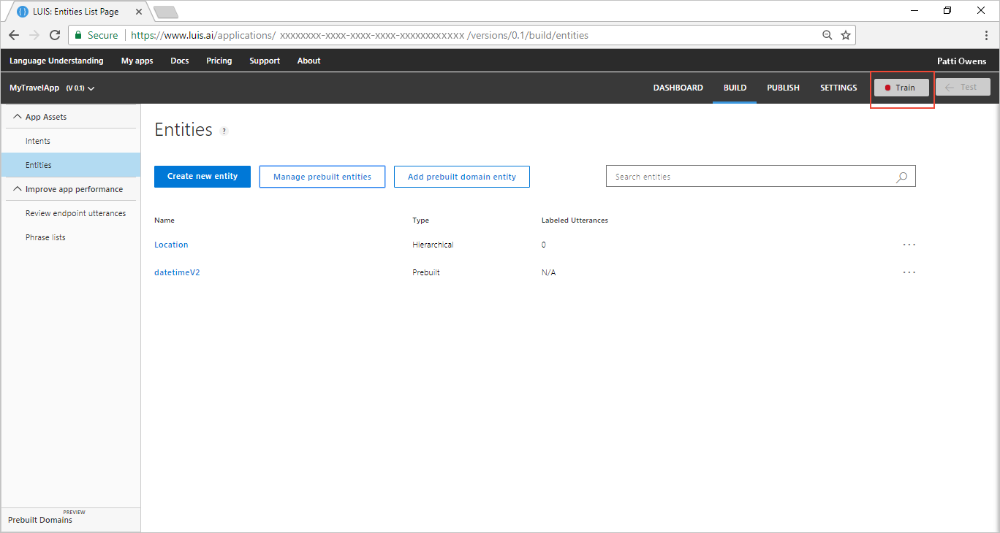

## Use existing intent to create composite entity
1. Select **Intents** from the left navigation. 

    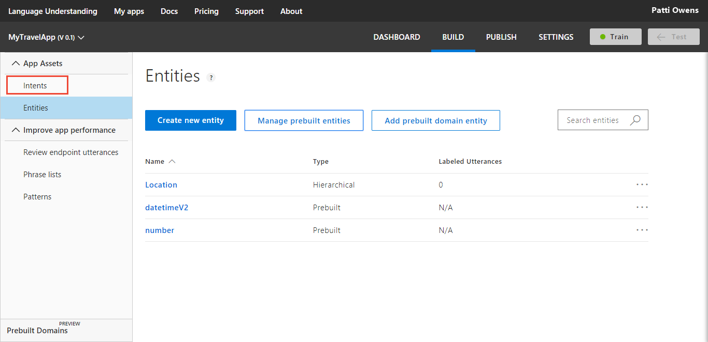

2. Select `BookFlight` from the **Intents** list.  

    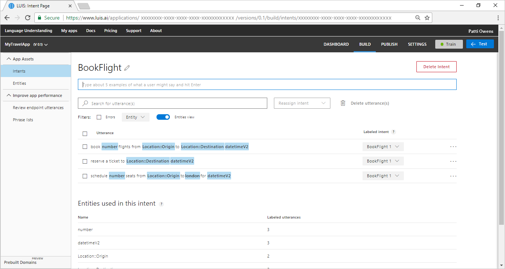

    The number and datetimeV2 prebuilt entities are labeled on the utterances.

3. For the utterance `book 2 flights from seattle to cairo next monday`, select the blue `number` entity, then select **Wrap in composite entity** from the list. A green line, under the words, follows the cursor as it moves to the right, indicating a composite entity. Then move to the right to select the last prebuilt entity `datetimeV2`, then enter `FlightReservation` in the text box of the pop-up window, then select **Create new composite**. 

    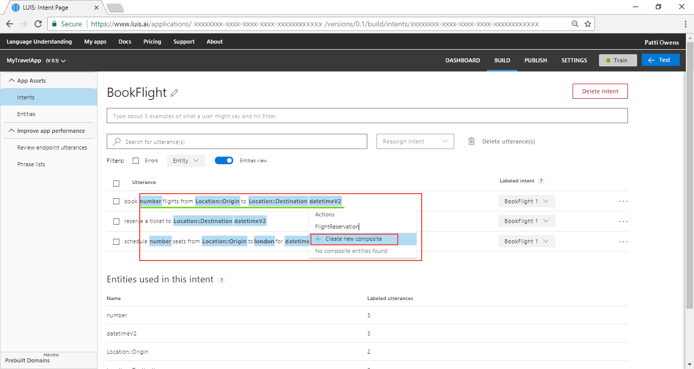

4. A pop-up dialog appears allowing you to verify the composite entity children. Select **Done**.

    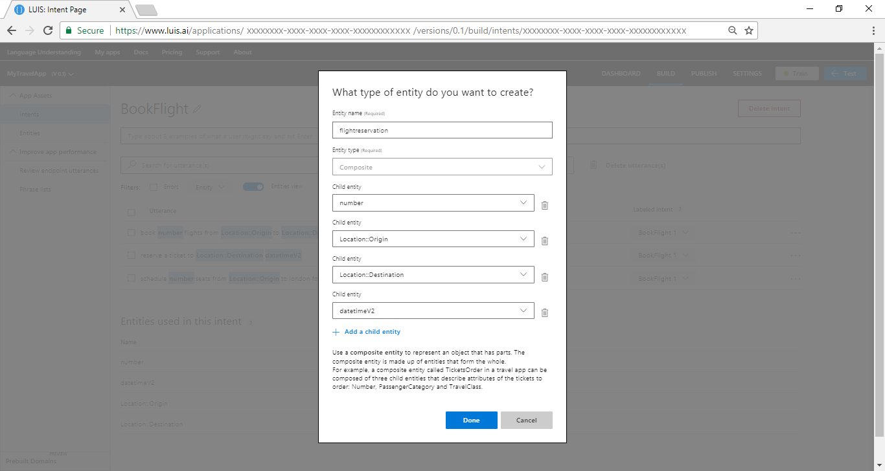

## Wrap the entities in the composite entity
Once the composite entity is created, label the remaining utterances in the composite entity. In order to wrap a phrase as a composite entity, you need to select the left-most word, then select **Wrap in composite entity** from the list that appears, then select the right-most word, then select the named composite entity `FlightReservation`. This is a quick, smooth step of selections, broken down into the following steps:

1. In the utterance `schedule 4 seats from paris to london for april 1`, select the 4 as number prebuilt entity.

    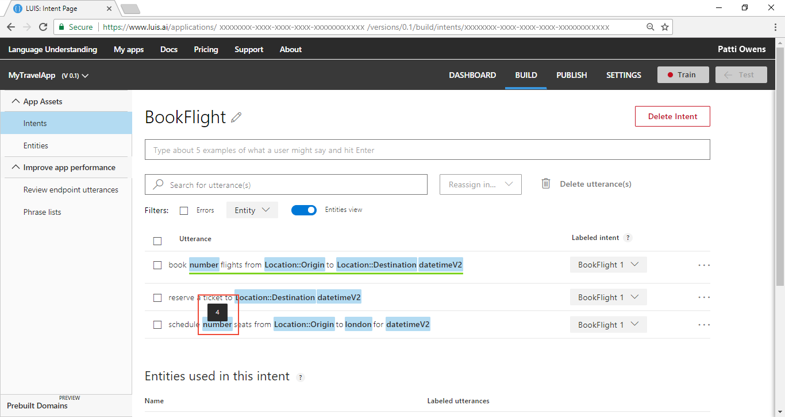

2. Select **Wrap in composite entity** from the list that appears.

    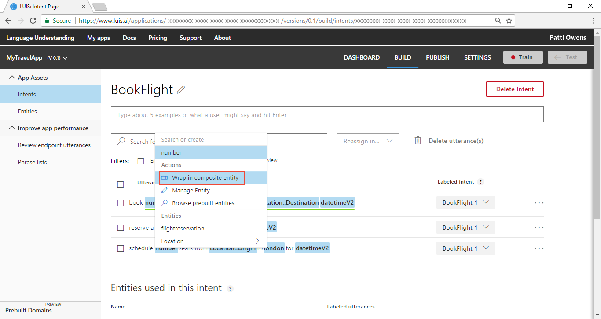

3. Select the right-most word. A green line appears under the phrase, indicating a composite entity.

    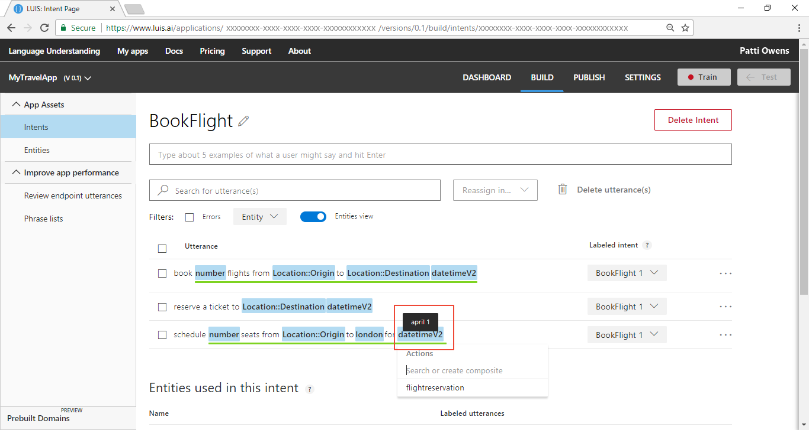

4. Select composite name `FlightReservation` from the list that appears.

    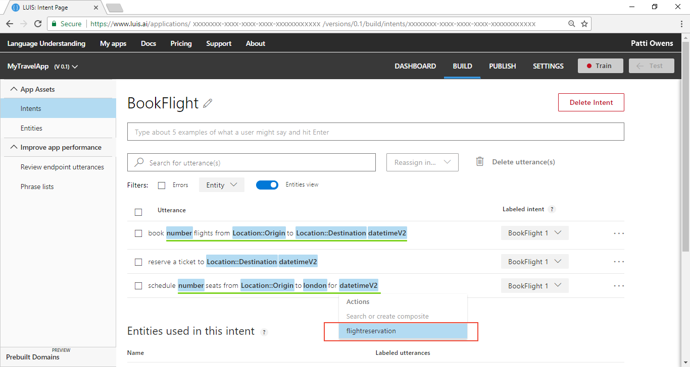

    For the last utterance, wrap `London` and `tomorrow` in the composite entity, using the same instructions. 

## Train the LUIS app
LUIS doesn't know about the changes to the intents and entities (the model), until it is trained. 

1. In the top right side of the LUIS website, select the **Train** button.

    

2. Training is complete when you see the green status bar at the top of the website confirming success.

    

## Publish the app to get the endpoint URL
In order to get a LUIS prediction in a chat bot or other application, you need to publish the app. 

1. In the top right side of the LUIS website, select the **Publish** button. 

    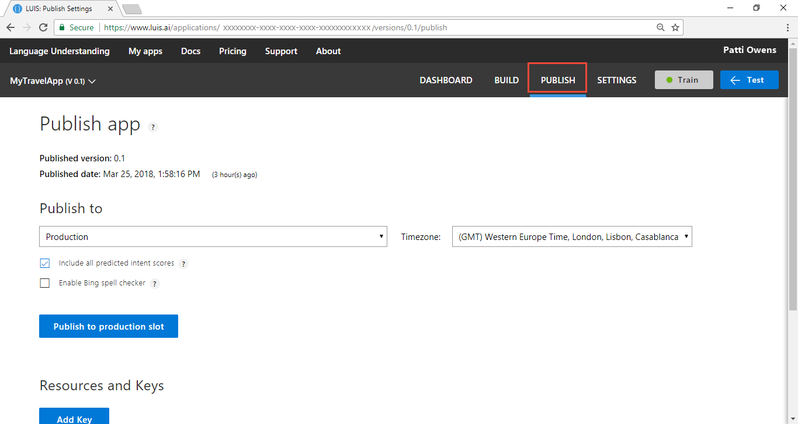

2. Select the **Publish to product slot**. 

    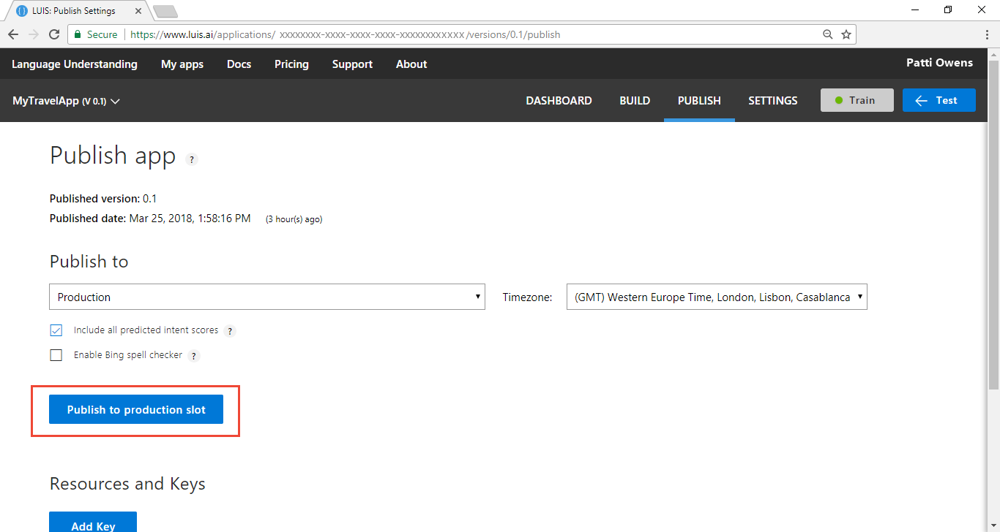

3. Publishing is complete when you see the green status bar at the top of the website confirming success.

## Query the endpoint with a different utterance
1. On the **Publish** page, select the **endpoint** link at the bottom of the page. This action opens another browser window with the endpoint URL in the address bar. 

    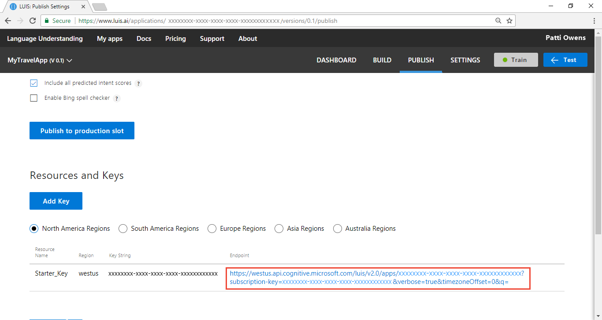

2. Go to the end of the URL in the address and enter `reserve 3 seats from London to Cairo on Sunday`. The last querystring parameter is `q`, the utterance query. This utterance is not the same as any of the labeled utterances so it is a good test and should return the `BookFlight` intent with the hierarchical entity extracted.

```
{
  "query": "reserve 3 seats from London to Cairo on Sunday",
  "topScoringIntent": {
    "intent": "BookFlight",
    "score": 0.999999046
  },
  "intents": [
    {
      "intent": "BookFlight",
      "score": 0.999999046
    },
    {
      "intent": "None",
      "score": 0.227036044
    }
  ],
  "entities": [
    {
      "entity": "sunday",
      "type": "builtin.datetimeV2.date",
      "startIndex": 40,
      "endIndex": 45,
      "resolution": {
        "values": [
          {
            "timex": "XXXX-WXX-7",
            "type": "date",
            "value": "2018-03-25"
          },
          {
            "timex": "XXXX-WXX-7",
            "type": "date",
            "value": "2018-04-01"
          }
        ]
      }
    },
    {
      "entity": "3 seats from london to cairo on sunday",
      "type": "flightreservation",
      "startIndex": 8,
      "endIndex": 45,
      "score": 0.6892485
    },
    {
      "entity": "cairo",
      "type": "Location::Destination",
      "startIndex": 31,
      "endIndex": 35,
      "score": 0.557570755
    },
    {
      "entity": "london",
      "type": "Location::Origin",
      "startIndex": 21,
      "endIndex": 26,
      "score": 0.8933808
    },
    {
      "entity": "3",
      "type": "builtin.number",
      "startIndex": 8,
      "endIndex": 8,
      "resolution": {
        "value": "3"
      }
    }
  ],
  "compositeEntities": [
    {
      "parentType": "flightreservation",
      "value": "3 seats from london to cairo on sunday",
      "children": [
        {
          "type": "builtin.datetimeV2.date",
          "value": "sunday"
        },
        {
          "type": "Location::Destination",
          "value": "cairo"
        },
        {
          "type": "builtin.number",
          "value": "3"
        },
        {
          "type": "Location::Origin",
          "value": "london"
        }
      ]
    }
  ]
}
```

This utterance returns a composite entities array including the **flightreservation** object with the data extracted.  

## What has this LUIS app accomplished?
This app, with just two intents and a compositie entity, identified a natural language query intention and returned the extracted data. 

Your chat bot now has enough information to determine the primary action, `BookFlight`, and the reservation information found in the utterance. 

## Where is this LUIS data used? 
LUIS is done with this request. The calling application, such as a chat bot, can take the topScoringIntent result and the data from the entity to take the next step. LUIS doesn't do that programmatic work for the bot or calling application. LUIS only determines what the user's intention is. 

## Next steps

[Learn more about entities](luis-concept-entity-types.md). 

<!--References-->
[LUIS]:luis-reference-regions.md#luis-website
[LUIS-regions]:luis-reference-regions.md#publishing-regions
