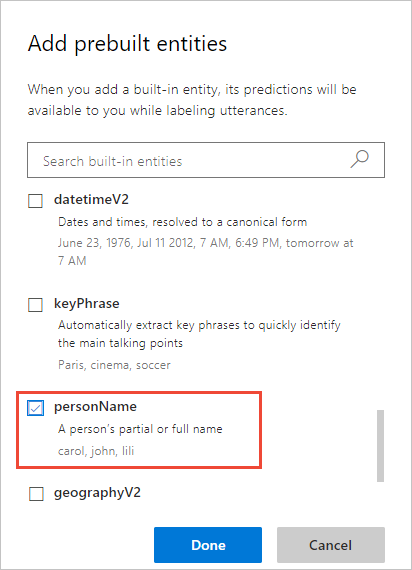
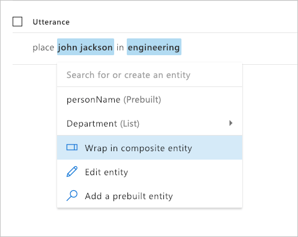

# Tutorial: Group and extract related data
In this tutorial, add a composite entity to bundle extracted data of various types into a single containing entity. By bundling the data, the client application can easily extract related data in different data types.

The purpose of the composite entity is to group related entities into a parent category entity. The information exists as separate entities before a composite is created. 

The composite entity is a good fit for this type of data because the data:

* Are related to each other. 
* Use a variety of entity types.
* Need to be grouped and processed by client app as a unit of information.

**In this tutorial, you learn how to:**

<!-- green checkmark -->
> [!div class="checklist"]
> * Import example app
> * Create intent
> * Add composite entity 
> * Train
> * Publish
> * Get intents and entities from endpoint

[!INCLUDE [LUIS Free account](../../../includes/cognitive-services-luis-free-key-short.md)]

## Import example app

1.  Download and save the [app JSON file](https://github.com/Azure-Samples/cognitive-services-language-understanding/blob/master/documentation-samples/tutorials/build-app/tutorial_list.json) from the List entity tutorial.

2. Import the JSON into a new app.

3. From the **Manage** section, on the **Versions** tab, clone the version, and name it `composite`. Cloning is a great way to play with various LUIS features without affecting the original version. Because the version name is used as part of the URL route, the name can't contain any characters that are not valid in a URL.

## Composite entity

In this app, the department name is defined in the **Department** list entity and includes synonyms. 

The **TransferEmployeeToDepartment** intent has example utterances to request an employee be moved to a new department. 

Example utterances for this intent include:

|Example utterances|
|--|
|move John W. Smith to the accounting department|
|transfer Jill Jones from to R&D|
 
The move request should include the department name, and the employee name. 

## Add the PersonName prebuilt entity to help with common data type extraction

LUIS provides several prebuilt entities for common data extraction. 

1. Select **Build** from the top navigation, then select **Entities** from the left navigation menu.

1. Select **Manage prebuilt entity** button.

1. Select **[PersonName](luis-reference-prebuilt-person.md)** from the list of prebuilt entities then select **Done**.

    

    This entity helps you add name recognition to your client application.

## Create composite entity from example utterances

1. Select **Intents** from the left navigation.

1. Select **TransferEmployeeToDepartment** from the intents list.

1. In the utterance `place John Jackson in engineering`, select the personName entity, `John Jackson`, then select **Wrap in composite entity** in the pop-up menu list for the following utterance. 

    

1. Then immediately select the last entity, `engineering` in the utterance. A green bar is drawn under the selected words indicating a composite entity. In the pop-up menu, enter the composite name `TransferEmployeeInfo` then select enter. 

    

1. In **What type of entity do you want to create?**, all the fields required are in the list: `personName` and `Department`. Select **Done**. Notice that the prebuilt entity, personName, was added to the composite entity. If you could have a prebuilt entity appear between the beginning and ending tokens of a composite entity, the composite entity must contain those prebuilt entities. If the prebuilt entities are not included, the composite entity is not correctly predicted but each individual element is.

    

## Label example utterances with composite entity

1. In each example utterance, select the left-most entity that should be in the composite. Then select **Wrap in composite entity**.

1. Select the last word in the composite entity then select **TransferEmployeeInfo** from the pop-up menu. 

1. Verify all utterances in the intent are labeled with the composite entity. 

## Train the app so the changes to the intent can be tested 

[!INCLUDE [LUIS How to Train steps](../../../includes/cognitive-services-luis-tutorial-how-to-train.md)]

## Publish the app so the trained model is queryable from the endpoint

[!INCLUDE [LUIS How to Publish steps](../../../includes/cognitive-services-luis-tutorial-how-to-publish.md)]

## Get intent and entity prediction from endpoint 

1. [!INCLUDE [LUIS How to get endpoint first step](../../../includes/cognitive-services-luis-tutorial-how-to-get-endpoint.md)]

2. Go to the end of the URL in the address and enter `Move Jill Jones to DevOps`. The last querystring parameter is `q`, the utterance query. 

    Since this test is to verify the composite is extracted correctly, a test can either include an existing sample utterance or a new utterance. A good test is to include all the child entities in the composite entity.

    ```json
    {
      "query": "Move Jill Jones to DevOps",
      "topScoringIntent": {
        "intent": "TransferEmployeeToDepartment",
        "score": 0.9882747
      },
      "intents": [
        {
          "intent": "TransferEmployeeToDepartment",
          "score": 0.9882747
        },
        {
          "intent": "None",
          "score": 0.00925369747
        }
      ],
      "entities": [
        {
          "entity": "jill jones",
          "type": "builtin.personName",
          "startIndex": 5,
          "endIndex": 14
        },
        {
          "entity": "devops",
          "type": "Department",
          "startIndex": 19,
          "endIndex": 24,
          "resolution": {
            "values": [
              "Development Operations"
            ]
          }
        },
        {
          "entity": "jill jones to devops",
          "type": "TransferEmployeeInfo",
          "startIndex": 5,
          "endIndex": 24,
          "score": 0.9607566
        }
      ],
      "compositeEntities": [
        {
          "parentType": "TransferEmployeeInfo",
          "value": "jill jones to devops",
          "children": [
            {
              "type": "builtin.personName",
              "value": "jill jones"
            },
            {
              "type": "Department",
              "value": "devops"
            }
          ]
        }
      ]
    }
    ```

   This utterance returns a composite entities array. Each entity is given a type and value. To find more precision for each child entity, use the combination of type and value from the composite array item to find the corresponding item in the entities array.  

## Clean up resources

[!INCLUDE [LUIS How to clean up resources](../../../includes/cognitive-services-luis-tutorial-how-to-clean-up-resources.md)]

## Related information

* [List entity tutorial](luis-quickstart-intents-only.md)
* [Composite entity](luis-concept-entity-types.md) conceptual information
* [How to train](luis-how-to-train.md)
* [How to publish](luis-how-to-publish-app.md)
* [How to test in LUIS portal](luis-interactive-test.md)


## Next steps

This tutorial created a composite entity to encapsulate existing entities. This allows the client application to find a group of related data in different datatypes to continue the conversation. A client application for this Human Resources app could ask what day and time the move needs to begin and end. It could also ask about other logistics of the move such as a physical phone. 

> [!div class="nextstepaction"] 
> [Learn how to add a simple entity with a phrase list](luis-quickstart-primary-and-secondary-data.md)  
