# Use an Azure Function app to add LUIS information to Application Insights

## Prerequisites

> [!div class="checklist"]
* Your LUIS **[LUIS endpoint key](manage-keys#endpoint-key)**. 
* Your existing LUIS [**application ID**](./luis-get-started-create-app.md) for the [Home Automation example](luis-get-started-create-app.md). The application ID is shown in the application's Settings page. 

> [!Tip]
> If you do not already have a subscription, you can register for a [free account](https://azure.microsoft.com/free/).

All of the code in this tutorial is available on the [LUIS-Samples github repository](https://github.com/Microsoft/LUIS-Samples/tree/master/documentation-samples/azure-function-application-insights-endpoint). 

## Scenario
This tutorial adds LUIS request and response information to the ApplicationInsights telemetry data storage. 

## What is ApplicationInsights?
Use [Application Insights](https://docs.microsoft.com/azure/application-insights/app-insights-overview) to monitor your live web application. It includes powerful analytics tools to help you diagnose telemetry issues and to understand what users actually do with your app. It's designed to help you continuously improve performance and usability. 

Currently, LUIS does not natively support Application Insights telemetry, but the Azure Function app does. 

## What is an Azure function app?
The [Azure Function](https://docs.microsoft.com/azure/azure-functions/) app is a serverless platform, currently supporting C# and Nodejs. An Azure function app is a unit of code that is executed based on an HTTP call. Azure functions can be triggered, cascaded, and returned to the caller. Any code you can call from .Net Core or Nodejs can be called from an Azure function. You have access to both NuGet (C#) and NPM (Nodejs) modules.

While you can develop Azure functions local to your development computer, you can also use the Azure portal's development environment for functions. Using the portal is a better fit for working with ApplicationInsights for this tutorial. 

While the Azure function in this tutorial is written in C#, your calling code can be in any programming language. The Azure function is a drop-in replacement for the LUIS endpoint. 

## Function purpose

This tutorial wraps the LUIS API endpoint query in an Azure function. The function's purpose is to send LUIS query or error information to Application Insights. Instead of calling the LUIS API as an HTTP Request, call the Azure function as an HTTP Request. The function returns the LUIS query results or errors without altering them.

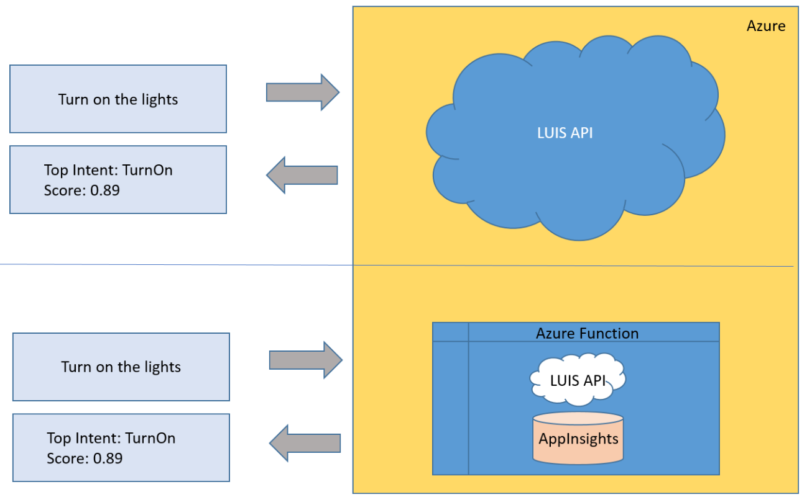

The function can, in addition to calling LUIS and Application Insights, call or use any REST or SDK on the C# or Nodejs platform. 

## Data Storage

Each call to the function adds custom information to your Application Insights service including the LUIS query response of intents, entities, scores, Azure Keys, LUIS App ID, and the region. Each custom data item is a name/value pair. In Application Insights, all the custom data is stored in a single JSON field of name/value pairs. 

## Azure services
The tutorial uses four Azure resources. The Function app service is hosted in an App Service plan. The ApplicationInsights service stores data in an Azure Storage Account. When the Function app is created, your Azure resources list has four new items:

|Azure Service|Purpose|
|--|--|
|ApplicationInsights|ApplicationInsights|Application Analytics|
|Azure Function app (AppService)|Serverless code|
|Storage Account|Data storage|
|App Service plan|Hosts app|

For this tutorial, all four services are in the "West US 2" region.

## Create the Function app
1. Sign in to **[Microsoft Azure](https://ms.portal.azure.com/)**
2. 
3. Click the green **+** sign in the upper left-hand panel and search for "Function app" in the marketplace, and follow the **create experience**.

    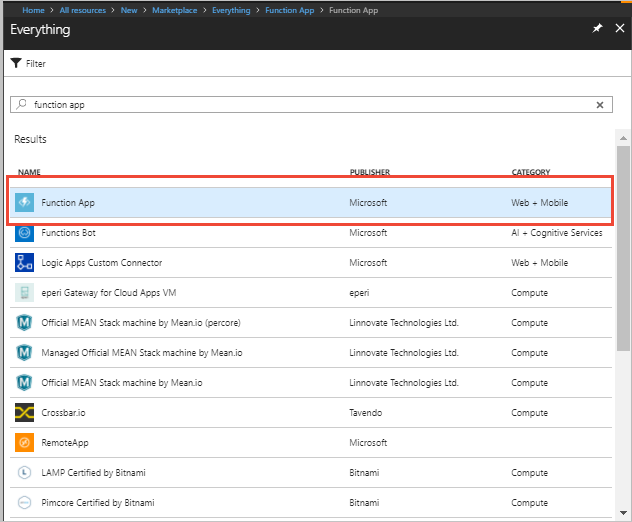 

3. Create the Function app with settings including account name of `LUIS-Fn-AppInsights-Tutorial`, pricing tiers, etc. Select **Consumption Plan** for the Hosting plan. Turn on **Application Insights**. Select `West US 2` for the Hosting Plan and Application Insights Location regions. Check **Pin to dashboard** so you can quickly return to the function. Select **Create**.

    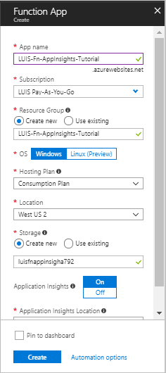 

    When Deployment succeeds, you see the Function app settings. This is currently an empty Function app. You need to add the first function.

## Add function
1. In the Function apps list on the left, click on the blue **+** symbol to add a function.

    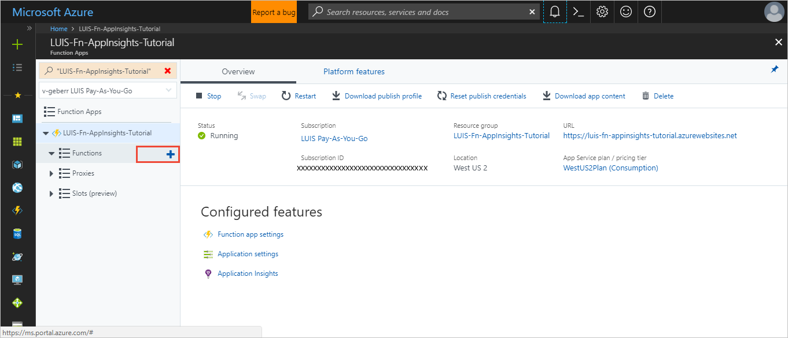

2. Select a **Webhook + API** scenario and choose **CSharp** for the language. Then click **Create this function**.

    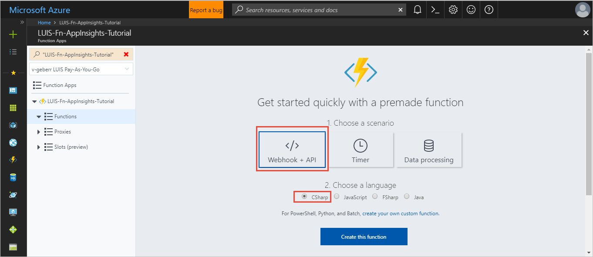

The functions list, under the Function Apps, shows one function named **HttpTriggerCSharp1**. The right window displays the code for run.csx. The method inside the file, **Run**, is the main entry. 

    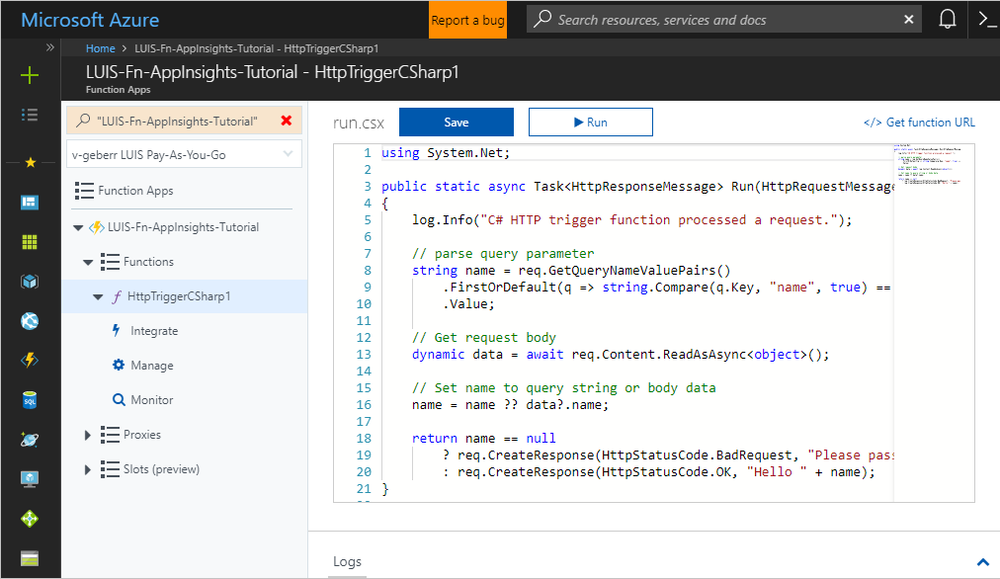

By default, when you call the function from an HTTP request with a query string or body that includes "name" and a value for "name", the function sends an HTTP response of "Hello " + name. If no value for name was provided, the function sends an HTTP error of BadRequest and a message asking for a name. 

The `Run` method is in `run.csx`:

   [!code-javascript[Run.original.csx](~/samples-luis/documentation-samples/azure-function-application-insights-endpoint/run.original.csx)]

## Verify basic function works
You can test the function in the far-right **Test** pane. 

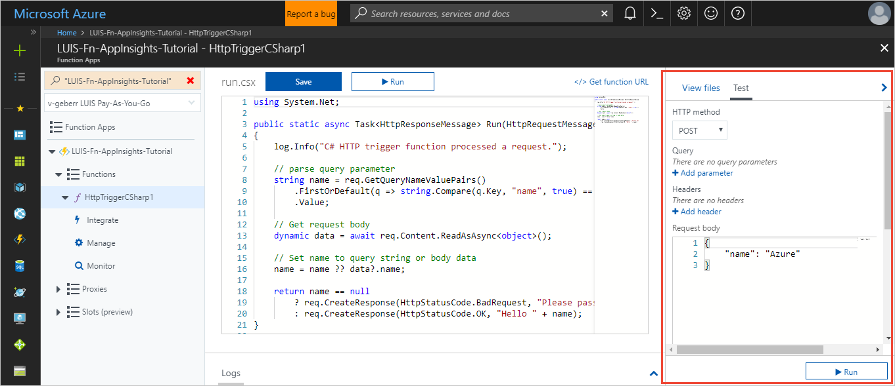

1. Click on **Run**. The **Output** box appears below the **Request body** box.

    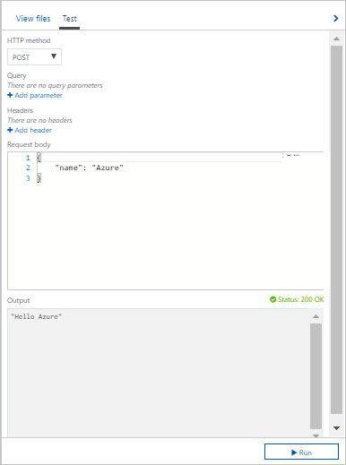

2. You can see the log of the function at the bottom, under the code window. Click the blue **^** to enlarge the log view.

    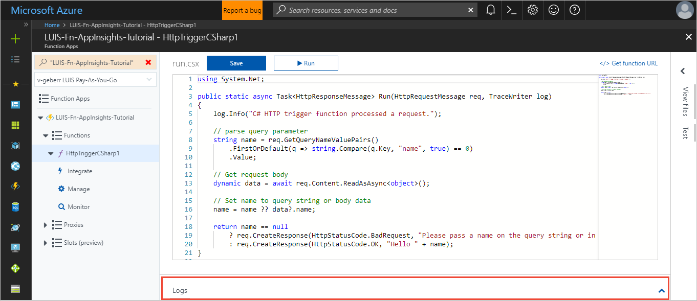

You have a working function app. 

> [!CAUTION]
> * If you receive an HTTP 500 error, the function has a runtime error. A best practice is to make small changes and test often. After each code addition below, save, and test that the function does not return a 500 error.
> * If, at some point in the tutorial, you change the code, save, and test and receive an error, feel free to save again and test or wait 10 seconds before testing again.

## Function files
All files associated with the function are available for editing. You can view the files by clicking **View files** next to **Test** in the far-right panel. 

    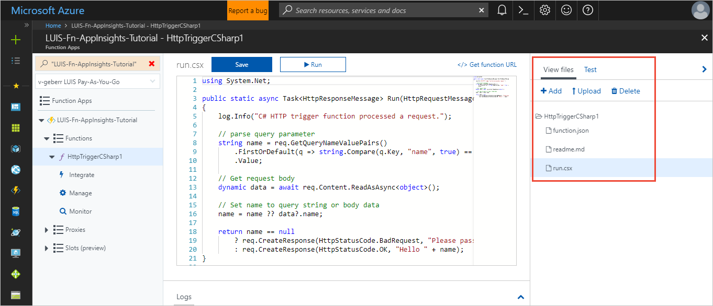

This basic function currently has a `function.json` file, a `readme.md` file, and a `run.csx` file. You can add, delete, or upload a file.

> [!Note]
> * For this tutorial, you do not need to change the `function.json` or the `readme.md` files.

## Restore NuGet packages
The function in this tutorial needs to use the Application Insights NuGet and the Newtonsoft.Json package. In order to add the dependencies to the function, the package name, and version are added to the `package.json`.

A basic function has no dependencies so the dependency file, `package.json` does not exist yet. [Download the `package.json`](https://github.com/Microsoft/LUIS-Samples/blob/master/documentation-samples/azure-function-application-insights-endpoint/project.json) from LUIS-Samples and upload to the files. 

[!code-javascript[Package.json dependencies](~/samples-luis/documentation-samples/azure-function-application-insights-endpoint/package.json)]

Watch the log to see that the NuGet packages are restored. Do not continue until the package is load is finished.

```
2018-01-12T21:27:20.644 Restoring packages.
2018-01-12T21:27:20.644 Starting NuGet restore
2018-01-12T21:27:22.787 Restoring packages for D:\home\site\wwwroot\HttpTriggerCSharp1\project.json...
2018-01-12T21:27:24.113 Committing restore...
2018-01-12T21:27:24.133 Writing lock file to disk. Path: D:\home\site\wwwroot\HttpTriggerCSharp1\project.lock.json
2018-01-12T21:27:24.410 D:\home\site\wwwroot\HttpTriggerCSharp1\project.json
2018-01-12T21:27:24.410 Restore completed in 1612ms.
2018-01-12T21:27:24.410 
2018-01-12T21:27:24.410 NuGet Config files used:
2018-01-12T21:27:24.410 C:\DWASFiles\Sites\mawsFnPlaceholder193\AppData\NuGet\NuGet.Config
2018-01-12T21:27:24.410 
2018-01-12T21:27:24.410 Feeds used:
2018-01-12T21:27:24.410 https://api.nuget.org/v3/index.json
2018-01-12T21:27:24.441 
2018-01-12T21:27:24.441 
2018-01-12T21:27:24.628 Packages restored.
2018-01-12T21:27:24.943 Script for function 'HttpTriggerCSharp1' changed. Reloading.
2018-01-12T21:27:25.213 Compilation succeeded.
```

## Add NuGet package
Return to the `run.csx` file. 

Most of the additional code for this tutorial is between the `Using` statement and the `Run` method. First, add the `System` and `ApplicationInsights` dependencies.

Add the following code:

   [!code-javascript[Add NuGet package](~/samples-luis/documentation-samples/azure-function-application-insights-endpoint/run.csx?range=7-20)]

Save the file.

## Add keys

Next, add the following code for the LUIS and Bing values. Change these values to your own ID and Keys.

   [!code-javascript[Add keys](~/samples-luis/documentation-samples/azure-function-application-insights-endpoint/run.csx?range=22-25)]

> [!Note]
> * You do not have to use the Bing Spell Check for this tutorial to function. It is added here as an option. 

Save the file.

## Add dependency variables
Add the HttpClient, and ApplicationInsights dependency variables:

   [!code-javascript[Add dependency variables](~/samples-luis/documentation-samples/azure-function-application-insights-endpoint/run.csx?range=27-32)]

Because Application Insights was turned on as part of the Function app creation, the `APPINSIGHTS_INSTRUMENTATIONKEY` is an environment variable for the Function app. You do not need to find the instrumentation key or set it. 

Save the file.

## Add function name variables for searching 
The easiest way to find the entries sent to Application Insights from this function is to search for unique and specific names. For this tutorial, the function name is `LUIS_fn_example` and the dependency name is `LUIS_fn_dependency_`. Add the code for this constant string:

   [!code-javascript[Add function name variables for searching](~/samples-luis/documentation-samples/azure-function-application-insights-endpoint/run.csx?range=34-36)]

Since the function is hooked to Application Insights, there are more entries than just the LUIS query results from the function.

Save the file.

## Create a new LUIS class
All the LUIS and Application Insights code is in a LUIS class. Create the class just after the function name:

```CSharp
public static class LUIS
{
    // add LUIS query result classes here

    // add EndpointQuery method here

    // add Application Insights successful log here

    // add Application Insights error log here
}
```

Save the file and test. If the test returns 200 continue.

## Add LUIS query result classes to LUIS class
The LUIS query result is a nested JSON object. In order to deserialize it into C# classes, the classes have to be defined. Notice that along with the properties from LUIS, several more properties have been added to collect more information about the call to LUIS. 

Add the following LUIS query result classes:

   [!code-javascript[Add LUIS query result classes to LUIS class](~/samples-luis/documentation-samples/azure-function-application-insights-endpoint/run.csx?range=40-68)]

Save the file and test. If the test returns 200 continue.

## Add EndpointQuery method to LUIS class
The function's main method `Run` does not handle the LUIS request. Instead, create a new method `EndpointQuery` to handle the LUIS request and the Application Insights entry.

The `EndpointQuery` method builds the URL, adds the `Ocp-Apim-Subscription-Key` HTTP security header, creates the telemetry object `dependencyTelemetry`, starts the dependency timer, awaits the asynchronous response from LUIS, sends the success or failing response to Application Insights, and returns the original response from LUIS back to the function's main method `Run`.

Add the `EndpointQuery` method:

   [!code-javascript[Add EndpointQuery method to LUIS class](~/samples-luis/documentation-samples/azure-function-application-insights-endpoint/run.csx?range=70-137)]

Save the file and test. If the test returns 200 continue.

The [DependencyTelemetry](https://docs.microsoft.com/dotnet/api/microsoft.applicationinsights.datacontracts.dependencytelemetry?view=azure-dotnet) constructor takes a Name and Type property. Both are arbitrary in this example. The Name is set to `LUIS-dependency-` + the region. This name is used to find the LUIS query results later in the tutorial.

## Add Application Insights successful log to LUIS class
The `ApplicationInsightsTraceSuccess` adds Application Insights properties to the dependency and sends those properties to Application Insights with the `.Track` call. The query result is flattened including all intents and entities. Each item in the array is numbered for each property.

Add the `ApplicationInsightsTraceSuccess` method:

   [!code-javascript[Add Application Insights successful log to LUIS class](~/samples-luis/documentation-samples/azure-function-application-insights-endpoint/run.csx?range=138-171)]

Save the file and test. If the test returns 200 continue.

## Add Application Insights error log to LUIS class
The `ApplicationInsightsTraceError` adds Application Insights properties to the dependency and sends those properties to Application Insights with the `.Track` call.

Add the `ApplicationInsightsTraceError` method:

   [!code-javascript[Add Application Insights error log to LUIS class](~/samples-luis/documentation-samples/azure-function-application-insights-endpoint/run.csx?range=172-183)]

Save the file and test. If the test returns 200 continue.

## Add LUIS.EndpointQuery to Run method
The complete LUIS class is now in `run.csx`. The main method `Run` needs to call it. 

Change the `Run` method to add the region either through the querystring or body and change the final call to return the LUIS.endpoint method results.

   [!code-javascript[Add LUIS.EndpointQuery to Run method](~/samples-luis/documentation-samples/azure-function-application-insights-endpoint/run.csx?range=186-213)]

Save the file and test. The test returns 400 bad request because the function expects the `query` name/value pair. 

Change the request body to:

```JSON
{
    "query": "turn on the lights"
}
```

Save the file and test. If the test returns 200 continue. The response from LUIS looks exactly as if it was made directly to the LUIS API.  

## Test failing LUIS Query
Make sure the erroring path is also returning the LUIS response. 

1. Change the name of the HTTP Header to have an extra `y` at the end of `LUISsubscriptionKey`. Since the proper header isn't sent, LUIS should response with a 401-Unauthorized error.

    Code before this change:
    
    ```CSharp
    httpClient.DefaultRequestHeaders.Add("Ocp-Apim-Subscription-Key", LUISsubscriptionKey);
    ```
    
    Code after this change:
    
    ```CSharp
    httpClient.DefaultRequestHeaders.Add("Ocp-Apim-Subscription-Key", LUISsubscriptionKeyy);
    ```

2. Save the file. Click on the **Test** button.

3. Review the HTTP response **Output** shown below the test query. The response from LUIS looks exactly as if it was made directly to LUIS.

## Test from Curl, an HTTP client
This test is outside the Azure portal. 

1. Get the function's URL by clicking on `</> Get function` in the top, middle window to the right of the Run button. 

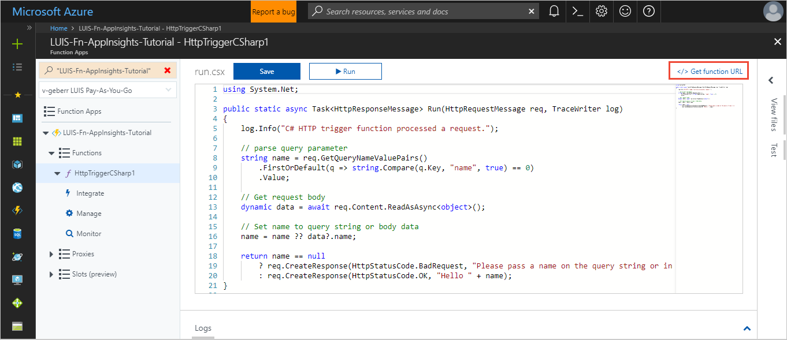

2. Copy this URL.  

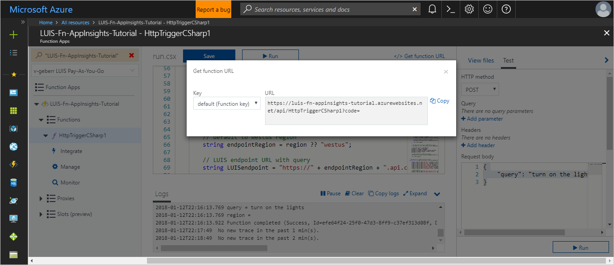

3. Open a command/terminal window to use [Curl](https://curl.haxx.se/). Enter the following Curl command to make an HTTP request into the Azure function, replace `<URL>` with the URL from step 2:

```
curl -H "Content-Type: application/json" -X POST -d '{"query":"turn on the lights"}' <URL>
```

The Curl response is:
```
  % Total    % Received % Xferd  Average Speed   Time    Time     Time  Current
                                 Dload  Upload   Total   Spent    Left  Speed
100   599  100   569  100    30    569     30  0:00:01 --:--:--  0:00:01   697{
  "query": "turn on the lights",
  "topScoringIntent": {
    "intent": "HomeAutomation.TurnOn",
    "score": 0.9835362
  },
  "intents": [
    {
      "intent": "HomeAutomation.TurnOn",
      "score": 0.9835362
    },
    {
      "intent": "None",
      "score": 0.0832152
    },
    {
      "intent": "HomeAutomation.TurnOff",
      "score": 0.0231100265
    }
  ],
  "entities": [
    {
      "entity": "lights",
      "type": "HomeAutomation.Device",
      "startIndex": 12,
      "endIndex": 17,
      "score": 0.637476563
    }
  ]
}

```

The Curl command did not have to pass the LUIS App ID, LUIS subscription Key, or Bing Subscription Key. The command only has to pass the query. 
 
## View LUIS entries in Application Insights
Open Application Insights to see the LUIS entries. 

1. In the portal, select `All resources` then filter by the name `LUIS-Fn-AppInsights-Tutorial`. The `All resources` icon is a 9x9 green grid. Click on the resource with the type `Application Insights`. The icon for Application Insights is a light bulb. 

    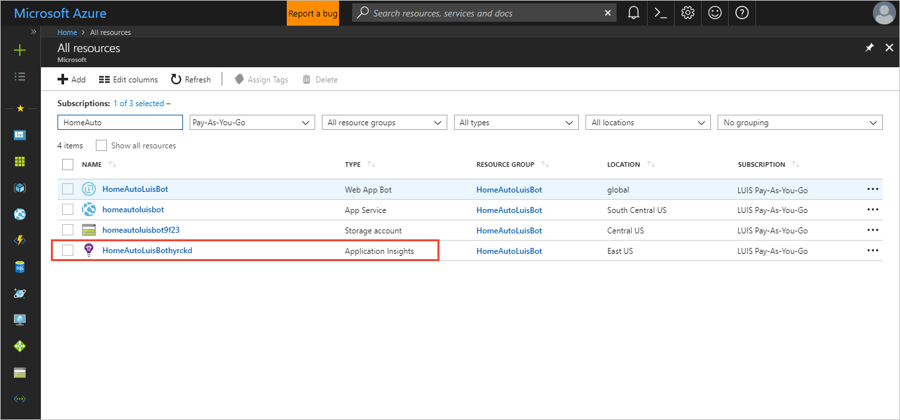

2. When the resource opens, click on the **Search** icon of the magnifying glass in the far right panel. A new panel to the right displays. Depending on how much telemetry data is found, the panel may take a second to display. The listing has Trace, Request, Dependency, and Exception data. Dependencies, such as the LUIS query results, are marked with a yellow bar to the left of the item. Filter on `LUIS_fn_dependency_` and hit enter on the keyboard. The list is narrowed to just LUIS query results.

    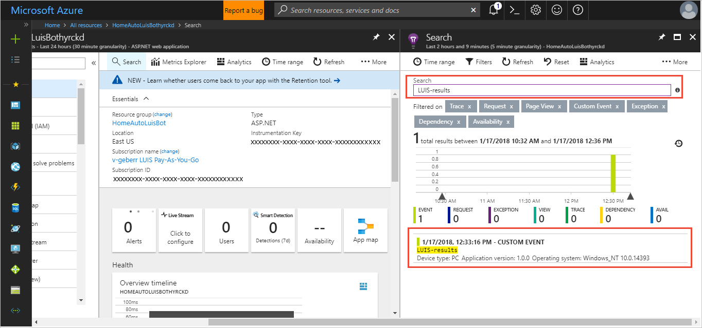

3. Select the second entry from the top -- the successful LUIS query. A new window displays more detailed data including the custom data for the successful LUIS query at the far-right. The Custom Data corresponds to the telemetry properties. The Command entry is the URL. 

    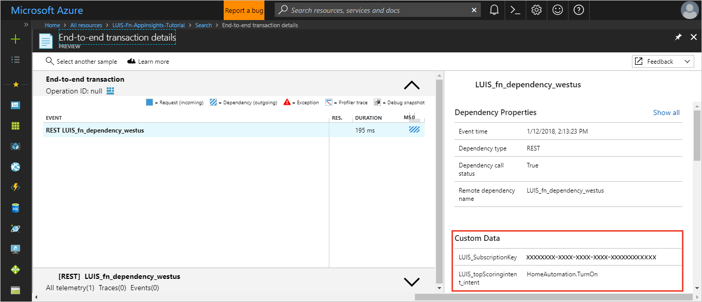

    When you are done, select the far-right top `X` to return to the list of dependency items. 

4. Select the top entry -- the erroring LUIS query. Remember this error was due to changing the required HTTP value to have an extra `y`. The dependency information shows the Custom Data from the `ApplicationInsightsTraceError` method, including the error message from LUIS. When you are done, select the far-right top `X` to return to the list of dependency items. 

> [!Tip]
> If you want to save the dependency list and return to it later, click on `...More` and click `Save favorite`.

## View LUIS entries in Analytics
Application Insights entries are stored in [Analytics](). Analytics gives you the power to query the data with the [Kusto](https://docs.microsoft.com/azure/application-insights/app-insights-analytics#query-data-in-analytics) language, as well as export it to [PowerBI](https://powerbi.microsoft.com). 

1. Click on `Analytics` at the top of the dependency listing, above the filter box. 

    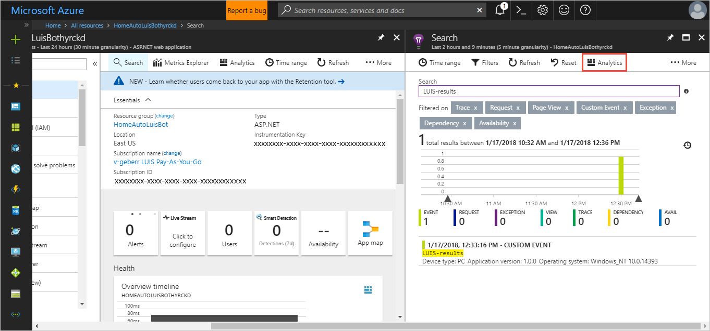

2. A new window opens with a query window above and a data table window below. If you have used databases before, this interface feels familiar. The query includes all items from the last 24 hours beginning with the name `LUIS_fn_dependency_`. The `CustomDimensions` column has the LUIS query results as name/value pairs.

    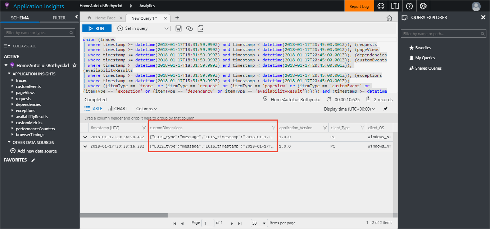

3. To pull out the top intent and the corresponding score, add the following just above the last line in the query window:

    ```SQL
    | extend topIntent = tostring(customDimensions.LUIS_topScoringintent_intent)
    | extend score = todouble(customDimensions.LUIS_topScoringintent_score)
    ```

4. Run the query. Scroll to the far right in the data table. The two new columns of top intent and score are available. Click on the topIntent column to sort.

    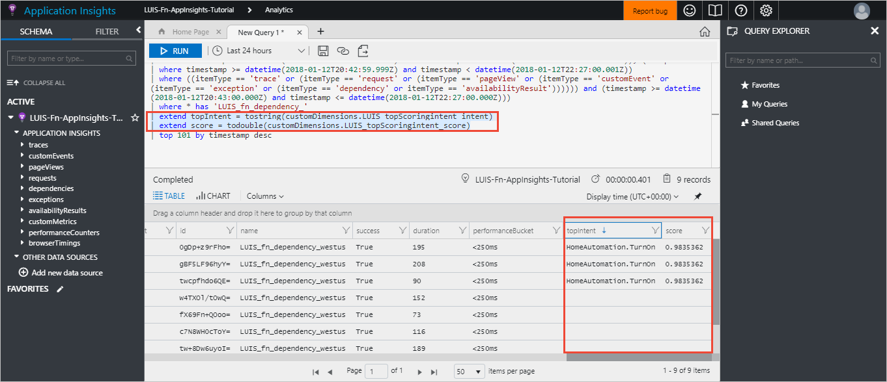

Learn more about the [Kusto query language](https://docs.loganalytics.io/docs/Learn/Getting-Started/Getting-started-with-queries) or [export the data to PowerBi](https://docs.microsoft.com/azure/application-insights/app-insights-export-power-bi). 

## Next steps

> [!div class="nextstepaction"]
> [Learn more about ](Train-Test.md)