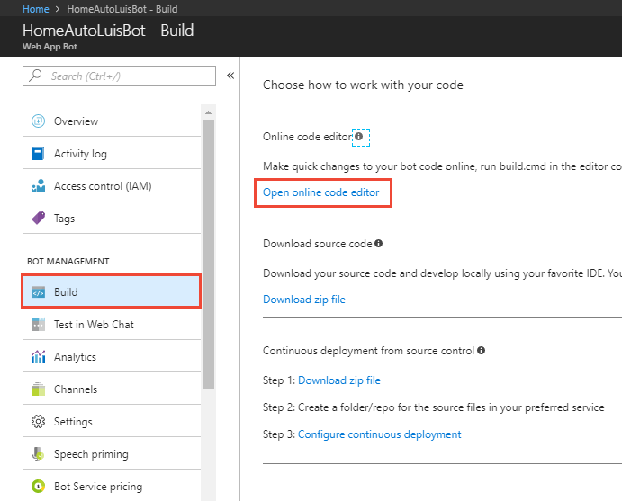
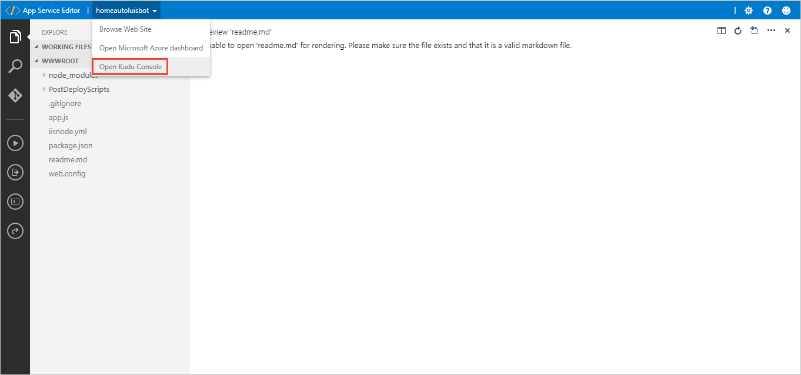
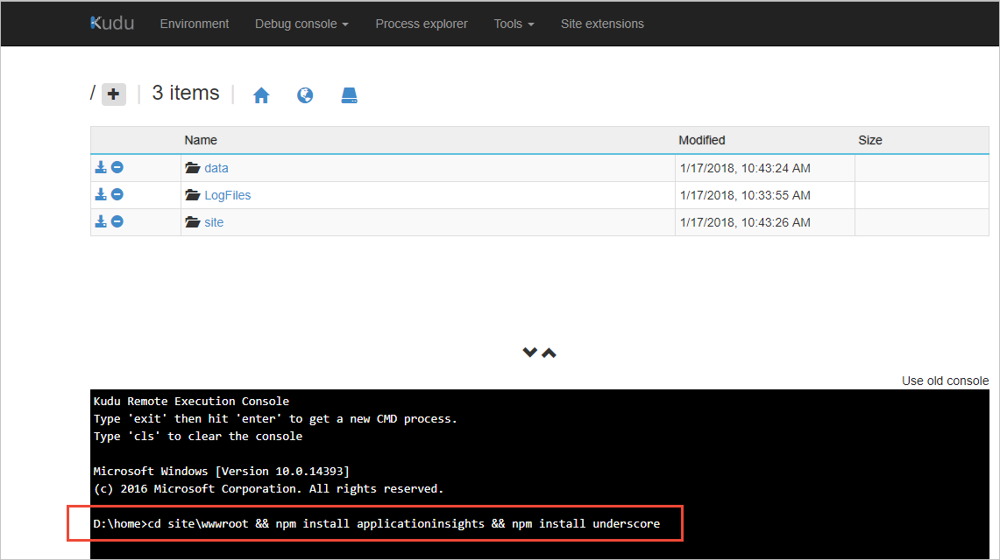

# Add LUIS results to Application Insights from a web app bot
[Application Insights](https://docs.microsoft.com/azure/application-insights/app-insights-overview) is a powerful analytics tools to help you diagnose telemetry issues and to understand what users actually do with your app.

In this tutorial, you learn how to:

> [!div class="checklist"]
* Add ApplicationInsights library to a web app bot
* Capture and send LUIS query results to ApplicationInsights
* Query ApplicationInsights for top intent, score, and utterance

## Prerequisites

* Your LUIS web app bot from the **[previous tutorial](luis-nodejs-tutorial-build-bot-framework-sample.md)**. This tutorial configured ApplicationInsights **On** when you created the bot. 

> [!Tip]
> If you do not already have a subscription, you can register for a [free account](https://azure.microsoft.com/free/).

All of the code in this tutorial is available on the [LUIS-Samples github repository](https://github.com/Microsoft/LUIS-Samples/tree/master/documentation-samples/tutorial-web-app-bot-application-insights/nodejs). 

## Scenario
This tutorial adds LUIS request and response information to [Application Insights](https://azure.microsoft.com/services/application-insights/) telemetry data storage. Once you have that data, you can query it with the Kusto language or PowerBi to analyze, aggregate, and report on intents, and entities of the utterance in real-time. This analysis helps you determine if you should add or edit the intents and entities of your LUIS app.

## Web app bot with LUIS
The code in **app.js**, when you finished the [web app bot with Node.js tutorial](luis-nodejs-tutorial-build-bot-framework-sample), should be: 

   [!code-javascript[Web app bot with LUIS](~/samples-luis/documentation-samples/tutorial-web-app-bot/nodejs/app.js "Web app bot with LUIS")]

## Add Application Insights library to web app bot
The Application Insights feature for the web app bot is turned on, currently Application Insights collects general state telemetry for the bot. It does not collect LUIS request and response information you need to check and fix your intents and entities. 

In order to capture the LUIS request and response, the web app bot needs the NPM package installed and configured in the **app.js** file. Then the intent dialog handlers need to send the LUIS request and response information to Application Insights in a way that it is queryable. 

### NPM install library 
1. In the Azure portal, in the web app bot service, select **Build** under the **Bot Management** section. 

    

2. A new browser tab opens with the App Service Editor. Select the app name in the top bar, then select **Open Kudu Console**. 

    

3. In the console, enter the following command:

    ```
    cd site\wwwroot && npm install applicationinsights && npm install underscore
    ```

    

    Wait for the packages to install:

    ```
    luisbot@1.0.0 D:\home\site\wwwroot
    `-- applicationinsights@1.0.1 
      +-- diagnostic-channel@0.2.0 
      +-- diagnostic-channel-publishers@0.2.1 
      `-- zone.js@0.7.6 
    
    npm WARN luisbot@1.0.0 No repository field.
    luisbot@1.0.0 D:\home\site\wwwroot
    +-- botbuilder-azure@3.0.4
    | `-- azure-storage@1.4.0
    |   `-- underscore@1.4.4 
    `-- underscore@1.8.3 
    ```

    You are done with the kudu console browser tab.

## Capture and send LUIS query results to ApplicationInsights
1. In the App Service Editor browser tab, open the **app.js** file.

2. Add the following NPM libraries under the existing `requires` lines:

   [!code-javascript[Add NPM packages to app.js](~/samples-luis/documentation-samples/tutorial-web-app-bot-application-insights/nodejs/app.js?range=12-16 "Add NPM packages to app.js")]

3. Create the Application Insights object and use the web app bot application setting **BotDevInsightsKey**: 

   [!code-javascript[Create the Application Insights object](~/samples-luis/documentation-samples/tutorial-web-app-bot-application-insights/nodejs/app.js?range=68-80 "Create the Application Insights object")]

4. Add the **appInsightsLog** function:

   [!code-javascript[Add the appInsightsLog function](~/samples-luis/documentation-samples/tutorial-web-app-bot-application-insights/nodejs/app.js?range=68-80 "Add the appInsightsLog function")]

    The last line of the function is where the data is added to Application Insights. 

5. Use the **appInsightsLog** function. You need to add it to every intent dialog:

   [!code-javascript[Use the appInsightsLog function](~/samples-luis/documentation-samples/tutorial-web-app-bot-application-insights/nodejs/app.js?range=117-118 "Use the appInsightsLog function")]

    All the code is available in the [LUIS-Samples repository](https://github.com/Microsoft/LUIS-Samples/tree/master/documentation-samples/tutorial-web-app-bot-application-insights/nodejs) and each line associated with this tutorial is commented with `//APPINSIGHT:`.

6. Use the **Test in Web Chat** feature to test your web app bot. You should see no difference because all the work is in Application Insights, not in the bot responses.

## View LUIS entries in Application Insights
Open Application Insights to see the LUIS entries. 

1. In the portal, select **All resources** then filter by the web app bot name. Click on the resource with the type **Application Insights**. The icon for Application Insights is a light bulb. 

    


2. When the resource opens, click on the **Search** icon of the magnifying glass in the far right panel. A new panel to the right displays. Depending on how much telemetry data is found, the panel may take a second to display. Search for `LUIS-results` and hit enter on the keyboard. The list is narrowed to just LUIS query results added with this tutorial.

    

3. Select the top entry. A new window displays more detailed data including the custom data for the LUIS query at the far-right. The data includes the top intent, and its score.

    

    When you are done, select the far-right top **X** to return to the list of dependency items. 


> [!Tip]
> If you want to save the dependency list and return to it later, click on **...More** and click **Save favorite**.

## Query Application Insights for intent, score, and utterance
Application Insights gives you the power to query the data with the [Kusto](https://docs.microsoft.com/azure/application-insights/app-insights-analytics#query-data-in-analytics) language, as well as export it to [PowerBI](https://powerbi.microsoft.com). 

1. Click on **Analytics** at the top of the dependency listing, above the filter box. 

    

2. A new window opens with a query window above and a data table window below. If you have used databases before, this arrangement is familiar. The query includes all items from the last 24 hours beginning with the name `LUIS-results`. The **CustomDimensions** column has the LUIS query results as name/value pairs.

    

3. To pull out the top intent, score, and utterance, add the following just above the last line in the query window:

    ```SQL
    | extend topIntent = tostring(customDimensions.LUIS_intent_intent)
    | extend score = todouble(customDimensions.LUIS_intent_score)
    | extend utterance = tostring(customDimensions.LUIS_text)
    ```

4. Run the query. Scroll to the far right in the data table. The two new columns of topIntent and score are available. Click on the topIntent column to sort.

    


Learn more about the [Kusto query language](https://docs.loganalytics.io/docs/Learn/Getting-Started/Getting-started-with-queries) or [export the data to PowerBi](https://docs.microsoft.com/azure/application-insights/app-insights-export-power-bi). 

## Next steps

> [!div class="nextstepaction"]
> [Learn more about ](Train-Test.md)