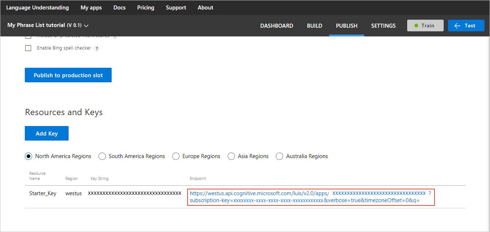
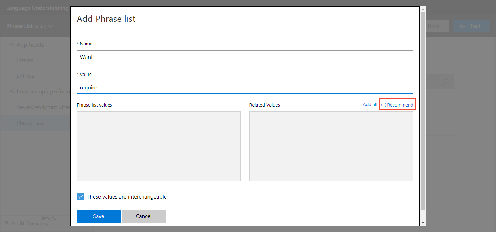
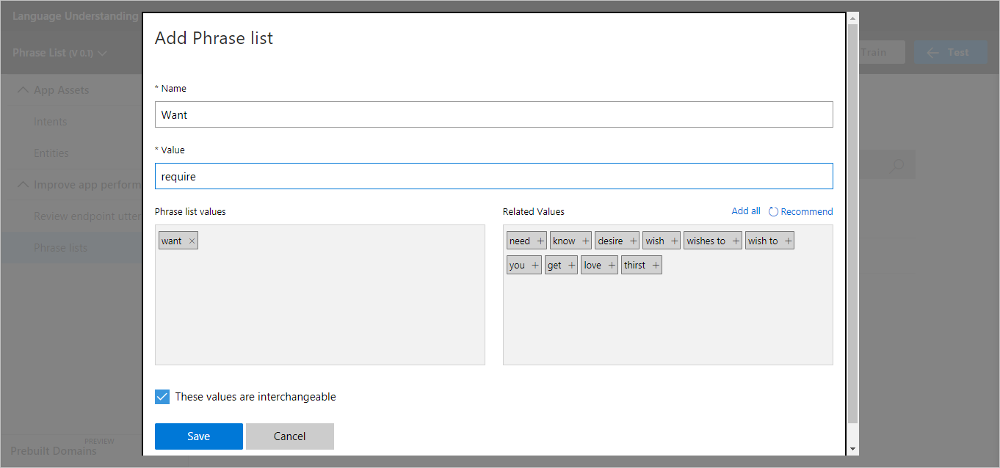
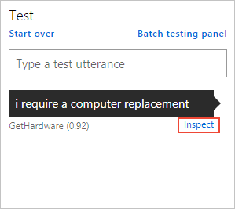

# Enhance LUIS understanding of synonyms with a phrase list 
Improve the accuracy of intent scores and identify entities for words that have the same meaning (synonyms) by adding an interchangeable [phrase list feature](./luis-concept-feature.md).

## Import a new app
1. Download the [example LUIS app][LuisSampleApp] that's designed for this tutorial. You will use it in the next step. 

2. As described in [Create an app](Create-new-app.md#import-new-app), import the file that you downloaded into the [LUIS][LUIS] website as a new app. The app name is "My Phrase List tutorial." It has intents, entities, and utterances. 

3. [Train]() your app. Until it is trained, you cannot [interactively test](Train-Test.md#interactive-testing) it in the [LUIS][LUIS] website. 

4. On the [Publish](PublishApp.md) page, select the **Include all predicted intent scores** check box. When the check box is selected, all intents are returned. When the check box is cleared, only the top intent is returned. 

5. [Publish](PublishApp.md) the app. Publishing the app allows you to test it by using the HTTPS endpoint. 

## Test a trained utterance
Use the published endpoint to query an utterance that the app already knows. Because LUIS already knows the utterance, the score is high and the entity is detected.

1. On the [Language Understanding (LUIS)][LUIS] website, on the **Publish** page for the new app, select the endpoint URL in the **Resources and Keys** section. 

    

2. In the browser, at the end of the URL, add the following query after the `q=`.

    `I want a computer replacement`

    The endpoint responds with the following JSON:
    
    ```JSON
    {
      "query": "I want a computer replacement",
      "topScoringIntent": {
        "intent": "GetHardware",
        "score": 0.9735458
      },
      "intents": [
        {
          "intent": "GetHardware",
          "score": 0.9735458
        },
        {
          "intent": "None",
          "score": 0.07053033
        },
        {
          "intent": "Whois",
          "score": 0.03760778
        },
        {
          "intent": "CheckCalendar",
          "score": 0.02285902
        },
        {
          "intent": "CheckInventory",
          "score": 0.0110072717
        }
      ],
      "entities": [
        {
          "entity": "computer",
          "type": "Hardware",
          "startIndex": 9,
          "endIndex": 16,
          "score": 0.8465915
        }
      ]
    }
    ```

    The intent score of 0.973 and the entity detection score of 0.846 are high because the app was trained with this utterance. The utterance is in the LUIS app on the intent page for **GetHardware**. The utterance's text, `computer`, is labeled as the **Hardware** entity. 
    
    |Status|Word| Intent score | Entity score |
    |--|--|--|--|
    |Trained| want | 0.973 | 0.846 |
    
    
## Test an untrained utterance
In the browser, use the same published endpoint to query with an utterance that the app doesn't already know:

`I require a computer replacement`

This utterance uses a synonym of the previous utterance:

| Trained word | Untrained synonym |
|--|--|
| want | require |

The endpoint response is:

```JSON
{
  "query": "I require a computer replacement",
  "topScoringIntent": {
    "intent": "GetHardware",
    "score": 0.840912163
  },
  "intents": [
    {
      "intent": "GetHardware",
      "score": 0.840912163
    },
    {
      "intent": "None",
      "score": 0.0972757638
    },
    {
      "intent": "Whois",
      "score": 0.0448251367
    },
    {
      "intent": "CheckCalendar",
      "score": 0.0291390456
    },
    {
      "intent": "CheckInventory",
      "score": 0.0137837809
    }
  ],
  "entities": []
}
```

| Status | Word | Intent score | Entity score |
|--|--|--|--|
| Trained| want | 0.973 | 0.846 |
| Untrained| require | 0.840 | - |

The untrained utterance intent score is lower than that of the labeled utterance because LUIS knows that the sentence is grammatically the same. But LUIS doesn't know that the utterances have the same meaning. Also, without the phrase list, the **Hardware** entity is not found.

You must teach LUIS that *want* and *require* mean the same thing in this app domain because a word can have more than one meaning. 

## Improve the score of untrained utterance with phrase list 
1. Add a [phrase list](Add-Features.md) feature named **want** with the value of `want`, and then select **Enter**.

    > [!TIP]
    > After each word or phrase, select the **Enter** key. The word or phrase is added to the **Phrase list values** box while the cursor stays in the **Value** box. You can enter many values quickly with this feature.

2. To view the words that LUIS recommends, select **Recommend**. 

    

3. Add all the words. If `require` is not in the recommended list, add it as a required value. 

4. Because these words are synonyms, keep the *interchangeable* setting, and then select **Save**.

    

5. Train the app, but don't publish it. Now you have two models. You can compare values in the two models.

## Compare the phrase list model to the published model
In this app, the published model is not trained with the synonyms. Only the currently edited model includes the phrase list of synonyms. To compare the models, use [interactive testing](Train-Test.md#interactive-testing). 

1. Open the test pane, and enter the following utterance:

    `I require a computer replacement`

2. To open the inspection panel, select **Inspect**. 

    

3. To compare the published model to the new phrase list model, select **Compare with published**.

    

After you add the phrase list, the increased accuracy of the utterance and the **Hardware** entity is found. 

|Status | Phrase list| Intent score | Entity score |
|--|--|--|--|
| Published | - | 0.84 | - |
| Currently editing |✔| 0.92 | Hardware entity identified |

> [!TIP]
> * By using [Interactive testing](Train-Test.md#interactive-testing), you can compare the published model to any trained changes that are made after you publish. 
> * By using [Endpoint testing](PublishApp.md#test-your-published-endpoint-in-a-browser), you can view the exact LUIS response JSON. 

## Get the entity score with the endpoint test
To view the entity score, [publish the model](PublishApp.md) and query the endpoint. 

`I require a computer replacement`

```JSON
{
  "query": "I require a computer replacement",
  "topScoringIntent": {
    "intent": "GetHardware",
    "score": 0.916503668
  },
  "intents": [
    {
      "intent": "GetHardware",
      "score": 0.916503668
    },
    {
      "intent": "None",
      "score": 0.136505231
    },
    {
      "intent": "Whois",
      "score": 0.02778677
    },
    {
      "intent": "CheckInventory",
      "score": 0.0144592477
    },
    {
      "intent": "CheckCalendar",
      "score": 0.01401332
    }
  ],
  "entities": [
    {
      "entity": "computer",
      "type": "Hardware",
      "startIndex": 12,
      "endIndex": 19,
      "score": 0.5959917
    }
  ]
}
```

The **Hardware** entity shows a score of 0.595 with the phrase list. Before the phrase list existed, the entity was not detected. 

|Status | Phrase list| Intent score | Entity score |
|--|--|--|--|
| Published | - | 0.84 | - |
| Currently editing |✔| 0.92 | 0.595 |

  [LUIS]:luis-reference-regions.md
  [LuisFeatures]: luis-concept-feature.md
  [LuisSampleApp]:https://github.com/Microsoft/LUIS-Samples/blob/master/documentation-samples/phrase_list/interchangeable/luis-app-before-phrase-list.json
