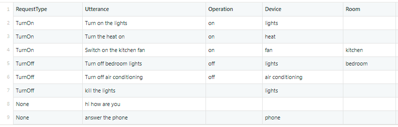
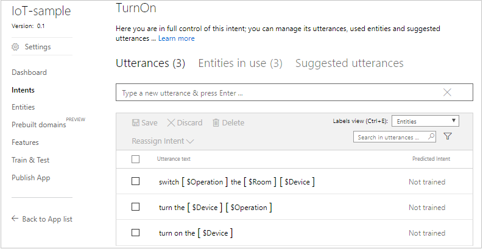

# Build a LUIS app programmatically using Node.js

LUIS provides a programmatic API that does everything that the UI at [https://www.luis.ai](https://www.luis.ai) does. This can save time when you might have a lot of preexisting data and it'd be faster to programmatically create a LUIS app than entering information by hand. 

## Prerequisites

* Log in to www.luis.ai and find your Programmatic Key in Account Settings.  You use this key to call the Authoring API.
* If you don't have an Azure subscription, create a [free account](https://azure.microsoft.com/free/?WT.mc_id=A261C142F) before you begin.
* This tutorial starts with a CSV for a hypothetical company's log files of user requests. Download it [here](https://github.com/Microsoft/LUIS-Samples/tree/master/examples).
* Install the latest Node.js with NPM. Download it from [here](https://nodejs.org/en/download/).
* **[Recommended]** Visual Studio Code for IntelliSense and debugging, download it from [here](https://code.visualstudio.com/) for free.

## Map preexisting data to intents and entities
Even if you have a system that wasn't created with LUIS in mind, if it contains textual data that maps to different things users want to do, you might be able to come up with a mapping from the existing categories of user input to intents in LUIS. If you can identify important words or phrases in what the users said, these might map to entities.

Open the `IoT.csv` file. It contains a log of user queries to a hypothetical home automation service, including how they were categorized, what the user said, and some columns with useful information pulled out of them. 

 

You'll see that the **RequestType** column could be intents, the **Request** column shows an example utterance, and the other fields could be entities if they actually occur in the utterance. Because we have intents, entities, and example utterances, we have what we need to create a sample app.

## Steps to generate a LUIS app from non-LUIS data
To generate a new LUIS app from the source file, first you parse the data from the CSV file and convert this data to a format that you can upload to LUIS using the Authoring API. From the parsed data, you gather information on what intents and entities are there. Then you make API calls to create the app, and add intents and entities that were gathered from the parsed data. Once you have created the LUIS app, you can add the example utterances from the parsed data. You can see this flow in the last part of the code below. Copy or [download](https://github.com/Microsoft/LUIS-Samples/tree/master/examples) this code and save it in `index.js`.

   [!code-nodejs[Node.js code for calling the steps to build a LUIS app](~/samples-luis/examples/build-app-programmatically-csv/index.js)]


## Parse the CSV

The column entries that contain the utterances in the CSV have to be parsed into a JSON format that LUIS can understand. This JSON format must contain an `intentName` field that identifies the intent of the utterance. It must also contain an `entityLabels` field, which can be empty if there are no entities in the utterance. 

For example, the entry for "Turn on the lights" maps to this JSON:

```json
        {
            "text": "Turn on the lights",
            "intentName": "TurnOn",
            "entityLabels": [
                {
                    "entityName": "Operation",
                    "startCharIndex": 5,
                    "endCharIndex": 6
                },
                {
                    "entityName": "Device",
                    "startCharIndex": 12,
                    "endCharIndex": 17
                }
            ]
        }
```

In this example, the `intentName` comes from the user request under the **Request** column heading in the CSV file, and the `entityName` comes from the other columns with key information. For example, if there's an entry for **Operation** or **Device**, and that string also occurs in the actual request, then it can be labeled as an entity. The following code demonstrates this parsing process. You can copy or [download](https://github.com/Microsoft/LUIS-Samples/blob/master/examples/build-app-programmatically-csv/_parse.js) it and save it to `_parse.js`.

   [!code-nodejs[Node.js code for parsing a CSV file to extract intents, entities, and labeled utterances](~/samples-luis/examples/build-app-programmatically-csv/_parse.js)]


## Create the LUIS app
Once the data has been parsed into JSON, we need a LUIS app to add it to. The following code creates the LUIS app. Copy or [download](https://github.com/Microsoft/LUIS-Samples/blob/master/examples/build-app-programmatically-csv/_create.js) it, and save it into `_create.js`.

   [!code-nodejs[Node.js code for creating a LUIS app](~/samples-luis/examples/build-app-programmatically-csv/_create.js)]


## Add intents
Once you have an app, you need to intents to it. The following code creates the LUIS app. Copy or [download](https://github.com/Microsoft/LUIS-Samples/blob/master/examples/build-app-programmatically-csv/_intents.js) it, and save it into `_intents.js`.

   [!code-nodejs[Node.js code for creating a series of intents](~/samples-luis/examples/build-app-programmatically-csv/_intents.js)]


## Add entities
The following code adds the entities to the LUIS app. Copy or [download](https://github.com/Microsoft/LUIS-Samples/blob/master/examples/build-app-programmatically-csv/_upload.js) it, and save it into `_entities.js`.

   [!code-nodejs[Node.js code for creating entities](~/samples-luis/examples/build-app-programmatically-csv/_entities.js)]
   


## Add utterances
Once the entities and intents have been defined in the LUIS app, you can add the utterances. The following code uses the [Utterances_AddBatch](https://westus.dev.cognitive.microsoft.com/docs/services/5890b47c39e2bb17b84a55ff/operations/5890b47c39e2bb052c5b9c09) API which allows you to add up to 100 utterances at a time.  Copy or [download](https://github.com/Microsoft/LUIS-Samples/blob/master/examples/build-app-programmatically-csv/_upload.js) it, and save it into `_upload.js`.

   [!code-nodejs[Node.js code for adding utterances](~/samples-luis/examples/build-app-programmatically-csv/_upload.js)]


## Run the code


### Install Node.js dependencies
Install the Node.js dependencies from NPM in the terminal/command line.

````
> npm install
````

### Change Configuration Settings
In order to use this application, you need to change the values in the index.js file to your own subscription key, and provide the name you want the app to have. You can also set the app's culture or change the version number.

Open the index.js file, and change these values at the top of the file.


````JavaScript
// Change these values
const LUIS_programmaticKey = "YOUR_PROGRAMMATIC_KEY";
const LUIS_appName = "Sample App";
const LUIS_appCulture = "en-us"; 
const LUIS_versionId = "0.1";
````
### Run the script
Run the script from a terminal/command line with Node.js.

````
> node index.js
````
or
````
> npm start
````

### Application progress
While the application is running, the command line shows progress. The command line output includes the format of the responses from LUIS.

````
> node index.js
intents: ["TurnOn","TurnOff","Dim","Other"]
entities: ["Operation","Device","Room"]
parse done
JSON file should contain utterances. Next step is to create an app with the intents and entities it found.
Called createApp, created app with ID 314b306c-0033-4e09-92ab-94fe5ed158a2
Called addIntents for intent named TurnOn.
Called addIntents for intent named TurnOff.
Called addIntents for intent named Dim.
Called addIntents for intent named Other.
Results of all calls to addIntent = [{"response":"e7eaf224-8c61-44ed-a6b0-2ab4dc56f1d0"},{"response":"a8a17efd-f01c-488d-ad44-a31a818cf7d7"},{"response":"bc7c32fc-14a0-4b72-bad4-d345d807f965"},{"response":"727a8d73-cd3b-4096-bc8d-d7cfba12eb44"}]
called addEntity for entity named Operation.
called addEntity for entity named Device.
called addEntity for entity named Room.
Results of all calls to addEntity= [{"response":"6a7e914f-911d-4c6c-a5bc-377afdce4390"},{"response":"56c35237-593d-47f6-9d01-2912fa488760"},{"response":"f1dd440c-2ce3-4a20-a817-a57273f169f3"}]
retrying add examples...

Results of add utterances = [{"response":[{"value":{"UtteranceText":"turn on the lights","ExampleId":-67649},"hasError":false},{"value":{"UtteranceText":"turn the heat on","ExampleId":-69067},"hasError":false},{"value":{"UtteranceText":"switch on the kitchen fan","ExampleId":-3395901},"hasError":false},{"value":{"UtteranceText":"turn off bedroom lights","ExampleId":-85402},"hasError":false},{"value":{"UtteranceText":"turn off air conditioning","ExampleId":-8991572},"hasError":false},{"value":{"UtteranceText":"kill the lights","ExampleId":-70124},"hasError":false},{"value":{"UtteranceText":"dim the lights","ExampleId":-174358},"hasError":false},{"value":{"UtteranceText":"hi how are you","ExampleId":-143722},"hasError":false},{"value":{"UtteranceText":"answer the phone","ExampleId":-69939},"hasError":false},{"value":{"UtteranceText":"are you there","ExampleId":-149588},"hasError":false},{"value":{"UtteranceText":"help","ExampleId":-81949},"hasError":false},{"value":{"UtteranceText":"testing the circuit","ExampleId":-11548708},"hasError":false}]}]
upload done
````


## Open the LUIS app in LUIS.ai
Once the script completes, you can log in to [luis.ai](https://www.luis.ai) and see the LUIS app you just created under **My Apps**. You should be able to see the utterances you added under the **TurnOn**, **TurnOff**, and **None** intents.

 

## Next steps

> [!div class="nextstepaction"]
> [test and train your app in LUIS.ai](Train-Test.md)

## Additional resources

This sample applications use the following LUIS APIs:
- [create app](https://westus.dev.cognitive.microsoft.com/docs/services/5890b47c39e2bb17b84a55ff/operations/5890b47c39e2bb052c5b9c36)
- [add intents](https://westus.dev.cognitive.microsoft.com/docs/services/5890b47c39e2bb17b84a55ff/operations/5890b47c39e2bb052c5b9c0c)
- [add entities](https://westus.dev.cognitive.microsoft.com/docs/services/5890b47c39e2bb17b84a55ff/operations/5890b47c39e2bb052c5b9c0e) 
- [add utterances](https://westus.dev.cognitive.microsoft.com/docs/services/5890b47c39e2bb17b84a55ff/operations/5890b47c39e2bb052c5b9c09) 


