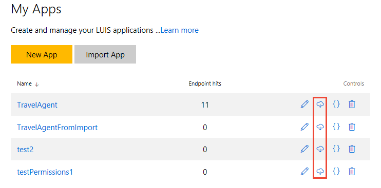

# Import utterances from the query log using Node.js

This tutorial helps you import utterances from the query log that contains all the user utterances passed to your LUIS endpoint.

## Prerequisites

* Log in to www.luis.ai and find your Programmatic Key in Account Settings.  You use this key to call the Authoring API.
* If you don't have an Azure subscription, create a [free account](https://azure.microsoft.com/free/?WT.mc_id=A261C142F) before you begin.
* This tutorial assumes you have already [created a LUIS app](luis-get-started-create-app.md), [trained](https://docs.microsoft.com/en-us/azure/cognitive-services/LUIS/train-test) and [published](PublishApp.md) it, and that some utterances have been passed to its endpoint.
* Install the latest Node.js with NPM. Download it from [here](https://nodejs.org/en/download/).
* **[Recommended]** Visual Studio Code for IntelliSense and debugging, download it from [here](https://code.visualstudio.com/) for free.

## Download the query log
This sample shows how to import queries from an application's query log from [luis.ai](http://www.luis.ai).

In order to export a LUIS application, select the download icon for the application and download the file. 

 


### Format of Query log
The format of the query log is a CSV file with a heading row. The parsing needed to ignore the first two columns and focus on the third column.  

````
"Query","UTC DateTime","Response"
"go to paris",10/04/2017 17:56:05,"{""query"":""go to paris"",""intents"":[{""intent"":""BookFlight"",""score"":0.9999256},{""intent"":""None"",""score"":0.16970253}],""entities"":[{""entity"":""paris"",""type"":""Location::LocationTo"",""startIndex"":6,""endIndex"":10,""score"":0.797421634}]}"
"ticket to paris",10/04/2017 18:15:58,"{""query"":""ticket to paris"",""intents"":[{""intent"":""BookFlight"",""score"":0.9999747},{""intent"":""None"",""score"":0.149017587}],""entities"":[{""entity"":""paris"",""type"":""Location::LocationTo"",""startIndex"":10,""endIndex"":14,""score"":0.9220803}]}"

````

## Download sample code

The code for this tutorial is at [CSV Upload Sample](https://github.com/Microsoft/LUIS-Samples/tree/master/examples/demo-upload-example-utterances/demo-Upload-utterances-from-querylog). Download the following files:

| Filename    | Description           |
|-------------|-----------------------|
| [index.js](https://github.com/Microsoft/LUIS-Samples/blob/master/examples/demo-upload-example-utterances/demo-Upload-utterances-from-querylog/index.js)  |  The sample's main file. It contains configuration settings and uploads the batch of utterances. Change the `downloadFile` value in the index.js file to the location and name of your query log file. |
| [_parse.js](https://github.com/Microsoft/LUIS-Samples/blob/master/examples/demo-upload-example-utterances/demo-Upload-utterances-from-querylog/_parse.js)  |  This file converts the utterances to the format expected by the [Batch Add Labels API](https://westus.dev.cognitive.microsoft.com/docs/services/5890b47c39e2bb17b84a55ff/operations/5890b47c39e2bb052c5b9c09) |
| [_upload.js](https://github.com/Microsoft/LUIS-Samples/blob/master/examples/demo-upload-example-utterances/demo-Upload-utterances-from-querylog/_upload.js)  |  This file contains methods for uploading JSON to the [Batch Add Labels API](https://westus.dev.cognitive.microsoft.com/docs/services/5890b47c39e2bb17b84a55ff/operations/5890b47c39e2bb052c5b9c09) |


## Install Node.js dependencies
Install the Node.js dependencies from NPM in the terminal/command line.

````
> npm install
````

## Change Configuration Settings
In order to use this application, you need to change the values in the index.js file to your own subscription key, app ID, and version ID. 

Open the index.js file, and change these values at the top of the file.


````JavaScript
// TBD: CHANGE THESE VALUES
const LUIS_subscriptionKey = "YOUR_SUBSCRIPTION_KEY"; 
const LUIS_appId = "YOUR_APP_ID";
const LUIS_versionId = "0.1";
````
## Run the application
Run the application from a terminal/command line with Node.js.

````
> node index.js
````
or
````
> npm start
````

## Application progress
While the application is running, the command line shows progress.

````
> node index.js
intents: ["TurnAllOn","TurnAllOff","None","TurnOn","TurnOff"]
parse done
upload done
process done
````

## Batching Utterances
The sample sends batches of utterances. They are grouped into pages before sending each page. Each batch sent of received is numbered with an "ExampleId" between 0-99. This helps you find which utterances failed.

## Inspect the generated files
The sample creates files associated with each step:

* utterances.json: Batch labels to upload.
* utterances.upload.json: The final response body from the Batch Add Labels API.

Examples of the files used and produced by the sample are in the ./example-files subdirectory.

If any of these files are missing, there was an error with the application. 

## Format of the JSON for the batch upload
The format of the JSON for the batch upload is noted in the [batch add labels](https://westus.dev.cognitive.microsoft.com/docs/services/5890b47c39e2bb17b84a55ff/operations/5890b47c39e2bb052c5b9c09) API. Note that the format of the download for query logs is different both in content and format. 


## LUIS APIs used in this sample
This sample applications use the following LUIS APIs:
- [download query log](https://westus.dev.cognitive.microsoft.com/docs/services/5890b47c39e2bb17b84a55ff/operations/5890b47c39e2bb052c5b9c36) API
- [batch add labels](https://westus.dev.cognitive.microsoft.com/docs/services/5890b47c39e2bb17b84a55ff/operations/5890b47c39e2bb052c5b9c09) API.


## Troubleshooting

### Use your own private apps
If you incorrectly use an app ID that you do not have permission to upload to, such as any public apps, you receive an error.

### If intents and entities are not found, they are not created
Any intent or entity uploaded that is not found in your LUIS app will cause an error. It is important that all intents and entities used in the batch already exist in the app.

### Errors in output file of the application
The final response body from upload API is in the 'utterances.upload.json' file. This file is an array of responses, one response for each item in the batch. 

Each item in the batch can succeed or fail independent of any other item, so it is important to check the response. 

#### Examples of correctly formatted items:

````JavaScript
// successfully formated item
    {
        "row": 1,
        "text": "go to paris",
        "intentName": "BookFlight",
        "entityLabels": [
            {
                "entityName": "Location::LocationTo",
                "startCharIndex": 6,
                "endCharIndex": 10
            }
        ]
    }
````

#### An example of a successful item upload response:

````JavaScript
// successfully uploaded item
{
    "value": {
        "UtteranceText": "go to paris",
        "ExampleId": -175128
    },
    "hasError": false
}
````

#### Examples of successful request (HTTP 200+) with failed items in the response body:

````JavaScript
// failed uploaded item - don't upload built-ins
{
    "value": null,
    "hasError": true,
    "error": {
        "code": "FAILED",
        "message": "ticket to seattle tomorrowtimezoneOffset=0. Error: The entity extractor builtin.number doesn't exist in the selected application"
    }
}
````

````JavaScript
// failed uploaded item - missing intent
{
    "value": null,
    "hasError": true,
    "error": {
        "code":"FAILED","message":"turn on the left light. Error: The intent classifier TurnOn does not exist in the selected application"
    }
}
````
 
#### Reasons for failed requests (HTTP 400+) other than malformed items:
A batch upload may fail for general reasons not related to the batch itself. You need to investigate the error returned to fix the problem. A list of common issues include:

- public subscription ID - you are not allowed to write a batch to this subscription
- incorrect app ID
- incorrect version ID
- incorrect LUIS API URI

#### Examples of failed requests (HTTP 400+) because of malformed items:

Batch upload items (or the whole batch) can result in parsing errors in the LUIS API. These errors are generally returned as HTTP 400 status errors instead of returning a successful response with an array of items, some of which failed.

A list of common issues include for a well-formed batch:

- batch has too many items
- batch includes intent that doesn't exist in app
- batch includes entity that doesn't exist in app
- batch includes prebuilt entity provided by LUIS Prebuilt domains

A malformed batch will also be refused because the JSON cannot be parsed as it is. The following JSON examples show some malformed JSON you should avoid.

````JavaScript
// malformed item - entityLabels first array item is present but empty
// fix - should remove {}, empty entityLabels array is fine
{
    "row": 2,
    "text": "ticket to paris",
    "intentName": "BookFlight",
    "entityLabels": [
        {
            
        }
    ]
}
```` 

````JavaScript
// malformed item - malformed JSON - no comma
// fix - add comma after every key:value pair
[
    {
        "text": "Hello"
        "intent": "Greetings"
    },
    {
        "text": "I want bread"
        "intent": "Request"
    }
]
```` 

````JavaScript
// malformed item - malformed JSON - extra comma at end of key:value pair
// while Node.js will ignore this, the LUIS API will not
// fix - remove extra comma
[
    {
        "text": "Hello",
        "intent": "Greetings",
    },
    {
        "text": "I want bread",
        "intent": "Request"
    }
]
````

## Next steps

* Try to improve your app's performance by continuing to add and label utterances.

