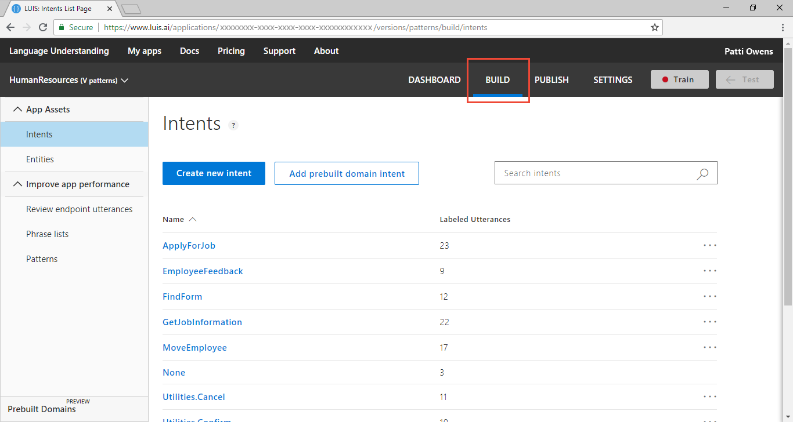
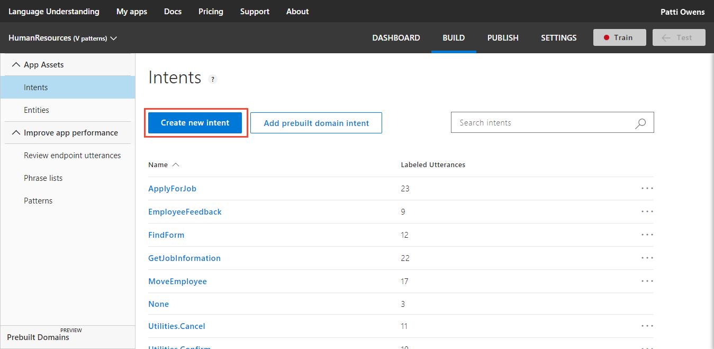

# Tutorial: Improve app with patterns

In this tutorial, use patterns to increase intent and entity prediction.  

> [!div class="checklist"]
* How to identify that a pattern would help your app
* How to create a pattern 
* How to verify pattern prediction improvements

For this article, you need a free [LUIS](luis-reference-regions.md) account in order to author your LUIS application.

## Before you begin
If you don't have the Human Resources app from the [batch test](luis-tutorial-batch-testing.md) tutorial, [import](luis-how-to-start-new-app.md#import-new-app) the JSON into a new app in the [LUIS](luis-reference-regions.md#luis-website) website. The app to import is found in the [LUIS-Samples](https://github.com/Microsoft/LUIS-Samples/blob/master/documentation-samples/quickstarts/custom-domain-batchtest-HumanResources.json) Github repository.

If you want to keep the original Human Resources app, clone the version on the [Settings](luis-how-to-manage-versions.md#clone-a-version) page, and name it `patterns`. Cloning is a great way to play with various LUIS features without affecting the original version. 

## Patterns teach LUIS common utterances with fewer examples
Because of the nature of the Human Resource domain, there are a few common ways of asking about employee relationships in organizations. For example:

```
Who does Jill Jones report to?
Who reports to Jill Jones? 
```

These utterances are too close to determine the contextual uniqueness of each without providing many utterance examples. By adding a pattern for an intent, LUIS learns common utterance patterns for an intent without supplying many utterance examples. 

Example template utterances for this intent include:

```
Who does {Employee} report to?
Who reports to {Employee}? 
```

The pattern is a combination of regular expression matching and machine learning. When you create a pattern, you need to provide template utterance examples for LUIS to learn the pattern. These examples, along with the intent utterances, give LUIS a better understanding of what utterances fit the intent and where, within the utterance, the entity exists.

Remember that employees were created in the [list entity tutorial](luis-quickstart-intent-and-list-entity.md).

## Create new intents and their utterances
Add two new intents: OrgChart-Manager, OrgChart-Reports. The intent name can be used as a function name in the client app and that the Employee entity could be used as a parameter to that function.

```
OrgChart-Manager(employee){
    ///
}
```

1. Make sure your Human Resources app is in the **Build** section of LUIS. You can change to this section by selecting **Build** on the top, right menu bar. 

    [ ](./media/luis-tutorial-pattern/hr-first-image.png#lightbox)

2. On the **Intents** page, select **Create new intent**. 

    [](media/luis-tutorial-pattern/hr-create-intent-button.png#lightbox)

3. Enter `OrgChart-Manager` in the pop-up dialog box then select **Done**.

    

4. Add example utterances to the intent.

    |Example utterances|
    |--|
    |Who is John W. Smith the subordinate of?|
    |Who does John W. Smith report to?|
    |Who is John W. Smith's manager?|
    |Who does Jill Jones directly report to?|
    |Who is Jill Jones supervisor?|

    [](media/luis-tutorial-pattern/hr-orgchart-manager-intent.png#lightbox)

5. Select **Intents** in the left navigation.

6. Select **Create new intent**. 

7. Enter `OrgChart-Reports` in the pop-up dialog box then select **Done**.

8. Add example utterances to the intent.

    |Example utterances|
    |--|
    |Who are John W. Smith's subordinates?|
    |Who reports to John W. Smith?|
    |Who does John W. Smith manage?|
    |Who are Jill Jones direct reports?|
    |Who does Jill Jones supervise?|

## Caution about example utterance quantity
The quantity of example utterances in these intents are not enough to train LUIS properly. In a real-world app, each intent should have a minimum of 15 utterances with a variety of word choice and utterance length. These few utterances are selected specifically to highlight patterns. 

## Train the LUIS app
The new intent and utterances require training. 

1. In the top right side of the LUIS website, select the **Train** button.

    

2. Training is complete when you see the green status bar at the top of the website confirming success.

    

## Publish the app to get the endpoint URL
In order to get a LUIS prediction in a chatbot or other application, you need to publish the app. 

1. In the top right side of the LUIS website, select the **Publish** button. 

2. Select the Production slot and the **Publish** button.

    [ ](./media/luis-tutorial-pattern/hr-publish-to-production.png#lightbox)

3. Publishing is complete when you see the green status bar at the top of the website confirming success.

## Query the endpoint with a different utterance
1. On the **Publish** page, select the **endpoint** link at the bottom of the page. This action opens another browser window with the endpoint URL in the address bar. 

    [ ](./media/luis-tutorial-pattern/hr-publish-select-endpoint.png#lightbox)


2. Go to the end of the URL in the address and enter `Who is the boss of Jill Jones?`. The last querystring parameter is `q`, the utterance **query**. 

    ```JSON
    {
    "query": "who is the boss of jill jones?",
    "topScoringIntent": {
        "intent": "OrgChart-Manager",
        "score": 0.353984952
    },
    "intents": [
        {
        "intent": "OrgChart-Manager",
        "score": 0.353984952
        },
        {
        "intent": "OrgChart-Reports",
        "score": 0.214128986
        },
        {
        "intent": "EmployeeFeedback",
        "score": 0.08434003
        },
        {
        "intent": "MoveEmployee",
        "score": 0.019131
        },
        {
        "intent": "GetJobInformation",
        "score": 0.004819009
        },
        {
        "intent": "Utilities.Confirm",
        "score": 0.0043958663
        },
        {
        "intent": "Utilities.StartOver",
        "score": 0.00312064588
        },
        {
        "intent": "Utilities.Cancel",
        "score": 0.002265454
        },
        {
        "intent": "Utilities.Help",
        "score": 0.00133465114
        },
        {
        "intent": "None",
        "score": 0.0011388344
        },
        {
        "intent": "Utilities.Stop",
        "score": 0.00111166481
        },
        {
        "intent": "FindForm",
        "score": 0.0008900076
        },
        {
        "intent": "ApplyForJob",
        "score": 0.0007836131
        }
    ],
    "entities": [
        {
        "entity": "jill jones",
        "type": "Employee",
        "startIndex": 19,
        "endIndex": 28,
        "resolution": {
            "values": [
            "Employee-45612"
            ]
        }
        },
        {
        "entity": "boss of jill jones",
        "type": "builtin.keyPhrase",
        "startIndex": 11,
        "endIndex": 28
        }
    ]}
    ```

Did this query succeed? For this training cycle it did succeed. The scores of the two top intents are close. Because LUIS training is not exactly the same each time, there is a bit of variation, these two scores could invert on the next training cycle. The result is that the wrong intent could be returned. 

Use patterns to make the difference between these two closely-related intents more accurately predicted. 


## Add the template utterances

1. Select **Build** in the top menu.

2. In the left navigation, under **Improve app performance**, select **Patterns** from the left navigation.

3. Select the **OrgChart-Manager** intent, then enter the following template utterances, one at a time, selecting enter after each template utterance:

    |Template utterances|
    |:--|
    |Who is {Employee} the subordinate of[?]|
    |Who does {Employee} report to[?]|
    |Who is {Employee}['s] manager[?]|
    |Who does {Employee} directly report to[?]|
    |Who is {Employee}['s] supervisor[?]|
    |Who is the boss of {Employee}[?]|

    [ ](./media/luis-tutorial-pattern/hr-pattern-missing-entity.png#lightbox)

    The `{Employee}` syntax marks the entity location within the template utterance as well as which entity it is. 

    The optional syntax, `[]`, marks words or punctuation that are optional. LUIS matches the utterance, ignoring the optional text inside the brackets.

    If you type the template utterance in, LUIS helps you fill in the entity when you enter the left curly bracket, `{`, by 

    [ ](./media/luis-tutorial-pattern/hr-enter-pattern.png#lightbox)

4. Select the **OrgChart-Reports** intent, then enter the following template utterances, one at a time, selecting enter after each template utterance:

    |Template utterances|
    |:--|
    |Who are {Employee}['s] subordinates[?]|
    |Who reports to {Employee}[?]|
    |Who does {Employee} manage[?]|
    |Who are {Employee} direct reports[?]|
    |Who does {Employee} supervise[?]|
    |Who does {Employee} boss[?]|

## Query endpoint when patterns are used

1. Train and publish the app again.

2. On the **Publish** page, select the **endpoint** link at the bottom of the page. This action opens another browser window with the endpoint URL in the address bar. 

3. Go to the end of the URL in the address and enter `Who is the boss of Jill Jones?`. The last querystring parameter is `q`, the utterance **query**. 

    ```JSON
    {
    "query": "who is the boss of jill jones?",
    "topScoringIntent": {
        "intent": "OrgChart-Manager",
        "score": 0.9999989
    },
    "intents": [
        {
        "intent": "OrgChart-Manager",
        "score": 0.9999989
        },
        {
        "intent": "OrgChart-Reports",
        "score": 7.616303E-05
        },
        {
        "intent": "EmployeeFeedback",
        "score": 7.84204349E-06
        },
        {
        "intent": "GetJobInformation",
        "score": 1.20674213E-06
        },
        {
        "intent": "MoveEmployee",
        "score": 7.91245157E-07
        },
        {
        "intent": "None",
        "score": 3.875E-09
        },
        {
        "intent": "Utilities.StartOver",
        "score": 1.49E-09
        },
        {
        "intent": "Utilities.Confirm",
        "score": 1.34545453E-09
        },
        {
        "intent": "Utilities.Help",
        "score": 1.34545453E-09
        },
        {
        "intent": "Utilities.Stop",
        "score": 1.34545453E-09
        },
        {
        "intent": "Utilities.Cancel",
        "score": 1.225E-09
        },
        {
        "intent": "FindForm",
        "score": 1.123077E-09
        },
        {
        "intent": "ApplyForJob",
        "score": 5.625E-10
        }
    ],
    "entities": [
        {
        "entity": "jill jones",
        "type": "Employee",
        "startIndex": 19,
        "endIndex": 28,
        "resolution": {
            "values": [
            "Employee-45612"
            ]
        },
        "role": ""
        },
        {
        "entity": "boss of jill jones",
        "type": "builtin.keyPhrase",
        "startIndex": 11,
        "endIndex": 28
        }
    ]}
    ```


<!--
## Use an entity with a role in a pattern
The LUIS app is used to help move employees from one location to another. An example utterance is `Move Bob Jones from Seattle to Los Colinas`. Each location in the utterance has a different meaning. Seattle is the originating location and Los Colinas is the destination location for the move. In order to differentiate those locations in the pattern, in the following sections you create a simple entity for location with two roles: origin and destination. 

### Create a new intent for moving people and assets
Create a new intent for any utterances that are about moving people or assets.

1. Select **Intents** from left navigation
2. Select **Create new intent**
3. Name the new intent `MoveAssetsOrPeople`
4. Add example utterances:

    ```
    Move Bob Jones from Seattle to Los Colinas
    Move Dave Cooper from Redmond to Seattle
    Move Jim Smith from Toronto to Vancouver
    Move Jill Benson from Boston to London
    Move Travis Hinton from Portland to Orlando
    ```
    

    The purpose of the example utterances is to give enough examples. If, later in the test, the location entity isn't detected, and consequently the pattern isn't detected, come back to this step and add more examples. Then train and test again. 

5. Mark the entities in the example utterances with the Employee entity by selecting the first name then the last name in an utterance, then selecting the Employee entity in the list.

    

6. Select the text `portland` in the utterance `move travis hinton from portland to orlando`. In the pop-up dialog, enter the new entity name `Location`, and select **Create new entity**. Choose the **Simple** entity type and select **Done**.

    

    Mark the rest of the location names in the utterances. 

    

    The pattern of word choice and order is obvious in the previous image. If you were **not** using patterns, and the utterances on the intent have an obvious pattern, that is a good indication you should be using patterns. 

    If you expect a wide variety of utterances, instead of a pattern, these would be the wrong example utterances. In that case, you would want widely varying utterances in term or word choice, utterance length, and entity placement. 


### Add role to location entity 
Roles can only be used for patterns. Add the roles of Origin and Destination to the Location entity. 

1. Select **Entities** in the left navigation, then **Location** from the list of entities.

2. Add `Origin` and `Destination` roles to the entity.

    

    The roles are not marked on the MoveAssetsOrPeople intent page because roles don't exist on intent utterances. They only exist on pattern template utterances. 

### Add template utterances that uses location and destination roles
Add template utterances that use the new entity.

1. Select **Patterns** from the left navigation.

2. Select the **MoveAssetsOrPeople** intent.

3. Enter a new template utterance using the new entity `Move {Employee} from {Location:Origin} to {Location:Destination}`. The syntax for an entity and role inside a template utterance is `{entity:role}`.

    

4. Train the app for the new intent, entity, and pattern.

### Test the new pattern for role data extraction
Validate the new pattern with a test.

1. Select **Test** in the top panel. 
2. Enter the utterance `Move Tammi Carlson from Bellingham to Winthrop`.
3. Select **Inspect** under the result to see the test results for entity and intent.

    

    The entities are found first, then the pattern is found, indicating the intent. If you have a test result where the entities are not detected, and therefore the pattern is not found, you need to add more example utterances on the intent (not the pattern). 

4. Close the test panel by selecting the **Test** button in the top navigation.

## Use a Pattern.any entity to find free-form entities in a pattern
This HumanResources app also helps employees find company forms. Many of the forms have titles that are varying in length. The varying length includes phrases that may confuse LUIS about where the form name ends. Using a **Pattern.any** entity in a pattern allows you to specify the beginning and end of the form name so LUIS correctly extracts the form name. 

### Create a new intent for the form
Create a new intent for utterances that are looking for forms.

1. Select **Intents** from left navigation.

2. Select **Create new intent**.

3. Name the new intent `FindForm`.

4. Add an example utterance.

    ```
    `Where is the form What to do when a fire breaks out in the Lab and who needs to sign it after I read it?`
    ```

    

    The form title is `What to do when a fire breaks out in the Lab`. The utterance is asking for the location of the form and is also asking who needs to sign it validating the employee read it. Without a Pattern.any entity, it would be difficult to understand where the form title ends and extract the form title as an entity of the utterance.

### Create a Pattern.any entity for the form title
The Pattern.any entity allows for entities of varying length. It only works in a pattern because the pattern marks the beginning and end of the entity. If you find that your pattern, when it includes a Pattern.any, extracts entities incorrectly, use an [explicit list](luis-concept-patterns.md#explicit-lists) to correct this problem. 

1. Select **Entities** in the left navigation.

2. Select **Create new entity**. 

3. Name the entity `FormName` with type **Pattern.any**. For this specific tutorial, you do not need to add any roles to the entity.

    

### Add a pattern that uses the Pattern.any

1. Select **Patterns** from the left navigation.

2. Select the **FindForm** intent.

3. Enter a template utterance using the new entity `Where is the form {FormName} and who needs to sign it after I read it?`

    

4. Train the app for the new intent, entity, and pattern.

### Test the new pattern for free-form data extraction
1. Select **Test** from the top bar to open the test panel. 

2. Enter the utterance `Where is the form Understand your responsibilities as a member of the community and who needs to sign it after I read it?`.

3. Select **Inspect** under the result to see the test results for entity and intent.

    

    The entity is found first, then the pattern is found, indicating the intent. If you have a test result where the entities are not detected, and therefore the pattern is not found, you need to add more example utterances on the intent (not the pattern).

4. Close the test panel by selecting the **Test** button in the top navigation.
-->

## Clean up resources
When no longer needed, delete the LUIS app. To do so, select the ellipsis (***...***) to the right of the app name in the app list, select **Delete**. On the pop-up dialog **Delete app?**, select **Ok**.

## Next steps

> [!div class="nextstepaction"]
> [Learn best practices for LUIS apps](luis-concept-best-practices.md)