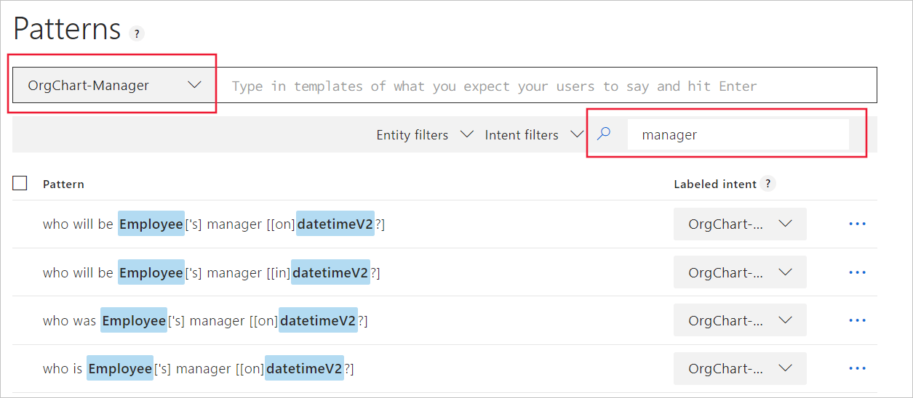

# Tutorial: Add common pattern template utterance formats

In this tutorial, use patterns to increase intent and entity prediction while providing fewer example utterances. The pattern is provided by way of a template utterance example, which includes syntax to identify entities and ignorable text. A pattern is a combination of expression matching and machine learning.  The template utterance example, along with the intent utterances, give LUIS a better understanding of what utterances fit the intent.

[!INCLUDE [Waiting for LUIS portal refresh](./includes/wait-v3-upgrade.md)]

**In this tutorial, you learn how to:**

> [!div class="checklist"]
> * Create a pattern
> * Verify pattern prediction improvements
> * Mark text as ignorable and nest within pattern
> * Use test panel to verify pattern success

[!INCLUDE [LUIS Free account](../../../includes/cognitive-services-luis-free-key-short.md)]

## Import example app

Continue with the app created in the last tutorial, named **HumanResources**.

Use the following steps:

1.  Download and save [app JSON file](https://github.com/Azure-Samples/cognitive-services-language-understanding/blob/master/documentation-samples/tutorials/custom-domain-batchtest-HumanResources.json?raw=true).

2. Import the JSON into a new app.

3. From the **Manage** section, on the **Versions** tab, clone the version, and name it `patterns`. Cloning is a great way to play with various LUIS features without affecting the original version. Because the version name is used as part of the URL route, the name can't contain any characters that are not valid in a URL.

## Create new intents and their utterances

1. [!INCLUDE [Start in Build section](../../../includes/cognitive-services-luis-tutorial-build-section.md)]

2. On the **Intents** page, select **Create new intent**.

3. Enter `OrgChart-Manager` in the pop-up dialog box then select **Done**.

    

4. Add example utterances to the intent.

    |Example utterances|
    |--|
    |Who is John W. Smith the subordinate of?|
    |Who does John W. Smith report to?|
    |Who is John W. Smith's manager?|
    |Who does Jill Jones directly report to?|
    |Who is Jill Jones supervisor?|

    [](media/luis-tutorial-pattern/hr-orgchart-manager-intent.png#lightbox)

    Don't worry if the keyPhrase entity is labeled in the utterances of the intent instead of the employee entity. Both are correctly predicted in the Test pane and at the endpoint.

5. Select **Intents** in the left navigation.

6. Select **Create new intent**.

7. Enter `OrgChart-Reports` in the pop-up dialog box then select **Done**.

8. Add example utterances to the intent.

    |Example utterances|
    |--|
    |Who are John W. Smith's subordinates?|
    |Who reports to John W. Smith?|
    |Who does John W. Smith manage?|
    |Who are Jill Jones direct reports?|
    |Who does Jill Jones supervise?|

## Caution about example utterance quantity

[!INCLUDE [Too few examples](../../../includes/cognitive-services-luis-too-few-example-utterances.md)]

## Train

[!INCLUDE [LUIS How to Train steps](../../../includes/cognitive-services-luis-tutorial-how-to-train.md)]

## Publish

[!INCLUDE [LUIS How to Publish steps](../../../includes/cognitive-services-luis-tutorial-how-to-publish.md)]

## Get intent and entities from endpoint

1. [!INCLUDE [LUIS How to get endpoint first step](../../../includes/cognitive-services-luis-tutorial-how-to-get-endpoint.md)]

2. Go to the end of the URL in the address and enter `Who is the boss of Jill Jones?`. The last querystring parameter is `q`, the utterance **query**.

    ```json
    {
        "query": "who is the boss of jill jones?",
        "topScoringIntent": {
            "intent": "OrgChart-Manager",
            "score": 0.353984952
        },
        "intents": [
            {
                "intent": "OrgChart-Manager",
                "score": 0.353984952
            },
            {
                "intent": "OrgChart-Reports",
                "score": 0.214128986
            },
            {
                "intent": "EmployeeFeedback",
                "score": 0.08434003
            },
            {
                "intent": "MoveEmployee",
                "score": 0.019131
            },
            {
                "intent": "GetJobInformation",
                "score": 0.004819009
            },
            {
                "intent": "Utilities.Confirm",
                "score": 0.0043958663
            },
            {
                "intent": "Utilities.StartOver",
                "score": 0.00312064588
            },
            {
                "intent": "Utilities.Cancel",
                "score": 0.002265454
            },
            {
                "intent": "Utilities.Help",
                "score": 0.00133465114
            },
            {
                "intent": "None",
                "score": 0.0011388344
            },
            {
                "intent": "Utilities.Stop",
                "score": 0.00111166481
            },
            {
                "intent": "FindForm",
                "score": 0.0008900076
            },
            {
                "intent": "ApplyForJob",
                "score": 0.0007836131
            }
        ],
        "entities": [
            {
                "entity": "jill jones",
                "type": "Employee",
                "startIndex": 19,
                "endIndex": 28,
                "resolution": {
                    "values": [
                        "Employee-45612"
                    ]
                }
            },
            {
                "entity": "boss of jill jones",
                "type": "builtin.keyPhrase",
                "startIndex": 11,
                "endIndex": 28
            }
        ]
    }
    ```

Did this query succeed? For this training cycle it did succeed. The scores of the two top intents are close. Because LUIS training is not exactly the same each time, there is a bit of variation, these two scores could invert on the next training cycle. The result is that the wrong intent could be returned.

Use patterns to make the correct intent's score significantly higher in percentage and farther from the next highest score.

Leave this second browser window open. You use it again later in the tutorial.

## Template utterances
Because of the nature of the Human Resource domain, there are a few common ways of asking about employee relationships in organizations. For example:

|Utterances|
|--|
|Who does Jill Jones report to?|
|Who reports to Jill Jones?|

These utterances are too close to determine the contextual uniqueness of each without providing many utterance examples. By adding a pattern for an intent, LUIS learns common utterance patterns for an intent without supplying many utterance examples.

Template utterance examples for this intent include:

|Template utterances examples|syntax meaning|
|--|--|
|Who does {Employee} report to[?]|interchangeable {Employee}, ignore [?]}|
|Who reports to {Employee}[?]|interchangeable {Employee}, ignore [?]}|

The `{Employee}` syntax marks the entity location within the template utterance as well as which entity it is. The optional syntax, `[?]`, marks words, or punctuation that are optional. LUIS matches the utterance, ignoring the optional text inside the brackets.

While the syntax looks like regular expressions, it is not regular expressions. Only the curly bracket, `{}`, and square bracket, `[]`, syntax is supported. They can be nested up to two levels.

In order for a pattern to be matched to an utterance, the entities within the utterance have to match the entities in the template utterance first. However, the template doesn't help predict entities, only intents.

**While patterns allow you to provide fewer example utterances, if the entities are not detected, the pattern does not match.**

## Add the patterns for the OrgChart-Manager intent

1. Select **Build** in the top menu.

2. In the left navigation, under **Improve app performance**, select **Patterns** from the left navigation.

3. Select the **OrgChart-Manager** intent, then enter the following template utterances:

    |Template utterances|
    |:--|
    |Who is {Employee} the subordinate of[?]|
    |Who does {Employee} report to[?]|
    |Who is {Employee}['s] manager[?]|
    |Who does {Employee} directly report to[?]|
    |Who is {Employee}['s] supervisor[?]|
    |Who is the boss of {Employee}[?]|

    Entities with roles use syntax that includes the role name, and are covered in a [separate tutorial for roles](luis-tutorial-pattern-roles.md).

    If you type the template utterance, LUIS helps you fill in the entity when you enter the left curly bracket, `{`.

    [](./media/luis-tutorial-pattern/hr-pattern-missing-entity.png#lightbox)

4. While still on the Patterns page, select the **OrgChart-Reports** intent, then enter the following template utterances:

    |Template utterances|
    |:--|
    |Who are {Employee}['s] subordinates[?]|
    |Who reports to {Employee}[?]|
    |Who does {Employee} manage[?]|
    |Who are {Employee} direct reports[?]|
    |Who does {Employee} supervise[?]|
    |Who does {Employee} boss[?]|

## Query endpoint when patterns are used

Now that the patterns are added to the app, train, publish and query the app at the prediction runtime endpoint.

1. Train and publish the app again.

1. Switch browser tabs back to the endpoint URL tab.

1. Go to the end of the URL in the address and enter `Who is the boss of Jill Jones?` as the utterance. The last querystring parameter is `q`, the utterance **query**.

    ```json
    {
        "query": "who is the boss of jill jones?",
        "topScoringIntent": {
            "intent": "OrgChart-Manager",
            "score": 0.9999989
        },
        "intents": [
            {
                "intent": "OrgChart-Manager",
                "score": 0.9999989
            },
            {
                "intent": "OrgChart-Reports",
                "score": 7.616303E-05
            },
            {
                "intent": "EmployeeFeedback",
                "score": 7.84204349E-06
            },
            {
                "intent": "GetJobInformation",
                "score": 1.20674213E-06
            },
            {
                "intent": "MoveEmployee",
                "score": 7.91245157E-07
            },
            {
                "intent": "None",
                "score": 3.875E-09
            },
            {
                "intent": "Utilities.StartOver",
                "score": 1.49E-09
            },
            {
                "intent": "Utilities.Confirm",
                "score": 1.34545453E-09
            },
            {
                "intent": "Utilities.Help",
                "score": 1.34545453E-09
            },
            {
                "intent": "Utilities.Stop",
                "score": 1.34545453E-09
            },
            {
                "intent": "Utilities.Cancel",
                "score": 1.225E-09
            },
            {
                "intent": "FindForm",
                "score": 1.123077E-09
            },
            {
                "intent": "ApplyForJob",
                "score": 5.625E-10
            }
        ],
        "entities": [
            {
                "entity": "jill jones",
                "type": "Employee",
                "startIndex": 19,
                "endIndex": 28,
                "resolution": {
                    "values": [
                        "Employee-45612"
                    ]
                },
                "role": ""
            },
            {
                "entity": "boss of jill jones",
                "type": "builtin.keyPhrase",
                "startIndex": 11,
                "endIndex": 28
            }
        ]
    }
    ```

The intent prediction is now significantly more confident.

## Working with optional text and prebuilt entities

The previous pattern template utterances in this tutorial had a few examples of optional text such as the possessive use of the letter s, `'s`, and the use of the question mark, `?`. Suppose you need to allow for current and future dates in the utterance text.

Example utterances are:

|Intent|Example utterances with optional text and prebuilt entities|
|:--|:--|
|OrgChart-Manager|`Who was Jill Jones manager on March 3?`|
|OrgChart-Manager|`Who is Jill Jones manager now?`|
|OrgChart-Manager|`Who will be Jill Jones manager in a month?`|
|OrgChart-Manager|`Who will be Jill Jones manager on March 3?`|

Each of these examples uses a verb tense, `was`, `is`, `will be`, as well as a date, `March 3`, `now`, and `in a month`, that LUIS needs to predict correctly. Notice that the last two examples use almost the same text except for `in` and `on`.

Example template utterances that allow for this optional information:

|Intent|Example utterances with optional text and prebuilt entities|
|:--|:--|
|OrgChart-Manager|`who was {Employee}['s] manager [[on]{datetimeV2}?`]|
|OrgChart-Manager|`who is {Employee}['s] manager [[on]{datetimeV2}?]`|


The use of the optional syntax of square brackets, `[]`, makes this optional text easy to add to the template utterance and can be nested up to a second level, `[[]]`, and include entities or text.


**Question: Why are all the `w` letters, the first letter in each template utterance, lowercase? Shouldn't they be optionally upper or lowercase?** The utterance submitted to the query endpoint, by the client application, is converted into lowercase. The template utterance can be uppercase or lowercase and the endpoint utterance can also be either. The comparison is always done after the conversion to lowercase.

**Question: Why isn't prebuilt number part of the template utterance if March 3 is predicted both as number `3` and date `March 3`?** The template utterance contextually is using a date, either literally as in `March 3` or abstracted as `in a month`. A date can contain a number but a number may not necessarily be seen as a date. Always use the entity that best represents the type you want returned in the prediction JSON results.

**Question: What about poorly phrased utterances such as `Who will {Employee}['s] manager be on March 3?`.** Grammatically different verb tenses such as this where the `will` and `be` are separated need to be a new template utterance. The existing template utterance will not match it. While the intent of the utterance hasn't changed, the word placement in the utterance has changed. This change impacts the prediction in LUIS. You can [group and or](#use-the-or-operator-and-groups) the verb-tenses to combine these utterances.

**Remember: entities are found first, then the pattern is matched.**

## Edit the existing pattern template utterance

1. On the LUIS website, select **Build** in the top menu then select **Patterns** in the left menu.

1. Search for the existing template utterance, `Who is {Employee}['s] manager[?]`, and select the ellipsis (***...***) to the right, then select **Edit** from the pop-up menu.

1. Change the template utterance to: `who is {Employee}['s] manager [[on]{datetimeV2}?]`

## Add new pattern template utterances

1. While still in the **Patterns** section of **Build**, add several new pattern template utterances. Select **OrgChart-Manager** from the Intent drop-down menu and enter each of the following template utterances:

    |Intent|Example utterances with optional text and prebuilt entities|
    |--|--|
    |OrgChart-Manager|`who was {Employee}['s] manager [[on]{datetimeV2}?]`|
    |OrgChart-Manager|`who will be {Employee}['s] manager [[in]{datetimeV2}?]`|
    |OrgChart-Manager|`who will be {Employee}['s] manager [[on]{datetimeV2}?]`|

2. Train the app.

3. Select **Test** at the top of the panel to open the testing panel.

4. Enter several test utterances to verify that the pattern is matched and the intent score is significantly high.

    After you enter the first utterance, select **Inspect** under the result so you can see all the prediction results. Each utterance should have the **OrgChart-Manager** intent and should extract the values for the entities of Employee and datetimeV2.

    |Utterance|
    |--|
    |Who will be Jill Jones manager|
    |who will be jill jones's manager|
    |Who will be Jill Jones's manager?|
    |who will be Jill jones manager on March 3|
    |Who will be Jill Jones manager next Month|
    |Who will be Jill Jones manager in a month?|

All of these utterances found the entities inside, therefore they match the same pattern, and have a high prediction score.

## Use the OR operator and groups

Several of the previous template utterances are very close. Use the **group** `()` and **OR** `|` syntax to reduce the template utterances.

The following 2 patterns can combine into a single pattern using the group `()` and OR `|` syntax.

|Intent|Example utterances with optional text and prebuilt entities|
|--|--|
|OrgChart-Manager|`who will be {Employee}['s] manager [[in]{datetimeV2}?]`|
|OrgChart-Manager|`who will be {Employee}['s] manager [[on]{datetimeV2}?]`|

The new template utterance will be:

`who ( was | is | will be ) {Employee}['s] manager [([in]|[on]){datetimeV2}?]`.

This uses a **group** around the required verb tense and the optional `in` and `on` with an **or** pipe between them.

1. On the **Patterns** page, select the **OrgChart-Manager** filter. Narrow the list by searching for `manager`.

    

1. Keep one version of the template utterance (to edit in next step) and delete the other variations.

1. Change the template utterance to:

    `who ( was | is | will be ) {Employee}['s] manager [([in]|[on]){datetimeV2}?]`.

1. Train the app.

1. Use the Test pane to test versions of the utterance:

    |Utterances to enter in Test pane|
    |--|
    |`Who is Jill Jones manager this month`|
    |`Who is Jill Jones manager on July 5th`|
    |`Who was Jill Jones manager last month`|
    |`Who was Jill Jones manager on July 5th`|
    |`Who will be Jill Jones manager in a month`|
    |`Who will be Jill Jones manager on July 5th`|


## Use the utterance beginning and ending anchors

The pattern syntax provides beginning and ending utterance anchor syntax of a caret, `^`. The beginning and ending utterance anchors can be used together to target very specific and possibly literal utterance or used separately to target intents.

## Using roles in patterns

The purpose of roles is to extract contextually related entities in an utterance. In the utterance, `Move new employee Robert Williams from Sacramento and San Francisco`, the origin city, and destination city values are related to each other and use common language to denote each location.


The name of the new employee, Billy Patterson, is not part of the list entity **Employee** yet. The new employee name is extracted first, in order to send the name to an external system to create the company credentials. After the company credentials are created, the employee credentials are added to the list entity **Employee**.

The new employee and family need to be moved from the current city to a city where the fictitious company is located. Because a new employee can come from any city, the locations need to be discovered. A set list such as a list entity would not work because only the cities in the list would be extracted.

The role names associated with the origin and destination cities need to be unique across all entities. An easy way to make sure the roles are unique is to tie them to the containing entity through a naming strategy. The **NewEmployeeRelocation** entity is a simple entity with two roles: **NewEmployeeReloOrigin** and **NewEmployeeReloDestination**. Relo is short for relocation.

Because the example utterance `Move new employee Robert Williams from Sacramento and San Francisco` has only machine-learned entities, it is important to provide enough example utterances to the intent so the entities are detected.

**While patterns allow you to provide fewer example utterances, if the entities are not detected, the pattern does not match.**

If you have difficulty with simple entity detection because it is a name such as a city, consider adding a phrase list of similar values. This helps the detection of the city name by giving LUIS an additional signal about that type of word or phrase. Phrase lists only help the pattern by helping with entity detection, which is necessary for the pattern to match.

## Import example app
Continue with the app created in the last tutorial, named **HumanResources**.

Use the following steps:

1.  Download and save [app JSON file](https://github.com/Azure-Samples/cognitive-services-language-understanding/blob/master/documentation-samples/tutorials/custom-domain-patterns-HumanResources-v2.json?raw=true).

2. Import the JSON into a new app.

3. From the **Manage** section, on the **Versions** tab, clone the version, and name it `roles`. Cloning is a great way to play with various LUIS features without affecting the original version. Because the version name is used as part of the URL route, the name can't contain any characters that are not valid in a URL.

## Create new entities

1. [!INCLUDE [Start in Build section](../../../includes/cognitive-services-luis-tutorial-build-section.md)]

2. Select **Entities** from the left navigation.

3. Select **Create new entity**.

4. In the pop-up window, enter `NewEmployee` as a **Simple** entity.

5. Select **Create new entity**.

6. In the pop-up window, enter `NewEmployeeRelocation` as a **Simple** entity.

7. Select **NewEmployeeRelocation** from the list of entities.

8. Enter the first role as `NewEmployeeReloOrigin` and select enter.

9. Enter the second role as `NewEmployeeReloDestination` and select enter.

## Create new intent
Labeling the entities in these steps may be easier if the prebuilt keyPhrase entity is removed before beginning then added back after you are done with the steps in this section.

1. Select **Intents** from the left navigation.

2. Select **Create new intent**.

3. Enter `NewEmployeeRelocationProcess` as the intent name in the pop-up dialog box.

4. Enter the following example utterances, labeling the new entities. The entity and role values are in bold. Remember to switch to the **Tokens View** if you find it easier to label the text.

    You don't specify the role of the entity when labeling in the intent. You do that later when creating the pattern.

    |Utterance|NewEmployee|NewEmployeeRelocation|
    |--|--|--|
    |Move **Bob Jones** from **Seattle** to **Los Colinas**|Bob Jones|Seattle, Los Colinas|
    |Move **Dave C. Cooper** from **Redmond** to **New York City**|Dave C. Cooper|Redmond, New York City|
    |Move **Jim Paul Smith** from **Toronto** to **West Vancouver**|Jim Paul Smith|Toronto, West Vancouver|
    |Move **J. Benson** from **Boston** to **Staines-upon-Thames**|J. Benson|Boston, Staines-upon-Thames|
    |Move **Travis "Trav" Hinton** from **Castelo Branco** to **Orlando**|Travis "Trav" Hinton|Castelo Branco, Orlando|
    |Move **Trevor Nottington III** from **Aranda de Duero** to **Boise**|Trevor Nottington III|Aranda de Duero, Boise|
    |Move **Dr. Greg Williams** from **Orlando** to **Ellicott City**|Dr. Greg Williams|Orlando, Ellicott City|
    |Move **Robert "Bobby" Gregson** from **Kansas City** to **San Juan Capistrano**|Robert "Bobby" Gregson|Kansas City, San Juan Capistrano|
    |Move **Patti Owens** from **Bellevue** to **Rockford**|Patti Owens|Bellevue, Rockford|
    |Move **Janet Bartlet** from **Tuscan** to **Santa Fe**|Janet Bartlet|Tuscan, Santa Fe|

    The employee name has a variety of prefix, word count, syntax, and suffix. This is important for LUIS to understand the variations of a new employee name. The city names also have a variety of word count and syntax. This variety is important to teach LUIS how these entities may appear in a user's utterance.

    If either entity had been of the same word count and no other variations, you would teach LUIS that this entity only has that word count and no other variations. LUIS would not be able to correctly predict a broader set of variations because it was not shown any.

    If you removed the keyPhrase entity, add it back to the app now.

## Train

[!INCLUDE [LUIS How to Train steps](../../../includes/cognitive-services-luis-tutorial-how-to-train.md)]

## Publish

[!INCLUDE [LUIS How to Publish steps](../../../includes/cognitive-services-luis-tutorial-how-to-publish.md)]

## Get intent and entities from endpoint

1. [!INCLUDE [LUIS How to get endpoint first step](../../../includes/cognitive-services-luis-tutorial-how-to-get-endpoint.md)]

2. Go to the end of the URL in the address and enter `Move Wayne Berry from Miami to Mount Vernon`. The last querystring parameter is `q`, the utterance **query**.

    ```json
    {
      "query": "Move Wayne Berry from Newark to Columbus",
      "topScoringIntent": {
        "intent": "NewEmployeeRelocationProcess",
        "score": 0.514479756
      },
      "intents": [
        {
          "intent": "NewEmployeeRelocationProcess",
          "score": 0.514479756
        },
        {
          "intent": "Utilities.Confirm",
          "score": 0.017118983
        },
        {
          "intent": "MoveEmployee",
          "score": 0.009982505
        },
        {
          "intent": "GetJobInformation",
          "score": 0.008637771
        },
        {
          "intent": "ApplyForJob",
          "score": 0.007115978
        },
        {
          "intent": "Utilities.StartOver",
          "score": 0.006120186
        },
        {
          "intent": "Utilities.Cancel",
          "score": 0.00452428637
        },
        {
          "intent": "None",
          "score": 0.00400899537
        },
        {
          "intent": "OrgChart-Reports",
          "score": 0.00240071164
        },
        {
          "intent": "Utilities.Help",
          "score": 0.001770991
        },
        {
          "intent": "EmployeeFeedback",
          "score": 0.001697356
        },
        {
          "intent": "OrgChart-Manager",
          "score": 0.00168116146
        },
        {
          "intent": "Utilities.Stop",
          "score": 0.00163952739
        },
        {
          "intent": "FindForm",
          "score": 0.00112958835
        }
      ],
      "entities": [
        {
          "entity": "wayne berry",
          "type": "NewEmployee",
          "startIndex": 5,
          "endIndex": 15,
          "score": 0.629158735
        },
        {
          "entity": "newark",
          "type": "NewEmployeeRelocation",
          "startIndex": 22,
          "endIndex": 27,
          "score": 0.638941
        }
      ]
    }
    ```

The intent prediction score is only about 50%. If your client application requires a higher number, this needs to be fixed. The entities were not predicted either.

One of the locations was extracted but the other location was not.

Patterns will help the prediction score, however, the entities must be correctly predicted before the pattern matches the utterance.

## Pattern with roles

1. Select **Build** in the top navigation.

2. Select **Patterns** in the left navigation.

3. Select **NewEmployeeRelocationProcess** from the **Select an intent** drop-down list.

4. Enter the following pattern: `move {NewEmployee} from {NewEmployeeRelocation:NewEmployeeReloOrigin} to {NewEmployeeRelocation:NewEmployeeReloDestination}[.]`

    If you train, publish, and query the endpoint, you may be disappointed to see that the entities are not found, so the pattern didn't match, therefore the prediction didn't improve. This is a consequence of not enough example utterances with labeled entities. Instead of adding more examples, add a phrase list to fix this problem.

## Cities phrase list
Cities, like people's names are tricky in that they can be any mix of words and punctuation. The cities of the region and world are known, so LUIS needs a phrase list of cities to begin learning.

1. Select **Phrase list** from the **Improve app performance** section of the left menu.

2. Name the list `Cities` and add the following `values` for the list:

    |Values of phrase list|
    |--|
    |Seattle|
    |San Diego|
    |New York City|
    |Los Angeles|
    |Portland|
    |Philadephia|
    |Miami|
    |Dallas|

    Do not add every city in the world or even every city in the region. LUIS needs to be able to generalize what a city is from the list. Make sure to keep **These values are interchangeable** selected. This setting means the words on the list on treated as synonyms.

3. Train and publish the app.

## Get intent and entities from endpoint

1. [!INCLUDE [Start in Build section](../../../includes/cognitive-services-luis-tutorial-build-section.md)]

2. Go to the end of the URL in the address and enter `Move wayne berry from miami to mount vernon`. The last querystring parameter is `q`, the utterance **query**.

    ```json
    {
      "query": "Move Wayne Berry from Miami to Mount Vernon",
      "topScoringIntent": {
        "intent": "NewEmployeeRelocationProcess",
        "score": 0.9999999
      },
      "intents": [
        {
          "intent": "NewEmployeeRelocationProcess",
          "score": 0.9999999
        },
        {
          "intent": "Utilities.Confirm",
          "score": 1.49678385E-06
        },
        {
          "intent": "MoveEmployee",
          "score": 8.240291E-07
        },
        {
          "intent": "GetJobInformation",
          "score": 6.3131273E-07
        },
        {
          "intent": "None",
          "score": 4.25E-09
        },
        {
          "intent": "OrgChart-Manager",
          "score": 2.8E-09
        },
        {
          "intent": "OrgChart-Reports",
          "score": 2.8E-09
        },
        {
          "intent": "EmployeeFeedback",
          "score": 1.64E-09
        },
        {
          "intent": "Utilities.StartOver",
          "score": 1.64E-09
        },
        {
          "intent": "Utilities.Help",
          "score": 1.48181822E-09
        },
        {
          "intent": "Utilities.Stop",
          "score": 1.48181822E-09
        },
        {
          "intent": "Utilities.Cancel",
          "score": 1.35E-09
        },
        {
          "intent": "FindForm",
          "score": 1.23846156E-09
        },
        {
          "intent": "ApplyForJob",
          "score": 5.692308E-10
        }
      ],
      "entities": [
        {
          "entity": "wayne berry",
          "type": "builtin.keyPhrase",
          "startIndex": 5,
          "endIndex": 15
        },
        {
          "entity": "miami",
          "type": "builtin.keyPhrase",
          "startIndex": 22,
          "endIndex": 26
        },
        {
          "entity": "wayne berry",
          "type": "NewEmployee",
          "startIndex": 5,
          "endIndex": 15,
          "score": 0.9410646,
          "role": ""
        },
        {
          "entity": "miami",
          "type": "NewEmployeeRelocation",
          "startIndex": 22,
          "endIndex": 26,
          "score": 0.9853915,
          "role": "NewEmployeeReloOrigin"
        },
        {
          "entity": "mount vernon",
          "type": "NewEmployeeRelocation",
          "startIndex": 31,
          "endIndex": 42,
          "score": 0.986044347,
          "role": "NewEmployeeReloDestination"
        }
      ],
      "sentimentAnalysis": {
        "label": "neutral",
        "score": 0.5
      }
   }
    ```

The intent score is now much higher and the role names are part of the entity response.

## Using Pattern.any entity

The pattern.any entity allows you to find free-form data where the wording of the entity makes it difficult to determine the end of the entity from the rest of the utterance.

This Human Resources app helps employees find company forms.

|Utterance|
|--|
|Where is **HRF-123456**?|
|Who authored **HRF-123234**?|
|**HRF-456098** is published in French?|

However, each form has both a formatted name, used in the preceding table, as well as a friendly name, such as `Request relocation from employee new to the company 2018 version 5`.

Utterances with the friendly form name look like:

|Utterance|
|--|
|Where is **Request relocation from employee new to the company 2018 version 5**?|
|Who authored **"Request relocation from employee new to the company 2018 version 5"**?|
|**Request relocation from employee new to the company 2018 version 5** is published in French?|

The varying length includes words that may confuse LUIS about where the entity ends. Using a Pattern.any entity in a pattern allows you to specify the beginning and end of the form name so LUIS correctly extracts the form name.

|Template utterance example|
|--|
|Where is {FormName}[?]|
|Who authored {FormName}[?]|
|{FormName} is published in French[?]|

## Import example app

1. Download and save [app JSON file](https://github.com/Azure-Samples/cognitive-services-language-understanding/blob/master/documentation-samples/tutorials/custom-domain-pattern-roles-HumanResources.json?raw=true).

1. In the [LUIS portal](https://www.luis.ai), on the **My apps** page, import the JSON into a new app.

1. From the **Manage** section, on the **Versions** tab, clone the version, and name it `patt-any`. Cloning is a great way to play with various LUIS features without affecting the original version. Because the version name is used as part of the URL route, the name can't contain any characters that are not valid in a URL.

## Add example utterances

1. Select **Build** from the top navigation, then select **Intents** from left navigation.

1. Select **FindForm** from the intents list.

1. Add some example utterances:

    |Example utterance|
    |--|
    |Where is the form **What to do when a fire breaks out in the Lab** and who needs to sign it after I read it?|
    |Where is **Request relocation from employee new to the company** on the server?|
    |Who authored "**Health and wellness requests on the main campus**" and what is the most current version?|
    |I'm looking for the form named "**Office move request including physical assets**". |

    Without a Pattern.any entity, it would be difficult for LUIS to understand where the form title ends because of the many variations of form names.

## Create a Pattern.any entity
The Pattern.any entity extracts entities of varying length. It only works in a pattern because the pattern marks the beginning and end of the entity.

1. Select **Entities** in the left navigation.

1. Select **Create new entity**, enter the name `FormName`, and select **Pattern.any** as the type. Select **Done**.

    You can't label the entity in an intent's example utterances because a Pattern.any is only valid in a pattern.

    If you want the extracted data to include other entities such as number or datetimeV2, you need to create a composite entity that includes the Pattern.any, as well as number and datetimeV2.

## Add a pattern that uses the Pattern.any

1. Select **Patterns** from the left navigation.

1. Select the **FindForm** intent.

1. Enter the following template utterances, which use the new entity:

    |Template utterances|
    |--|
    |Where is the form ["]{FormName}["] and who needs to sign it after I read it[?]|
    |Where is ["]{FormName}["] on the server[?]|
    |Who authored ["]{FormName}["] and what is the most current version[?]|
    |I'm looking for the form named ["]{FormName}["][.]|

    If you want to account for variations of the form such as single quotes instead of double quotes or a period instead of a question mark, create a new pattern for each variation.

## Train the LUIS app

[!INCLUDE [LUIS How to Train steps](../../../includes/cognitive-services-luis-tutorial-how-to-train.md)]

## Test the new pattern for free-form data extraction
1. Select **Test** from the top bar to open the test panel.

1. Enter the following utterance:

    `Where is the form Understand your responsibilities as a member of the community and who needs to sign it after I read it?`

1. Select **Inspect** under the result to see the test results for entity and intent.

    The entity `FormName` is found first, then the pattern is found, determining the intent. If you have a test result where the entities are not detected, and therefore the pattern is not found, you need to add more example utterances on the intent (not the pattern).

1. Close the test panel by selecting the **Test** button in the top navigation.

## Using an explicit list

If you find that your pattern, when it includes a Pattern.any, extracts entities incorrectly, use an [explicit list](reference-pattern-syntax.md#explicit-lists) to correct this problem.


## Clean up resources

[!INCLUDE [LUIS How to clean up resources](../../../includes/cognitive-services-luis-tutorial-how-to-clean-up-resources.md)]

## Next steps

This tutorial adds two intents for utterances that were difficult to prediction with high accuracy without having many example utterances. Adding patterns for these allowed LUIS to better predict the intent with a significantly higher score. Marking entities and ignorable text allowed LUIS to apply the pattern to a wider variety of utterances.

> [!div class="nextstepaction"]
> [Learn how to use roles with a pattern](luis-tutorial-pattern-roles.md)
