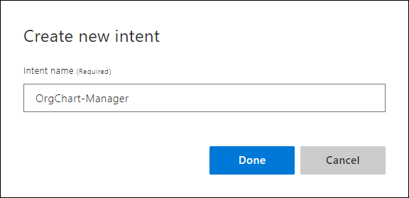

# Tutorial: Add common pattern template utterance formats to improve predictions

In this tutorial, use patterns to increase intent and entity prediction, which allows you to provide fewer example utterances. The pattern is template utterance assigned to an intent, containing syntax to identify entities and ignorable text.

**In this tutorial, you learn how to:**

> [!div class="checklist"]
> * Create a pattern
> * Verify pattern prediction improvements
> * Mark text as ignorable and nest within pattern
> * Use test panel to verify pattern success

[!INCLUDE [LUIS Free account](../../../includes/cognitive-services-luis-free-key-short.md)]

## Utterances in intent and pattern

There are two types of utterances stored in the LUIS app:

* Example utterances in the Intent
* Template utterances in the Pattern

Adding template utterances as a pattern allows you to provide fewer example utterances overall to an intent.

A pattern is applied as a combination of expression matching and machine learning.  The template utterance, along with the example utterances, give LUIS a better understanding of what utterances fit the intent.

## Import example app and clone to new version

Use the following steps:

1.  Download and save the [app JSON file](https://github.com/Azure-Samples/cognitive-services-language-understanding/blob/master/documentation-samples/tutorials/custom-domain-batchtest-HumanResources.json?raw=true).

1. Import the JSON into a new app into the [preview LUIS portal](https://preview.luis.ai).

1. From the **Manage** section, on the **Versions** tab, clone the version, and name it `patterns`. Cloning is a great way to play with various LUIS features without affecting the original version. Because the version name is used as part of the URL route, the name can't contain any characters that are not valid in a URL.

## Create new intents and their utterances

1. Select **Build** from the navigation bar.

1. On the **Intents** page, select **+ Create** to create a new intent.

1. Enter `OrgChart-Manager` in the pop-up dialog box then select **Done**.

    

1. Add example utterances to the intent. These utterances are not _exactly_ alike but do have a pattern that can be extracted.

    |Example utterances|
    |--|
    |`Who is John W. Smith the subordinate of?`|
    |`Who does John W. Smith report to?`|
    |`Who is John W. Smith's manager?`|
    |`Who does Jill Jones directly report to?`|
    |`Who is Jill Jones supervisor?`|

    Don't worry if the keyPhrase entity is labeled in the utterances of the intent instead of the employee entity. Both are correctly predicted in the Test pane and at the endpoint.

1. Select **Intents** in the left navigation.

1. Select **+ Create** to create a new intent. Enter `OrgChart-Reports` in the pop-up dialog box then select **Done**.

1. Add example utterances to the intent.

    |Example utterances|
    |--|
    |`Who are John W. Smith's subordinates?`|
    |`Who reports to John W. Smith?`|
    |`Who does John W. Smith manage?`|
    |`Who are Jill Jones direct reports?`|
    |`Who does Jill Jones supervise?`|

### Caution about example utterance quantity

[!INCLUDE [Too few examples](../../../includes/cognitive-services-luis-too-few-example-utterances.md)]

### Train the app before testing or publishing

[!INCLUDE [LUIS How to Train steps](includes/howto-train.md)]

### Publish the app to query from the endpoint

[!INCLUDE [LUIS How to Publish steps](includes/howto-publish.md)]

### Get intent and entities from endpoint

1. [!INCLUDE [LUIS How to get endpoint first step](includes/howto-get-endpoint.md)]

1. Go to the end of the URL in the address and enter `Who is the boss of Jill Jones?`. The last querystring parameter is the utterance `query`.

    ```json
    {
        "query": "Who is the boss of Jill Jones?",
        "prediction": {
            "topIntent": "OrgChart-Manager",
            "intents": {
                "OrgChart-Manager": {
                    "score": 0.313054234
                },
                "OrgChart-Reports": {
                    "score": 0.2462688
                },
                "EmployeeFeedback": {
                    "score": 0.0488328524
                },
                "GetJobInformation": {
                    "score": 0.0156933
                },
                "MoveEmployee": {
                    "score": 0.011265873
                },
                "Utilities.StartOver": {
                    "score": 0.003065792
                },
                "Utilities.Stop": {
                    "score": 0.00300148362
                },
                "Utilities.Cancel": {
                    "score": 0.00271081156
                },
                "None": {
                    "score": 0.00212835032
                },
                "ApplyForJob": {
                    "score": 0.0020669254
                },
                "Utilities.Confirm": {
                    "score": 0.00200891262
                },
                "FindForm": {
                    "score": 0.00194145238
                },
                "Utilities.Help": {
                    "score": 0.00182301877
                }
            },
            "entities": {
                "keyPhrase": [
                    "boss of Jill Jones"
                ],
                "Employee": [
                    [
                        "Employee-45612"
                    ]
                ],
                "$instance": {
                    "keyPhrase": [
                        {
                            "type": "builtin.keyPhrase",
                            "text": "boss of Jill Jones",
                            "startIndex": 11,
                            "length": 18,
                            "modelTypeId": 2,
                            "modelType": "Prebuilt Entity Extractor",
                            "recognitionSources": [
                                "model"
                            ]
                        }
                    ],
                    "Employee": [
                        {
                            "type": "Employee",
                            "text": "Jill Jones",
                            "startIndex": 19,
                            "length": 10,
                            "modelTypeId": 5,
                            "modelType": "List Entity Extractor",
                            "recognitionSources": [
                                "model"
                            ]
                        }
                    ]
                }
            }
        }
    }
    ```

Did this query succeed? For this training cycle it did succeed. The scores of the two top intents are close but the highest intent isn't significantly high (over 60%) and isn't far enough above the next intent's score.

Because LUIS training is not exactly the same each time, there is a bit of variation, these two scores could invert on the next training cycle. The result is that the wrong intent could be returned.

Use patterns to make the correct intent's score significantly higher in percentage and farther from the next highest score.

Leave this second browser window open. You use it again later in the tutorial.

## Template utterances
Because of the nature of the Human Resource domain, there are a few common ways of asking about employee relationships in organizations. For example:

|Utterances|
|--|
|`Who does Jill Jones report to?`|
|`Who reports to Jill Jones?`|

These utterances are too close to determine the contextual uniqueness of each without providing many utterance examples. By adding a pattern for an intent, LUIS learns common utterance patterns for an intent without supplying many utterance examples.

Template utterance examples for this intent include:

|Template utterances examples|syntax meaning|
|--|--|
|`Who does {Employee} report to[?]`|interchangeable `{Employee}`<br>ignore `[?]`|
|`Who reports to {Employee}[?]`|interchangeable `{Employee}`<br>ignore `[?]`|

The `{Employee}` syntax marks the entity location within the template utterance as well as which entity it is. The optional syntax, `[?]`, marks words, or punctuation that is optional. LUIS matches the utterance, ignoring the optional text inside the brackets.

While the syntax looks like a regular expression, it is not a regular expression. Only the curly bracket, `{}`, and square bracket, `[]`, syntax is supported. They can be nested up to two levels.

In order for a pattern to be matched to an utterance, the entities within the utterance have to match the entities in the template utterance first. This means the entities have to have enough examples in example utterances with a high degree of prediction before patterns with entities are successful. However, the template doesn't help predict entities, only intents.

**While patterns allow you to provide fewer example utterances, if the entities are not detected, the pattern does not match.**

### Add the patterns for the OrgChart-Manager intent

1. Select **Build** in the top menu.

1. In the left navigation, under **Improve app performance**, select **Patterns** from the left navigation.

1. Select the **OrgChart-Manager** intent, then enter the following template utterances:

    |Template utterances|
    |:--|
    |`Who is {Employee} the subordinate of[?]`|
    |`Who does {Employee} report to[?]`|
    |`Who is {Employee}['s] manager[?]`|
    |`Who does {Employee} directly report to[?]`|
    |`Who is {Employee}['s] supervisor[?]`|
    |`Who is the boss of {Employee}[?]`|

1. While still on the Patterns page, select the **OrgChart-Reports** intent, then enter the following template utterances:

    |Template utterances|
    |:--|
    |`Who are {Employee}['s] subordinates[?]`|
    |`Who reports to {Employee}[?]`|
    |`Who does {Employee} manage[?]`|
    |`Who are {Employee} direct reports[?]`|
    |`Who does {Employee} supervise[?]`|
    |`Who does {Employee} boss[?]`|

### Query endpoint when patterns are used

Now that the patterns are added to the app, train, publish and query the app at the prediction runtime endpoint.

1. Select **Train**. After training is complete, select **Publish** and select the **Production** slot then select **Done**.

1. After publishing is complete, switch browser tabs back to the endpoint URL tab.

1. Go to the end of the URL in the address and enter `Who is the boss of Jill Jones?` as the utterance. The last querystring parameter is the `query`.

    ```json
    {
        "query": "Who is the boss of Jill Jones?",
        "prediction": {
            "topIntent": "OrgChart-Manager",
            "intents": {
                "OrgChart-Manager": {
                    "score": 0.999997854
                },
                "OrgChart-Reports": {
                    "score": 6.13748343E-05
                },
                "EmployeeFeedback": {
                    "score": 8.052567E-06
                },
                "GetJobInformation": {
                    "score": 1.18197136E-06
                },
                "MoveEmployee": {
                    "score": 7.65549657E-07
                },
                "None": {
                    "score": 3.975E-09
                },
                "Utilities.StartOver": {
                    "score": 1.53E-09
                },
                "Utilities.Confirm": {
                    "score": 1.38181822E-09
                },
                "Utilities.Help": {
                    "score": 1.38181822E-09
                },
                "Utilities.Stop": {
                    "score": 1.38181822E-09
                },
                "Utilities.Cancel": {
                    "score": 1.25833333E-09
                },
                "FindForm": {
                    "score": 1.15384613E-09
                },
                "ApplyForJob": {
                    "score": 5.26923061E-10
                }
            },
            "entities": {
                "keyPhrase": [
                    "boss of Jill Jones"
                ],
                "Employee": [
                    [
                        "Employee-45612"
                    ]
                ],
                "$instance": {
                    "keyPhrase": [
                        {
                            "type": "builtin.keyPhrase",
                            "text": "boss of Jill Jones",
                            "startIndex": 11,
                            "length": 18,
                            "modelTypeId": 2,
                            "modelType": "Prebuilt Entity Extractor",
                            "recognitionSources": [
                                "model"
                            ]
                        }
                    ],
                    "Employee": [
                        {
                            "type": "Employee",
                            "text": "Jill Jones",
                            "startIndex": 19,
                            "length": 10,
                            "modelTypeId": 5,
                            "modelType": "List Entity Extractor",
                            "recognitionSources": [
                                "model"
                            ]
                        }
                    ]
                }
            }
        }
    }
    ```

The intent prediction is now significantly more confident and the next highest intent's score is significantly lower. These two intents won't flip-flop when training.

### Working with optional text and prebuilt entities

The previous pattern template utterances in this tutorial had a few examples of optional text such as the possessive use of the letter s, `'s`, and the use of the question mark, `?`. Suppose you need to allow for current and future dates in the utterance text.

Example utterances are:

|Intent|Example utterances with optional text and prebuilt entities|
|:--|:--|
|OrgChart-Manager|`Who was Jill Jones manager on March 3?`|
|OrgChart-Manager|`Who is Jill Jones manager now?`|
|OrgChart-Manager|`Who will be Jill Jones manager in a month?`|
|OrgChart-Manager|`Who will be Jill Jones manager on March 3?`|

Each of these examples uses a verb tense, `was`, `is`, `will be`, as well as a date, `March 3`, `now`, and `in a month`, that LUIS needs to predict correctly. Notice that the last two examples in the table use almost the same text except for `in` and `on`.

Example template utterances that allow for this optional information:

|Intent|Example utterances with optional text and prebuilt entities|
|:--|:--|
|OrgChart-Manager|`who was {Employee}['s] manager [[on]{datetimeV2}?`]|
|OrgChart-Manager|`who is {Employee}['s] manager [[on]{datetimeV2}?]`|


The use of the optional syntax of square brackets, `[]`, makes this optional text easy to add to the template utterance and can be nested up to a second level, `[[]]`, and include entities or text.


**Question: Why are all the `w` letters, the first letter in each template utterance, lowercase? Shouldn't they be optionally upper or lowercase?** The utterance submitted to the query endpoint, by the client application, is converted into lowercase. The template utterance can be uppercase or lowercase and the endpoint utterance can also be either. The comparison is always done after the conversion to lowercase.

**Question: Why isn't prebuilt number part of the template utterance if March 3 is predicted both as number `3` and date `March 3`?** The template utterance contextually is using a date, either literally as in `March 3` or abstracted as `in a month`. A date can contain a number but a number may not necessarily be seen as a date. Always use the entity that best represents the type you want returned in the prediction JSON results.

**Question: What about poorly phrased utterances such as `Who will {Employee}['s] manager be on March 3?`.** Grammatically different verb tenses such as this where the `will` and `be` are separated need to be a new template utterance. The existing template utterance will not match it. While the intent of the utterance hasn't changed, the word placement in the utterance has changed. This change impacts the prediction in LUIS. You can [group and or](#use-the-or-operator-and-groups) the verb-tenses to combine these utterances.

**Remember: entities are found first, then the pattern is matched.**

### Edit the existing pattern template utterance

1. In the preview LUIS portal, select **Build** in the top menu then select **Patterns** in the left menu.

1. Search for the existing template utterance, `Who is {Employee}['s] manager[?]`, and select the ellipsis (***...***) to the right, then select **Edit** from the pop-up menu.

1. Change the template utterance to: `who is {Employee}['s] manager [[on]{datetimeV2}?]`

### Add new pattern template utterances

1. While still in the **Patterns** section of **Build**, add several new pattern template utterances. Select **OrgChart-Manager** from the Intent drop-down menu and enter each of the following template utterances:

    |Intent|Example utterances with optional text and prebuilt entities|
    |--|--|
    |OrgChart-Manager|`who was {Employee}['s] manager [[on]{datetimeV2}?]`|
    |OrgChart-Manager|`who will be {Employee}['s] manager [[in]{datetimeV2}?]`|
    |OrgChart-Manager|`who will be {Employee}['s] manager [[on]{datetimeV2}?]`|

2. Select **Train** in the navigation bar to train the app.

3. After training is complete, select **Test** at the top of the panel to open the testing panel.

4. Enter several test utterances to verify that the pattern is matched and the intent score is significantly high.

    After you enter the first utterance, select **Inspect** under the result so you can see all the prediction results. Each utterance should have the **OrgChart-Manager** intent and should extract the values for the entities of Employee and datetimeV2.

    |Utterance|
    |--|
    |`Who will be Jill Jones manager`|
    |`who will be jill jones's manager`|
    |`Who will be Jill Jones's manager?`|
    |`who will be Jill jones manager on March 3`|
    |`Who will be Jill Jones manager next Month`|
    |`Who will be Jill Jones manager in a month?`|

All of these utterances found the entities inside, therefore they match the same pattern, and have a high prediction score. You added a few patterns that will match many variations of utterances. You didn't need to add any example utterances in the intent to have the template utterance work in the pattern.

This use of patterns provided:
* higher prediction scores
* with the same example utterances in the intent
* with just a few welll-constructed template utterances in the pattern

### Use the OR operator and groups

Several of the previous template utterances are very close. Use the **group** `()` and **OR** `|` syntax to reduce the template utterances.

The following 2 patterns can combine into a single pattern using the group `()` and OR `|` syntax.

|Intent|Example utterances with optional text and prebuilt entities|
|--|--|
|OrgChart-Manager|`who will be {Employee}['s] manager [[in]{datetimeV2}?]`|
|OrgChart-Manager|`who will be {Employee}['s] manager [[on]{datetimeV2}?]`|

The new template utterance will be:

`who ( was | is | will be ) {Employee}['s] manager [([in]|[on]){datetimeV2}?]`.

This uses a **group** around the required verb tense and the optional `in` and `on` with an **or** pipe between them.

1. On the **Patterns** page, select the **OrgChart-Manager** filter. Narrow the list by searching for `manager`.

1. Keep one version of the template utterance (to edit in next step) and delete the other variations.

1. Change the template utterance to:

    `who ( was | is | will be ) {Employee}['s] manager [([in]|[on]){datetimeV2}?]`

2. Select **Train** in the navigation bar to train the app.

3. After training is complete, select **Test** at the top of the panel to open the testing panel.

    Use the Test pane to test versions of the utterance:

    |Utterances to enter in Test pane|
    |--|
    |`Who is Jill Jones manager this month`|
    |`Who is Jill Jones manager on July 5th`|
    |`Who was Jill Jones manager last month`|
    |`Who was Jill Jones manager on July 5th`|
    |`Who will be Jill Jones manager in a month`|
    |`Who will be Jill Jones manager on July 5th`|

By using more pattern syntax, you could reduce the number of template utterances you have to maintain in your app, while still having a high prediction score.

### Use the utterance beginning and ending anchors

The pattern syntax provides beginning and ending utterance anchor syntax of a caret, `^`. The beginning and ending utterance anchors can be used together to target very specific and possibly literal utterance or used separately to target intents.

## Using Pattern.any entity

The pattern.any entity allows you to find free-form data where the wording of the entity makes it difficult to determine the end of the entity from the rest of the utterance.

This Human Resources app helps employees find company forms.

|Utterance|
|--|
|Where is **HRF-123456**?|
|Who authored **HRF-123234**?|
|**HRF-456098** is published in French?|

However, each form has both a formatted name, used in the preceding table, as well as a friendly name, such as `Request relocation from employee new to the company 2018 version 5`.

Utterances with the friendly form name look like:

|Utterance|
|--|
|Where is **Request relocation from employee new to the company 2018 version 5**?|
|Who authored **"Request relocation from employee new to the company 2018 version 5"**?|
|**Request relocation from employee new to the company 2018 version 5** is published in French?|

The varying length includes words that may confuse LUIS about where the entity ends. Using a Pattern.any entity in a pattern allows you to specify the beginning and end of the form name so LUIS correctly extracts the form name.

|Template utterance example|
|--|
|Where is {FormName}[?]|
|Who authored {FormName}[?]|
|{FormName} is published in French[?]|

### Add example utterances with Pattern.any

1. Select **Build** from the top navigation, then select **Intents** from left navigation.

1. Select **FindForm** from the intents list.

1. Add some example utterances:

    |Example utterance|Form name|
    |--|--|
    |Where is the form **What to do when a fire breaks out in the Lab** and who needs to sign it after I read it?|What to do when a fire breaks out in the Lab
    |Where is **Request relocation from employee new to the company** on the server?|Request relocation from employee new to the company|
    |Who authored "**Health and wellness requests on the main campus**" and what is the most current version?|Health and wellness requests on the main campus|
    |I'm looking for the form named "**Office move request including physical assets**". |Office move request including physical assets|

    Without a Pattern.any entity, it would be difficult for LUIS to understand where the form title ends because of the many variations of form names.

### Create a Pattern.any entity
The Pattern.any entity extracts entities of varying length. It only works in a pattern because the pattern marks the beginning and end of the entity with syntax.

1. Select **Entities** in the left navigation.

1. Select **+ Create**, enter the name `FormName`, and select **Pattern.any** as the type. Select **Create**.

### Add a pattern that uses the Pattern.any

1. Select **Patterns** from the left navigation.

1. Select the **FindForm** intent.

1. Enter the following template utterances, which use the new entity:

    |Template utterances|
    |--|
    |`Where is the form ["]{FormName}["] and who needs to sign it after I read it[?]`|
    |`Where is ["]{FormName}["] on the server[?]`|
    |`Who authored ["]{FormName}["] and what is the most current version[?]`|
    |`I'm looking for the form named ["]{FormName}["][.]`|

1. Train the app.

### Test the new pattern for free-form data extraction
1. Select **Test** from the top bar to open the test panel.

1. Enter the following utterance:

    `Where is the form Understand your responsibilities as a member of the community and who needs to sign it after I read it?`

1. Select **Inspect** under the result to see the test results for entity and intent.

    The entity `FormName` is found first, then the pattern is found, determining the intent. If you have a test result where the entities are not detected, and therefore the pattern is not found, you need to add more example utterances on the intent (not the pattern).

1. Close the test panel by selecting the **Test** button in the top navigation.

### Using an explicit list

If you find that your pattern, when it includes a Pattern.any, extracts entities incorrectly, use an [explicit list](reference-pattern-syntax.md#explicit-lists) to correct this problem.

## What did this tutorial accomplish?

This tutorial added patterns to help LUIS predict the intent with a significantly higher score without having to add more example utterances. Marking entities and ignorable text allowed LUIS to apply the pattern to a wider variety of utterances.

## Clean up resources

[!INCLUDE [LUIS How to clean up resources](../../../includes/cognitive-services-luis-tutorial-how-to-clean-up-resources.md)]

## Next steps


> [!div class="nextstepaction"]
> [Learn how to use roles with a pattern](luis-tutorial-pattern.md)
