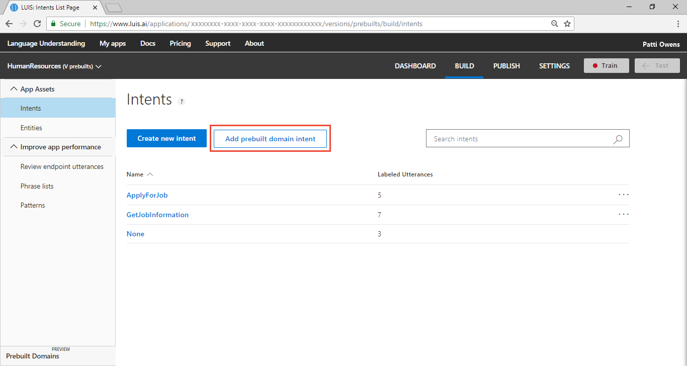
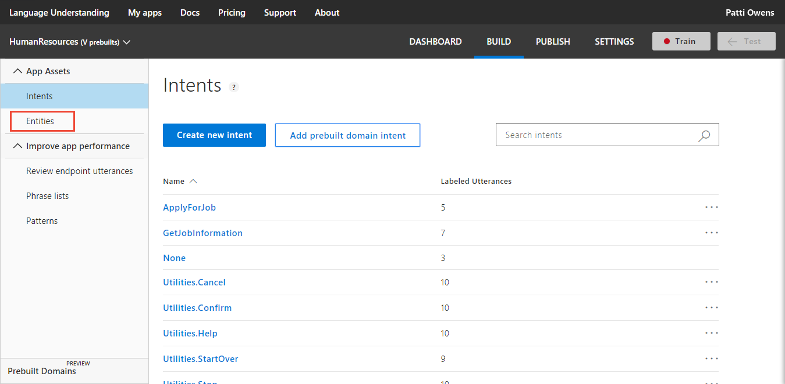
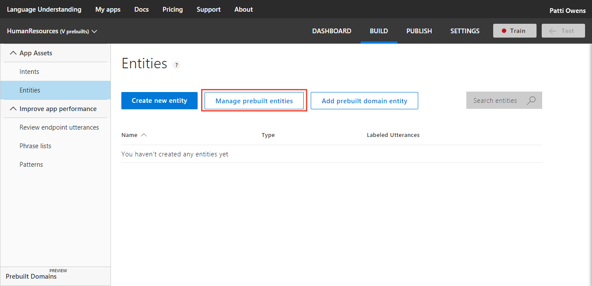

---
title: Add prebuilt intents and entities to extract common data in Language Understanding - Azure | Microsoft Docs 
description: Learn how to use prebuilt intents and entities to extract different types of entity data. 
services: cognitive-services
author: diberry
manager: cjgronlund

ms.service: cognitive-services
ms.component: luis
ms.topic: tutorial
ms.date: 08/03/2018
ms.author: diberry
--- 

# Tutorial: 2. Add prebuilt intents and entities
Add prebuilt intents and entities to the Human Resources tutorial app to quickly gain intent prediction and data extraction. 

In this tutorial, you learn how to:

> [!div class="checklist"]
* Add prebuilt intents 
* Add prebuilt entities datetimeV2 and number
* Train and publish
* Query LUIS and receive prediction response

[!INCLUDE [LUIS Free account](../../../includes/cognitive-services-luis-free-key-short.md)]

## Before you begin
If you do not have the [Human Resources](luis-quickstart-intents-only.md) app from the previous tutorial, [import](luis-how-to-start-new-app.md#import-new-app) the JSON into a new app in the [LUIS](luis-reference-regions.md#luis-website) website, from the [LUIS-Samples](https://github.com/Microsoft/LUIS-Samples/blob/master/documentation-samples/quickstarts/custom-domain-intent-only-HumanResources.json) Github repository.

If you want to keep the original Human Resources app, clone the version on the [Settings](luis-how-to-manage-versions.md#clone-a-version) page, and name it `prebuilts`. Cloning is a great way to play with various LUIS features without affecting the original version. 

## Add prebuilt intents
LUIS provides several prebuilt intents to help with common user intentions.  

1. Make sure your app is in the **Build** section of LUIS. You can change to this section by selecting **Build** on the top, right menu bar. 

2. Select **Add prebuilt domain intent**. 

    [  ](./media/luis-tutorial-prebuilt-intents-and-entities/add-prebuilt-domain-button.png#lightbox)

3. Search for `Utilities`. 

    [ ](./media/luis-tutorial-prebuilt-intents-and-entities/prebuilt-intent-utilities.png#lightbox)

4. Select the following intents and select **Done**: 

    * Utilities.Cancel
    * Utilities.Confirm
    * Utilities.Help
    * Utilities.StartOver
    * Utilities.Stop


## Add prebuilt entities
LUIS provides several prebuilt entities for common data extraction. 

1. Select **Entities** from the left navigation menu.

    [ ](./media/luis-tutorial-prebuilt-intents-and-entities/entities-navigation.png#lightbox)

2. Select **Manage prebuilt entities** button.

    [ ](./media/luis-tutorial-prebuilt-intents-and-entities/manage-prebuilt-entities-button.png#lightbox)

3. Select **number** and **datetimeV2** from the list of prebuilt entities then select **Done**.

    

## Train and publish the app

[!INCLUDE [LUIS How to Train steps](../../../includes/cognitive-services-luis-tutorial-how-to-train.md)]

## Publish app to endpoint

[!INCLUDE [LUIS How to Publish steps](../../../includes/cognitive-services-luis-tutorial-how-to-publish.md)]

## Query endpoint with an utterance

1. [!INCLUDE [LUIS How to get endpoint first step](../../../includes/cognitive-services-luis-tutorial-how-to-get-endpoint.md)]

2. Go to the end of the URL in the address and enter `I want to cancel on March 3`. The last query string parameter is `q`, the utterance **query**. 

    The result predicted the Utilities.Cancel intent and extracted the date of March 3 and the number 3. 

    ```
    {
      "query": "I want to cancel on March 3",
      "topScoringIntent": {
        "intent": "Utilities.Cancel",
        "score": 0.7818295
      },
      "intents": [
        {
          "intent": "Utilities.Cancel",
          "score": 0.7818295
        },
        {
          "intent": "ApplyForJob",
          "score": 0.0237864349
        },
        {
          "intent": "GetJobInformation",
          "score": 0.017576348
        },
        {
          "intent": "Utilities.StartOver",
          "score": 0.0130122062
        },
        {
          "intent": "Utilities.Help",
          "score": 0.006731322
        },
        {
          "intent": "None",
          "score": 0.00524190161
        },
        {
          "intent": "Utilities.Stop",
          "score": 0.004912514
        },
        {
          "intent": "Utilities.Confirm",
          "score": 0.00092950504
        }
      ],
      "entities": [
        {
          "entity": "march 3",
          "type": "builtin.datetimeV2.date",
          "startIndex": 20,
          "endIndex": 26,
          "resolution": {
            "values": [
              {
                "timex": "XXXX-03-03",
                "type": "date",
                "value": "2018-03-03"
              },
              {
                "timex": "XXXX-03-03",
                "type": "date",
                "value": "2019-03-03"
              }
            ]
          }
        },
        {
          "entity": "3",
          "type": "builtin.number",
          "startIndex": 26,
          "endIndex": 26,
          "resolution": {
            "value": "3"
          }
        }
      ]
    }
    ```

    There are two values for March 3 because the utterance didn't state if March 3 is in the past or in the future. It is up to the LUIS-calling application to make an assumption or ask for clarification, if that is needed. 

    By easily and quickly adding prebuilt intents and entities, the client application can add conversation management and extract common datatypes. 

## Clean up resources

[!INCLUDE [LUIS How to clean up resources](../../../includes/cognitive-services-luis-tutorial-how-to-clean-up-resources.md)]

## Next steps

> [!div class="nextstepaction"]
> [Add a regular expression entity to the app](luis-quickstart-intents-regex-entity.md)

