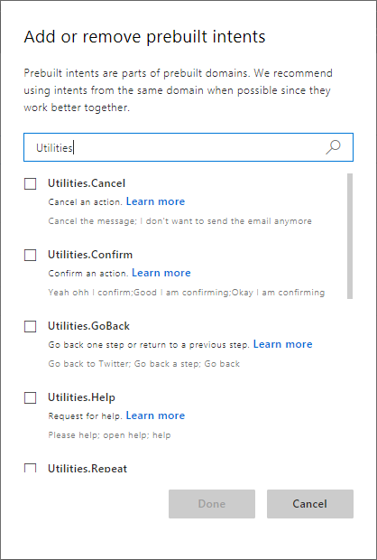
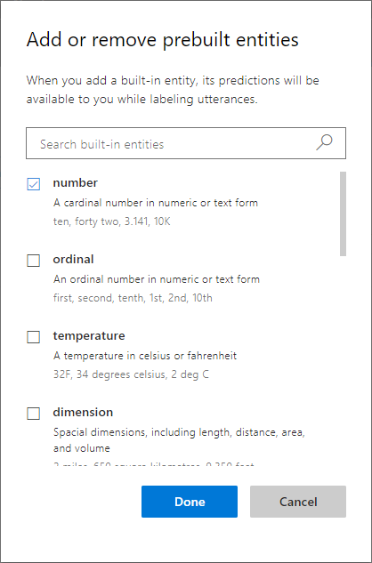

# Tutorial: Identify common intents and entities

In this tutorial, add prebuilt intents and entities to a Human Resources tutorial app to quickly gain intent prediction and data extraction. You do not need to mark any utterances with prebuilt entities because the entity is detected automatically.

Prebuilt models (domains, intents, and entities) help you build your model quickly.

**In this tutorial, you learn how to:**

> [!div class="checklist"]
> * Create new app
> * Add prebuilt intents 
> * Add prebuilt entities 
> * Train 
> * Publish 
> * Get intents and entities from endpoint

[!INCLUDE [LUIS Free account](../../../includes/cognitive-services-luis-free-key-short.md)]

## Create a new app

[!INCLUDE [Follow these steps to create a new LUIS app](../../../includes/cognitive-services-luis-create-new-app-steps.md)]


## Add prebuilt intents to help with common user intentions

LUIS provides several prebuilt intents to help with common user intentions.  

1. [!INCLUDE [Start in Build section](../../../includes/cognitive-services-luis-tutorial-build-section.md)]

1. Select **Add prebuilt domain intent**. 

1. Search for `Utilities`. 

    [](./media/luis-tutorial-prebuilt-intents-and-entities/prebuilt-intent-utilities.png#lightbox)

1. Select the following intents and select **Done**: 

   * Utilities.Cancel
   * Utilities.Confirm
   * Utilities.Help
   * Utilities.StartOver
   * Utilities.Stop

     These intents are helpful to determine where, in the conversation, the user is and what they are asking to do. 


## Add prebuilt entities to help with common data type extraction

LUIS provides several prebuilt entities for common data extraction. 

1. Select **Entities** from the left navigation menu.

1. Select **Add prebuilt entity** button.

1. Select the following entities from the list of prebuilt entities then select **Done**:

   * **[PersonName](luis-reference-prebuilt-person.md)** 
   * **[GeographyV2](luis-reference-prebuilt-geographyV2.md)**

     

     These entities will help you add name and place recognition to your client application.

## Add example utterances to the None intent 

[!INCLUDE [Follow these steps to add the None intent to the app](../../../includes/cognitive-services-luis-create-the-none-intent.md)]

## Train the app so the changes to the intent can be tested 

[!INCLUDE [LUIS How to Train steps](../../../includes/cognitive-services-luis-tutorial-how-to-train.md)]

## Publish the app so the trained model is queryable from the endpoint

[!INCLUDE [LUIS How to Publish steps](../../../includes/cognitive-services-luis-tutorial-how-to-publish.md)]

## Get intent and entity prediction from endpoint

1. [!INCLUDE [LUIS How to get endpoint first step](../../../includes/cognitive-services-luis-tutorial-how-to-get-endpoint.md)]

1. Go to the end of the URL in the browser address bar and enter `I want to cancel my trip to Seattle to see Bob Smith`. The last query string parameter is `q`, the utterance **query**. 

    ```json
    {
      "query": "I want to cancel my trip to Seattle to see Bob Smith",
      "topScoringIntent": {
        "intent": "Utilities.Cancel",
        "score": 0.807676256
      },
      "intents": [
        {
          "intent": "Utilities.Cancel",
          "score": 0.807676256
        },
        {
          "intent": "Utilities.StartOver",
          "score": 0.0487322025
        },
        {
          "intent": "Utilities.Help",
          "score": 0.0208660364
        },
        {
          "intent": "None",
          "score": 0.008789532
        },
        {
          "intent": "Utilities.Stop",
          "score": 0.006929268
        },
        {
          "intent": "Utilities.Confirm",
          "score": 0.00136293867
        }
      ],
      "entities": [
        {
          "entity": "seattle",
          "type": "builtin.geographyV2.city",
          "startIndex": 28,
          "endIndex": 34
        },
        {
          "entity": "bob smith",
          "type": "builtin.personName",
          "startIndex": 43,
          "endIndex": 51
        }
      ]
    }
    ```

    The result predicted the Utilities.Cancel intent with 80% confidence and extracted the city and person name data. 


## Clean up resources

[!INCLUDE [LUIS How to clean up resources](../../../includes/cognitive-services-luis-tutorial-how-to-clean-up-resources.md)]

## Related information

Learn more about prebuilt models:

* [Prebuilt domains](luis-reference-prebuilt-domains.md): these are common domains that reduce overall LUIS app authoring
* Prebuilt intents: these are the individual intents of the common domains. You can add intents individually instead of adding the entire domain.
* [Prebuilt entities](luis-prebuilt-entities.md): these are common data types useful to most LUIS apps.

Learn more about working with your LUIS app:

* [How to train](luis-how-to-train.md)
* [How to publish](luis-how-to-publish-app.md)
* [How to test in LUIS portal](luis-interactive-test.md)

## Next steps

By adding prebuilt intents and entities, the client application can determine common user intentions and extract common datatypes.  

> [!div class="nextstepaction"]
> [Add a regular expression entity to the app](luis-quickstart-intents-regex-entity.md)

