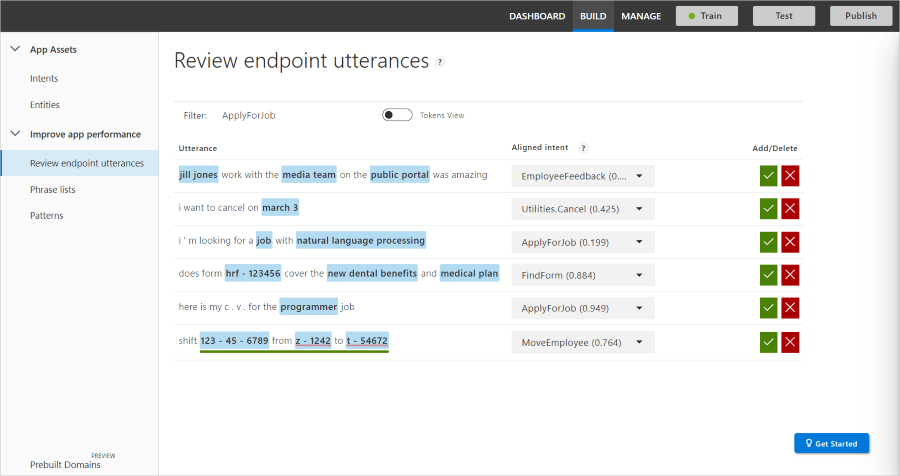
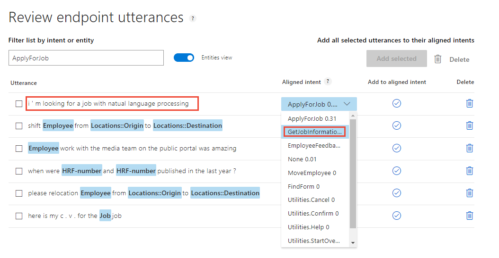
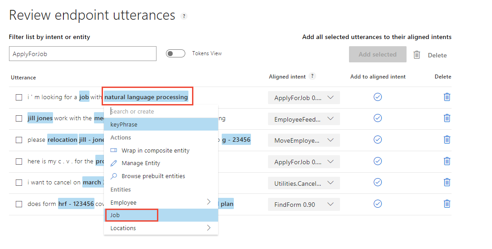
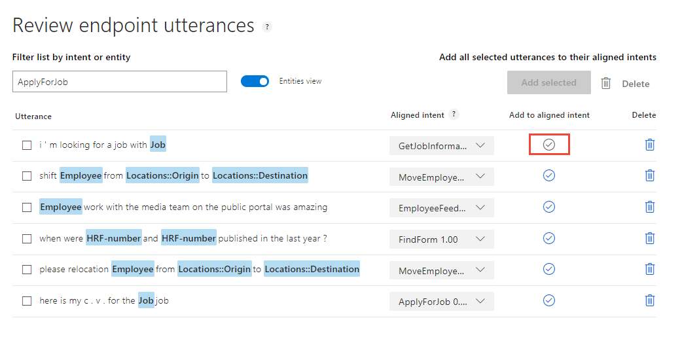
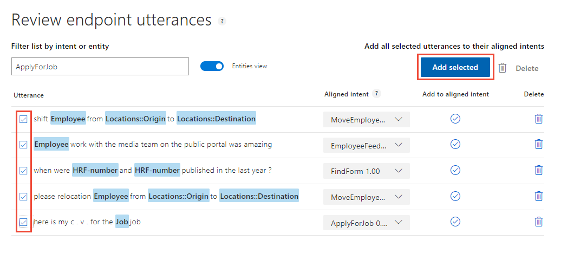

# Tutorial: Fix unsure predictions by reviewing endpoint utterances
In this tutorial, improve app predictions by verifying or correcting utterances received via the LUIS HTTPS endpoint that LUIS is unsure of. Some utterances may have to be verified for intent and others may need to be verified for entity. You should review endpoint utterances as a regular part of you scheduled LUIS maintenance. 

This review process is another way for LUIS to learn your app domain. LUIS selected the utterances that appear in the review list. This list is:

* Specific to the app.
* Is meant to improve the app's prediction accuracy. 
* Should be reviewed on a periodic basis. 

By reviewing the endpoint utterances, you verify or correct the utterance's predicted intent. You also label custom entities that were not predicted or predicted incorrectly. 

**In this tutorial, you learn how to:**

<!-- green checkmark -->
> [!div class="checklist"]
> * Import example app
> * Review endpoint utterances
> * Update phrase list
> * Train app
> * Publish app
> * Query endpoint of app to see LUIS JSON response

[!INCLUDE [LUIS Free account](../../../includes/cognitive-services-luis-free-key-short.md)]

## Import example app

Continue with the app created in the last tutorial, named **HumanResources**. 

Use the following steps:

1.  Download and save [app JSON file](https://github.com/Azure-Samples/cognitive-services-language-understanding/blob/master/documentation-samples/tutorials/custom-domain-sentiment-HumanResources.json).

1. Import the JSON into a new app.

1. From the **Manage** section, on the **Versions** tab, clone the version, and name it `review`. Cloning is a great way to play with various LUIS features without affecting the original version. Because the version name is used as part of the URL route, the name can't contain any characters that are not valid in a URL.

1. Train and publish the new app.

1. Use the endpoint to add the following utterances. You can either do this with a [script](https://github.com/Azure-Samples/cognitive-services-language-understanding/blob/master/examples/demo-upload-endpoint-utterances/endpoint.js) or from the endpoint in a browser. The utterances to add are:

   [!code-nodejs[Node.js code showing endpoint utterances to add](~/samples-luis/examples/demo-upload-endpoint-utterances/endpoint.js?range=15-26)]

    If you have all the versions of the app, through the series of tutorials, you may be surprised to see that the **Review endpoint utterances** list doesn't change, based on the version. There is a single pool of utterances to review, regardless of which version you are actively editing or which version of the app was published at the endpoint. 

## Review endpoint utterances

1. [!INCLUDE [Start in Build section](../../../includes/cognitive-services-luis-tutorial-build-section.md)]

1. Select **Review endpoint utterances** from the left navigation. The list is filtered for the **ApplyForJob** intent. 

    [](./media/luis-tutorial-review-endpoint-utterances/review-endpoint-utterances-with-entity-view.png#lightbox)

1. Toggle the **Entities view** to see the labeled entities. 
    
    [](./media/luis-tutorial-review-endpoint-utterances/review-endpoint-utterances-with-token-view.png#lightbox)

    |Utterance|Correct intent|Missing entities|
    |:--|:--|:--|
    |I'm looking for a job with Natural Language Processing|GetJobInfo|Job - "Natural Language Process"|

    This utterance is not in the correct intent and has a score less than 50%. The **ApplyForJob** intent has 21 utterances compared to the seven utterances in **GetJobInformation**. Along with aligning the endpoint utterance correctly, more utterances should be added to the **GetJobInformation** intent. That is left as an exercise for you to complete on your own. Each intent, except for the **None** intent, should have roughly the same number of example utterances. The **None** intent should have 10% of the total utterances in the app. 

1. For the intent `I'm looking for a job with Natual Language Processing`, select the correct intent, **GetJobInformation** in the **Aligned intent** column. 

    [](./media/luis-tutorial-review-endpoint-utterances/align-intent-1.png#lightbox)

1. In the same utterance, the entity for `Natural Language Processing` is keyPhrase. This should be a **Job** entity instead. Select `Natural Language Processing` then select the **Job** entity from the list.

    [](./media/luis-tutorial-review-endpoint-utterances/label-entity.png#lightbox)

1. On the same line, select the circled checkmark in the **Add to aligned intent** column. 

    [](./media/luis-tutorial-review-endpoint-utterances/align-utterance.png#lightbox)

    This action moves the utterance from the **Review endpoint utterances** to the **GetJobInformation** intent. The endpoint utterance is now an example utterance for that intent. 

1. Review the remaining utterances in this intent, labeling utterances and correcting the **Aligned intent**, if these are incorrect.

1. When all the utterances are correct, select the checkbox on each row, then select **Add selected** to align the utterances correctly. 

    [](./media/luis-tutorial-review-endpoint-utterances/finalize-utterance-alignment.png#lightbox)

1. The list should no longer have those utterances. If more utterances appear, continue to work through the list, correcting intents and labeling any missing entities, until the list is empty. 

1. Select the next intent in the Filter list, then continue correcting utterances and labeling entities. Remember the last step of each intent is to either select **Add to aligned intent** on the utterance row or check the box by each intent and select **Add selected** above the table.

    Continue until all intents and entities in the filter list have an empty list. This is a very small app. The review process takes only a few minutes. 

## Update phrase list
Keep the phrase list current with any newly discovered job names. 

1. Select **Phrase lists** from left navigation.

2. Select the **Jobs** phrase list.

3. Add `Natural Language Processing` as a value then select **Save**. 

## Train

LUIS doesn't know about the changes until it is trained. 

[!INCLUDE [LUIS How to Train steps](../../../includes/cognitive-services-luis-tutorial-how-to-train.md)]

## Publish

If you imported this app, you need to select **Sentiment analysis**.

[!INCLUDE [LUIS How to Publish steps](../../../includes/cognitive-services-luis-tutorial-how-to-publish.md)]

## Get intent and entities from endpoint

Try an utterance close to the corrected utterance. 

1. [!INCLUDE [LUIS How to get endpoint first step](../../../includes/cognitive-services-luis-tutorial-how-to-get-endpoint.md)]

2. Go to the end of the URL in the address and enter `Are there any natural language processing jobs in my department right now?`. The last querystring parameter is `q`, the utterance **query**. 

   ```json
   {
    "query": "are there any natural language processing jobs in my department right now?",
    "topScoringIntent": {
      "intent": "GetJobInformation",
      "score": 0.9247605
    },
    "intents": [
      {
        "intent": "GetJobInformation",
        "score": 0.9247605
      },
      {
        "intent": "ApplyForJob",
        "score": 0.129989788
      },
      {
        "intent": "FindForm",
        "score": 0.006438211
      },
      {
        "intent": "EmployeeFeedback",
        "score": 0.00408575451
      },
      {
        "intent": "Utilities.StartOver",
        "score": 0.00194211153
      },
      {
        "intent": "None",
        "score": 0.00166400627
      },
      {
        "intent": "Utilities.Help",
        "score": 0.00118593348
      },
      {
        "intent": "MoveEmployee",
        "score": 0.0007885918
      },
      {
        "intent": "Utilities.Cancel",
        "score": 0.0006373631
      },
      {
        "intent": "Utilities.Stop",
        "score": 0.0005980781
      },
      {
        "intent": "Utilities.Confirm",
        "score": 3.719905E-05
      }
    ],
    "entities": [
      {
        "entity": "right now",
        "type": "builtin.datetimeV2.datetime",
        "startIndex": 64,
        "endIndex": 72,
        "resolution": {
          "values": [
            {
              "timex": "PRESENT_REF",
              "type": "datetime",
              "value": "2018-07-05 15:23:18"
            }
          ]
        }
      },
      {
        "entity": "natural language processing",
        "type": "Job",
        "startIndex": 14,
        "endIndex": 40,
        "score": 0.9869922
      },
      {
        "entity": "natural language processing jobs",
        "type": "builtin.keyPhrase",
        "startIndex": 14,
        "endIndex": 45
      },
      {
        "entity": "department",
        "type": "builtin.keyPhrase",
        "startIndex": 53,
        "endIndex": 62
      }
    ],
    "sentimentAnalysis": {
      "label": "positive",
      "score": 0.8251864
    }
   }
   }
   ```

   The correct intent was predicted with a high score and the **Job** entity is detected as `natural language processing`. 

## Can reviewing be replaced by adding more utterances? 
You may wonder why not add more example utterances. What is the purpose of reviewing endpoint utterances? In a real-world LUIS app, the endpoint utterances are from users with word choice and arrangement you haven't used yet. If you had used the same word choice and arrangement, the original prediction would have a higher percentage. 

## Why is the top intent on the utterance list? 
Some of the endpoint utterances will have a high prediction score in the review list. You still need to review and verify those utterances. They are on the list because the next highest intent had a score too close to the top intent score. You want about 15% difference between the two top intents.

## Clean up resources

[!INCLUDE [LUIS How to clean up resources](../../../includes/cognitive-services-luis-tutorial-how-to-clean-up-resources.md)]

## Next steps
In this tutorial, you reviewed utterances submitted at the endpoint, that LUIS was unsure of. Once these utterances have been verified and moved into the correct intents as example utterances, LUIS will improve the prediction accuracy.

> [!div class="nextstepaction"]
> [Learn how to use patterns](luis-tutorial-pattern.md)
