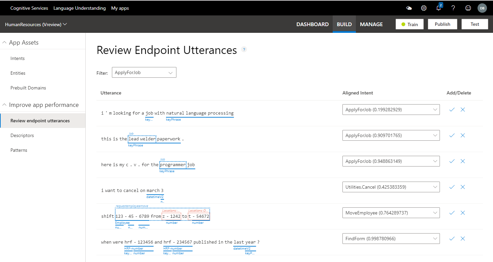
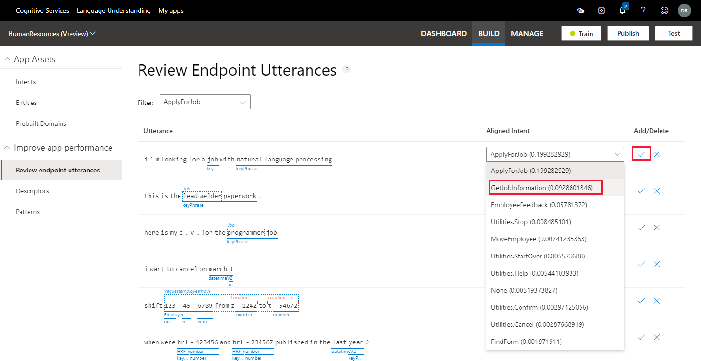

# Tutorial: Fix unsure predictions by reviewing endpoint utterances
In this tutorial, improve app predictions by verifying or correcting utterances, received via the LUIS HTTPS endpoint, that LUIS is unsure of. You should review endpoint utterances as a regular part of your scheduled LUIS maintenance.

This review process allows LUIS to learn your app domain. LUIS selects the utterances that appear in the review list. This list is:

* Specific to the app.
* Is meant to improve the app's prediction accuracy.
* Should be reviewed on a periodic basis.

By reviewing the endpoint utterances, you verify or correct the utterance's predicted intent.

**In this tutorial, you learn how to:**

<!-- green checkmark -->
> [!div class="checklist"]
> * Import example app
> * Review endpoint utterances
> * Train and publish app
> * Query endpoint of app to see LUIS JSON response

[!INCLUDE [LUIS Free account](../../../includes/cognitive-services-luis-free-key-short.md)]

## Download JSON file for app

Download and save [app JSON file](https://github.com/Azure-Samples/cognitive-services-language-understanding/blob/master/documentation-samples/tutorials/custom-domain-sentiment-HumanResources.json?raw=true).

## Import JSON file for app

[!INCLUDE [Import app steps](includes/import-app-steps.md)]

## Train the app to apply the entity changes to the app

[!INCLUDE [LUIS How to Train steps](includes/howto-train.md)]

## Publish the app to access it from the HTTP endpoint

[!INCLUDE [LUIS How to Publish steps](includes/howto-publish.md)]

## Add utterances at the endpoint

In this app, you have intents and entities but you don't have any endpoint usage. This endpoint usage is required to improve the app with the endpoint utterance review.

1. [!INCLUDE [LUIS How to get endpoint first step](includes/howto-get-endpoint.md)]

1. Go to the end of the URL in the address bar and replace _YOUR_QUERY_HERE_ with the utterances in the following table. For each utterance, submit the utterance, and get the result. Then replace the utterance at the end with the next utterance.

    |Endpoint utterance|Aligned intent|
    |--|--|
    |`I'm looking for a job with Natural Language Processing`|`GetJobInformation`|
    |`I want to cancel on March 3`|`Utilities.Cancel`|
    |`When were HRF-123456 and hrf-234567 published in the last year?`|`FindForm`|
    |`shift 123-45-6789 from Z-1242 to T-54672`|`MoveEmployee`|
    |`Please relocation jill-jones@mycompany.com from x-2345 to g-23456`|`MoveEmployee`|
    |`Here is my c.v. for the programmer job`|`ApplyForJob`|
    |`This is the lead welder paperwork.`|`ApplyForJob`|
    |`does form hrf-123456 cover the new dental benefits and medical plan`|`FindForm`|
    |`Jill Jones work with the media team on the public portal was amazing`|`EmployeeFeedback`|

    There is a single pool of utterances to review, regardless of which version you are actively editing or which version of the app was published at the endpoint.

## Review endpoint utterances

Review the endpoint utterances for correctly aligned intent. While there is a single pool of utterances to review across all versions, the process of correctly aligning the intent adds the example utterance to the current _active model_ only.

1. From the **Build** section of the portal, select **Review endpoint utterances** from the left navigation. The list is filtered for the **ApplyForJob** intent.

    > [!div class="mx-imgBorder"]
    > 

    This utterance, `I'm looking for a job with Natural Language Processing`, is not in the correct intent.

1.  To align this utterance, on the utterance row, select the correct **Aligned Intent** of `GetJobInformation`. Add the changed utterance to the app by selecting the checkmark.

    > [!div class="mx-imgBorder"]
    > 

    Review the remaining utterances in this intent, correcting the aligned intent as needed. Use the initial utterance table in this tutorial to view the aligned intent.

    The **Review endpoint utterances** list should no longer have the corrected utterances. If more utterances appear, continue to work through the list, correcting aligned intents until the list is empty.

    Any correction of entity labeling is done after the intent is aligned, from the Intent details page.

1. Train and publish the app again.

## Get intent prediction from endpoint

To verify the correctly aligned example utterances improved the app's prediction, try an utterance close to the corrected utterance.

1. [!INCLUDE [LUIS How to get endpoint first step](includes/howto-get-endpoint.md)]

1. Go to the end of the URL in the address bar and replace _YOUR_QUERY_HERE_ with `Are there any natural language processing jobs in my department right now?`.

   ```json
    {
        "query": "Are there any natural language processing jobs in my department right now?",
        "prediction": {
            "topIntent": "GetJobInformation",
            "intents": {
                "GetJobInformation": {
                    "score": 0.903607249
                },
                "EmployeeFeedback": {
                    "score": 0.0312187821
                },
                "ApplyForJob": {
                    "score": 0.0230276529
                },
                "MoveEmployee": {
                    "score": 0.008322801
                },
                "Utilities.Stop": {
                    "score": 0.004480808
                },
                "FindForm": {
                    "score": 0.00425248267
                },
                "Utilities.StartOver": {
                    "score": 0.004224336
                },
                "Utilities.Help": {
                    "score": 0.00373591436
                },
                "None": {
                    "score": 0.0034621188
                },
                "Utilities.Cancel": {
                    "score": 0.00230977475
                },
                "Utilities.Confirm": {
                    "score": 0.00112078607
                }
            },
            "entities": {
                "keyPhrase": [
                    "natural language processing jobs",
                    "department"
                ],
                "datetimeV2": [
                    {
                        "type": "datetime",
                        "values": [
                            {
                                "timex": "PRESENT_REF",
                                "resolution": [
                                    {
                                        "value": "2019-12-05 23:23:53"
                                    }
                                ]
                            }
                        ]
                    }
                ],
                "$instance": {
                    "keyPhrase": [
                        {
                            "type": "builtin.keyPhrase",
                            "text": "natural language processing jobs",
                            "startIndex": 14,
                            "length": 32,
                            "modelTypeId": 2,
                            "modelType": "Prebuilt Entity Extractor",
                            "recognitionSources": [
                                "model"
                            ]
                        },
                        {
                            "type": "builtin.keyPhrase",
                            "text": "department",
                            "startIndex": 53,
                            "length": 10,
                            "modelTypeId": 2,
                            "modelType": "Prebuilt Entity Extractor",
                            "recognitionSources": [
                                "model"
                            ]
                        }
                    ],
                    "datetimeV2": [
                        {
                            "type": "builtin.datetimeV2.datetime",
                            "text": "right now",
                            "startIndex": 64,
                            "length": 9,
                            "modelTypeId": 2,
                            "modelType": "Prebuilt Entity Extractor",
                            "recognitionSources": [
                                "model"
                            ]
                        }
                    ]
                }
            }
        }
    }
   ```

   Now that the unsure utterances are correctly aligned, the correct intent was predicted with a **high score**.

## Can reviewing be replaced by adding more utterances?
You may wonder why not add more example utterances. What is the purpose of reviewing endpoint utterances? In a real-world LUIS app, the endpoint utterances are from users with word choice and arrangement you haven't used yet. If you had used the same word choice and arrangement, the original prediction would have a higher percentage.

## Why is the top intent on the utterance list?
Some of the endpoint utterances will have a high prediction score in the review list. You still need to review and verify those utterances. They are on the list because the next highest intent had a score too close to the top intent score. You want about 15% difference between the two top intents.

## Clean up resources

[!INCLUDE [LUIS How to clean up resources](../../../includes/cognitive-services-luis-tutorial-how-to-clean-up-resources.md)]

## Next steps

In this tutorial, you reviewed utterances submitted at the endpoint, that LUIS was unsure of. Once these utterances have been verified and moved into the correct intents as example utterances, LUIS will improve the prediction accuracy.

> [!div class="nextstepaction"]
> [Learn how to use patterns](luis-tutorial-pattern.md)
