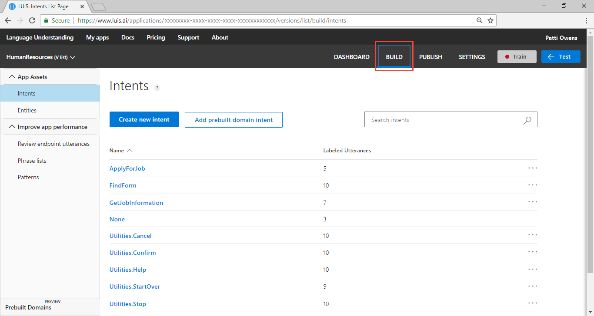

---
title: Tutorial to review endpoint utterances in Language Understanding (LUIS) - Azure | Microsoft Docs 
description: In this tutorial, learn how to review endpoint utterances in the Human Resources (HR) domain in LUIS. 
services: cognitive-services
author: v-geberr
manager: kaiqb 

ms.service: cognitive-services
ms.component: luis
ms.topic: tutorial
ms.date: 07/02/2018
ms.author: v-geberr
#Customer intent: As a new user, I want to understand why and when to review endpoint utterances. 

--- 

# Tutorial: Review endpoint utterances
In this tutorial, improve app predictions by verifying or correcting utterances received via the LUIS HTTP endpoint. 

<!-- green checkmark -->
> [!div class="checklist"]
> * Understand reviewing endpoint utterances 
> * Backup endpoint utterances with authoring API
> * Use LUIS app for the Human Resources (HR) domain 
> * Review endpoint utterances
> * Train, and publish app
> * Query endpoint of app to see LUIS JSON response

For this article, you need a free [LUIS](luis-reference-regions.md#luis-website) account to author your LUIS application.

## Before you begin
If you don't have the Human Resources app from the [keyPhrase entity](luis-quickstart-intent-and-key-phrase.md) tutorial, [import](create-new-app.md#import-new-app) the JSON into a new app in the [LUIS](luis-reference-regions.md#luis-website) website. The app to import is found in the [LUIS-Samples](https://github.com/Microsoft/LUIS-Samples/blob/master/documentation-samples/quickstarts/custom-domain-regex-HumanResources.json) Github repository. If you use this tutorial from an imported app, you will also need to train, publish, then add the [utterances](https://github.com/Microsoft/LUIS-Samples/blob/master/documentation-samples/quickstarts/endpoint-utterances-Human-Resources.json) to the endpoint with a [script](https://github.com/Microsoft/LUIS-Samples/blob/master/examples/demo-upload-example-utterances/demo-upload-utterances-from-review-endpoint-utterances/endpoint.js). 

If you want to keep the original Human Resources app, clone the version on the [Settings](luis-how-to-manage-versions.md#clone-a-version) page, and name it `review`. Cloning is a great way to play with various LUIS features without affecting the original version. 

## Purpose of reviewing endpoint utterances
LUIS chose the utterances in the review list. This list is specific to the utterances and is meant to improve the app's prediction accuracy. This list should be reviewed on a periodic basis to improve predictions. 

Any utterances that are correctly identified for intent and utterance, can be accepted as is. Any utterances that are either incorrect for the intent or entities should be corrected then accepted. 

## Backup endpoint utterances before beginning
Once an utterance is reviewed, it is not added back to LUIS even if it is submitted at the endpoint again . If you want to have a snapshot of the app, in case your review is incorrect, or the app is deleted, backup the app and endpoint utterances. 

Backing up the app consists of exporting the app from the **My apps** list. 

Backing up the endpoint utterances is done with the (authoring API)[https://westus.dev.cognitive.microsoft.com/docs/services/5890b47c39e2bb17b84a55ff/operations/5890b47c39e2bb052c5b9c0a]. 

In order to restore the app state, import the app and then apply the endpoint utterances to the endpoint again using this [script](https://github.com/Microsoft/LUIS-Samples/blob/master/examples/demo-upload-example-utterances/demo-upload-utterances-from-review-endpoint-utterances/endpoint.js). 

## Review endpoint utterances
1. Make sure your Human Resources app is in the **Build** section of LUIS. You can change to this section by selecting **Build** on the top, right menu bar. 

    

2. Select **Review endpoint utterances** from the left navigation. 

3. Review the utterances in the list. 

4. Filter the app by the **ApplyForJob** intent, above the list. 

5. 

## Train the LUIS app

## Publish the app