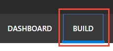

---
title: Tutorial to review endpoint utterances in Language Understanding (LUIS) - Azure | Microsoft Docs 
description: In this tutorial, learn how to review endpoint utterances in the Human Resources (HR) domain in LUIS. 
services: cognitive-services
author: v-geberr
manager: kaiqb 

ms.service: cognitive-services
ms.component: luis
ms.topic: tutorial
ms.date: 07/03/2018
ms.author: v-geberr
#Customer intent: As a new user, I want to understand why and when to review endpoint utterances. 

--- 

# Tutorial: Review endpoint utterances
In this tutorial, improve app predictions by verifying or correcting utterances received via the LUIS HTTP endpoint. 

<!-- green checkmark -->
> [!div class="checklist"]
> * Understand reviewing endpoint utterances 
> * Backup endpoint utterances with authoring API
> * Use LUIS app for the Human Resources (HR) domain 
> * Review endpoint utterances
> * Train, and publish app
> * Query endpoint of app to see LUIS JSON response

For this article, you need a free [LUIS](luis-reference-regions.md#luis-website) account to author your LUIS application.

## Before you begin
If you don't have the Human Resources app from the [sentiment](luis-quickstart-intent-and-sentiment-analysis.md) tutorial, import the app from [LUIS-Samples](https://github.com/Microsoft/LUIS-Samples/blob/master/documentation-samples/quickstarts/custom-domain-sentiment-HumanResources.json) Github repository. If you use this tutorial from this imported app, you also need to train, publish, then add the [utterances](https://github.com/Microsoft/LUIS-Samples/blob/master/documentation-samples/quickstarts/endpoint-utterances-Human-Resources.json) to the endpoint with a [script](https://github.com/Microsoft/LUIS-Samples/blob/master/examples/demo-upload-endpoint-utterances/endpoint.js) or from the endpoint in a browser. 

If you want to keep the original Human Resources app, clone the version on the [Settings](luis-how-to-manage-versions.md#clone-a-version) page, and name it `review`. Cloning is a great way to play with various LUIS features without affecting the original version. 

## Purpose of reviewing endpoint utterances
LUIS chose the utterances in the review list. This list is specific to the app and is meant to improve the app's prediction accuracy. This list should be reviewed on a periodic basis to improve predictions. 

The utterances submitted to the app over time, as you progressed through the tutorials, would have utterances that may have incorrect predictions based on the most recent tutorial intents and entities. If you imported the app and used the script to add the utterances, the review utterances would be different because the app didn't go through the various stages of tutorials. 

If you have all the versions of the app, through the tutorials, you may be surprised to see that the **Review endpoint utterances** list doesn't change, based on the version. There is a single pool of utterances to review, regardless of which version the utterance you are actively editing or which version of the app was published at the endpoint. 


## Review endpoint utterances

1. Make sure your Human Resources app is in the **Build** section of LUIS. You can change to this section by selecting **Build** on the top, right menu bar. 

    [ ](./media/luis-tutorial-review-endpoint-utterances/first-image.png#lightbox)

1. Select **Review endpoint utterances** from the left navigation. The list is filtered for the **ApplyForJob** intent. 

    [ ](./media/luis-tutorial-review-endpoint-utterances/entities-view-endpoint-utterances.png#lightbox)

2. Toggle the **Entities view** to see the labeled entities. 
    
    |Utterance|Correct intent|Missing entities|
    |:--|:--|:--|
    |I'm looking for a job with Natural Language Processing|GetJobInfo|Job - "Natural Language Process"|

    This utterance is not in the correct intent and has a score less than 50%. The **ApplyForJob** intent has 21 utterances compared to the seven utterances in **GetJobInformation**. Along with aligning the endpoint utterance correctly, more utterances should be added to the **GetJobInformation** intent. That is left as an exercise for you to complete on your own. Each intent, except for the **None** intent, should have roughly the same number of example utterances. The **None** intent should have 10% of the total utterances in the app. 

3. For the intent `I'm looking for a job with Natual Language Processing`, select the correct intent, **GetJobInformation** in the **Aligned intent** column. 

    [ ](./media/luis-tutorial-review-endpoint-utterances/align-intent-1.png#lightbox)

4. In the same utterance, the entity for `Natural Language Processing` is keyPhrase. This should be a **Job** entity instead. Select `Natural Language Processing` then select the **Job** entity from the list.

    [ ](./media/luis-tutorial-review-endpoint-utterances/label-entity.png#lightbox)

5. On the same line, select the circled checkmark in the **Add to aligned intent** column. 

    [ ](./media/luis-tutorial-review-endpoint-utterances/align-utterance.png#lightbox)

    This action moves the utterance from the **Review endpoint utterances** to the **GetJobInformation** intent. The endpoint utterance is now an example utterance for that intent. 

6. Review the remaining utterances in this intent, labeling utterances and correcting the **Aligned intent**, if these are incorrect.

7. When all the utterances are correct, select the checkbox on each row, then select **Add selected** to align the utterances correctly. 

    [ ](./media/luis-tutorial-review-endpoint-utterances/finalize-utterance-alignment.png#lightbox)

8. The list should no longer have those utterances. Continue to work through the list, correcting intents and labeling any missing entities, until it is empty. Select the next intent in the Filter list, then continue correcting utterances and labeling entities. Remember the last step of each utterance is to either select **Add to aligned intent** on the utterance row or check the box by each intent and select **Add selected** above the table. This is a very small app. The review process takes a few minutes only.

## Train the LUIS app
LUIS doesn't know about the changes until it is trained. 

1. In the top right side of the LUIS website, select the **Train** button.

2. Training is complete when you see the green status bar at the top of the website confirming success.

## Publish the app to get the endpoint URL
In order to get the updated model of the LUIS app in a chatbot or other application, you need to publish the app. 

1. In the top right side of the LUIS website, select the **Publish** button. 

2. Select the Production slot and the **Publish** button.

3. Publishing is complete when you see the green status bar at the top of the website confirming success.

## Query the endpoint with an utterance
Try the utterance that was corrected. 

1. On the **Publish** page, select the **endpoint** link at the bottom of the page. This action opens another browser window with the endpoint URL in the address bar. 

2. Go to the end of the URL in the address and enter `I'm looking for a job with Natural Language Processing`. The last querystring parameter is `q`, the utterance **query**. 

```JSON
{
  "query": "I'm looking for a job with Natural Language Processing",
  "topScoringIntent": {
    "intent": "GetJobInformation",
    "score": 0.9092416
  },
  "intents": [
    {
      "intent": "GetJobInformation",
      "score": 0.9092416
    },
    {
      "intent": "ApplyForJob",
      "score": 0.0481389128
    },
    {
      "intent": "EmployeeFeedback",
      "score": 0.00855329
    },
    {
      "intent": "Utilities.Confirm",
      "score": 0.00533996429
    },
    {
      "intent": "None",
      "score": 0.00476739649
    },
    {
      "intent": "Utilities.StartOver",
      "score": 0.00442132354
    },
    {
      "intent": "FindForm",
      "score": 0.00259294664
    },
    {
      "intent": "Utilities.Help",
      "score": 0.00255334447
    },
    {
      "intent": "Utilities.Cancel",
      "score": 0.00194117648
    },
    {
      "intent": "Utilities.Stop",
      "score": 0.00159457081
    },
    {
      "intent": "MoveEmployee",
      "score": 0.0009164306
    }
  ],
  "entities": [
    {
      "entity": "natural language processing",
      "type": "Job",
      "startIndex": 27,
      "endIndex": 53,
      "score": 0.8488714
    },
    {
      "entity": "job",
      "type": "builtin.keyPhrase",
      "startIndex": 18,
      "endIndex": 20
    },
    {
      "entity": "natural language processing",
      "type": "builtin.keyPhrase",
      "startIndex": 27,
      "endIndex": 53
    }
  ],
  "sentimentAnalysis": {
    "label": "neutral",
    "score": 0.5
  }
}```

The prediction score is at 90% and the job entity is detected as natural language processing. 

## Can reviewing be replaced by adding more utterances? 
You may wonder why not add more example utterances. What is the purpose of reviewing endpoint utterances? In a real-world LUIS app, the endpoint utterances are from users with word choice and arrangement you haven't used yet. If you had used the same word choice and arrangement, the original prediction would have a higher percentage. 

## Why is the top intent on the utterance list? 
Some of the endpoint utterances will have a high percentage in the review list. You still need to review and verify those utterances. They are on the list because the next highest intent had a score too close to the top intent score. 

## What has this tutorial accomplished?
This app prediction accuracy has increased by reviewing utterances from the endpoint. 

## Clean up resources
When no longer needed, delete the LUIS app. Select **My apps** in the top left menu. Select the three dot menu (...) to the right of the app name in the app list, select **Delete**. On the pop-up dialog **Delete app?**, select **Ok**.

## Next steps

> [!div class="nextstepaction"]
> [Learn how to use patterns](luis-tutorial-patterns.md)
