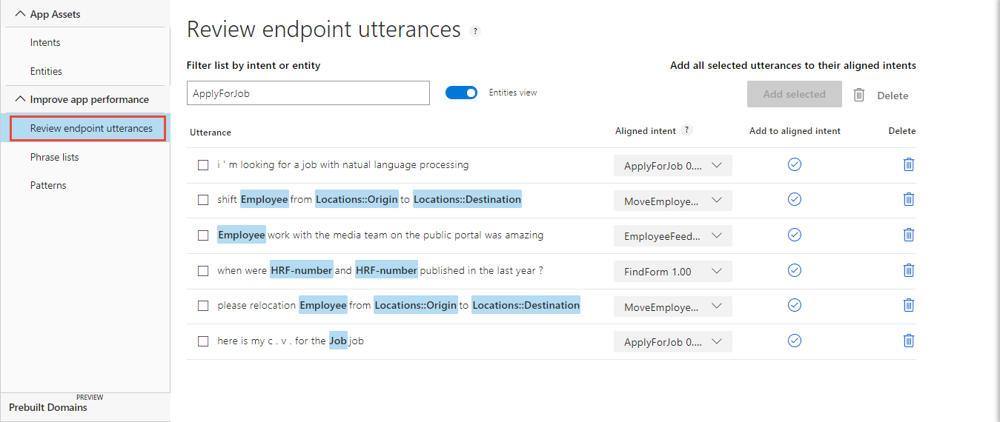
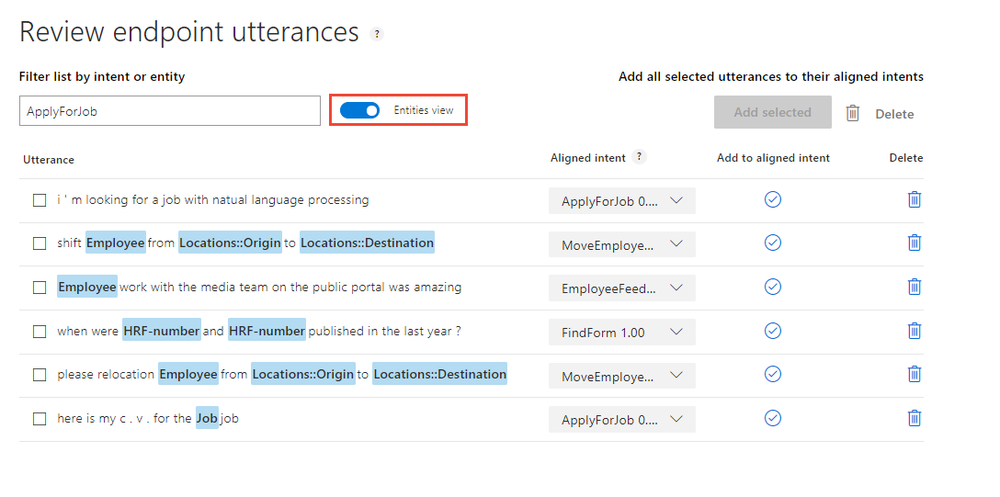

---
title: Tutorial to review endpoint utterances in Language Understanding (LUIS) - Azure | Microsoft Docs 
description: In this tutorial, learn how to review endpoint utterances in the Human Resources (HR) domain in LUIS. 
services: cognitive-services
author: diberry
manager: cjgronlund

ms.service: cognitive-services
ms.component: luis
ms.topic: tutorial
ms.date: 08/03/2018
ms.author: diberry
#Customer intent: As a new user, I want to understand why and when to review endpoint utterances. 

--- 

# Tutorial: Review endpoint utterances
In this tutorial, improve app predictions by verifying or correcting utterances received via the LUIS HTTP endpoint. 

<!-- green checkmark -->
> [!div class="checklist"]
> * Understand reviewing endpoint utterances 
> * Use LUIS app for the Human Resources (HR) domain 
> * Review endpoint utterances
> * Train, and publish app
> * Query endpoint of app to see LUIS JSON response

[!INCLUDE [LUIS Free account](../../../includes/cognitive-services-luis-free-key-short.md)]

## Before you begin
If you don't have the Human Resources app from the [sentiment](luis-quickstart-intent-and-sentiment-analysis.md) tutorial, import the app from [LUIS-Samples](https://github.com/Microsoft/LUIS-Samples/blob/master/documentation-samples/quickstarts/custom-domain-sentiment-HumanResources.json) Github repository. If you use this tutorial as a new, imported app, you also need to train, publish, then add the utterances to the endpoint with a [script](https://github.com/Microsoft/LUIS-Samples/blob/master/examples/demo-upload-endpoint-utterances/endpoint.js) or from the endpoint in a browser. The utterances to add are:

   [!code-nodejs[Node.js code showing endpoint utterances to add](~/samples-luis/examples/demo-upload-endpoint-utterances/endpoint.js?range=15-26)]

If you want to keep the original Human Resources app, clone the version on the [Settings](luis-how-to-manage-versions.md#clone-a-version) page, and name it `review`. Cloning is a great way to play with various LUIS features without affecting the original version. 

If you have all the versions of the app, through the series of tutorials, you may be surprised to see that the **Review endpoint utterances** list doesn't change, based on the version. There is a single pool of utterances to review, regardless of which version the utterance you are actively editing or which version of the app was published at the endpoint. 

## Purpose of reviewing endpoint utterances
This review process is another way for LUIS to learn your app domain. LUIS selected the utterances in the review list. This list is:

* Specific to the app.
* Is meant to improve the app's prediction accuracy. 
* Should be reviewed on a periodic basis. 

By reviewing the endpoint utterances, you verify or correct the utterance's predicted intent. You also label custom entities that were not predicted. 

## Review endpoint utterances

1. Make sure your Human Resources app is in the **Build** section of LUIS. You can change to this section by selecting **Build** on the top, right menu bar. 

2. Select **Review endpoint utterances** from the left navigation. The list is filtered for the **ApplyForJob** intent. 

    [ ](./media/luis-tutorial-review-endpoint-utterances/entities-view-endpoint-utterances.png#lightbox)

3. Toggle the **Entities view** to see the labeled entities. 
    
    [ ](./media/luis-tutorial-review-endpoint-utterances/select-entities-view.png#lightbox)

    |Utterance|Correct intent|Missing entities|
    |:--|:--|:--|
    |I'm looking for a job with Natural Language Processing|GetJobInfo|Job - "Natural Language Process"|

    This utterance is not in the correct intent and has a score less than 50%. The **ApplyForJob** intent has 21 utterances compared to the seven utterances in **GetJobInformation**. Along with aligning the endpoint utterance correctly, more utterances should be added to the **GetJobInformation** intent. That is left as an exercise for you to complete on your own. Each intent, except for the **None** intent, should have roughly the same number of example utterances. The **None** intent should have 10% of the total utterances in the app. 

    When you are in **Tokens View**, you can hover over any blue text to the utterance to see the predicted entity name. 

4. For the intent `I'm looking for a job with Natual Language Processing`, select the correct intent, **GetJobInformation** in the **Aligned intent** column. 

    [ ](./media/luis-tutorial-review-endpoint-utterances/align-intent-1.png#lightbox)

5. In the same utterance, the entity for `Natural Language Processing` is keyPhrase. This should be a **Job** entity instead. Select `Natural Language Processing` then select the **Job** entity from the list.

    [ ](./media/luis-tutorial-review-endpoint-utterances/label-entity.png#lightbox)

6. On the same line, select the circled checkmark in the **Add to aligned intent** column. 

    [ ](./media/luis-tutorial-review-endpoint-utterances/align-utterance.png#lightbox)

    This action moves the utterance from the **Review endpoint utterances** to the **GetJobInformation** intent. The endpoint utterance is now an example utterance for that intent. 

7. Review the remaining utterances in this intent, labeling utterances and correcting the **Aligned intent**, if these are incorrect.

8. When all the utterances are correct, select the checkbox on each row, then select **Add selected** to align the utterances correctly. 

    [ ](./media/luis-tutorial-review-endpoint-utterances/finalize-utterance-alignment.png#lightbox)

9. The list should no longer have those utterances. If more utterances appear, continue to work through the list, correcting intents and labeling any missing entities, until it is empty. Select the next intent in the Filter list, then continue correcting utterances and labeling entities. Remember the last step of each intent is to either select **Add to aligned intent** on the utterance row or check the box by each intent and select **Add selected** above the table. 

    This is a very small app. The review process takes only a few minutes.

## Add new job name to phrase list
Keep the phrase list current with any newly discovered job names. 

1. Select **Phrase lists** from left navigation.

2. Select the **Jobs** phrase list.

3. Add `Natural Language Processing` as a value then select **Save**. 

## Train the LUIS app

LUIS doesn't know about the changes until it is trained. 

[!INCLUDE [LUIS How to Train steps](../../../includes/cognitive-services-luis-tutorial-how-to-train.md)]

## Publish the app to get the endpoint URL

If you imported this app, you need to select **Sentiment analysis**.

[!INCLUDE [LUIS How to Publish steps](../../../includes/cognitive-services-luis-tutorial-how-to-publish.md)]

## Query the endpoint with an utterance

Try an utterance close to the corrected utterance. 

1. [!INCLUDE [LUIS How to get endpoint first step](../../../includes/cognitive-services-luis-tutorial-how-to-get-endpoint.md)]

2. Go to the end of the URL in the address and enter `Are there any natural language processing jobs in my department right now?`. The last querystring parameter is `q`, the utterance **query**. 

  ```JSON
  {
    "query": "are there any natural language processing jobs in my department right now?",
    "topScoringIntent": {
      "intent": "GetJobInformation",
      "score": 0.9247605
    },
    "intents": [
      {
        "intent": "GetJobInformation",
        "score": 0.9247605
      },
      {
        "intent": "ApplyForJob",
        "score": 0.129989788
      },
      {
        "intent": "FindForm",
        "score": 0.006438211
      },
      {
        "intent": "EmployeeFeedback",
        "score": 0.00408575451
      },
      {
        "intent": "Utilities.StartOver",
        "score": 0.00194211153
      },
      {
        "intent": "None",
        "score": 0.00166400627
      },
      {
        "intent": "Utilities.Help",
        "score": 0.00118593348
      },
      {
        "intent": "MoveEmployee",
        "score": 0.0007885918
      },
      {
        "intent": "Utilities.Cancel",
        "score": 0.0006373631
      },
      {
        "intent": "Utilities.Stop",
        "score": 0.0005980781
      },
      {
        "intent": "Utilities.Confirm",
        "score": 3.719905E-05
      }
    ],
    "entities": [
      {
        "entity": "right now",
        "type": "builtin.datetimeV2.datetime",
        "startIndex": 64,
        "endIndex": 72,
        "resolution": {
          "values": [
            {
              "timex": "PRESENT_REF",
              "type": "datetime",
              "value": "2018-07-05 15:23:18"
            }
          ]
        }
      },
      {
        "entity": "natural language processing",
        "type": "Job",
        "startIndex": 14,
        "endIndex": 40,
        "score": 0.9869922
      },
      {
        "entity": "natural language processing jobs",
        "type": "builtin.keyPhrase",
        "startIndex": 14,
        "endIndex": 45
      },
      {
        "entity": "department",
        "type": "builtin.keyPhrase",
        "startIndex": 53,
        "endIndex": 62
      }
    ],
    "sentimentAnalysis": {
      "label": "positive",
      "score": 0.8251864
    }
  }
  }
  ```

  The correct intent was predicted with a high score and the **Job** entity is detected as `natural language processing`. 

## Can reviewing be replaced by adding more utterances? 
You may wonder why not add more example utterances. What is the purpose of reviewing endpoint utterances? In a real-world LUIS app, the endpoint utterances are from users with word choice and arrangement you haven't used yet. If you had used the same word choice and arrangement, the original prediction would have a higher percentage. 

## Why is the top intent on the utterance list? 
Some of the endpoint utterances will have a high percentage in the review list. You still need to review and verify those utterances. They are on the list because the next highest intent had a score too close to the top intent score. 

## What has this tutorial accomplished?
This app prediction accuracy has increased by reviewing utterances from the endpoint. 

## Clean up resources

[!INCLUDE [LUIS How to clean up resources](../../../includes/cognitive-services-luis-tutorial-how-to-clean-up-resources.md)]

## Next steps

> [!div class="nextstepaction"]
> [Learn how to use patterns](luis-tutorial-pattern.md)
