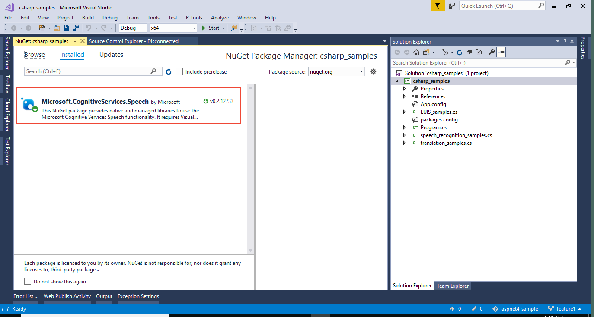
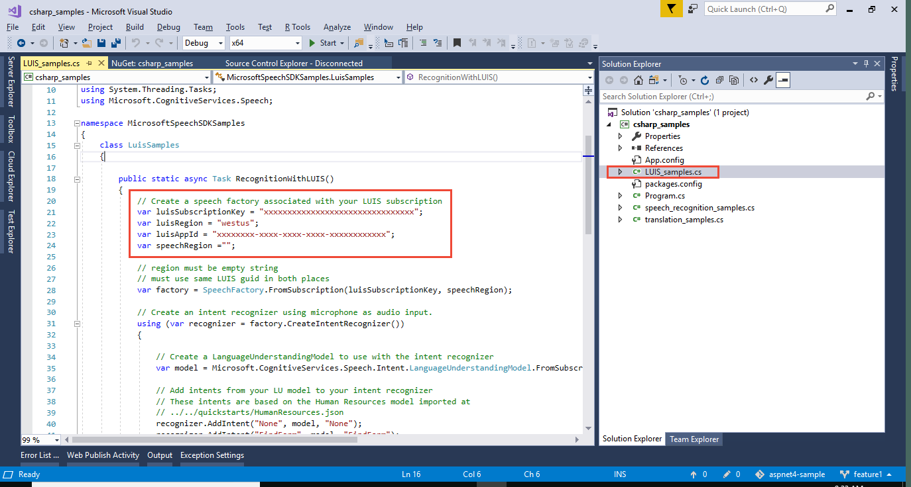
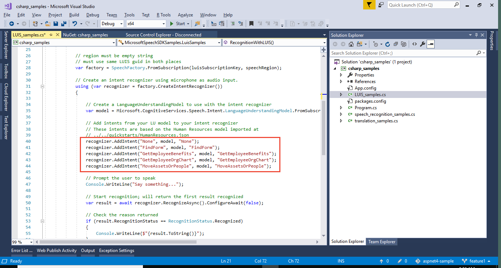

# Integrate Speech service
The [Speech service](https://docs.microsoft.com/azure/cognitive-services/Speech-Service/) allows you to use a single request to receive audio and return LUIS prediction JSON objects.

In this article, you download and use a C# project in Visual Studio to speak an utterance into a microphone and receive LUIS prediction information. The project uses the Speech [NuGet](https://www.nuget.org/packages/Microsoft.CognitiveServices.Speech/) package, already included as a reference. 

For this article, you need a free [LUIS][LUIS] website account in order to import the application.

## Create LUIS endpoint key
In the Azure portal, [create](luis-how-to-azure-subscription.md#create-luis-endpoint-key) a **Language Understanding** (LUIS) key. 

## Import Human Resources LUIS app
The intents, and utterances for this article are from the Human Resources LUIS app available from the [LUIS-Samples](https://github.com/Microsoft/LUIS-Samples) Github repository. Download the [HumanResources.json](https://github.com/Microsoft/LUIS-Samples/blob/master/documentation-samples/quickstarts/HumanResources.json) file, save it with the *.json extension, and [import](luis-how-to-start-new-app.md#import-new-app) it into LUIS. 

This app has intents, entities, and utterances related to the Human Resources domain. Example utterances include:

```
Who is John Smith's manager?
Who does John Smith manage?
Where is Form 123456?
Do I have any paid time off?
```

## Add KeyPhrase prebuilt entity
After importing the app, select **Entities**, then **Manage prebuilt entities**. Add the **KeyPhrase** entity. The KeyPhrase entity extracts key subject matter from the utterance.

## Train and publish the app
1. In the top, right navigation bar, select the **Train** button to train the LUIS app.

2. Select **Publish** to go to the publish page. 

3. At the bottom of the **Publish** page, add the LUIS key created in the [Create LUIS endpoint key](#create-luis-endpoint-key) section.

4. Publish the LUIS app by selecting the **Publish** button to the right of the Publish slot. 

  On the **Publish** page, collect the app ID, publish region, and subscription ID of the LUIS key created in the  [Create LUIS endpoint key](#create-luis-endpoint-key) section. You need to modify the code to use these values later in this article. 

  These values are all included in the endpoint URL at the bottom of the **Publish** page for the key you created. 
  
  Do **not** use the free starter key for this exercise. Only a **Language Understanding** key created in the Azure portal will work for this exercise. 

  https://**REGION**.api.cognitive.microsoft.com/luis/v2.0/apps/**APPID**?subscription-key=**LUISKEY**&q=

## Audio device
This article uses the audio device on your computer. That can be a headset with microphone or a built-in audio device. Check the audio input levels to see if you should speak louder than you normally would to have your speech detected by the audio device. 

## Download the LUIS Sample project
 Clone or download the [LUIS-Samples](https://github.com/Microsoft/LUIS-Samples) repository. Open the [Speech to intent project](https://github.com/Microsoft/LUIS-Samples/tree/master/documentation-samples/tutorial-speech-intent-recognition) with Visual Studio and restore the NuGet packages. The VS solution file is .\LUIS-Samples-master\documentation-samples\tutorial-speech-intent-recognition\csharp\csharp_samples.sln.

The Speech SDK is already included as a reference. 

[](./media/luis-tutorial-speech-to-intent/nuget-package.png#lightbox)

## Modify the C# code
Open the **LUIS_samples.cs** file and change the following variables:

|Variable name|Purpose|
|--|--|
|luisSubscriptionKey|Corresponds to endpoint URL's subscription-key value from Publish page|
|luisRegion|Corresponds to endpoint URL's first subdomain|
|luisAppId|Corresponds to endpoint URL's route following **apps/**|

[](./media/luis-tutorial-speech-to-intent/change-variables.png#lightbox)

The file already has the Human Resources intents mapped.

[](./media/luis-tutorial-speech-to-intent/intents.png#lightbox)

Build and run the app. 

## Test code with utterance
Select **1** and speak into the microphone "Who is the manager of John Smith".

```cmd
1. Speech recognition of LUIS intent.
0. Stop.
Your choice: 1
LUIS...
Say something...
ResultId:cc83cebc9d6040d5956880bcdc5f5a98 Status:Recognized IntentId:<GetEmployeeOrgChart> Recognized text:<Who is the manager of John Smith?> Recognized Json:{"DisplayText":"Who is the manager of John Smith?","Duration":25700000,"Offset":9200000,"RecognitionStatus":"Success"}. LanguageUnderstandingJson:{
  "query": "Who is the manager of John Smith?",
  "topScoringIntent": {
    "intent": "GetEmployeeOrgChart",
    "score": 0.617331
  },
  "entities": [
    {
      "entity": "manager of john smith",
      "type": "builtin.keyPhrase",
      "startIndex": 11,
      "endIndex": 31
    }
  ]
}

Recognition done. Your Choice:

```

The correct intent, **GetEmployeeOrgChart**, was found with a 61% confidence. The keyPhrase entity was returned. 

The Speech SDK returns the entire LUIS response. 

## Clean up resources
When no longer needed, delete the LUIS HumanResources app. To do so, select the ellipsis (***...***) button to the right of the app name in the app list, select **Delete**. On the pop-up dialog **Delete app?**, select **Ok**.

Remember to delete the LUIS-Samples directory when you are done using the sample code.

## Next steps

> [!div class="nextstepaction"]
> [Integrate LUIS with a BOT](luis-csharp-tutorial-build-bot-framework-sample.md)

[LUIS]: https://docs.microsoft.com/azure/cognitive-services/luis/luis-reference-regions#luis-website