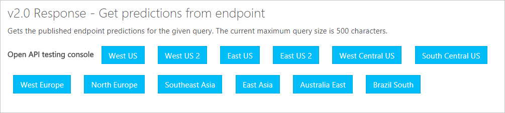

# API v2 Migration guide
The v1 [endpoint](https://aka.ms/v1-endpoint-api-docs) and [authoring](https://aka.ms/v1-authoring-api-docs) APIs will be deprecated on SOMEDATE. Use this guide to understand how to migrate to v2. 

|  | | |
|--|--|--|
|v1 |[authoring](https://aka.ms/v1-authoring-api-docs)|[endpoint](https://aka.ms/v1-endpoint-api-docs) |
|v2 |[authoring](https://aka.ms/luis-authoring-apis)|[endpoint](https://aka.ms/luis-endpoint-apis)|


## Azure Regions
There are more [regions](https://aka.ms/LUIS-regions) provided for the LUIS APIs. Each region corresponds to a testing console for the API. Your LUIS app must be defined in the appropriate region and authored in the correct region-based LUIS website. 



## Route name changes
The authoring API route changed from using the **prog** route to using the **api** route.

### Authoring route
| version | route |
|--|--|
|1|/luis/v1.0/**prog**/apps|
|2|/luis/**api**/v2.0/apps|


### Endpoint route
The endpoint API has new querystring parameters as well as a different response. If the verbose flag is true, all intents, regardless of score are returned in an array named intents, in addition to the topScoringIntent.

| version | utterance querystring name| route |
|--|--|--|
|1|id|/luis/v1/application[?id][&q]|
|2|q|/luis/v2.0/apps/{appId}?q={q}[&timezoneOffset][&verbose][&spellCheck][&staging][&bing-spell-check-subscription-key][&log]|


v1 endpoint success response
```JSON
{
  "odata.metadata":"https://dialogice.cloudapp.net/odata/$metadata#domain","value":[
    {
      "id":"bccb84ee-4bd6-4460-a340-0595b12db294","q":"turn on the camera","response":"[{\"intent\":\"OpenCamera\",\"score\":0.976928055},{\"intent\":\"None\",\"score\":0.0230718572}]"
    }
  ]
}
```

v2 endpoint success response
```JSON
{
  "query": "forward to frank 30 dollars through HSBC",
  "topScoringIntent": {
    "intent": "give",
    "score": 0.3964121
  },
  "entities": [
    {
      "entity": "30",
      "type": "builtin.number",
      "startIndex": 17,
      "endIndex": 18,
      "resolution": {
        "value": "30"
      }
    },
    {
      "entity": "frank",
      "type": "frank",
      "startIndex": 11,
      "endIndex": 15,
      "score": 0.935219169
    },
    {
      "entity": "30 dollars",
      "type": "builtin.currency",
      "startIndex": 17,
      "endIndex": 26,
      "resolution": {
        "unit": "Dollar",
        "value": "30"
      }
    },
    {
      "entity": "hsbc",
      "type": "Bank",
      "startIndex": 36,
      "endIndex": 39,
      "resolution": {
        "values": [
          "BankeName"
        ]
      }
    }
  ]
}
```

## Key management no longer in API
The subscription key APIs are deprecated, returning 410 GONE.

| version | route |
|--|--|
|1|/luis/v1.0/prog/subscriptions|
|1|/luis/v1.0/prog/subscriptions/{subscriptionKey}|

Azure [subscription keys](azureibizasubscription.md) are generated in the Azure portal and assigned to a LUIS app on the **[Publish](manage-keys.md)** page. 

## New versioning route
The v2 model is now contained in a [version](luis-how-to-manage-versions.md). A version name is 10 characters in the route. The default version is "0.1".

| version | route |
|--|--|
|1|/luis/v1.0/**prog**/apps/{appId}/entities|
|2|/luis/**api**/v2.0/apps/{appId}/**versions**/{versionId}/entities|

## Metadata renamed
Several APIs that return LUIS metadata have new names.

| v1 route name | v2 route name |
|--|--|
|PersonalAssistantApps |assistants|
|applicationcultures|cultures|
|applicationdomains|domains|
|applicationusagescenarios|usagescenarios|


## Sample renamed to suggest
The ability to find [endpoint utterances]() that LUIS determined will enhance the model is changed from **sample** to **suggest**. This is called "Review endpoint utterances" in the LUIS website.

| version | route |
|--|--|
|1|/luis/v1.0/**prog**/apps/{appId}/entities/{entityId}/**sample**|
|1|/luis/v1.0/**prog**/apps/{appId}/intents/{intentId}/**sample**|
|2|/luis/**api**/v2.0/apps/{appId}/**versions**/{versionId}/entities/{entityId}/**suggest**|
|2|/luis/**api**/v2.0/apps/{appId}/**versions**/{versionId}/intents/{intentId}/**suggest**|


## Create app from prebuilt domains
[Prebuilt domains](luis-how-to-use-prebuilt-domains.md) provide a predefined domain model. This allows you to quickly develop your LUIS application for common domains. 

```
// v2 route
/luis/api/v2.0/apps/customprebuiltdomains  [get,post]
/luis/api/v2.0/apps/customprebuiltdomains/{culture}  [get]
```

