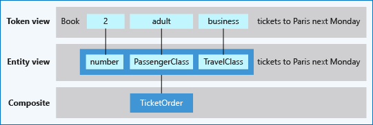

# Composite entity

A composite entity is made up of other entities, such as prebuilt entities, simple, regular expression, and list entities. The separate entities form a whole entity.

> [!CAUTION]
> This entity is **deprecated**. Please migrate to the [machine-learning entity](reference-entity-machine-learned-entity.md).

**This entity is a good fit when the data:**

* Are related to each other.
* Are related to each other in the context of the utterance.
* Use a variety of entity types.
* Need to be grouped and processed by the client application as a unit of information.
* Have a variety of user utterances that require machine-learning.



## Example JSON

Consider a composite entity of prebuilt `number` and `Location::ToLocation` with the following utterance:

`book 2 tickets to cairo`

Notice that `2`, the number, and `cairo`, the ToLocation have words between them that are not part of any of the entities. The green underline, used in a labeled utterance in the [LUIS](luis-reference-regions.md) website, indicates a composite entity.


#### [V2 prediction endpoint response](#tab/V2)

Composite entities are returned in a `compositeEntities` array and all entities within the composite are also returned in the `entities` array:

```JSON
  "entities": [
    {
      "entity": "2 tickets to cairo",
      "type": "ticketinfo",
      "startIndex": 5,
      "endIndex": 22,
      "score": 0.9214487
    },
    {
      "entity": "cairo",
      "type": "builtin.geographyV2.city",
      "startIndex": 18,
      "endIndex": 22
    },
    {
      "entity": "2",
      "type": "builtin.number",
      "startIndex": 5,
      "endIndex": 5,
      "resolution": {
        "subtype": "integer",
        "value": "2"
      }
    }
  ],
  "compositeEntities": [
    {
      "parentType": "ticketinfo",
      "value": "2 tickets to cairo",
      "children": [
        {
          "type": "builtin.number",
          "value": "2"
        },
        {
          "type": "builtin.geographyV2.city",
          "value": "cairo"
        }
      ]
    }
  ]
```

#### [V3 prediction endpoint response](#tab/V3)

This is the JSON if `verbose=false` is set in the query string:

```json
"entities": {
    "ticketinfo": [
        {
            "number": [
                2
            ],
            "geographyV2": [
                "cairo"
            ]
        }
    ]
}
```

This is the JSON if `verbose=true` is set in the query string:

```json
"entities": {
    "ticketinfo": [
        {
            "number": [
                2
            ],
            "geographyV2": [
                "cairo"
            ],
            "$instance": {
                "number": [
                    {
                        "type": "builtin.number",
                        "text": "2",
                        "startIndex": 5,
                        "length": 1,
                        "modelTypeId": 2,
                        "modelType": "Prebuilt Entity Extractor",
                        "recognitionSources": [
                            "model"
                        ]
                    }
                ],
                "geographyV2": [
                    {
                        "type": "builtin.geographyV2.city",
                        "text": "cairo",
                        "startIndex": 18,
                        "length": 5,
                        "modelTypeId": 2,
                        "modelType": "Prebuilt Entity Extractor",
                        "recognitionSources": [
                            "model"
                        ]
                    }
                ]
            }
        }
    ],
    "$instance": {
        "ticketinfo": [
            {
                "type": "ticketinfo",
                "text": "2 tickets to cairo",
                "startIndex": 5,
                "length": 18,
                "score": 0.9214487,
                "modelTypeId": 4,
                "modelType": "Composite Entity Extractor",
                "recognitionSources": [
                    "model"
                ]
            }
        ]
    }
}
```

* * *


|Data object|Entity name|Value|
|--|--|--|
|Prebuilt Entity - number|"builtin.number"|"2"|
|Prebuilt Entity - GeographyV2|"Location::ToLocation"|"cairo"|

## Next steps

Learn more about entities:

* [Concepts](luis-concept-entity-types.md)
* [How to create](luis-how-to-add-entities.md)
