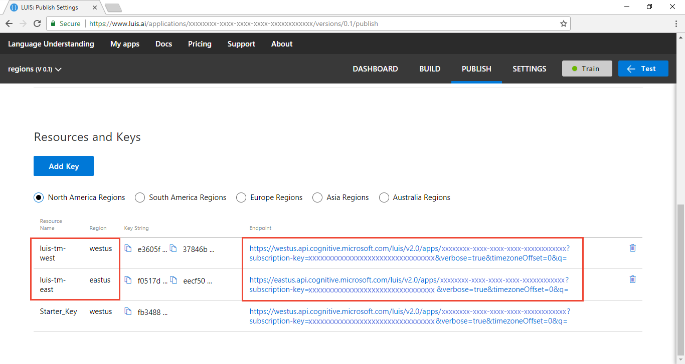

# Use Microsoft Azure Traffic Manager to manage endpoint quota across keys
Language Understanding (LUIS) offers the ability to increase the endpoint request quota beyond a single key's quota. This is done by creating more keys for LUIS and adding them to the LUIS application on the **Publish** page in the **Resources and Keys** section. 

The client-application has to manage the traffic across the keys. LUIS does not do that for you. 

This article explains how to manage the traffic across keys using Node.js and [Traffic Manager][traffic-manager-marketing].

## Create Azure resource for the Traffic Manager profiles with PowerShell
Before creating the Azure resources, create a resource group to contain all the resources. Name the resource group `luis-traffic-manager` and use the region is `West US`. The region of the resource group stores metadata about the group. It won't slow down your resources if they are in another region. 

Create resource group with **New-AzureRmResourceGroup** cmdlet:

```PowerShell
New-AzureRmResourceGroup -Name luis-traffic-manager -Location "West US"
```

## Increase total endpoint quota with more subscription keys
1. In the Azure portal, create two **Language Understanding** keys, one in the West US and one in the East US. In real-world usage create as many keys as needed in the pricing tier to solve your endpoint request expectations. Use the existing resource group, created in the previous section, named `luis-traffic-manager`.

    

2. In the [LUIS][LUIS] website, on the **Publish** page, add keys to the app. 

    

    The example URL in the **endpoint** column uses a GET request with the subscription key as a query parameter. Copy all these URLs. They will be used as part of the Traffic Manager configuration later in this article.

    https://**westus**.api.cognitive.microsoft.com/luis/v2.0/apps/<appID>?subscription-key=<subscriptionKey>&q=
    https://**eastus**.api.cognitive.microsoft.com/luis/v2.0/apps/<appID>?subscription-key=<subscriptionKey>&q=

## Manage traffic across keys with Traffic Manager
Traffic Manager creates a new DNS access point for your endpoints. It does not act as a gateway or proxy but strictly at the DNS level. This example won't change any DNS records. It uses a DNS library to communicate with Traffic Manager to get the correct endpoint for that specific request. _Each_ request intended for LUIS first requires a Traffic Manager request to determine which LUIS endpoint to use. 

Traffic Manager polls the endpoints periodically to make sure the endpoint is still available. The Traffic Manager URL polled needs to be accessible with a GET request and return a 200. The endpoint URL on the **Publish** page does this. Since each subscription key has a different route and query string parameters, each subscription key needs a different polling path. Each time Traffic Manager polls, it does cost a quota request. The query string parameter **q** of the LUIS endpoint is the utterance sent to LUIS. This parameter will be used to add Traffic Manager polling to the LUIS endpoint log as a debugging technique while getting Traffic Manager configured.

Because each LUIS endpoint needs its own path, it will need its own Traffic Manager profile. In order to manage across profiles, create a nested Traffic Manager architecture. One parent profile will point to the children profiles and manage traffic across them.

## Connect to PowerShell in Azure portal
In the [Azure][azure-portal] portal, open the PowerShell window. The icon for the PowerShell window is the **>_** in the top navigation bar. By using PowerShell from the portal, you are sure to get the latest version and you are authenticated. PowerShell in the portal requires a [Azure Storage] account. 

The following sections use [Traffic Manager PowerShell cmdlets](https://docs.microsoft.com/powershell/module/azurerm.trafficmanager/?view=azurermps-6.2.0#traffic_manager).


## Configure Traffic Manager with nested Profiles
The following sections create two child profiles, one for the East LUIS key and one for the West LUIS key. Then a parent profile is created and the two child profiles are added to the parent profile. 

### Create the East US Traffic Manager profile with PowerShell
To create the East US Traffic Manager profile, there are several steps: create profile, add endpoint, and set endpoint. A Traffic Manager profile can have many endpoint but each endpoint has the same validation path. Because the LUIS endpoint URLs for the east and west subscriptions are different due to region and subscription key, so each LUIS endpoint is also a single endpoint in the profile. 

1. Create profile with **New-AzureRmTrafficManagerProfile** cmdlet

    ```PowerShell
    $eastprofile = New-AzureRmTrafficManagerProfile -Name luis-profile-eastus -ResourceGroupName luis-traffic-manager -TrafficRoutingMethod Performance -RelativeDnsName luis-dns-eastus -Ttl 30 -MonitorProtocol HTTPS -MonitorPort 443 -MonitorPath "/luis/v2.0/apps/<appID>?subscription-key=<subscriptionKey>&q=traffic-manager"
    ```
    
    Change the variables marked with `<>` to your own values or the values in the following table:
    
    |Configuration parameter|Variable name or Value|Purpose|
    |--|--|--|
    |-Name|luis-profile-eastus|Traffic Manager name in Azure portal|
    |-ResourceGroupName|luis-traffic-manager|Created in previous section|
    |-TrafficRoutingMethod|Performance|For more information, see [Traffic Manager routing methods][routing-methods]. If using performance, the URL request to the Traffic Manager must come from the region of the user. If going through a chatbot or other application, it is the chatbot's responsibility to mimic the region in the call to the Traffic Manager. |
    |-RelativeDnsName|luis-dns-eastus|This is the subdomain for the service: luis-dns-eastus.trafficmanager.net|
    |-Ttl|30|Polling interval, 30 seconds|
    |-MonitorProtocol<BR>-MonitorPort|HTTPS<br>443|Port and protocol for LUIS is HTTPS/443|
    |-MonitorPath|"/luis/v2.0/apps/<appID>?subscription-key=<subscriptionKey>&q=traffic-manager"|Replace <appId> and <subscriptionKey> with your own values|
    
2. Add endpoint with **Add-AzureRmTrafficManagerEndpointConfig** cmdlet

    ```PowerShell
    Add-AzureRmTrafficManagerEndpointConfig -EndpointName luis-east-endpoint -TrafficManagerProfile $eastprofile -Type ExternalEndpoints -Target eastus.api.cognitive.microsoft.com -EndpointLocation "eastus" -EndpointStatus Enabled
    ```

    |Configuration parameter|Variable name or Value|Purpose|
    |--|--|--|
    |-EndpointName|luis-east-endpoint|Endpoint name displayed under the profile|
    |-TrafficManagerProfile|$eastprofile|Use profile object created in Step 1|
    |-Type|ExternalEndpoints|For more information, see [Traffic Manager endpoint][traffic-manager-endpoints] |
    |-Target|eastus.api.cognitive.microsoft.com|This is domain for the LUIS endpoint.|
    |-EndpointLocation|"eastus"|Region of the endpoint|
    |-EndpointStatus|Enabled|Enable endpoint when it is created|

3. Set east endpoint with **Set-AzureRmTrafficManagerProfile** cmdlet

    ```PowerShell
    Set-AzureRmTrafficManagerProfile -TrafficManagerProfile $eastprofile
    ```

Notice that the polling URL is constructed from information in the profile and the endpoint.

### Create the West US Traffic Manager profile with PowerShell
To create the West US Traffic Manager profile, follow the same steps: create profile, add endpoint, and set endpoint.

1. Create profile with **New-AzureRmTrafficManagerProfile** cmdlet

    ```PowerShell
    $westprofile = New-AzureRmTrafficManagerProfile -Name luis-profile-westus -ResourceGroupName luis-traffic-manager -TrafficRoutingMethod Performance -RelativeDnsName luis-dns-westus -Ttl 30 -MonitorProtocol HTTPS -MonitorPort 443 -MonitorPath "/luis/v2.0/apps/<appID>?subscription-key=<subscriptionKey>&q=traffic-manager"
    ```
    
    Change the variables marked with `<>` to your own values or the values in the following table:
    
    |Configuration parameter|Variable name or Value|Purpose|
    |--|--|--|
    |-Name|luis-profile-westus|Traffic Manager name in Azure portal|
    |-ResourceGroupName|luis-traffic-manager|Created in previous section|
    |-TrafficRoutingMethod|Performance|For more information, see [Traffic Manager routing methods][routing-methods]. If using performance, the URL request to the Traffic Manager must come from the region of the user. If going through a chatbot or other application, it is the chatbot's responsibility to mimic the region in the call to the Traffic Manager. |
    |-RelativeDnsName|luis-dns-westus|This is the subdomain for the service: luis-dns-westus.trafficmanager.net|
    |-Ttl|30|Polling interval, 30 seconds|
    |-MonitorProtocol<BR>-MonitorPort|HTTPS<br>443|Port and protocol for LUIS is HTTPS/443|
    |-MonitorPath|"/luis/v2.0/apps/<appID>?subscription-key=<subscriptionKey>&q=traffic-manager"|Replace <appId> and <subscriptionKey> with your own values. Remember this subscription key will be different than the east subscription key|
    
2. Add endpoint with **Add-AzureRmTrafficManagerEndpointConfig** cmdlet

    ```PowerShell
    Add-AzureRmTrafficManagerEndpointConfig -EndpointName luis-west-endpoint -TrafficManagerProfile $westprofile -Type ExternalEndpoints -Target westus.api.cognitive.microsoft.com -EndpointLocation "westus" -EndpointStatus Enabled
    ```

    |Configuration parameter|Variable name or Value|Purpose|
    |--|--|--|
    |-EndpointName|luis-west-endpoint|Endpoint name displayed under the profile|
    |-TrafficManagerProfile|$westprofile|Use profile object created in Step 1|
    |-Type|ExternalEndpoints|For more information, see [Traffic Manager endpoint][traffic-manager-endpoints] |
    |-Target|westus.api.cognitive.microsoft.com|This is domain for the LUIS endpoint.|
    |-EndpointLocation|"westus"|Region of the endpoint|
    |-EndpointStatus|Enabled|Enable endpoint when it is created|

3. Set west endpoint with **Set-AzureRmTrafficManagerProfile** cmdlet

    ```PowerShell
    Set-AzureRmTrafficManagerProfile -TrafficManagerProfile $westprofile
    ```

### Create parent Traffic Manager profile
Create the parent Traffic Manager profile and link two child Traffic Manager profiles to the parent.

1. Create parent profile with **New-AzureRmTrafficManagerProfile** cmdlet

    ```PowerShell
    $parentprofile = New-AzureRmTrafficManagerProfile -Name luis-profile-parent -ResourceGroupName luis-traffic-manager -TrafficRoutingMethod Performance -RelativeDnsName luis-dns-parent -Ttl 30 -MonitorProtocol HTTPS -MonitorPort 443 -MonitorPath "/"
    ```

    |Configuration parameter|Variable name or Value|Purpose|
    |--|--|--|
    |-Name|luis-profile-parent|Traffic Manager name in Azure portal|
    |-ResourceGroupName|luis-traffic-manager|Created in previous section|
    |-TrafficRoutingMethod|Performance|For more information, see [Traffic Manager routing methods][routing-methods]. If using performance, the URL request to the Traffic Manager must come from the region of the user. If going through a chatbot or other application, it is the chatbot's responsibility to mimic the region in the call to the Traffic Manager. |
    |-RelativeDnsName|luis-dns-parent|This is the subdomain for the service: luis-dns-parent.trafficmanager.net|
    |-Ttl|30|Polling interval, 30 seconds|
    |-MonitorProtocol<BR>-MonitorPort|HTTPS<br>443|Port and protocol for LUIS is HTTPS/443|
    |-MonitorPath|"/"|This path doesn't matter because the child endpoint paths are used instead.|

2. Add child east profile to parent with **Add-AzureRmTrafficManagerEndpointConfig** and **NestedEndpoints** type

    ```PowerShell
    Add-AzureRmTrafficManagerEndpointConfig -EndpointName child-endpoint-useast -TrafficManagerProfile $parentprofile -Type NestedEndpoints -TargetResourceId $eastprofile.Id -EndpointStatus Enabled -EndpointLocation "eastus" -MinChildEndpoints 1
    ```

    |Configuration parameter|Variable name or Value|Purpose|
    |--|--|--|
    |-EndpointName|child-endpoint-useast|East profile|
    |-TrafficManagerProfile|$parentprofile|Profile to assign this endpoint to|
    |-Type|NestedEndpoints|For more information, see [Add-AzureRmTrafficManagerEndpointConfig][https://docs.microsoft.com/powershell/module/azurerm.trafficmanager/Add-AzureRmTrafficManagerEndpointConfig?view=azurermps-6.2.0]. |
    |-TargetResourceId|$eastprofile.Id|Id of the child profile|
    |-EndpointStatus|Enabled|Endpoint status after adding to parent|
    |-EndpointLocation|"eastus"|This region is superceded by the child regions. [Azure region name](https://azure.microsoft.com/global-infrastructure/regions/) of resource|
    |-MinChildEndpoints|1|Minimum number to child endpoints|

3. Add child west profile to parent with **Add-AzureRmTrafficManagerEndpointConfig** cmdlet and **NestedEndpoints** type

    ```PowerShell
    Add-AzureRmTrafficManagerEndpointConfig -EndpointName child-endpoint-uswest -TrafficManagerProfile $parentprofile -Type NestedEndpoints -TargetResourceId $westprofile.Id -EndpointStatus Enabled -EndpointLocation "westus" -MinChildEndpoints 1
    ```

    |Configuration parameter|Variable name or Value|Purpose|
    |--|--|--|
    |-EndpointName|child-endpoint-uswest|West profile|
    |-TrafficManagerProfile|$parentprofile|Profile to assign this endpoint to|
    |-Type|NestedEndpoints|For more information, see [Add-AzureRmTrafficManagerEndpointConfig][https://docs.microsoft.com/powershell/module/azurerm.trafficmanager/Add-AzureRmTrafficManagerEndpointConfig?view=azurermps-6.2.0]. |
    |-TargetResourceId|$westprofile.Id|Id of the child profile|
    |-EndpointStatus|Enabled|Endpoint status after adding to parent|
    |-EndpointLocation|"westus"|[Azure region name](https://azure.microsoft.com/global-infrastructure/regions/) of resource|
    |-MinChildEndpoints|1|Minimum number to child endpoints|

4. Set endpoints with **Set-AzureRmTrafficManagerProfile** cmdlet 

    ```PowerShell
    Set-AzureRmTrafficManagerProfile -TrafficManagerProfile $parentprofile
    ```

### PowerShell variables
In the previous sections, three PowerShell variables were created: `$eastprofile`, `$westprofile`, `$parentprofile`. These variables are used toward the end of the Traffic Manager configuration. If you chose not to create the variables, or forgot to, you can use the PowerShell cmdlet, **Get-AzureRmTrafficManagerProfile**, to get the profile again and assign it to a variable. 

Replace the items in angle brackets, `<>`, with the correct values for each of the three profiles you need. 

```PowerShell
$<variable-name> = Get-AzureRmTrafficManagerProfile -Name <profile-name> -ResourceGroupName bot-luis-balance-westus
```

### Validate Traffic Manager polling works

### Validate DNS response from Traffic Manager works

## Create middle layer to use Traffic Manager

## Test middle layer

## Clean up

## Next steps

[traffic-manager-marketing]: https://azure.microsoft.com/services/traffic-manager/
[traffic-manager-docs]: https://docs.microsoft.com/azure/traffic-manager/
[LUIS]:luis-reference-regions.md#luis-website
[azure-portal]:https://portal.azure.com/
[azure-storage]:https://azure.microsoft.com/services/storage/
[routing-methods]:https://docs.microsoft.com/azure/traffic-manager/traffic-manager-routing-methods
[traffic-manager-endpoints]:https://docs.microsoft.com/azure/traffic-manager/traffic-manager-endpoint-types