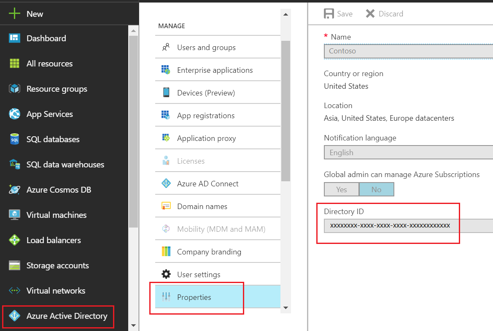
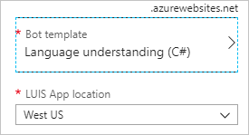

# Language Understanding Frequently Asked Questions (FAQ)

This article contains answers to frequently asked questions about Language Understanding (LUIS).

## What's new

[Learn more](whats-new.md) about what's new in Language Understanding (LUIS).

<a name="luis-authoring"></a>

## Authoring

### What are the LUIS best practices?
Start with the [Authoring Cycle](luis-concept-app-iteration.md), then read the [best practices](luis-concept-best-practices.md).

### What is the best way to start building my app in LUIS?

The best way to build your app is through an [incremental process](luis-concept-app-iteration.md).

### What is a good practice to model the intents of my app? Should I create more specific or more generic intents?

Choose intents that are not so general as to be overlapping, but not so specific that it makes it difficult for LUIS to distinguish between similar intents. Creating discriminative specific intents is one of the best practices for LUIS modeling.

### Is it important to train the None intent?

Yes, it is good to train your **None** intent with more utterances as you add more labels to other intents. A good ratio is 1 or 2 labels added to **None** for every 10 labels added to an intent. This ratio boosts the discriminative power of LUIS.

### How can I correct spelling mistakes in utterances?

See the [Bing Spell Check API V7](luis-tutorial-bing-spellcheck.md) tutorial. LUIS enforces limits imposed by Bing Spell Check API V7.

### How do I edit my LUIS app programmatically?
To edit your LUIS app programmatically, use the [Authoring API](https://go.microsoft.com/fwlink/?linkid=2092087). See [Call LUIS authoring API](./get-started-get-model-rest-apis.md) and [Build a LUIS app programmatically using Node.js](./luis-tutorial-node-import-utterances-csv.md) for examples of how to call the Authoring API. The Authoring API requires that you use an [authoring key](luis-how-to-azure-subscription.md#azure-resources-for-luis) rather than an endpoint key. Programmatic authoring allows up to 1,000,000 calls per month and five transactions per second. For more info on the keys you use with LUIS, see [Manage keys](./luis-how-to-azure-subscription.md).

### Where is the Pattern feature that provided regular expression matching?
The previous **Pattern feature** is currently deprecated, replaced by **[Patterns](luis-concept-patterns.md)**.

### How do I use an entity to pull out the correct data?
See [entities](luis-concept-entity-types.md) and [data extraction](luis-concept-data-extraction.md).

### Should variations of an example utterance include punctuation?
Use one of the following solutions:
* Ignore [punctuation](luis-reference-application-settings.md#punctuation-normalization)
* Add the different variations as example utterances to the intent
* Add the pattern of the example utterance with the [syntax to ignore](luis-concept-patterns.md#pattern-syntax) the punctuation.

### Does LUIS currently support Cortana?

Cortana prebuilt apps were deprecated in 2017. They are no longer supported.

### How do I transfer ownership of a LUIS app?
To transfer a LUIS app to a different Azure subscription, export the LUIS app and import it using a new account. Update the LUIS app ID in the client application that calls it. The new app may return slightly different LUIS scores from the original app.

### A prebuilt entity is tagged in an example utterance instead of my custom entity. How do I fix this?

In the LUIS portal, you can label text for the exact entity you are interested in extracting. If the LUIS portal is not showing the correct entity prediction, you may need to add more utterances and label the entity within the text or add a feature.

### I tried to import an app or version file but I got an error, what happened?

Read more about [version import errors](luis-how-to-manage-versions.md#import-errors).

<a name="luis-collaborating"></a>

## Collaborating and contributing

### How do I give collaborators access to LUIS with Azure Active Directory (Azure AD) or Azure role-based access control (Azure RBAC)?

See [Azure Active Directory resources](luis-how-to-collaborate.md#azure-active-directory-resources)  and [Azure Active Directory tenant user](luis-how-to-collaborate.md#azure-active-directory-tenant-user) to learn how to give collaborators access.

<a name="luis-endpoint"></a>

## Endpoint

### I received an HTTP 403 error status code. How do I fix it?

You get 403 and 429 error status codes when you exceed the transactions per second or transactions per month for your pricing tier. Increase your pricing tier, or use Language Understanding [containers](luis-container-howto.md).

When you use all those free 1000 endpoint queries or you exceed your pricing tier's monthly transactions quota, you receive an HTTP 403 error status code.

To fix this error, you need to either [change your pricing tier](luis-how-to-azure-subscription.md#change-the-pricing-tier) to a higher tier or [create a new resource](luis-get-started-create-app.md#sign-in-to-luis-portal) and assign it to your app.

Solutions for this error include:

* In the [Azure portal](https://portal.azure.com), on your Language Understanding resource, on the **Resource Management -> Pricing tier**, change your pricing tier to a higher TPS tier. You don't need to do anything in the Language Understanding portal if your resource is already assigned to your Language Understanding app.
*  If your usage exceeds the highest pricing tier, add more Language Understanding resources with a load balancer in front of them. The [Language Understanding container](luis-container-howto.md) with Kubernetes or Docker Compose can help with this.

### I received an HTTP 429 error status code. How do I fix it?

You get 403 and 429 error status codes when you exceed the transactions per second or transactions per month for your pricing tier. Increase your pricing tier, or use Language Understanding [containers](luis-container-howto.md).

This status code is returned when your transactions per second exceeds your pricing tier.

Solutions include:

* You can [increase your pricing tier](luis-how-to-azure-subscription.md#change-the-pricing-tier), if you are not at the highest tier.
* If your usage exceeds the highest pricing tier, add more Language Understanding resources with a load balancer in front of them. The [Language Understanding container](luis-container-howto.md) with Kubernetes or Docker Compose can help with this.
* You can gate your client application requests with a [retry policy](/azure/architecture/best-practices/transient-faults#general-guidelines) you implement yourself when you get this status code.

### My endpoint query returned unexpected results. What should I do?

Unexpected query prediction results are based on the state of the published model. To correct the model, you may need to change the model, train, and publish again.

Correcting the model starts with [active learning](luis-how-to-review-endpoint-utterances.md).

You can remove non-deterministic training by updating the [application version settings API](https://westus.dev.cognitive.microsoft.com/docs/services/5890b47c39e2bb17b84a55ff/operations/versions-update-application-version-settings) in order to use all training data.

Review the [best practices](luis-concept-best-practices.md) for other tips.

### Why does LUIS add spaces to the query around or in the middle of words?
LUIS [tokenizes](luis-glossary.md#token) the utterance based on the [culture](luis-language-support.md#tokenization). Both the original value and the tokenized value are available for [data extraction](luis-concept-data-extraction.md#tokenized-entity-returned).

### How do I create and assign a LUIS endpoint key?
[Create the endpoint key](luis-how-to-azure-subscription.md) in Azure for your [service](https://azure.microsoft.com/pricing/details/cognitive-services/language-understanding-intelligent-services/) level. [Assign the key](luis-how-to-azure-subscription.md) on the **[Azure Resources](luis-how-to-azure-subscription.md)** page. There is no corresponding API for this action. Then you must change the HTTP request to the endpoint to [use the new endpoint key](luis-how-to-azure-subscription.md).

### How do I interpret LUIS scores?
Your system should use the highest scoring intent regardless of its value. For example, a score below 0.5 (less than 50%) does not necessarily mean that LUIS has low confidence. Providing more training data can help increase the [score](luis-concept-prediction-score.md) of the most-likely intent.

### Why don't I see my endpoint hits in my app's Dashboard?
The total endpoint hits in your app's Dashboard are updated periodically, but the metrics associated with your LUIS endpoint key in the Azure portal are updated more frequently.

If you don't see updated endpoint hits in the Dashboard, sign in to the Azure portal, and find the resource associated with your LUIS endpoint key, and open **Metrics** to select the **Total Calls** metric. If the endpoint key is used for more than one LUIS app, the metric in the Azure portal shows the aggregate number of calls from all LUIS apps that use it.

### Is there a PowerShell command get to the endpoint quota?

[!INCLUDE [updated-for-az](../../../includes/updated-for-az.md)]

You can use a PowerShell command to see the endpoint quota:

```powershell
Get-AzCognitiveServicesAccountUsage -ResourceGroupName <your-resource-group> -Name <your-resource-name>
```

### My LUIS app was working yesterday but today I'm getting 403 errors. I didn't change the app. How do I fix it?
Follow these [instructions](#how-do-i-create-and-assign-a-luis-endpoint-key) to create a LUIS endpoint key and assign it to the app. Then you must change the client application's HTTP request to the endpoint to [use the new endpoint key](luis-how-to-azure-subscription.md). If you created a new resource in a different region, change the HTTP client request's region too.

### How do I secure my LUIS endpoint?
See [Securing the endpoint](luis-how-to-azure-subscription.md#securing-the-endpoint).

## Working within LUIS limits

### What is the maximum number of intents and entities that a LUIS app can support?
See the [boundaries](luis-limits.md) reference.

### I want to build a LUIS app with more than the maximum number of intents. What should I do?

See [Best practices for intents](luis-concept-intent.md#if-you-need-more-than-the-maximum-number-of-intents).

### What are the limits on the number and size of phrase lists?
For the maximum length of a [phrase list](./luis-concept-feature.md), see the [boundaries](luis-limits.md) reference.

### What are the limits on example utterances?
See the [boundaries](luis-limits.md) reference.

## Testing and training

### I see some errors in the batch testing pane for some of the models in my app. How can I address this problem?

The errors indicate that there is some discrepancy between your labels and the predictions from your models. To address the problem, do one or both of the following tasks:
* To help LUIS improve discrimination among intents, add more labels.
* To help LUIS learn faster, add phrase-list features that introduce domain-specific vocabulary.

See the [Batch testing](./luis-how-to-batch-test.md) tutorial.

### When an app is exported then reimported into a new app (with a new app ID), the LUIS prediction scores are different. Why does this happen?

See [Prediction differences between copies of same app](luis-concept-prediction-score.md#review-intents-with-similar-scores).

### Some utterances go to the wrong intent after I made changes to my app. The issue seems to disappear at random. How do I fix it?

See [Train with all data](luis-how-to-train.md#train-with-all-data).

## App publishing

### What is the tenant ID in the "Add a key to your app" window?
In Azure, a tenant represents the client or organization that is associated with a service. Find your tenant ID in the Azure portal in the **Directory ID** box by selecting **Azure Active Directory** > **Manage** > **Properties**.



<a name="why-are-there-more-subscription-keys-on-my-apps-publish-page-than-i-assigned-to-the-app"></a>
<a name="why-are-there-more-endpoint-keys-on-my-apps-publish-page-than-i-assigned-to-the-app"></a>


### Why are there more endpoint keys assigned to my app than I assigned?
Each LUIS app has the authoring/starter key in the endpoint list as a convenience. This key allows only a few endpoint hits so you can try out LUIS.

If your app existed before LUIS was generally available (GA), LUIS endpoint keys in your subscription are assigned automatically. This was done to make GA migration easier. Any new LUIS endpoint keys in the Azure portal are _not_ automatically assigned to LUIS.

## Key management

### How do I know what key I need, where I get it, and what I do with it?

See [Authoring and query prediction endpoint keys in LUIS](luis-how-to-azure-subscription.md) to learn about the differences between the authoring key and the prediction runtime key.

### I got an error about being out of quota. How do I fix it?

See, Fix HTTP status code [403](#i-received-an-http-403-error-status-code-how-do-i-fix-it) and [429](#i-received-an-http-429-error-status-code-how-do-i-fix-it) to learn more.

### I need to handle more endpoint queries. How do I do that?

See, Fix HTTP status code [403](#i-received-an-http-403-error-status-code-how-do-i-fix-it) and [429](#i-received-an-http-429-error-status-code-how-do-i-fix-it) to learn more.

### I created an authoring key but it isn't showing in the LUIS portal. What happened?

Authoring keys are available in the LUIS portal after [migrating to the authoring key experience](luis-migration-authoring.md).

## App management

### How do I download a log of user utterances?
By default, your LUIS app logs utterances from users. To download a log of utterances that users send to your LUIS app, go to **My Apps**, and select the app. In the contextual toolbar, select **Export Endpoint Logs**. The log is formatted as a comma-separated value (CSV) file.

### How can I disable the logging of utterances?
You can turn off the logging of user utterances by setting `log=false` in the Endpoint URL that your client application uses to query LUIS. However, turning off logging disables your LUIS app's ability to suggest utterances or improve performance that's based on [active learning](luis-concept-review-endpoint-utterances.md#what-is-active-learning). If you set `log=false` because of data-privacy concerns, you can't download a record of those user utterances from LUIS or use those utterances to improve your app.

Logging is the only storage of utterances.

### Why don't I want all my endpoint utterances logged?
If you are using your log for prediction analysis, do not capture test utterances in your log.

## Data management

### Can I delete data from LUIS?

* You can always delete example utterances used for training LUIS. If you delete an example utterance from your LUIS app, it is removed from the LUIS web service and is unavailable for export.
* You can delete utterances from the list of user utterances that LUIS suggests in the **Review endpoint utterances** page. Deleting utterances from this list prevents them from being suggested, but doesn't delete them from logs.
* If you delete an account, all apps are deleted, along with their example utterances and logs. The data is retained on the servers for 60 days before it is deleted permanently.

### How does Microsoft manage data I send to LUIS?

The [Trust Center](https://www.microsoft.com/trustcenter) explains our commitments and your options for data management and access in Azure Services.

## Language and translation support

### I have an app in one language and want to create a parallel app in another language. What is the easiest way to do so?
1. Export your app.
2. Translate the labeled utterances in the JSON file of the exported app to the target language.
3. You might need to change the names of the intents and entities or leave them as they are.
4. Finally, import the app to have a LUIS app in the target language.

## App notification

### Why did I get an email saying I'm almost out of quota?
Your authoring/starter key is only allowed 1000 endpoint queries a month. Create a LUIS endpoint key (free or paid) and use that key when making endpoint queries. If you are making endpoint queries from a bot or another client application, you need to change the LUIS endpoint key there.

## Bots

### My LUIS bot isn't working. What do I do?

The first issue is to isolate if the issue is related to LUIS or happens outside the LUIS middleware.

#### Resolve issue in LUIS
Pass the same utterance to LUIS from the [LUIS endpoint](luis-get-started-create-app.md#query-the-v3-api-prediction-endpoint). If you receive an error, resolve the issue in LUIS until the error is no longer returned. Common errors include:

* `Out of call volume quota. Quota will be replenished in <time>.` - This issue indicates you either need to change from an authoring key to an [endpoint key](luis-how-to-azure-subscription.md) or you need to change [service tiers](luis-how-to-azure-subscription.md#change-the-pricing-tier).

#### Resolve issue in Azure Bot Service

If you are using the Azure Bot Service and the issue is that the **Test in Web Chat** returns `Sorry, my bot code is having an issue`, check your logs:

1. In the Azure portal, for your bot, from the **Bot management** section, select **Build**.
1. Open the online code editor.
1. In the top, blue navigation bar, select the bot name (the second item to the right).
1. In the resulting drop-down list, select **Open Kudu Console**.
1. Select **LogFiles**, then select **Application**. Review all log files. If you don't see the error in the application folder, review all log files under **LogFiles**.
1. Remember to rebuild your project if you are using a compiled language such as C#.

> [!Tip]
> The console can also install packages.

#### Resolve issue while debugging on local machine with Bot Framework.

To learn more about local debugging of a bot, see [Debug a bot](/azure/bot-service/bot-service-debug-bot).

## Integrating LUIS

### Where is my LUIS app created during the Azure web app bot subscription process?
If you select a LUIS template, and select the **Select** button in the template pane, the left-side pane changes to include the template type, and asks in what region to create the LUIS template. The web app bot process doesn't create a LUIS subscription though.



### What LUIS regions support Bot Framework speech priming?
[Speech priming](/bot-framework/bot-service-manage-speech-priming) is only supported for LUIS apps in the central (US) instance.

## API Programming Strategies

### How do I programmatically get the LUIS region of a resource?

Use the LUIS sample to [find region](https://github.com/Azure-Samples/cognitive-services-language-understanding/tree/master/documentation-samples/find-region) programmatically using C# or Node.Js.

## LUIS service

### Is Language Understanding (LUIS) available on-premises or in private cloud?

Yes, you can use the LUIS [container](luis-container-howto.md) for these scenarios if you have the necessary connectivity to meter usage.

## Migrating to the next version

### How do I migrate to preview V3 API?

See [API v2 to v3 Migration guide for LUIS apps](luis-migration-api-v3.md)

## Build 2019 Conference announcements

The following features were released at the Build 2019 Conference:

* [Preview of V3 API migration guide](luis-migration-api-v3.md)
* [Improved analytics dashboard](luis-how-to-use-dashboard.md)
* [Improved prebuilt domains](luis-reference-prebuilt-domains.md)
* [Dynamic list entities](schema-change-prediction-runtime.md#dynamic-lists-passed-in-at-prediction-time)
* [External entities](luis-migration-api-v3.md#external-entities-passed-in-at-prediction-time)

Videos:

* [How to use Azure Conversational AI to scale your business for the next generation](https://www.youtube.com/watch?v=_k97jd-csuk&feature=youtu.be)

## Next steps

To learn more about LUIS, see the following resources:
* [Stack Overflow questions tagged with LUIS](https://stackoverflow.com/questions/tagged/luis)
* [Microsoft Q&A question page for MSDN Language Understanding Intelligent Services (LUIS)](/answers/topics/azure-language-understanding.html)