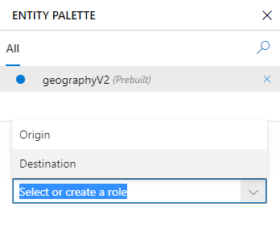

# Tutorial: Extract contextually related data from an utterance

In this tutorial, find related pieces of data based on context. For example, origin and destination locations for a transfer from one city to another. Both pieces of data may be required and they are related to each other.

A role can be used with any prebuilt or custom entity type, and used in both example utterances and patterns.

**In this tutorial, you learn how to:**

> [!div class="checklist"]
> * Create new app
> * Add intent
> * Get origin and destination information using roles
> * Train
> * Publish
> * Get intents and entity roles from endpoint

[!INCLUDE [LUIS Free account](../../../includes/cognitive-services-luis-free-key-short.md)]

## Related data

This app determines where an employee is to be moved from the origin city to the destination city. It uses a GeographyV2 prebuilt entity to identify the city names and it uses roles to determine the location types (origin and destination) within the utterance.

A role should be used when the entity data to extract:

* Is related to each other in the context of the utterance.
* Uses specific word choice to indicate each role. Examples of these words include: from/to, leaving/headed to, away from/toward.
* Both roles are frequently in the same utterance, allowing LUIS to learn from this frequent contextual usage.
* Need to be grouped and processed by client app as a unit of information.

## Create a new app

1. Sign in to the [LUIS **preview** portal](https://preview.luis.ai).

1. Select **+ New app for conversation**, enter the name `HumanResources` and keep the default culture, **English**. Leave the description and prediction resource empty. Select **Done**.

## Create an intent to move employees between cities

An intent is used to classify user utterances based on the user's intention, determined from the natural language text.

In order to classify an utterance, the intent needs examples of user utterances that should be classified with this intent.

1. [!INCLUDE [Start in Build section](../../../includes/cognitive-services-luis-tutorial-build-section.md)]

1. Select **+ Create**.

1. Enter `MoveEmployeeToCity` in the pop-up dialog box then select **Done**.

    > [!div class="mx-imgBorder"]
    > 

1. Add several example utterances to this intent that you expect a user to ask.

    |Example utterances|
    |--|
    |move John W. Smith leaving Seattle headed to Orlando|
    |transfer Jill Jones from Seattle to Cairo|
    |Place John Jackson away from Tampa, coming to Atlanta |
    |move Debra Doughtery to Tulsa from Chicago|
    |mv Jill Jones leaving Cairo headed to Tampa|
    |Shift Alice Anderson to Oakland from Redmond|
    |Carl Chamerlin from San Francisco to Redmond|
    |Transfer Steve Standish from San Diego toward Bellevue |
    |lift Tanner Thompson from Kansas city and shift to Chicago|

    > [!div class="mx-imgBorder"]
    > 

## Add prebuilt entity geographyV2

The prebuilt entity, **geographyV2**, extracts location information, including city names. Since the utterances have two city names, relating to each other in context, use roles to extract that context.

1. Select **Entities** from the left-side navigation.

1. Select **+ Add prebuilt entity**, then enter `geo` in the search bar to filter the prebuilt entities.

    > [!div class="mx-imgBorder"]
    > 

1. Select the checkbox and select **Done**.

## Add roles to prebuilt entity

1. In the **Entities** list, select the **geographyV2** to open the new entity.
1. To add a role, select **+** and add the following two roles: `Origin`, and `Destination`.

    > [!div class="mx-imgBorder"]
    > 

## Label entity roles in example utterances

1. Select **Intents** from the left-side navigation, then select the **MoveEmployeeToCity** intent. Notice the city names are labeled with the prebuilt entity **geographyV2**.
1. In the context toolbar, select the **Entity palette** with the _pencil icon_.

    > [!div class="mx-imgBorder"]
    > 

1. Select the prebuilt entity, **geographyV2**, then select the **Entity inspector**.
1. In the **Entity inspector**, select one role, **Destination**. This changes the mouse cursor. Use the cursor to label the text in all the utterances that is the destination location.

    > [!div class="mx-imgBorder"]
    > 


1. Return to the **Entity inspector**, change to the role to **Origin**. Use the cursor to label the text in all the utterances that is the origin location.

## Add example utterances to the None intent

[!INCLUDE [Follow these steps to add the None intent to the app](../../../includes/cognitive-services-luis-create-the-none-intent.md)]

## Train the app so the changes to the intent can be tested

To train the app, select **Train**. Training applies the changes, such as the new entities and the labeled utterances, to the active model.

## Publish the app to access it from the HTTP endpoint

[!INCLUDE [LUIS How to Publish steps](includes/howto-publish.md)]


## Get intent and entity prediction from endpoint

1. [!INCLUDE [LUIS How to get endpoint first step](includes/howto-get-endpoint.md)]


1. Go to the end of the URL in the address bar and replace _YOUR_QUERY_HERE_ with `Please move Carl Chamerlin from Tampa to Portland`.

This utterance is not the same as any of the labeled utterances so it is a good test and should return the `MoveEmployee` intent with the entity extracted.

    ```json
    {
      "query": "Please move Carl Chamerlin from Tampa to Portland",
      "topScoringIntent": {
        "intent": "MoveEmployeeToCity",
        "score": 0.9706451
      },
      "intents": [
        {
          "intent": "MoveEmployeeToCity",
          "score": 0.9706451
        },
        {
          "intent": "None",
          "score": 0.0307451729
        }
      ],
      "entities": [
        {
          "entity": "tampa",
          "type": "builtin.geographyV2.city",
          "startIndex": 32,
          "endIndex": 36,
          "role": "Origin"
        },
        {
          "entity": "portland",
          "type": "builtin.geographyV2.city",
          "startIndex": 41,
          "endIndex": 48,
          "role": "Destination"
        }
      ]
    }
    ```

    The correct intent is predicted and the entities array has both the origin and destination roles in the corresponding **entities** property.

[!INCLUDE [LUIS How to clean up resources](includes/quickstart-tutorial-cleanup-resources.md)]

## Related information

* [Entities concepts](luis-concept-entity-types.md)
* [Roles concepts](luis-concept-roles.md)
* [Prebuilt entities list](luis-reference-prebuilt-entities.md)
* [How to train](luis-how-to-train.md)
* [How to publish](luis-how-to-publish-app.md)
* [How to test in LUIS portal](luis-interactive-test.md)
* [Roles](luis-concept-roles.md)

## Next steps

This tutorial created a new intent and added example utterances for the contextually learned data of origin and destination locations. Once the app is trained and published, a client-application can use that information to create a move ticket with the relevant information.

> [!div class="nextstepaction"]
> [Learn how to add a composite entity](luis-tutorial-composite-entity.md)
