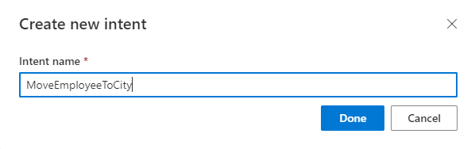
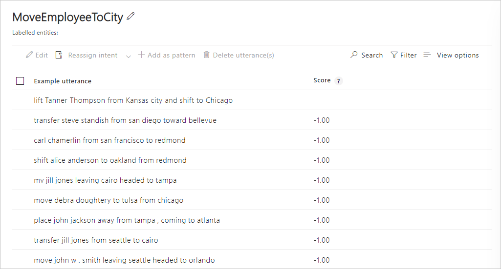
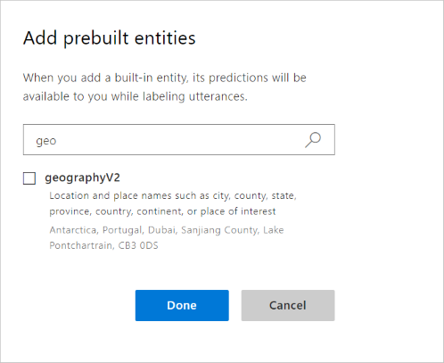
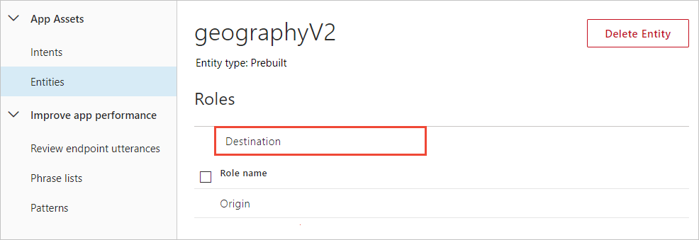

# Tutorial: Extract contextually related data from an utterance

In this tutorial, find related pieces of data based on context. For example, an origin and destination locations for a transfer from one city to another. Both pieces of data may be required and they are related to each other.  

A role can be used with any prebuilt or custom entity type, and used in both example utterances and patterns. 

**In this tutorial, you learn how to:**

> [!div class="checklist"]
> * Create new app
> * Add intent 
> * Get origin and destination information using roles
> * Train
> * Publish
> * Get intents and entity roles from endpoint

[!INCLUDE [LUIS Free account](../../../includes/cognitive-services-luis-free-key-short.md)]

## Related data

This app determines where an employee is to be moved from the origin city to the destination city. It uses a GeographyV2 prebuilt entity to identify the city names and it uses roles to determine the location types (origin and destination) within the utterance.

A role should be used when the entity data to extract:

* Is related to each other in the context of the utterance.
* Uses specific word choice to indicate each role. Examples of these words include: from/to, leaving/headed to, away from/toward.
* Both roles are frequently in the same utterance, allowing LUIS to learn from this frequent contextual usage.
* Need to be grouped and processed by client app as a unit of information.

## Create a new app

[!INCLUDE [Follow these steps to create a new LUIS app](../../../includes/cognitive-services-luis-create-new-app-steps.md)]

## Create an intent to move employees between cities

1. [!INCLUDE [Start in Build section](../../../includes/cognitive-services-luis-tutorial-build-section.md)]

1. Select **Create new intent**. 

1. Enter `MoveEmployeeToCity` in the pop-up dialog box then select **Done**. 

    

1. Add example utterances to the intent.

    |Example utterances|
    |--|
    |move John W. Smith leaving Seattle headed to Orlando|
    |transfer Jill Jones from Seattle to Cairo|
    |Place John Jackson away from Tampa, coming to Atlanta |
    |move Debra Doughtery to Tulsa from Chicago|
    |mv Jill Jones leaving Cairo headed to Tampa|
    |Shift Alice Anderson to Oakland from Redmond|
    |Carl Chamerlin from San Francisco to Redmond|
    |Transfer Steve Standish from San Diego toward Bellevue |
    |lift Tanner Thompson from Kansas city and shift to Chicago|

    [](./media/tutorial-entity-roles/hr-enter-utterances.png#lightbox)

## Add prebuilt entity geographyV2

The prebuilt entity, geographyV2, extracts location information, including city names. Since the utterances have two city names, relating to each other in context, use roles to extract that context.

1. Select **Entities** from the left-side navigation.

1. Select **Add prebuilt entity**, then select `geo` in the search bar to filter the prebuilt entities. 

    
1. Select the checkbox and select **Done**.
1. In the **Entities** list, select the **geographyV2** to open the new entity. 
1. Add two roles, `Origin`, and `Destination`. 

    
1. Select **Intents** from the left-side navigation, then select the **MoveEmployeeToCity** intent. Notice the city names are labeled with the prebuilt entity **geogrpahyV2**.
1. In the first utterance of the list, select the origin location. A drop-down menu appears. Select **geographyV2** in the list, then follow the menu across to select **Origin**.
1. Use the method from the previous step to mark all roles of locations in all the utterances. 


## Add example utterances to the None intent 

[!INCLUDE [Follow these steps to add the None intent to the app](../../../includes/cognitive-services-luis-create-the-none-intent.md)]

## Train the app so the changes to the intent can be tested 

[!INCLUDE [LUIS How to Train steps](../../../includes/cognitive-services-luis-tutorial-how-to-train.md)]

## Publish the app so the trained model is queryable from the endpoint

[!INCLUDE [LUIS How to Publish steps](../../../includes/cognitive-services-luis-tutorial-how-to-publish.md)]

## Get intent and entity prediction from endpoint

1. [!INCLUDE [LUIS How to get endpoint first step](../../../includes/cognitive-services-luis-tutorial-how-to-get-endpoint.md)]


1. Go to the end of the URL in the address bar and enter `Please move Carl Chamerlin from Tampa to Portland`. The last querystring parameter is `q`, the utterance **query**. This utterance is not the same as any of the labeled utterances so it is a good test and should return the `MoveEmployee` intent with the entity extracted.

    ```json
    {
      "query": "Please move Carl Chamerlin from Tampa to Portland",
      "topScoringIntent": {
        "intent": "MoveEmployeeToCity",
        "score": 0.979823351
      },
      "intents": [
        {
          "intent": "MoveEmployeeToCity",
          "score": 0.979823351
        },
        {
          "intent": "None",
          "score": 0.0156363435
        }
      ],
      "entities": [
        {
          "entity": "geographyV2",
          "role": "Destination",
          "startIndex": 41,
          "endIndex": 48,
          "score": 0.6044041
        },
        {
          "entity": "geographyV2",
          "role": "Origin",
          "startIndex": 32,
          "endIndex": 36,
          "score": 0.739491045
        }
      ]
    }
    ```
    
    The correct intent is predicted and the entities array has both the origin and destination roles in the corresponding **entities** property.
    
## Clean up resources

[!INCLUDE [LUIS How to clean up resources](../../../includes/cognitive-services-luis-tutorial-how-to-clean-up-resources.md)]

## Related information

* [Entities concepts](luis-concept-entity-types.md)
* [Roles concepts](luis-concept-roles.md)
* [Prebuilt entities list](luis-reference-prebuilt-entities.md)
* [How to train](luis-how-to-train.md)
* [How to publish](luis-how-to-publish-app.md)
* [How to test in LUIS portal](luis-interactive-test.md)
* [Roles](luis-concept-roles.md)

## Next steps

This tutorial created a new intent and added example utterances for the contextually learned data of origin and destination locations. Once the app is trained and published, a client-application can use that information to create a move ticket with the relevant information.

> [!div class="nextstepaction"] 
> [Learn how to add a composite entity](luis-tutorial-composite-entity.md) 
