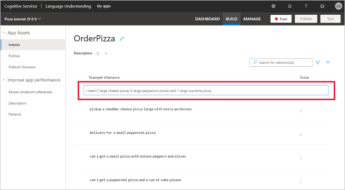

# Tutorial: Build a LUIS app to determine user intentions

In this tutorial, you create a custom app that predicts a user's intention based on the utterance (text).

**In this tutorial, you learn how to:**

> [!div class="checklist"]
> * Create a new app
> * Create intents
> * Add example utterances
> * Train app
> * Publish app
> * Get intent prediction from endpoint

## User intentions as intents

The purpose of the app is to determine the intention of conversational, natural language text:

`I'd like to order a veggie pizza with a salad on the side.`

These intentions are categorized into **Intents**.

|Intent|Purpose|
|--|--|
|`ModifyOrder`|Determine user's pizza order.|
|`Greeting`|Begin bot conversation.|
|`ConfirmOrder`|Confirm pizza order.|
|`None`|Determine if user is asking something the app is not supposed to answer. This intent if provided as part of app creation and can't be deleted. |

## Create a new app

[!INCLUDE [Follow these steps to create a new LUIS app](includes/create-pizza-app.md)]

## Create a new intent

1. In the portal, inside the app's **Build** section, select **+ Create**. Enter the new intent name, `OrderPizza`, then select **Done**.

    The `OrderPizza` intent is predicted when: a user wants to order a pizza.

1. Add several example utterances to this intent that you expect a user to ask:

    |`OrderPizza` example utterances|
    |--|
    |`can i get a pepperoni pizza and a can of coke please`|
    |`can i get a small pizza with onions peppers and olives`|
    |`delivery for a small pepperoni pizza`|
    |`pickup a cheddar cheese pizza large with extra anchovies`|
    |`i need 2 large cheese pizzas 6 large pepperoni pizzas and 1 large supreme pizza`|
    |`Order a pizza for me`|

    

    By providing _example utterances_, you are training LUIS about what kinds of utterances should be predicted for this intent.

    [!INCLUDE [Do not use too few utterances](includes/do-not-use-too-few-utterances.md)]

## Create remaining intents

1. Create the `Greeting` intent and add the following example utterances. This is the intent to determine if a user is beginning a new pizza order conversation.

    |`Greeting` example utterances|
    |--|
    |`Hi`|
    |`Hello`|
    |`Hey`|
    |`Start`|
    |`Begin`|

1. Create the `Confirm` intent and add the following example utterances. This is the intent to determine if a user is done ordering and accepts the order details.

    |`Confirm` example utterances|
    |--|
    |`Go ahead`|
    |`ok`|
    |`Yes`|
    |`Sure`|


## None intent example utterances

[!INCLUDE [Follow these steps to add the None intent to the app](includes/add-example-utterances-none-intent.md)]

## Train the app

[!INCLUDE [LUIS How to Train steps](includes/howto-train.md)]

## Publish the app

[!INCLUDE [LUIS How to Publish steps](includes/howto-publish.md)]

## Get intent prediction

1. [!INCLUDE [LUIS How to get endpoint first step](includes/howto-get-endpoint.md)]

1. Go to the end of the URL in the address bar and enter:

    `get a medium vegetarian pizza for delivery`

    This is not exactly the same as an example utterance so it is a good test to see if LUIS can learn what should be predicted with this intent.

    The last query string parameter is `query`, the utterance **query**. This utterance is not the same as any of the example utterances. It is a good test and should return the `OrderPizza` intent as the top scoring intent.

    ```JSON
    {
        "query": "get a medium vegetarian pizza for delivery",
        "prediction": {
            "topIntent": "OrderPizza",
            "intents": {
                "OrderPizza": {
                    "score": 0.6488959
                },
                "None": {
                    "score": 0.139966831
                },
                "Confirm": {
                    "score": 0.00736504374
                },
                "Greeting": {
                    "score": 0.003970454
                }
            },
            "entities": {}
        }
    }
    ```

    The entities array is empty because this app currently does not have any entities (unit of data inside the utterance to extract).

    The JSON result identifies the top scoring intent as **`prediction.topIntent`** property. All scores are between 1 and 0, with the better score being closer to 1.

1. Change the URL **query** parameter to target the **Greeting** intent:

    `Howdy`

    This is not exactly the same as an example utterance so it is a good test to see if LUIS can learn what should be predicted with this intent.

    ```json
    {
        "query": "howdy",
        "prediction": {
            "topIntent": "Greeting",
            "intents": {
                "Greeting": {
                    "score": 0.446016937
                },
                "Confirm": {
                    "score": 0.2390079
                },
                "None": {
                    "score": 0.09119555
                },
                "OrderPizza": {
                    "score": 0.00109590159
                }
            },
            "entities": {}
        }
    }
    ```

    This prediction has a 44% confidence score. To increase the confidence score, add between 15 and 30 example utterances.

## Client-application next steps

After LUIS returns the JSON response, LUIS is done with this request. LUIS doesn't provide answers to user utterances, it only identifies what type of information is being asked for in natural language. The conversational follow-up is provided by the client application such as an Azure Bot.


[!INCLUDE [LUIS How to clean up resources](includes/quickstart-tutorial-cleanup-resources.md)]

## Related information

* [Types of entities](luis-concept-entity-types.md)
* [How to train](luis-how-to-train.md)
* [How to publish](luis-how-to-publish-app.md)
* [How to test in LUIS portal](luis-interactive-test.md)
* [Azure Bot](https://docs.microsoft.com/azure/bot-service/?view=azure-bot-service-4.0)


## Next steps

This tutorial created a LUIS app, created intents, added example utterances to each intent, added example utterances to the None intent, trained, published, and tested at the endpoint. These are the basic steps of building a LUIS model.

> [!div class="nextstepaction"]
> [Add a decomposable entity to this app](tutorial-machine-learned-entity.md)
