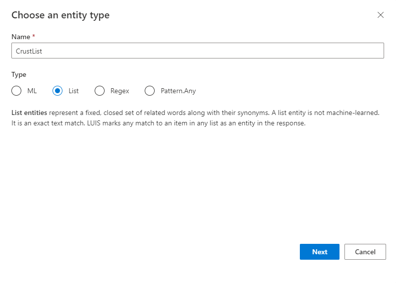
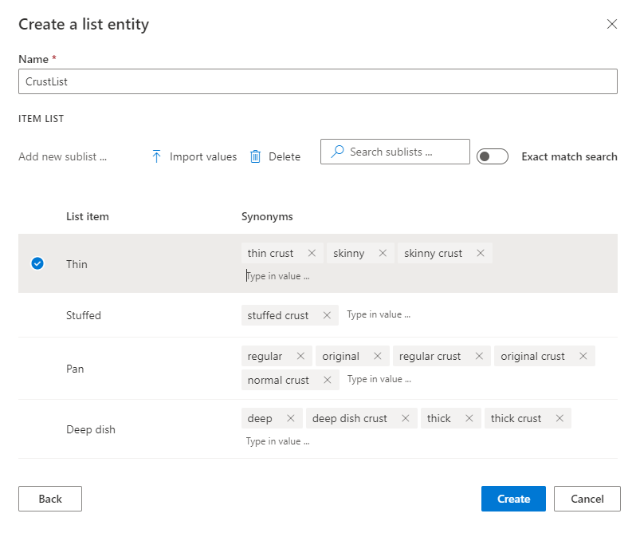

# Tutorial: Get exact text-matched data from an utterance with list entity

In this tutorial, understand how to get data that exactly matches a predefined list of items.

**In this tutorial, you learn how to:**

<!-- green checkmark -->
> [!div class="checklist"]
> * Import app and use existing intent
> * Add list entity
> * Train, publish, and query app to get extracted data

[!INCLUDE [LUIS Free account](../../../includes/cognitive-services-luis-free-key-short.md)]

## What is a list entity?

A list entity is an exact text match to the words in the utterance. Each item on the list can include a list of synonyms. Use a list entity when you want an exact match.

For this imported pizza application, create a list entity for the different types of pizza crust.

A list entity is a good choice for this type of data when:

* The data values are a known set.
* The set doesn't exceed the maximum LUIS [boundaries](luis-boundaries.md) for this entity type.
* The text in the utterance is a case-insensitive match with a synonym or the canonical name. LUIS doesn't use the list beyond the match. Stemming, plurals, and other variations are not resolved with just a list entity. To manage variations, consider using a [pattern](reference-pattern-syntax.md#syntax-to-mark-optional-text-in-a-template-utterance) with the optional text syntax.

> [!CAUTION]
> If you are not sure if you want a list entity or a machine-learned entity with a phrase list as a descriptor, the best and most flexible practice is to use a machine-learned entity with a phrase list as a descriptor. This method allows LUIS to learn and extend the values of the data to extract.

## Import example .json and add utterances

1.  Download and save the [app JSON file](https://raw.githubusercontent.com/Azure-Samples/cognitive-services-language-understanding/master/documentation-samples/tutorials/machine-learned-entity/pizza-tutorial-with-entities.json).

    [!INCLUDE [Import app steps](includes/import-app-steps.md)]

1. The imported app has an `OrderPizza` intent. Select that intent, and add a few utterances with new crust types:

    |New utterances|
    |--|--|
    |please order a pan crust small pepperoni pizza|
    |3 thin crust hawaiian pizzas|
    |deliver 2 stuffed crust pizzas with bread sticks|
    |one thick crust pizza for pickup|
    |one deep dish pepperoni pizza|

## Crust list entity

Now that the **OrderPizza** intent has example utterances with crust types, LUIS needs to understand which words represent the crust types.

Examples of the primary name and synonyms are:

|Canonical name|Synonyms|
|--|--|
|Deep dish|deep<br>deep dish crust<br>thick<br>thick crust|
|Pan|regular<br>original<br>normal<br>regular crust<br>original crust<br>normal crust|
|Stuffed|stuffed crust|
|Thin|thin crust<br>skinny<br>skinny crust|

1. Select **Entities** in the left panel.

1. Select **+ Create**.

1. In the entity pop-up dialog, enter `CrustList` for the entity name, and  **List** for entity type. Select **Next**.

    > [!div class="mx-imgBorder"]
    > 

1. On the **Create a list entity** page, enter the canonical names and synonyms for each canonical name then select **Create**.

    > [!div class="mx-imgBorder"]
    > 

    When you add a list entity to a LUIS app, you don't need to [label](label-entity-example-utterance.md) the text with the list entity. It is applied to all utterances in all intents.

## Train the app before testing or publishing

[!INCLUDE [LUIS How to Train steps](includes/howto-train.md)]

## Publish the app to query from the endpoint

[!INCLUDE [LUIS How to Publish steps](includes/howto-publish.md)]

## Get intent and entity prediction from endpoint

1. [!INCLUDE [LUIS How to get endpoint first step](includes/howto-get-endpoint.md)]

2. Go to the end of the URL in the address and enter the following utterance:

    `Deliver 2 deep dish hawaiian pizzas and a thin pepperoni`

    The last querystring parameter is `query`, the utterance **query**.


    ```json
    {
        "query": "Deliver 2 deep dish hawaiian pizzas and a thin pepperoni",
        "prediction": {
            "topIntent": "OrderPizza",
            "intents": {
                "OrderPizza": {
                    "score": 0.9957229
                },
                "None": {
                    "score": 0.016832687
                },
                "Confirm": {
                    "score": 0.0015708931
                },
                "Greeting": {
                    "score": 0.00057060417
                }
            },
            "entities": {
                "number": [
                    2
                ],
                "CrustList": [
                    [
                        "Deep dish"
                    ],
                    [
                        "Thin"
                    ]
                ],
                "$instance": {
                    "number": [
                        {
                            "type": "builtin.number",
                            "text": "2",
                            "startIndex": 8,
                            "length": 1,
                            "modelTypeId": 2,
                            "modelType": "Prebuilt Entity Extractor",
                            "recognitionSources": [
                                "model"
                            ]
                        }
                    ],
                    "CrustList": [
                        {
                            "type": "CrustList",
                            "text": "deep dish",
                            "startIndex": 10,
                            "length": 9,
                            "modelTypeId": 5,
                            "modelType": "List Entity Extractor",
                            "recognitionSources": [
                                "model"
                            ]
                        },
                        {
                            "type": "CrustList",
                            "text": "thin",
                            "startIndex": 42,
                            "length": 4,
                            "modelTypeId": 5,
                            "modelType": "List Entity Extractor",
                            "recognitionSources": [
                                "model"
                            ]
                        }
                    ]
                }
            }
        }
    }
    ```

    The types of crust were found as exact text matches and returned in the JSON response. This information is used by the client application to process the order.

[!INCLUDE [LUIS How to clean up resources](includes/quickstart-tutorial-cleanup-resources.md)]

## Related information

* [List entity](luis-concept-entity-types.md#list-entity) conceptual information
* [How to train](luis-how-to-train.md)
* [How to publish](luis-how-to-publish-app.md)
* [How to test in LUIS portal](luis-interactive-test.md)
* [Concept - entities](luis-concept-entity-types.md)
* [JSON reference of regular expression entity](reference-entity-regular-expression.md?tabs=V3)
* [How to add entities to extract data](luis-how-to-add-entities.md)

## Next steps
This tutorial added example utterances, then created a list entity to extract exact text matches from the utterances. After training, and publishing the app, a query to the endpoint identified the intention and returned the extracted data.

> [!div class="nextstepaction"]
> [Add prebuilt entity with a role](tutorial-entity-roles.md)

