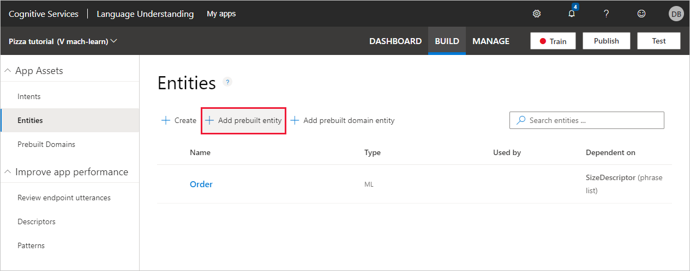
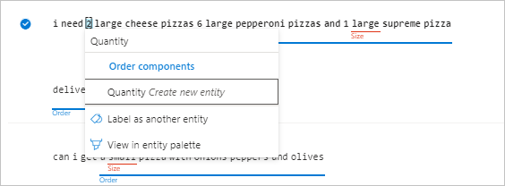

# Tutorial: Extract names with machine-learned entities

In this tutorial, extract machine-learned data from an utterance using the machine-learned entity. The machine-learned entity supports the [model decomposition concept](luis-concept-model.md#v3-authoring-model-decomposition) by providing subcomponent entities with their descriptors and constraints. 

[!INCLUDE [Uses preview portal](includes/uses-portal-preview.md)]

**In this tutorial, you learn how to:**

<!-- green checkmark -->
> [!div class="checklist"]
> * Import example app
> * Add machine-learned entity 
> * Add subcomponent
> * Add subcomponent's descriptor
> * Add subcomponent's constraint
> * Train app
> * Publish app
> * Get entity prediction from endpoint

[!INCLUDE [LUIS Free account](includes/quickstart-tutorial-use-free-starter-key.md)]


## Machine-learned entity

This tutorial adds a machine-learned entity to extract data from an utterance. The purpose of the entity is to teach LUIS what the entity is and where it can be found in an utterance. The part of the utterance that is the machine-learned entity can change from utterance to utterance based on word choice and utterance length. LUIS needs examples of the entity.  

This machine-learned entity is the beginning and top-level for data extraction. The decomposability of the machine-learned entity allows LUIS to find and label the specific words inside the utterance's text for each part of the entity. 

While you may not know how detailed you want your entity when you begin your app, a best-practice is to start with a machine-learned entity, then add subcomponents are your app matures.

## Import example app

1.  Download and save the [app JSON file](https://github.com/Azure-Samples/cognitive-services-language-understanding/blob/master/documentation-samples/tutorials/machine-learned-entity/pizza-intents-only.json).

1. In the [preview LUIS portal](https://preview.luis.ai), on the **My apps** page, select **Import**, then **Import as JSON**. Find the saved JSON file from the previous step. You don't need to change the name of the app. Select **Done**

1. From the **Manage** section, on the **Versions** tab, select the version, then select **Clone** to clone the version, and name it `mach-learn`. Then select **Done** to finish the clone process.

    Cloning is a best-practice before you modify your app. Because the version name is used as part of the URL route, the name can't contain any characters that are not valid in a URL.

## Mark entities in example utterances

To extract information about a Pizza order, mark the details in the example utterances. To extract details about a pizza order, create a top level, machine-learned `Order` entity. This should include all words that are important to get the order correct and only those words.

1. [!INCLUDE [Start in Build section](includes/tutorial-start-in-build-section.md)]

1. On the **Intents** page, select **OrderPizza** intent. 

1. In the example utterances list, select the following utterance. 

    |Order example utterance|
    |--|
    |`pickup a cheddar cheese pizza large with extra anchovies`|

    Begin just before the left-most text of `pickup` (#1), select it (this begins the marking process), then go just beyond the right-most text, `anchovies` (#2 - this ends the marking process).

    An entity won't always be the entire utterance. In this specific case, `pickup` indicates how the order is to be received so it should be part of the marked entity for the order.


    FIX THIS IMAGE


    

1. In the pop-up box, enter the name of the entity as `Order` (#1). Then select that name from the list (#2).

    FIX THIS IMAGE

    

1. In the **Choose an entity type** box, select **Add Structure** (#1) then select **Next** (#2).

    

1. In the **Create a machine learned entity** box, in the **Structure** box, add `Size`. For the **Size** component, add a **descriptor** named `SizeDescriptor`, then select **Create new phrase list**.

    

1. In the **Create new phrase list descriptor** box, enter values of: `small`, `medium`, and `large`. When the **Suggestions** box fills in, select `extra-large`, and `x-large`. Select `xl` when it appears in the **Suggestions** box. Select **Done** to create the new phrase list as a descriptor to the Size subcomponent.  

    

1. In the **Create a machine learned entity**, select **Create** to finish the machine-learned entity.

1. When the Intent details page appears, the example utterance has a solid line under the marked text. This indicates the marked text agrees with the prediction. Because you explicitly marked it and labeled it, they will match. This visual indicator is valuable, not on the first utterance marked, but on the remaining utterances. 

    FIX THIS IMAGE

    

1. In the example utterance, mark and select the **Size** subcomponent. Again the line is solid under the text because both the marking and prediction match because you explicitly marked the text.

1. Mark the `Order` entity in the remaining utterances. The square brackets in the text indicate the marked entity.

    |Order example utterances|
    |--|
    |`can i get [a pepperoni pizza and a can of coke] please`|
    |`can i get [a small pizza with onions peppers and olives]`|
    |`[delivery for a small pepperoni pizza]`|
    |`i need [2 large cheese pizzas 6 large pepperoni pizzas and 1 large supreme pizza]`|

    The `a` is part of the order because it implies a quantity of 1.

1. Mark the words indicating size such as `large` and `small` with the Size entity. 

    FIX THIS IMAGE

    

1. Train the app, select **Train**. 

1. After training, add a new example utterance to understand how well LUIS understands the new machine-learned entity. 

    |Order example utterance|
    |--|
    |`pickup XL meat lovers pizza`|

    The overall top entity, `Order` is marked and the `Size` subcomponent is also marked with dotted lines.  

    

    The dotted link indicates the prediction. 

1. In order to accept the prediction, select the row, then select **Confirm entity predictions**.

    

## Add prebuilt number to app

The order information should also include how many of an item in the order. To extract this data, add a subcomponent to the order entity named `Quantity`. Add a constraint to the `Quantity` entity to make sure only numbers are returned. This constraint uses a prebuilt (pretrained) entity named **Number** to extract this information. If the number is spelled out as `two` or uses a digit `2`, the client application will receive the data extracted as digits. 

Begin by adding the prebuilt number to the app. 

1. Select **Entities** from the left menu, then select **+ Create**. 

    

1. In the **Add prebuilt entities** box, search for and select **Number** then select **Done**. 

    

    The prebuilt entity is added to the app but isn't a constraint for the `Quantity` subcomponent yet. 

## Add constraint to entity

Constrain the `Quantity` subcomponent to a number with this procedure.

1. In the following utterance, select the text in the square brackets to create a `Quantity` machine-learned subcomponent.  

    |Order example utterance|
    |--|
    |`i need [2] large cheese pizzas 6 large pepperoni pizzas and 1 large supreme pizza`|

1. In the pop-up box, enter the name of `Quantity` and create the entity. 

    

1. To set the constraint for the `Quantity` entity, select the **Entities** section from the left-menu, then select the `Order` entity.

1. In the **Structure** box, select the `Quantity` component, then select the pencil icon to add a new constraint. In the box, select **Add prebuilt...**. 


## Publish the app so the trained model is queryable from the endpoint

[!INCLUDE [LUIS How to Publish steps](../../../includes/cognitive-services-luis-tutorial-how-to-publish.md)]

## Get intent and entity prediction from endpoint 

1. [!INCLUDE [LUIS How to get endpoint first step](../../../includes/cognitive-services-luis-tutorial-how-to-get-endpoint.md)]

2. Go to the end of the URL in the address and enter `Here is my c.v. for the engineering job`. The last querystring parameter is `q`, the utterance **query**. This utterance is not the same as any of the labeled utterances so it is a good test and should return the `ApplyForJob` utterances.

    ```json
    {
      "query": "Here is my c.v. for the engineering job",
      "topScoringIntent": {
        "intent": "ApplyForJob",
        "score": 0.98052007
      },
      "intents": [
        {
          "intent": "ApplyForJob",
          "score": 0.98052007
        },
        {
          "intent": "GetJobInformation",
          "score": 0.03424581
        },
        {
          "intent": "None",
          "score": 0.0015820954
        }
      ],
      "entities": [
        {
          "entity": "engineering",
          "type": "Job",
          "startIndex": 24,
          "endIndex": 34,
          "score": 0.668959737
        }
      ]
    }
    ```
    
    LUIS found the correct intent, **ApplyForJob**, and extracted the correct entity, **Job**, with a value of `engineering`.


## Names are tricky
The LUIS app found the correct intent with high confidence and it extracted the job name, but names are tricky. Try the utterance `This is the lead welder paperwork`.  

In the following JSON, LUIS responds with the correct intent, `ApplyForJob`, but didn't extract the `lead welder` job name. 

```json
{
  "query": "This is the lead welder paperwork",
  "topScoringIntent": {
    "intent": "ApplyForJob",
    "score": 0.860295951
  },
  "intents": [
    {
      "intent": "ApplyForJob",
      "score": 0.860295951
    },
    {
      "intent": "GetJobInformation",
      "score": 0.07265678
    },
    {
      "intent": "None",
      "score": 0.00482481951
    }
  ],
  "entities": []
}
```

Because a name can be anything, LUIS predicts entities more accurately if it has a phrase list of words to boost the signal.

## To boost signal of the job-related words, add a phrase list of job-related words

Open the [jobs-phrase-list.csv](https://github.com/Azure-Samples/cognitive-services-language-understanding/blob/master/documentation-samples/quickstarts/job-phrase-list.csv) from the Azure-Samples GitHub repository. The list is over 1,000 job words and phrases. Look through the list for job words that are meaningful to you. If your words or phrases are not on the list, add your own.

1. In the **Build** section of the LUIS app, select **Phrase lists** found under the **Improve app performance** menu.

1. Select **Create new phrase list**. 

1. Name the new phrase list `JobNames` and copy the list from jobs-phrase-list.csv into the **Values** text box.

    [](media/luis-quickstart-primary-and-secondary-data/hr-create-phrase-list-1.png#lightbox)

    If you want more words added to the phrase list, select **Recommand** then review the new **Related Values** and add any that are relevant. 

    Make sure to keep the **These values are interchangeable** checked because these values should all be treated as synonyms for jobs. Learn more about interchangeable and noninterchangeable [phrase list concepts](luis-concept-feature.md#how-to-use-phrase-lists).

1. Select **Done** to activate the phrase list.

    [](media/luis-quickstart-primary-and-secondary-data/hr-create-phrase-list-2.png#lightbox)

1. Train and publish the app again to use phrase list.

1. Requery at the endpoint with the same utterance: `This is the lead welder paperwork.`

    The JSON response includes the extracted entity:

    ```json
      {
      "query": "This is the lead welder paperwork.",
      "topScoringIntent": {
        "intent": "ApplyForJob",
        "score": 0.983076453
      },
      "intents": [
        {
          "intent": "ApplyForJob",
          "score": 0.983076453
        },
        {
          "intent": "GetJobInformation",
          "score": 0.0120766377
        },
        {
          "intent": "None",
          "score": 0.00248388131
        }
      ],
      "entities": [
        {
          "entity": "lead welder",
          "type": "Job",
          "startIndex": 12,
          "endIndex": 22,
          "score": 0.8373154
        }
      ]
    }
    ```

## Clean up resources

[!INCLUDE [LUIS How to clean up resources](../../../includes/cognitive-services-luis-tutorial-how-to-clean-up-resources.md)]

## Related information

* [Intents without entities tutorial](luis-quickstart-intents-only.md)
* [Simple entity](luis-concept-entity-types.md) conceptual information
* [Phrase list](luis-concept-feature.md) conceptual information
* [How to train](luis-how-to-train.md)
* [How to publish](luis-how-to-publish-app.md)
* [How to test in LUIS portal](luis-interactive-test.md)


## Next steps

In this tutorial, the Human Resources app uses a machine-learned simple entity to find job names in utterances. Because job names can be such a wide variety of words or phrases, the app needed a phrase list to boost the job name words. 

> [!div class="nextstepaction"]
> [Add a prebuilt keyphrase entity](luis-quickstart-intent-and-key-phrase.md)
