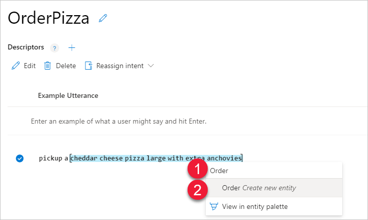
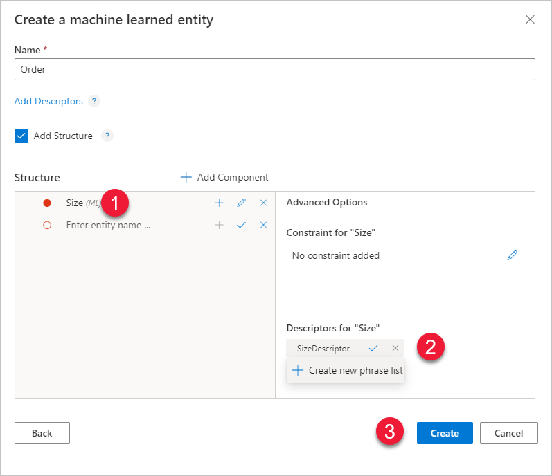
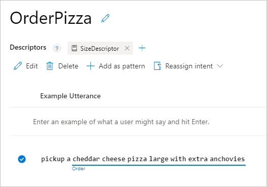

# Tutorial: Extract names with machine-learned entities

In this tutorial, extract machine-learned data from an utterance using the machine-learned entity. The machine-learned entity supports the [model decomposition concept](luis-concept-model.md#v3-authoring-model-decomposition) by providing subcomponent entities with their descriptors and constraints. 

[!INCLUDE [Uses preview portal](includes/uses-portal-preview.md)]

**In this tutorial, you learn how to:**

<!-- green checkmark -->
> [!div class="checklist"]
> * Import example app
> * Add machine-learned entity 
> * Add subcomponent
> * Add subcomponent's descriptor
> * Add subcomponent's constraint
> * Train app
> * Publish app
> * Get entity prediction from endpoint

[!INCLUDE [LUIS Free account](includes/quickstart-tutorial-use-free-starter-key.md)]


## Machine-learned entity

This tutorial adds a machine-learned entity to extract data from an utterance. The purpose of the entity is to teach LUIS what the entity is and where it can be found in an utterance. The part of the utterance that is the machine-learned entity can change from utterance to utterance based on word choice and utterance length. LUIS needs examples of the entity.  

This machine-learned entity is the beginning and top-level for data extraction. The decomposability of the machine-learned entity allows LUIS to find and label the specific words inside the utterance's text for each part of the entity. 

While you may not know how detailed you want your entity when you begin your app, a best-practice is to start with a machine-learned entity, then add subcomponents are your app matures.

## Import example app

1.  Download and save the [app JSON file](https://github.com/Azure-Samples/cognitive-services-language-understanding/blob/master/documentation-samples/tutorials/machine-learned-entity/pizza-intents-only.json).

1. In the [preview LUIS portal](https://preview.luis.ai), on the **My apps** page, select **Import**, then **Import as JSON**. Find the saved JSON file from the previous step. You don't need to change the name of the app. Select **Done**

1. From the **Manage** section, on the **Versions** tab, select the version, then select **Clone** to clone the version, and name it `mach-learn`. Then select **Done** to finish the clone process.

    Cloning is a best-practice before you modify your app. Because the version name is used as part of the URL route, the name can't contain any characters that are not valid in a URL.

## Mark entities in example utterances

To extract information about a Pizza order, mark the details in the example utterances. To extract details about a pizza order, create a top level, machine-learned `CompleteOrder` entity. This should include all words that are important to get the order correct and only those words.

1. [!INCLUDE [Start in Build section](includes/tutorial-start-in-build-section.md)]

1. On the **Intents** page, select **OrderPizza** intent. 

1. In the example utterances list, select the following utterance. Begin just before the left-most text (#1), select it (this begins the marking process), then go just beyond the right-most text (#2 - this ends the marking process).

    

1. In the pop-up box, enter the name of the entity as `Order` (#1). Then select that name from the list (#2).

    

1. In the **Choose an entity type** box, select **Add Structure** (#1) then select **Next** (#2).

    

1. In the **Create a machine learned entity** box, in the **Structure** box, add `Size`. For the **Size** component, add a **descriptor** named `SizeDescriptor`, then select **Create new phrase list**.

    

1. In the **Create new phrase list descriptor** box, enter values of: `small`, `medium`, and `large`. When the **Suggestions** box fills in, select `extra-large`, and `x-large`. Select `xl` when it appears in the **Suggestions** box. Select **Done** to create the new phrase list as a descriptor to the Size subcomponent.  

    

1. In the **Create a machine learned entity**, select **Create** to finish the machine-learned entity.

1. When the Intent details page appears, the example utterance has a solid line under the marked text. This indicates the marked text agrees with the prediction. Because you explicitly marked it and labeled it, they will match. This visual indicator is valuable, not on the first utterance marked, but on the remaining utterances. 

    

1. In the example utterance, mark and select the **Size** subcomponent. Again the line is solid under the text because both the marking and prediction match because you explicitly marked the text.

1. Train the app to understand how much LUIS knows about this entity as it is applied to the other example utterances. Select **Train**. 

1. After training, one of the other utterances is marked with a dotted line, indicating the LUIS prediction. 

    

    The overall top entity, `Order` is marked and the `Size` subcomponent is also marked with dotted lines.  

## Add more example utterances and mark entity

Simple entities need many examples in order to have a high confidence of prediction. 
 
1. Add more utterances and mark the job words or phrases as **Job** entity. 

    |Utterance|Job entity|
    |:--|:--|
    |I'm applying for the Program Manager desk in R&D|Program Manager|
    |Here is my line cook application.|line cook|
    |My resume for camp counselor is attached.|camp counselor|
    |This is my c.v. for administrative assistant.|administrative assistant|
    |I want to apply for the management job in sales.|management, sales|
    |This is my resume for the new accounting position.|accounting|
    |My application for barback is included.|barback|
    |I'm submitting my application for roofer and framer.|roofer, framer|
    |My c.v. for bus driver is here.|bus driver|
    |I'm a registered nurse. Here is my resume.|registered nurse|
    |I would like to submit my paperwork for the teaching position I saw in the paper.|teaching|
    |This is my c.v. for the stocker post in fruits and vegetables.|stocker|
    |Apply for tile work.|tile|
    |Attached resume for landscape architect.|landscape architect|
    |My curriculum vitae for professor of biology is enclosed.|professor of biology|
    |I would like to apply for the position in photography.|photography|

## Mark job entity in other intents

1. Select **Intents** from the left menu.

1. Select **GetJobInformation** from the list of intents. 

1. Label the jobs in the example utterances

    If there are more example utterances in one intent than another intent, that intent has a higher likelihood of being the highest predicted intent. 

## Train the app so the changes to the intent can be tested 

[!INCLUDE [LUIS How to Train steps](../../../includes/cognitive-services-luis-tutorial-how-to-train.md)]

## Publish the app so the trained model is queryable from the endpoint

[!INCLUDE [LUIS How to Publish steps](../../../includes/cognitive-services-luis-tutorial-how-to-publish.md)]

## Get intent and entity prediction from endpoint 

1. [!INCLUDE [LUIS How to get endpoint first step](../../../includes/cognitive-services-luis-tutorial-how-to-get-endpoint.md)]

2. Go to the end of the URL in the address and enter `Here is my c.v. for the engineering job`. The last querystring parameter is `q`, the utterance **query**. This utterance is not the same as any of the labeled utterances so it is a good test and should return the `ApplyForJob` utterances.

    ```json
    {
      "query": "Here is my c.v. for the engineering job",
      "topScoringIntent": {
        "intent": "ApplyForJob",
        "score": 0.98052007
      },
      "intents": [
        {
          "intent": "ApplyForJob",
          "score": 0.98052007
        },
        {
          "intent": "GetJobInformation",
          "score": 0.03424581
        },
        {
          "intent": "None",
          "score": 0.0015820954
        }
      ],
      "entities": [
        {
          "entity": "engineering",
          "type": "Job",
          "startIndex": 24,
          "endIndex": 34,
          "score": 0.668959737
        }
      ]
    }
    ```
    
    LUIS found the correct intent, **ApplyForJob**, and extracted the correct entity, **Job**, with a value of `engineering`.


## Names are tricky
The LUIS app found the correct intent with high confidence and it extracted the job name, but names are tricky. Try the utterance `This is the lead welder paperwork`.  

In the following JSON, LUIS responds with the correct intent, `ApplyForJob`, but didn't extract the `lead welder` job name. 

```json
{
  "query": "This is the lead welder paperwork",
  "topScoringIntent": {
    "intent": "ApplyForJob",
    "score": 0.860295951
  },
  "intents": [
    {
      "intent": "ApplyForJob",
      "score": 0.860295951
    },
    {
      "intent": "GetJobInformation",
      "score": 0.07265678
    },
    {
      "intent": "None",
      "score": 0.00482481951
    }
  ],
  "entities": []
}
```

Because a name can be anything, LUIS predicts entities more accurately if it has a phrase list of words to boost the signal.

## To boost signal of the job-related words, add a phrase list of job-related words

Open the [jobs-phrase-list.csv](https://github.com/Azure-Samples/cognitive-services-language-understanding/blob/master/documentation-samples/quickstarts/job-phrase-list.csv) from the Azure-Samples GitHub repository. The list is over 1,000 job words and phrases. Look through the list for job words that are meaningful to you. If your words or phrases are not on the list, add your own.

1. In the **Build** section of the LUIS app, select **Phrase lists** found under the **Improve app performance** menu.

1. Select **Create new phrase list**. 

1. Name the new phrase list `JobNames` and copy the list from jobs-phrase-list.csv into the **Values** text box.

    [](media/luis-quickstart-primary-and-secondary-data/hr-create-phrase-list-1.png#lightbox)

    If you want more words added to the phrase list, select **Recommand** then review the new **Related Values** and add any that are relevant. 

    Make sure to keep the **These values are interchangeable** checked because these values should all be treated as synonyms for jobs. Learn more about interchangeable and noninterchangeable [phrase list concepts](luis-concept-feature.md#how-to-use-phrase-lists).

1. Select **Done** to activate the phrase list.

    [](media/luis-quickstart-primary-and-secondary-data/hr-create-phrase-list-2.png#lightbox)

1. Train and publish the app again to use phrase list.

1. Requery at the endpoint with the same utterance: `This is the lead welder paperwork.`

    The JSON response includes the extracted entity:

    ```json
      {
      "query": "This is the lead welder paperwork.",
      "topScoringIntent": {
        "intent": "ApplyForJob",
        "score": 0.983076453
      },
      "intents": [
        {
          "intent": "ApplyForJob",
          "score": 0.983076453
        },
        {
          "intent": "GetJobInformation",
          "score": 0.0120766377
        },
        {
          "intent": "None",
          "score": 0.00248388131
        }
      ],
      "entities": [
        {
          "entity": "lead welder",
          "type": "Job",
          "startIndex": 12,
          "endIndex": 22,
          "score": 0.8373154
        }
      ]
    }
    ```

## Clean up resources

[!INCLUDE [LUIS How to clean up resources](../../../includes/cognitive-services-luis-tutorial-how-to-clean-up-resources.md)]

## Related information

* [Intents without entities tutorial](luis-quickstart-intents-only.md)
* [Simple entity](luis-concept-entity-types.md) conceptual information
* [Phrase list](luis-concept-feature.md) conceptual information
* [How to train](luis-how-to-train.md)
* [How to publish](luis-how-to-publish-app.md)
* [How to test in LUIS portal](luis-interactive-test.md)


## Next steps

In this tutorial, the Human Resources app uses a machine-learned simple entity to find job names in utterances. Because job names can be such a wide variety of words or phrases, the app needed a phrase list to boost the job name words. 

> [!div class="nextstepaction"]
> [Add a prebuilt keyphrase entity](luis-quickstart-intent-and-key-phrase.md)
