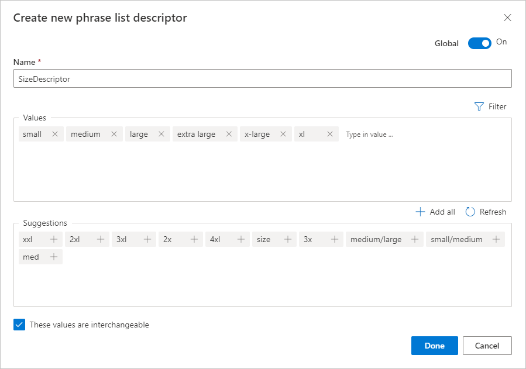
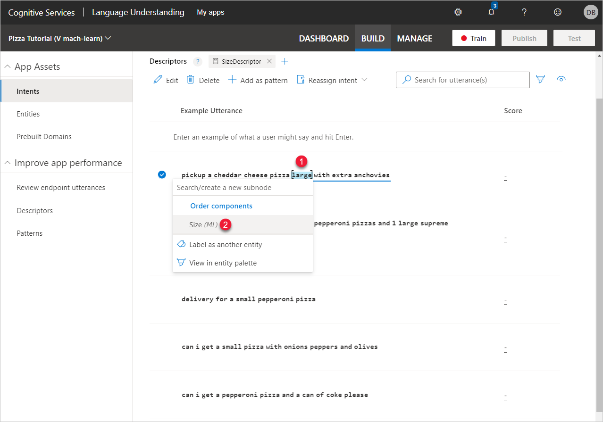
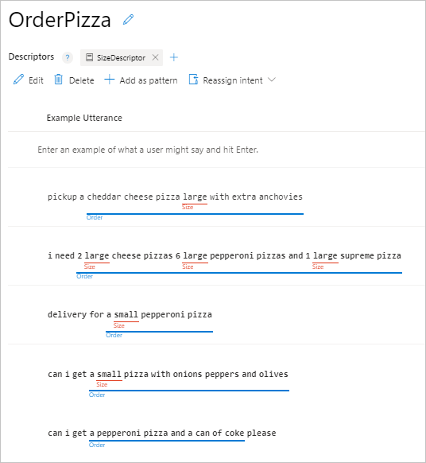
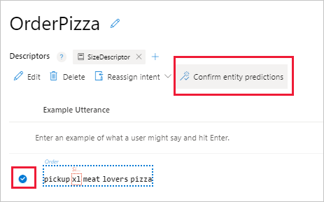
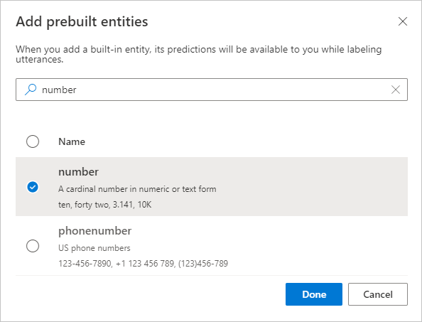
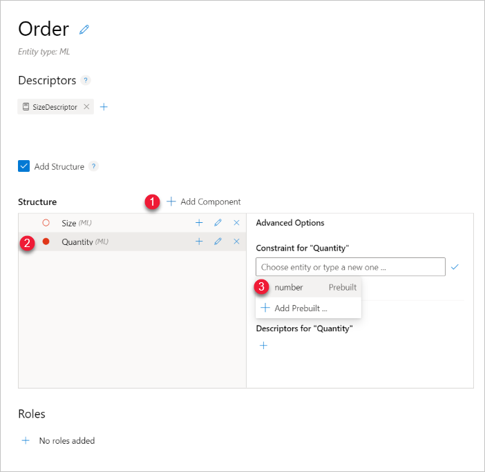
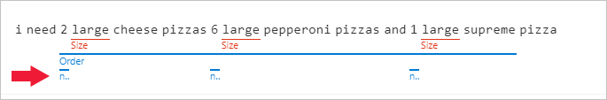
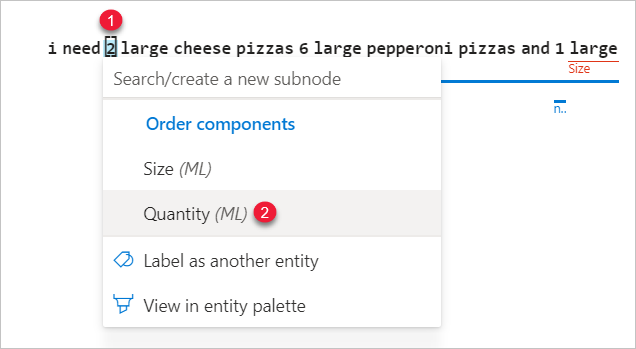
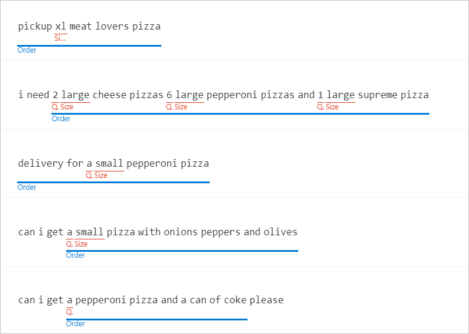
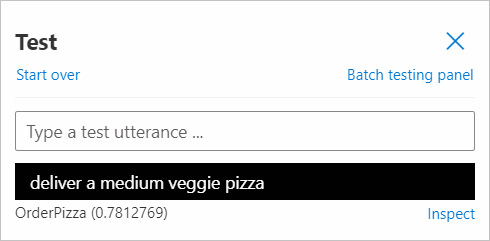

# Tutorial: Extract structured data from user utterance with machine-learned entities in Language Understanding (LUIS)

In this tutorial, extract structured data from an utterance using the machine-learned entity.

The machine-learned entity supports the [model decomposition concept](luis-concept-model.md#v3-authoring-model-decomposition) by providing subcomponent entities with their descriptors and constraints.

**In this tutorial, you learn how to:**

> [!div class="checklist"]
> * Import example app
> * Add machine-learned entity
> * Add subcomponent
> * Add subcomponent's descriptor
> * Add subcomponent's constraint
> * Train app
> * Test app
> * Publish app
> * Get entity prediction from endpoint

[!INCLUDE [LUIS Free account](includes/quickstart-tutorial-use-free-starter-key.md)]


## Why use a machine-learned entity?

This tutorial adds a machine-learned entity to extract data from an utterance.

The entity defines the data to extract from within the utterance. This includes giving the data a name, a type (if possible), any resolution of the data if there is ambiguity, and the exact text that makes up the data.

In order to define the entity, you need to create the entity then label the text representing the entity in the example utterances within all intents. These labeled examples teach LUIS what the entity is and where it can be found in an utterance.

## Entity decomposability is important

Entity decomposability is important for both intent prediction and for data extraction with the entity.

Start with a machine-learned entity, which is the beginning and top-level entity for data extraction. Then decompose the entity into the parts needed by the client application.

While you may not know how detailed you want your entity when you begin your app, a best practice is to start with a machine-learned entity, then decompose with subcomponents as your app matures.

In this, you create a machine-learned entity to represent an order for a pizza app. The order should have all the parts that are necessary to fullfil the order. To begin, the entity will extract order-related text, pulling out size, and quantity.

An utterance for `Please deliver one large cheese pizza to me` should extract `one large cheese pizza` as the order, then also extract `1` and `large`.

There is further decomposition you can add such as creating subcomponents for toppings or crust. After this tutorial, you should feel confident adding these subcomponents to your existing `Order` entity.

## Import example .json to begin app

1.  Download and save the [app JSON file](https://raw.githubusercontent.com/Azure-Samples/cognitive-services-language-understanding/master/documentation-samples/tutorials/machine-learned-entity/pizza-intents-only.json).

[!INCLUDE [Import app steps](includes/import-app-steps.md)]

## Label text as entities in example utterances

To extract details about a pizza order, create a top level, machine-learned `Order` entity.

1. On the **Intents** page, select the **OrderPizza** intent.

1. In the example utterances list, select the following utterance.

    |Order example utterance|
    |--|
    |`pickup a cheddar cheese pizza large with extra anchovies`|

    Begin selecting just before the left-most text of `pickup` (#1), then go just beyond the right-most text, `anchovies` (#2 - this ends the labeling process). A pop-up menu appears. In the pop-up box, enter the name of the entity as `Order` (#3). Then select `Order - Create new entity` from the list (#4).

    

    > [!NOTE]
    > An entity won't always be the entire utterance. In this specific case, `pickup` indicates how the order is to be received. From a conceptual perspective, `pickup` should be part of the labeled entity for the order.

1. In the **Choose an entity type** box, select **Add Structure** then select **Next**. Structure is necessary to add subcomponents such as size and quantity.

    

1. In the **Create a machine learned entity** box, in the **Structure** box, add `Size` then select Enter.
1. To add a **descriptor**, select the `+` in the **Descriptors** area, then select **Create new phrase list**.

1. In the **Create new phrase list descriptor** box, enter the name `SizeDescriptor` then enter values of: `small`, `medium`, and `large`. When the **Suggestions** box fills in, select `extra large`, and `xl`. Select **Done** to create the new phrase list.

    This phrase list descriptor helps the `Size` subcomponent find words related to size by providing it with example words. This list doesn't need to include every size word but should include words that are expected to indicate size.

    

1. On the **Create a machine learned entity** window, select **Create** to finish creating the `Size` subcomponent.

    The `Order` entity with a `Size` component is created but only the `Order` entity has been applied to the utterance. You need to label the `Size` entity text in the example utterance.

1. In the same example utterance, label the **Size** subcomponent of `large` by selecting the word then selecting the **Size** entity from the drop-down list.

    

    The line is solid under the text because both the labeling and prediction match because you _explicitly_ labeled the text.

1. Label the `Order` entity in the remaining utterances along with the size entity. The square brackets in the text indicate the labeled `Order` entity and the `Size` entity within.

    |Order example utterances|
    |--|
    |`can i get [a pepperoni pizza and a can of coke] please`|
    |`can i get [a [small] pizza with onions peppers and olives]`|
    |`[delivery for a [small] pepperoni pizza]`|
    |`i need [2 [large] cheese pizzas 6 [large] pepperoni pizzas and 1 [large] supreme pizza]`|

    

    > [!CAUTION]
    > How do you treat implied data such as the letter `a` implying a single pizza? Or the lack of `pickup` and `delivery` to indicate where the pizza is expected? Or the lack of a size to indicate your default size of small or large? Consider treating implied data handling as part of your business rules in the client application instead of or in addition to LUIS.

1. To train the app, select **Train**. Training applies the changes, such as the new entities and the labeled utterances, to the active model.

1. After training, add a new example utterance to the intent to see how well LUIS understands the machine-learned entity.

    |Order example utterance|
    |--|
    |`pickup XL meat lovers pizza`|

    The overall top entity, `Order` is labeled and the `Size` subcomponent is also labeled with dotted lines.

    

    The dotted line indicates the prediction.

1. To change the prediction into a labeled entity, select the row, then select **Confirm entity predictions**.

    

    At this point, the machine-learned entity is working because it can find the entity within a new example utterance. As you add example utterances, if the entity is not predicted correctly, label the entity and the subcomponents. If the entity is predicted correctly, make sure to confirm the predictions.

## Add prebuilt number to help extract data

The order information should also include how many of an item is in the order, such as how many pizzas. To extract this data, a new machine-learned subcomponent needs to be added to `Order` and that component needs a constraint of a prebuilt number. By constraining the entity to a prebuilt number, the entity will find and extract numbers whether the text is a digit, `2`, or text, `two`.

Begin by adding the prebuilt number entity to the app.

1. Select **Entities** from the left menu, then select **+ Add prebuilt entity**.

1. In the **Add prebuilt entities** box, search for and select **number** then select **Done**.

    

    The prebuilt entity is added to the app but isn't a constraint yet.

## Create subcomponent entity with constraint to help extract data

The `Order` entity should have a `Quantity` subcomponent to determine how many of an item are in the order. The quantity should be constrained to a number so that the extracted data is immediately available to the client application by name.

A constraint is applied as a text match, either with exact matching (such as a list entity) or through regular expressions (such as a regular expression entity or a prebuilt entity).

By using a constraint, only text that matches that constraint is extracted.

1. Select **Entities** then select the `Order` entity.
1. Select **+ Add Component** then enter the name `Quantity` then select Enter to add the new subcomponent to the `Order` entity.
1. After the success notification, in the **Advanced Options**, select the Constraint pencil.
1. In the drop-down list, select the prebuilt number.

    

    The `Quantity` entity is applied when text matches the prebuilt number entity.

    The entity with the constraint is created but not yet applied to the example utterances.

    > [!NOTE]
    > A subcomponent can be nested within a subcomponent up to 5 levels. While this isn't shown in this article, it is available from the portal and the API.

## Label example utterance to teach LUIS about the entity

1. Select **Intents** from the left-hand navigation then select the **OrderPizza** intent. The three numbers in the following utterances are labeled but are visually below the `Order` entity line. This lower level means the entities are found but are not considered a part of the `Order` entity.

    

1. Label the numbers with the `Quantity` entity by selecting the `2` in the example utterance then selecting `Quantity` from the list. Label the `6` and the `1` in the same example utterance.

    

## Train the app to apply the entity changes to the app

Select **Train** to train the app with these new utterances. After training, the `Quantity` subcomponent is correctly predicted in the `Order` component. This correct prediction is indicated with a solid line.



At this point, the order has some details that can be extracted (size, quantity, and total order text). There is further refining of the `Order` entity such as pizza toppings, type of crust, and side orders. Each of those should be created as subcomponents of the `Order` entity.

## Test the app to validate the changes

Test the app using the interactive **Test** panel. This process lets you enter a new utterance then view the prediction results to see how well the active and trained app is working. The intent prediction should be fairly confident (above 70%) and the entity extraction should pick up at least the `Order` entity. The details of the order entity may be missing because 5 utterances aren't enough to handle every case.

1. Select **Test** in the top navigation.
1. Enter the utterance `deliver a medium veggie pizza` and select Enter. The active model predicted the correct intent with over 70% confidence.

    

1. Select **Inspect** to see the entity predictions.

    

    The size was correctly identified. Remember that the example utterances in the `OrderPizza` intent don't have an example of `medium` as a size but do use a descriptor of a `SizeDescriptor` phrase list that includes medium.

    The quantity is not correctly predicted. You can fix this in your client application by defaulting size to one (1) if no size is returned in the LUIS prediction.

## Publish the app to access it from the HTTP endpoint

[!INCLUDE [LUIS How to Publish steps](includes/howto-publish.md)]

## Get intent and entity prediction from HTTP endpoint

1. [!INCLUDE [LUIS How to get endpoint first step](includes/howto-get-endpoint.md)]

1. Go to the end of the URL in the address bar and replace _YOUR_QUERY_HERE_ with the same query as you entered in the interactive test panel.

    `deliver a medium veggie pizza`

    The last querystring parameter is `query`, the utterance **query**.

    ```json
    {
        "query": "deliver a medium veggie pizza",
        "prediction": {
            "topIntent": "OrderPizza",
            "intents": {
                "OrderPizza": {
                    "score": 0.7812769
                },
                "None": {
                    "score": 0.0314020254
                },
                "Confirm": {
                    "score": 0.009299271
                },
                "Greeting": {
                    "score": 0.007551549
                }
            },
            "entities": {
                "Order": [
                    {
                        "Size": [
                            "medium"
                        ],
                        "$instance": {
                            "Size": [
                                {
                                    "type": "Size",
                                    "text": "medium",
                                    "startIndex": 10,
                                    "length": 6,
                                    "score": 0.9955588,
                                    "modelTypeId": 1,
                                    "modelType": "Entity Extractor",
                                    "recognitionSources": [
                                        "model"
                                    ]
                                }
                            ]
                        }
                    }
                ],
                "$instance": {
                    "Order": [
                        {
                            "type": "Order",
                            "text": "a medium veggie pizza",
                            "startIndex": 8,
                            "length": 21,
                            "score": 0.7983857,
                            "modelTypeId": 1,
                            "modelType": "Entity Extractor",
                            "recognitionSources": [
                                "model"
                            ]
                        }
                    ]
                }
            }
        }
    }
    ```


[!INCLUDE [LUIS How to clean up resources](includes/quickstart-tutorial-cleanup-resources.md)]

## Related information

* [Tutorial - intents](luis-quickstart-intents-only.md)
* [Concept - entities](luis-concept-entity-types.md) conceptual information
* [Concept - features](luis-concept-feature.md) conceptual information
* [How to train](luis-how-to-train.md)
* [How to publish](luis-how-to-publish-app.md)
* [How to test in LUIS portal](luis-interactive-test.md)

## Next steps

In this tutorial, the app uses a machine-learned entity to find the intent of a user's utterance and extract details from that utterance. Using the machine-learned entity allows you to decompose the details of the entity.

> [!div class="nextstepaction"]
> [Add a prebuilt keyphrase entity](luis-quickstart-intent-and-key-phrase.md)
