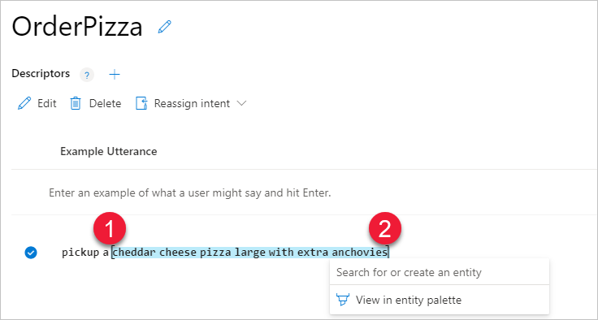
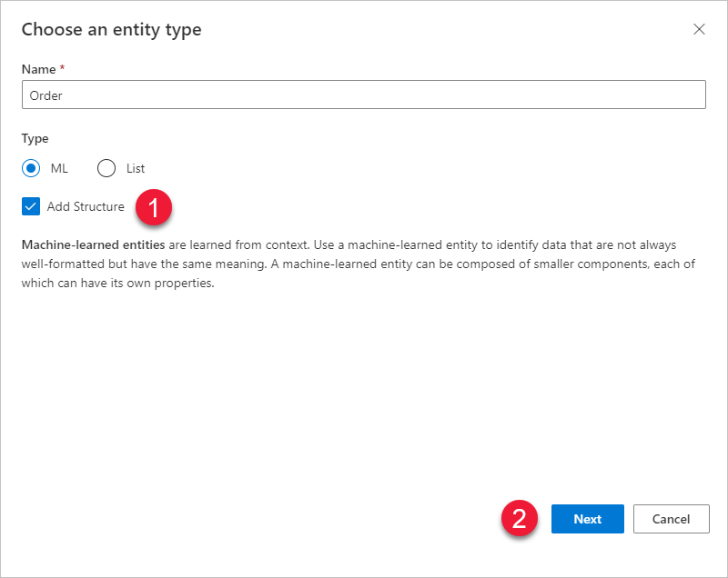
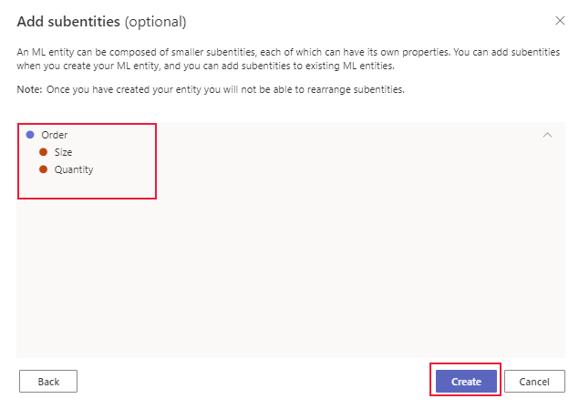
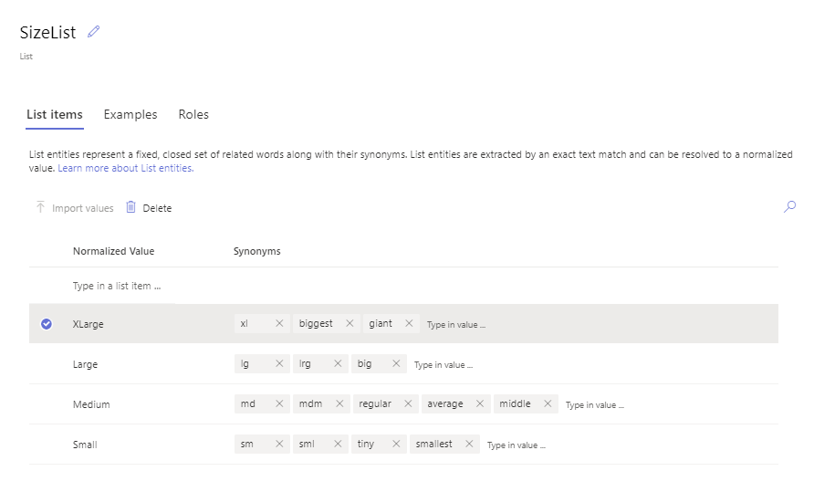
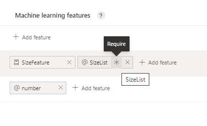
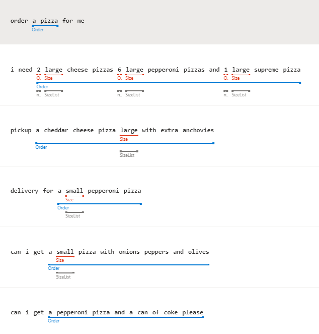
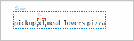
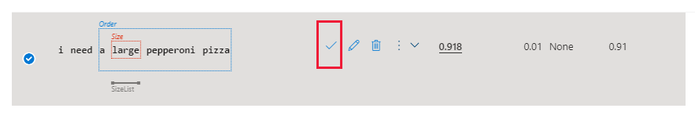
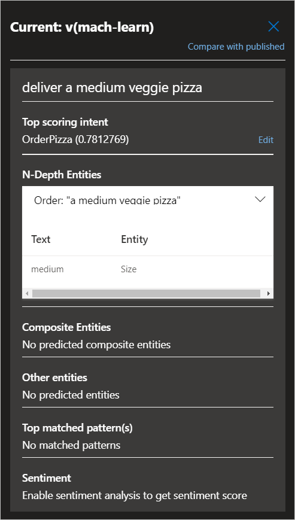
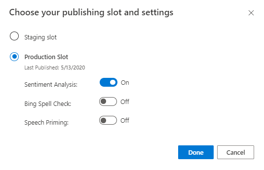

# Tutorial: Extract structured data from user utterance with machine-learning entities in Language Understanding (LUIS)

In this tutorial, extract structured data from an utterance using the machine-learning entity.

The machine-learning entity supports the [model decomposition concept](luis-concept-model.md#v3-authoring-model-decomposition) by providing subentity entities with [features](luis-concept-feature.md).

**In this tutorial, you learn how to:**

> [!div class="checklist"]
> * Import example app
> * Add machine-learning entity
> * Add subentity and feature
> * Train, Test, Publish app
> * Get entity prediction from endpoint

[!INCLUDE [LUIS Free account](includes/quickstart-tutorial-use-free-starter-key.md)]


## Why use a machine-learning entity?

This tutorial adds a machine-learning entity to extract data from a user's utterance.

The entity defines the data to extract from within the utterance. This includes giving the data a name, a type (if possible), any resolution of the data if there is ambiguity, and the exact text that makes up the data.

In order to define the data, you need to:
* Create the entity
* Label the text, within example utterances, representing the entity. These labeled examples teach LUIS what the entity is and where it can be found in an utterance.

## Entity decomposability is important

Entity decomposability is important for both intent prediction and for data extraction with the entity.

Start with a machine-learning entity, which is the beginning and top-level entity for data extraction. Then decompose the entity into subentities.

While you may not know how detailed you want your entity when you begin your app, a best practice is to start with a machine-learning entity, then decompose with subentities as your app matures.

In this tutorial, you create a machine-learning entity to represent an order for a pizza app. The entity will extract order-related text, pulling out size, and quantity.

An utterance of `Please deliver one large cheese pizza to me` should extract `one large cheese pizza` as the order, then also extract `1` for quantity and `large` for size.

## Download JSON file for app

Download and save the [app JSON file](https://raw.githubusercontent.com/Azure-Samples/cognitive-services-language-understanding/master/documentation-samples/tutorials/machine-learned-entity/pizza-intents-only.json).

## Import JSON file for app

[!INCLUDE [Import app steps](includes/import-app-steps.md)]

## Create machine learned entity

To extract details about a pizza order, create a top level, machine-learning `Order` entity.

1. On the **Intents** page, select the **OrderPizza** intent.

1. In the example utterances list, select the following utterance.

    |Order example utterance|
    |--|
    |`pickup a cheddar cheese pizza large with extra anchovies`|

    Begin selecting just before the left-most text of `pickup` (#1), then go just beyond the right-most text, `anchovies` (#2 - this ends the labeling process). A pop-up menu appears. In the pop-up box, enter the name of the entity as `Order` (#3). Then select `Order Create new entity` from the list (#4).

    

    > [!NOTE]
    > An entity won't always be the entire utterance. In this specific case, `pickup` indicates how the order is to be received. From a conceptual perspective, `pickup` should be part of the labeled entity for the order.

1. In the **Choose an entity type** box, select **Add Structure** then select **Next**. Structure is necessary to add subentities such as size and quantity.

    

1. In the **Add subentities (optional)** box, select **+** on the `Order` row, then add `Size` and `Quantity` as subentities, then select **Create**.

    > [!div class="mx-imgBorder"]
    > 

## Edit subentities to improve extraction

The previous steps create the entity and subentity. To improve extraction, add features to the subentities.

### Improve size extraction with phrase list

1. Select **Entities** from the left menu, then select **Order** entity.

1. On the **Schema and features** tab, select the **Size** subentity, then select **+ Add feature**.

1. Select **Create new phrase list** from the drop-down menu.

1. In the **Create new phrase list** box, enter the name `SizePhraselist` then enter values of: `small`, `medium`, and `large`. When the **Suggestions** box fills in, select `extra large`, and `xl`. Select **Create** to create the new phrase list.

    This phrase list feature helps the `Size` subentity find words related to size by providing it with example words. This phrase list doesn't need to include every size word but should include words that are expected to indicate size.

### Add SizeList entity

Adding a list of known sizes the client application recognizes will also help extraction.

1. Select **Entities** from the left menu then select **+ Create**.

1. Set the entity name as `SizeListentity` so it is easy to identify when compared to the `SizePhraselist` created in the previous section.

1. Add the sizes the client application expects: `Small`, `Medium`, `Large`, and `XLarge` then add synonyms for each. The synonyms should be the terms that a user enters in the chat bot. The entity is extracted with a list entity when it matched exactly to the normalized value or synonyms.

    |Normalized value|Synonyms|
    |--|--|
    |Small|sm, sml, tiny, smallest|
    |Medium|md, mdm, regular, average, middle|
    |Large|lg, lrg, big|
    |XLarge|xl, biggest, giant|


    > [!div class="mx-imgBorder"]
    > 

### Add feature of SizeList entity

1. Select **Entities** from left menu to return to the list of entities.

1. Select **Order** from the list of entities.

1. On the **Schema and features** tab, select the **Size** entity, then select **+ Add feature**.

1. Select **@ SizeListentity** from the drop-down list.

<a name="add-prebuilt-number-entity-to-app"></a>

### Add prebuilt number entity

Adding a prebuilt number entity will also help extraction.

1. Select **Entities** from the left menu then select **Add prebuilt entity**.

1. Select **Number** from the list then select **Done**.

1. Select **Entities** from left menu to return to the list of entities.

### Add feature of prebuilt number entity

1. Select **Order** from the list of entities.

1. On the **Schema and features** tab, select the **Quantity** entity, then select **+ Add feature**.

1. Select **@ number** from the drop-down list.

<a name="create-subcomponent-entity-with-constraint-to-help-extract-data"></a>

## Configure required features

On the Entity detail page for **Order** entity, select the asterisk, `*`, for both the **@ SizeList** feature and the **@ number** feature. The asterisk appears in the same label as the feature name.

> [!div class="mx-imgBorder"]
> 

<a name="label-text-as-entities-in-example-utterances"></a>
<a name="label-example-utterance-to-teach-luis-about-the-entity"></a>

## Label example utterances

The machine learned entity is created and the subentities have features. To complete the extraction improvement, the example utterances need to be labeled with the subentities.

1. Select **Intents** from the left navigation, then select the **OrderPizza** intent.

1. To open the **Entity Palette**, selecting the **@** symbol in the contextual toolbar.

1. Select each entity row in the palette, then use the palette cursor to select the entity in each example utterance. When you are finished, the entity list should look like the following image.

    > [!div class="mx-imgBorder"]
    > 

## Train the app

To train the app, select **Train**. Training applies the changes, such as the new entities and the labeled utterances, to the active model.

## Add a new example utterance

1. After training, add a new example utterance to the `OrderPizza` intent to see how well LUIS understands the machine-learning entity.

    |Order example utterance|
    |--|
    |`I need a large pepperoni pizza`|

    The overall top entity, `Order` is labeled and the `Size` subentity is also labeled with dotted lines.

    > [!div class="mx-imgBorder"]
    > 

    The dotted line indicates the prediction based on the current trained app.

1. To change the prediction into a labeled entity, select the check mark on the same row.

    > [!div class="mx-imgBorder"]
    > 

    At this point, the machine-learning entity is working because it can find the entity within a new example utterance. As you add example utterances, if the entity is not predicted correctly, label the entity and the subentities. If the entity is predicted correctly, make sure to confirm the predictions.


## Train the app to apply the entity changes to the app

Select **Train** to train the app with this new utterance.

At this point, the order has some details that can be extracted (size, quantity, and total order text). There is further refining of the `Order` entity such as pizza toppings, type of crust, and side orders. Each of those should be created as subentities of the `Order` entity.

## Test the app to validate the changes

Test the app using the interactive **Test** panel. This process lets you enter a new utterance then view the prediction results to see how well the active, trained app is working. The intent prediction should be fairly confident (above 60%) and the entity extraction should pick up at least the `Order` entity. The details of the order entity may be missing because these few utterances aren't enough to handle every case.

1. Select **Test** in the top navigation.
1. Enter the utterance `2 small cheese pizzas for pickup` and select Enter. The active model predicted the correct intent with over 60% confidence.


1. Select **Inspect** to see the entity predictions.

    > [!div class="mx-imgBorder"]
    > 

<a name="publish-with-sentiment-analysis"></a>

## Publish the app to access it from the HTTP endpoint

In order to receive a LUIS prediction in a chat bot or other client application, you need to publish the app to the endpoint.

1. Select **Publish** in the top-right navigation.

    

1. Select the **Production** slot, then select **Change settings**, select **Sentiment Analysis**, then select **Done**.

    > [!div class="mx-imgBorder"]
    > 

1. Select the **Access your endpoint URLs** link in the notification to go to the **Azure Resources** page. The endpoint URLs are listed as the **Example Query**.

## Get intent and entity prediction from HTTP endpoint

1. [!INCLUDE [LUIS How to get endpoint first step](includes/howto-get-endpoint.md)]

1. Go to the end of the URL in the address bar and replace _YOUR_QUERY_HERE_ with the same query as you entered in the interactive test panel.

    `2 small cheese pizzas for pickup`

    The last querystring parameter is `query`, the utterance **query**.

    ```json
    {
        "query": "2 small cheese pizzas for pickup",
        "prediction": {
            "topIntent": "OrderPizza",
            "intents": {
                "OrderPizza": {
                    "score": 0.7812769
                },
                "None": {
                    "score": 0.0314020254
                },
                "Confirm": {
                    "score": 0.009299271
                },
                "Greeting": {
                    "score": 0.007551549
                }
            },
            "entities": {
                "Order": [
                    {
                        "Size": [
                            "small"
                        ],
                        "Quantity": [
                            2
                        ]
                    }
                ]
            }
        },
        "sentimentAnalysis":{
            "label":"neutral",
            "score":0.98
       }
    }
    ```


[!INCLUDE [LUIS How to clean up resources](includes/quickstart-tutorial-cleanup-resources.md)]

## Related information

* [Tutorial - intents](luis-quickstart-intents-only.md)
* [Concept - entities](luis-concept-entity-types.md) conceptual information
* [Concept - features](luis-concept-feature.md) conceptual information
* [How to train](luis-how-to-train.md)
* [How to publish](luis-how-to-publish-app.md)
* [How to test in LUIS portal](luis-interactive-test.md)

## Next steps

In this tutorial, the app uses a machine-learning entity to find the intent of a user's utterance and extract details from that utterance. Using the machine-learning entity allows you to decompose the details of the entity.

> [!div class="nextstepaction"]
> [Add a prebuilt keyphrase entity](luis-quickstart-intent-and-key-phrase.md)
