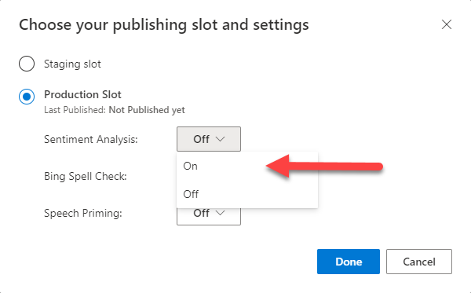

# Tutorial:  Add sentiment analysis as a publishing setting

In this tutorial, modify the publishing settings to extract sentiment analysis then query the LUIS endpoint to see the returned sentiment of a user utterance.

**In this tutorial, you learn how to:**

<!-- green checkmark -->
> [!div class="checklist"]
> * Add sentiment analysis as a publish setting
> * Get sentiment of an utterance from the published endpoint

[!INCLUDE [LUIS Free account](../../../includes/cognitive-services-luis-free-key-short.md)]

## Sentiment analysis is a publish setting

The following utterances show examples of sentiment:

|Sentiment|Score|Utterance|
|:--|:--|:--|
|negative|0.01 |The pizza was awful.|
|positive|0.97 |The cheese pizza was wonderful.|

Sentiment analysis is a publish setting that applies to every utterance. Once set, your app returns the sentiment of an utterance without you having to label data.

Because it is a publish setting, you do not see it labeled on the intents or entities pages. You can see it in the [interactive test](luis-interactive-test.md#view-sentiment-results) pane or when testing at the endpoint URL.

## Import example .json to begin app

1.  Download and save the [app JSON file](https://raw.githubusercontent.com/Azure-Samples/cognitive-services-language-understanding/master/documentation-samples/tutorials/machine-learned-entity/pizza-tutorial-with-entities.json).

[!INCLUDE [Import app steps](includes/import-app-steps.md)]

## Train the app

[!INCLUDE [LUIS How to Train steps](includes/howto-train.md)]

## Configure app to include sentiment analysis

1. Select **Publish** from the top menu. Sentiment analysis is a publishing setting.

1. Select **Production slot** then select **Change settings**.
1. Set the Sentiment Analysis setting to **On**.

    

## Get the sentiment of an utterance from the endpoint

1. [!INCLUDE [LUIS How to get endpoint first step](includes/howto-get-endpoint.md)]

1. Go to the end of the URL in the address bar and replace _YOUR_QUERY_HERE_ with:

    `Deliver 2 of the best cheese pizzas ever!!!`

    This utterance is not the same as any of the labeled utterances so it is a good test and should return the `OrderPizza` intent with the sentiment analysis extracted.

    ```json
    {
        "query": "Deliver 2 of the best cheese pizzas ever!!!",
        "prediction": {
            "topIntent": "OrderPizza",
            "intents": {
                "OrderPizza": {
                    "score": 0.4659952
                },
                "None": {
                    "score": 0.16901511
                },
                "Confirm": {
                    "score": 0.00421415
                },
                "Greeting": {
                    "score": 0.00109914376
                }
            },
            "entities": {
                "number": [
                    2
                ],
                "$instance": {
                    "number": [
                        {
                            "type": "builtin.number",
                            "text": "2",
                            "startIndex": 8,
                            "length": 1,
                            "modelTypeId": 2,
                            "modelType": "Prebuilt Entity Extractor",
                            "recognitionSources": [
                                "model"
                            ]
                        }
                    ]
                }
            },
            "sentiment": {
                "label": "positive",
                "score": 0.861665964
            }
        }
    }
    ```

    The sentiment analysis is positive with a score of 86%.

[!INCLUDE [LUIS How to clean up resources](includes/quickstart-tutorial-cleanup-resources.md)]

## Related information

* Sentiment analysis is provided by Cognitive Service [Text Analytics](../Text-Analytics/index.yml). The feature is restricted to Text Analytics [supported languages](luis-language-support.md#languages-supported).
* [How to train](luis-how-to-train.md)
* [How to publish](luis-how-to-publish-app.md)
* [How to test in LUIS portal](luis-interactive-test.md)


## Next steps
This tutorial adds sentiment analysis as a publish setting to extract sentiment values from the utterance as a whole.

> [!div class="nextstepaction"]
> [Review endpoint utterances in the HR app](luis-tutorial-review-endpoint-utterances.md)

