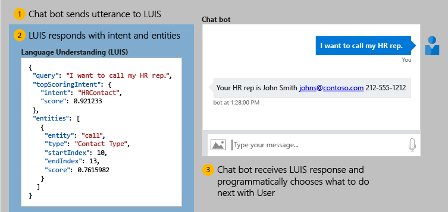

# What is Language Understanding (LUIS)?

Language Understanding (LUIS) is a cloud-based API service that applies custom machine-learning intelligence to a user's conversational, natural language text to predict overall meaning, and pull out relevant, detailed information. 

A client application for LUIS is any conversational application that communicates with a user in natural language to complete a task. Examples of client applications include social media apps, chat bots, and speech-enabled desktop applications.  

")

## Use LUIS in a chat bot

<a name="Accessing-LUIS"></a>

Once the LUIS app is published, a client application sends utterances (text) to the LUIS natural language processing endpoint [API][endpoint-apis] and receives the results as JSON responses. A common client application for LUIS is a chat bot.




|Step|Action|
|:--|:--|
|1|The client application sends the user _utterance_ (text in their own words), "I want to call my HR rep." to the LUIS endpoint as an HTTP request.|
|2|LUIS applies the learned model to the natural language text to provide intelligent understanding about the user input. LUIS returns a JSON-formatted response, with a top intent, "HRContact". The minimum JSON endpoint response contains the query utterance, and the top scoring intent. It can also extract data such as the Contact Type entity.|
|3|The client application uses the JSON response to make decisions about how to fulfill the user's requests. These decisions can include some decision tree in the bot framework code and calls to other services. |

The LUIS app provides intelligence so the client application can make smart choices. LUIS doesn't provide those choices. 

<a name="Key-LUIS-concepts"></a>
<a name="what-is-a-luis-model"></a>

## Natural language processing

A LUIS app contains a domain-specific natural language model. You can start the LUIS app with a prebuilt domain model, build your own model, or blend pieces of a prebuilt domain with your own custom information.

* **Prebuilt model** LUIS has many prebuilt domain models including intents, utterances, and prebuilt entities. You can use the prebuilt entities without having to use the intents and utterances of the prebuilt model. [Prebuilt domain models](luis-how-to-use-prebuilt-domains.md) include the entire design for you and are a great way to start using LUIS quickly.

* **Custom Entities** LUIS gives you several ways to identify your own custom intents and entities including machine-learned entities, specific or literal entities, and a combination of machine-learned and literal.

## Build the LUIS model
Build the model with the [authoring](https://go.microsoft.com/fwlink/?linkid=2092087) APIs or with the LUIS portal.

The LUIS model begins with categories of user intentions called **[intents](luis-concept-intent.md)**. Each intent needs examples of user **[utterances](luis-concept-utterance.md)**. Each utterance can provide a variety of data that needs to be extracted with **[entities](luis-concept-entity-types.md)**. 

|Example user utterance|Intent|Entities|
|-----------|-----------|-----------|
|"Book a flight to __Seattle__?"|BookFlight|Seattle|
|"When does your store __open__?"|StoreHoursAndLocation|open|
|"Schedule a meeting at __1pm__ with __Bob__ in Distribution"|ScheduleMeeting|1pm, Bob|

## Query prediction endpoint

After the model is built and published to the endpoint, the client application sends utterances to the published prediction [endpoint](https://go.microsoft.com/fwlink/?linkid=2092356) API. The API applies the model to the text for analysis. The API responds with the prediction results in a JSON format.  

The minimum JSON endpoint response contains the query utterance, and the top scoring intent. It can also extract data such as the following **Contact Type** entity. 

```JSON
{
  "query": "I want to call my HR rep.",
  "topScoringIntent": {
    "intent": "HRContact",
    "score": 0.921233
  },
  "entities": [
    {
      "entity": "call",
      "type": "Contact Type",
      "startIndex": 10,
      "endIndex": 13,
      "score": 0.7615982
    }
  ]
}
```

## Improve model prediction

After a LUIS model is published and receives real user utterances, LUIS provides several methods to improve prediction accuracy: [active learning](luis-concept-review-endpoint-utterances.md) of endpoint utterances, [phrase lists](luis-concept-feature.md) for domain word inclusion, and [patterns](luis-concept-patterns.md) to reduce the number of utterances needed.

<a name="using-luis"></a>

## Development lifecycle
LUIS provides tools, versioning, and collaboration with other LUIS authors to integrate into the full development life cycle at the level of the client application and the language model. 

## Implementing LUIS
LUIS, as a REST API, can be used with any product, service, or framework that makes an HTTP request. The following list contains the top Microsoft products and services used with LUIS.

The top client application for LUIS is:
* [Web app bot](https://docs.microsoft.com/azure/bot-service/?view=azure-bot-service-4.0) quickly creates a LUIS-enabled chat bot to talk with a user via text input. Uses [Bot Framework][bot-framework] version [4.x](https://github.com/Microsoft/botbuilder-dotnet) for a complete bot experience.

Tools to quickly and easily use LUIS with a bot:
* [LUIS CLI](https://github.com/Microsoft/botbuilder-tools/tree/master/packages/LUIS) The NPM package provides authoring and prediction with as either a stand-alone command line tool or as import. 
* [LUISGen](https://github.com/Microsoft/botbuilder-tools/tree/master/packages/LUISGen) LUISGen is a tool for generating strongly typed C# and typescript source code from an exported LUIS model.
* [Dispatch](https://aka.ms/dispatch-tool) allows several LUIS and QnA Maker apps to be used from a parent app using dispatcher model.
* [LUDown](https://github.com/Microsoft/botbuilder-tools/tree/master/packages/Ludown) LUDown is a command line tool that helps manage language models for your bot.

Other Cognitive Services used with LUIS:
* [QnA Maker][qnamaker] allows several types of text to combine into a question and answer knowledge base.
* [Bing Spell Check API](../bing-spell-check/proof-text.md) provides text correction before prediction. 
* [Speech service](../Speech-Service/overview.md) converts spoken language requests into text. 
* [Conversation learner](https://docs.microsoft.com/azure/cognitive-services/labs/conversation-learner/overview) allows you to build bot conversations quicker with LUIS.
* [Project personality chat](https://docs.microsoft.com/azure/cognitive-services/project-personality-chat/overview) to handle bot small talk.

Samples using LUIS:
* [Conversational AI](https://github.com/Microsoft/AI) GitHub repository.
* [Language Understanding](https://github.com/Azure-Samples/cognitive-services-language-understanding) Azure samples

## Next steps

Author a new LUIS app with a [prebuilt](luis-get-started-create-app.md) or [custom](luis-quickstart-intents-only.md) domain. [Query the prediction endpoint](luis-get-started-cs-get-intent.md) of a public IoT app.

[bot-framework]: https://docs.microsoft.com/bot-framework/
[flow]: https://docs.microsoft.com/connectors/luis/
[authoring-apis]: https://go.microsoft.com/fwlink/?linkid=2092087
[endpoint-apis]: https://go.microsoft.com/fwlink/?linkid=2092356
[qnamaker]: https://qnamaker.ai/
