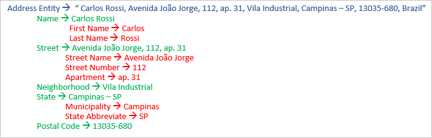

# What's new in Language Understanding

Learn what's new in the service. These items include release notes, videos, blog posts, and other types of information. Bookmark this page to keep up to date with the service.

## Release notes

### June 2020

* [Preview 3.0 Authoring](luis-migration-authoring-entities.md) SDK -
    * Version 3.2.0-preview.3 - [.NET - NuGet](https://www.nuget.org/packages/Microsoft.Azure.CognitiveServices.Language.LUIS.Authoring/)
    * Version 4.0.0-preview.3 - [JS - NPM](https://www.npmjs.com/package/@azure/cognitiveservices-luis-authoring)
* Applying DevOps practices with LUIS
    * Concepts
        * [DevOps practices for LUIS](luis-concept-devops-sourcecontrol.md)
        * [Continuous Integration and Continuous Delivery workflows for LUIS DevOps](luis-concept-devops-automation.md)
        * [Testing for LUIS DevOps](luis-concept-devops-testing.md)
    * How-to
        * [Apply DevOps to LUIS app development using GitHub Actions](luis-how-to-devops-with-github.md)
    * [Complete code GitHub repo](https://github.com/Azure-Samples/LUIS-DevOps-Template)

### May 2020 - //Build

* Released as **generally available** (GA):
    * [Language Understanding container](luis-container-howto.md)
    * Preview portal promoted to [current portal](https://www.luis.ai), [previous](https://previous.luis.ai) portal still available
    * New machine-learning entity creation and labeling experience
    * [Upgrade process](migrate-from-composite-entity.md) from composite and simple entities to machine-learning entities
    * [Setting](how-to-application-settings-portal.md) support for normalizing word variants
* Preview Authoring API changes
    * App schema 7.x for nested machine-learning entities
    * [Migration to required feature](luis-migration-authoring-entities.md#api-change-constraint-replaced-with-required-feature)
* New resources for developers
    * [Continuous integration tools](developer-reference-resource.md#continuous-integration-tools)
    * Workshop - learn best practices for [_Natural Language Understanding_ (NLU) using LUIS](developer-reference-resource.md#workshops)
* [Customer managed keys](luis-encryption-of-data-at-rest.md) - encrypt all the data you use in LUIS by using your own key
* [AI show](https://channel9.msdn.com/Shows/AI-Show/New-Features-in-Language-Understanding) (video) - see the new features in LUIS

### March 2020

* TLS 1.2 is now enforced for all HTTP requests to this service. For more information, see [Azure Cognitive Services security](../cognitive-services-security.md).

### November 4, 2019 - Ignite

* Video - [Advanced Natural Language Understanding (NLU) models using LUIS and Azure Cognitive Services | BRK2188](https://www.youtube.com/watch?v=JdJEV2jV0_Y)

* Improved developer productivity
    * General availability of our [prediction endpoint V3](luis-migration-api-v3.md).
    * Ability to import and export apps with `.lu` ([LUDown](https://github.com/microsoft/botbuilder-tools/tree/master/packages/Ludown)) format. This paves the way for an effective CI/CD process.
* Language expansion
    * [Arabic and Hindi](luis-language-support.md) in public preview.
* Prebuilt models
    * [Prebuilt domains](luis-reference-prebuilt-domains.md) is now generally available (GA)
    * Japanese [prebuilt entities](luis-reference-prebuilt-entities.md#japanese-entity-support) - age, currency, number, and percentage are not supported in V3.
    * Italian [prebuilt entities](luis-reference-prebuilt-entities.md#italian-entity-support) - age, currency, dimension, number, and percentage resolution changed from V2.
* Enhanced user experience in [preview.luis.ai portal](https://preview.luis.ai) - revamped labeling experience to enable building and debugging complex models. Try the preview portal tutorials:
    * [Intents only](tutorial-intents-only.md)
    * [Decomposable machine-learning entity](tutorial-machine-learned-entity.md)
* Advance language understanding capabilities - [building sophisticated language models](luis-concept-entity-types.md) with less effort.
* Define machine learning features at the model level and enable models to be used as signals to other models, for example using entities as features to intents and to other entities.
* New, expanded [limits](luis-limits.md) - higher maximum for phrase lists and total phrases, new model as a feature limits
* Extract information from text in the format of deep hierarchy structure, making conversation applications more powerful.

    

### September 3, 2019

* Azure authoring resource - [migrate now](luis-migration-authoring.md).
    * 500 apps per Azure resource
    * 100 versions per app
* Turkish support for prebuilt entities
* Italian support for datetimeV2

### July 23, 2019

* Update the [Recognizers-Text](https://github.com/microsoft/Recognizers-Text/releases/tag/dotnet-v1.2.3) to 1.2.3
    * Age, Temperature, Dimension, and Currency recognizers in Italian.
    * Improvement in Holiday recognition in English to correctly calculate Thanksgiving-based dates.
    * Improvements in French DateTime to reduce false positives of non-Date and non-Time entities.
    * Support for calendar/school/fiscal year and acronyms in English DateRange.
    * Improved PhoneNumber recognition in Chinese and Japanese.
    * Improved support for NumberRange in English.
    * Performance improvements.

### June 24, 2019

* [OrdinalV2 prebuilt entity](luis-reference-prebuilt-ordinal-v2.md) to support ordering such as next, previous, and last. English culture only.

### May 6, 2019 - //Build Conference

The following features were released at the Build 2019 Conference:

* [Preview of V3 API migration guide](luis-migration-api-v3.md)
* [Improved analytics dashboard](luis-how-to-use-dashboard.md)
* [Improved prebuilt domains](luis-reference-prebuilt-domains.md)
* [Dynamic list entities](schema-change-prediction-runtime.md#dynamic-lists-passed-in-at-prediction-time)
* [External entities](schema-change-prediction-runtime.md#external-entities-passed-in-at-prediction-time)

## Blogs

[Bot Framework](https://blog.botframework.com/)

## Videos

### 2019 Ignite videos

[Advanced Natural Language Understanding (NLU) models using LUIS and Azure Cognitive Services | BRK2188](https://www.youtube.com/watch?v=JdJEV2jV0_Y)

### 2019 Build videos

[How to use Azure Conversational AI to scale your business for the next generation](https://www.youtube.com/watch?v=_k97jd-csuk&feature=youtu.be)

## Service updates

[Azure update announcements for Cognitive Services](https://azure.microsoft.com/updates/?product=cognitive-services)
