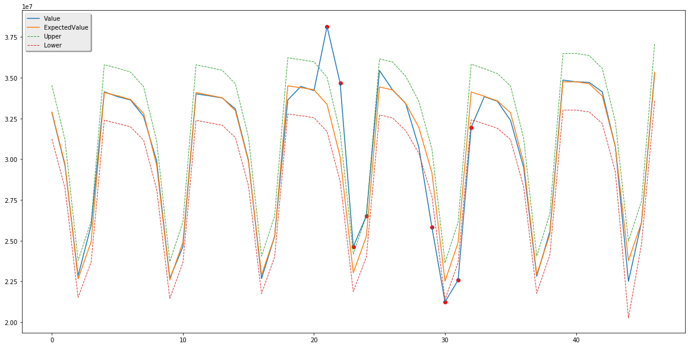
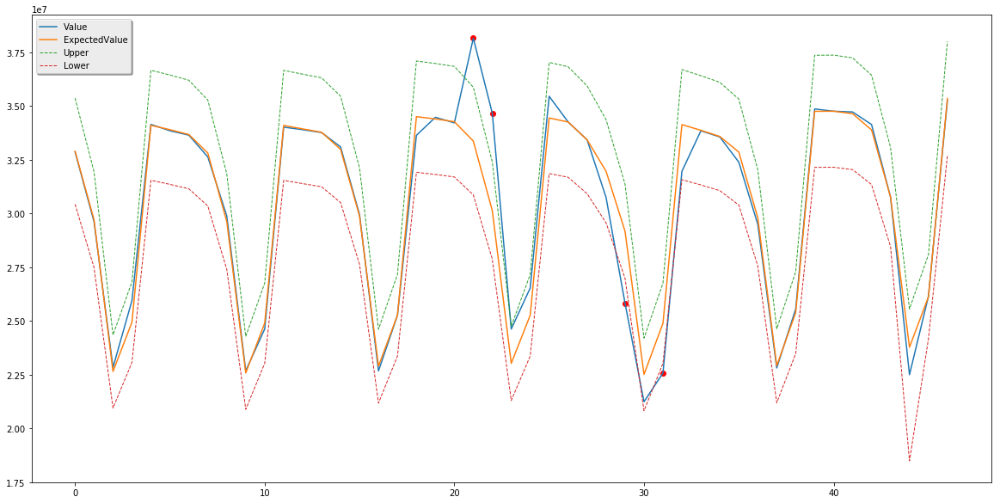
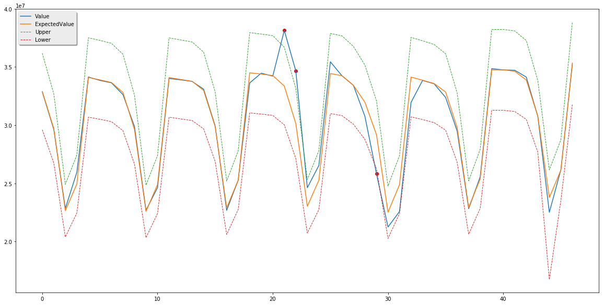
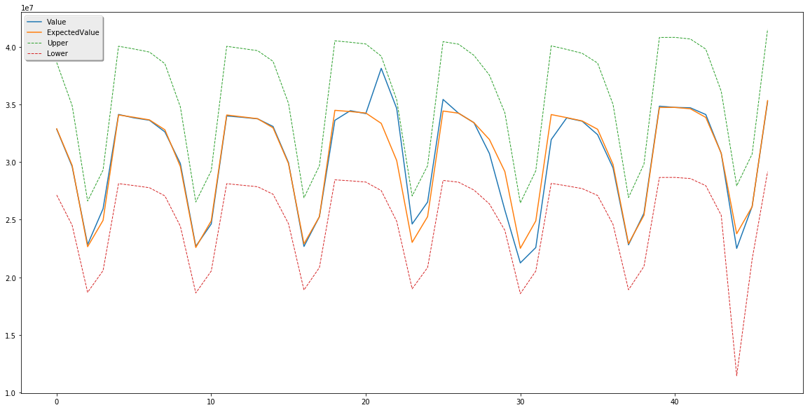

The data returned with the expected value and default upper and lower margins. In practice, you can define a [sensitivity] parameter, and then use (ExpectedValue + sensitivity * UpperMargin) as the upper bound and (ExpectedValue - sensitivity * LowerMargin) as the lower bound to tune the anomaly point by yourselves. The value of the [sensitivity] should be greater than 1. Below are some diagrams for tuning.

> [!NOTE]
> The diagrams are not generated by the sample application. They are created by a seperate tool with the sample application.

