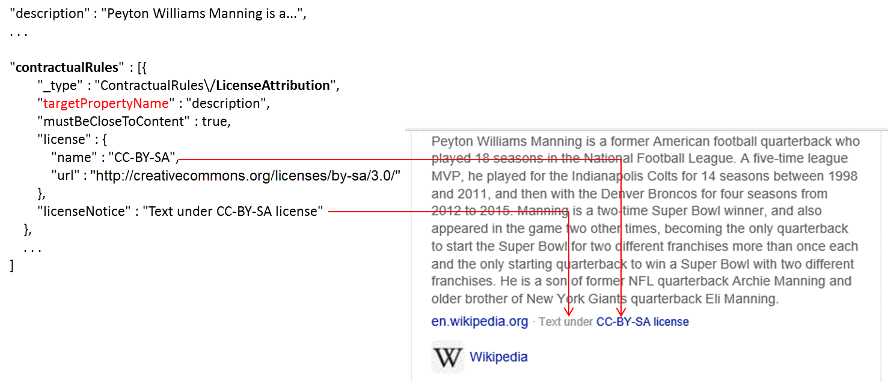
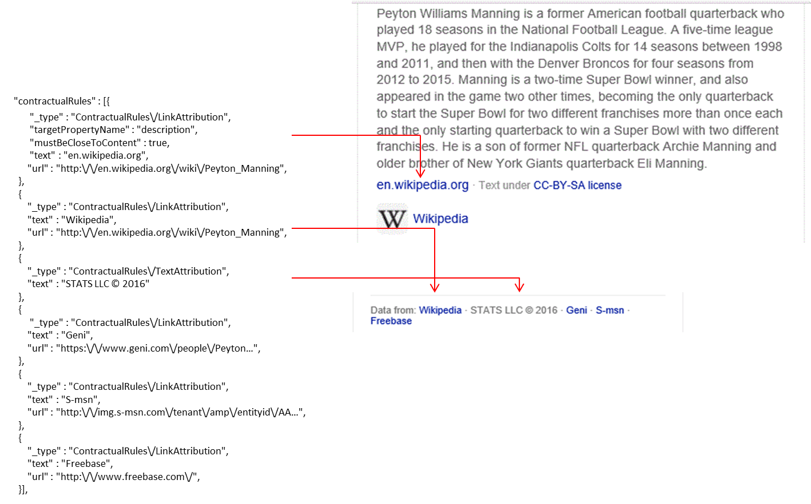
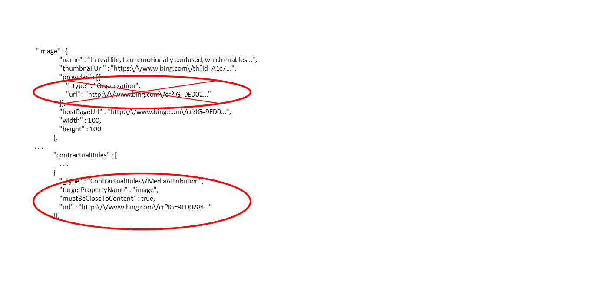

---
title: What is Project Answer Search?
titlesuffix: Azure Cognitive Services
description: Introduction to the Project Answer Search.
services: cognitive-services
author: mikedodaro
manager: cgronlun

ms.service: cognitive-services
ms.component: project-answer-search
ms.topic: overview
ms.date: 04/13/2018
ms.author: rosh
---

# What is Project Answer Search?
Project Answer Search API uses the Bing v7 endpoint to get answers to interrogative queries. A question such as "What is the circumference of the earth?" returns an answer with factual information.  A query for a person, place, or thing returns information about the entity identified by the query. These scenarios can be useful in applications such as conversational bots, messaging apps, readers, etc.  

Queries return responses that depend on the query scenario: webpages are always returned, while [facts](fact-queries.md) and/or [entities](entity-queries.md) are returned if relevant.

## Endpoint
To get answers to a question or information about a person, place, or thing, send a request to the Answer Search API endpoint. Use the headers and URL parameters for various specifications.  Include *Ocp-Apim-Subscription-Key* header with a valid token.  The market parameter is required. Only `en-us` market is currently supported.

The following query gets answers to the question: "What is the circumference of the earth?"

GET:
````
https://api.labs.cognitive.microsoft.com/answerSearch/v7.0/search?q=what+is+circumference+of+the=earth?&mkt=en-us

````

The URL parameter `q=` is required to specify the object of search.

## Response object

The response includes HTTP headers, webpages, facts, and/or entities.

````
BingAPIs-TraceId: AB2E75C998614ADB8EBF5110DF648298
X-MSEdge-ClientID: 1E48FC4F7B8768C80B14F7997A106906
BingAPIs-SessionId: 0504DDD6DAE84861A4842306F8DA7A58
BingAPIs-Market: en-US
X-MSEdge-Ref: Ref A: AB2E75C998614ADB8EBF5110DF648298 Ref B: CO1EDGE0322 Ref C: 2018-04-19T19:57:13Z

JSON Response:

{
  "_type": "SearchResponse",
  "queryContext": {
    "originalQuery": "what is the circumference of earth"
  },
  "webPages": {
    "webSearchUrl": "https://www.bing.com/search?q\u003dwhat+is+the+circumference+of+earth",
    "totalEstimatedMatches": 217000,
    "value": [
      {
        "id": "https://www.bingapis.com/api/v7/#WebPages.0",
        "name": "Circumference of the Earth - Universe Today",
        "url": "https://www.universetoday.com/26461/circumference-of-the-earth/",
        "isFamilyFriendly": true,
        "displayUrl": "https://www.universetoday.com/26461/circumference-of-the-earth",
        "snippet": "The circumference of the Earth in kilometers is 40,075 km, and the circumference of the Earth in miles is 24,901. In other words, if you could drive your car around the equator of the Earth (yes, even over the oceans), you’d put on an extra 40,075 km on the odometer.",
        "deepLinks": [
          {
            "name": "About Earth",
            "url": "https://www.universetoday.com/14382/10-interesting-facts-about-planet-earth/"
          }
        ],
        "dateLastCrawled": "2018-04-12T14:13:00.0000000Z",
        "language": "en"
      },
      {
        "id": "https://www.bingapis.com/api/v7/#WebPages.1",
        "name": "Earth - Wikipedia",
        "url": "https://en.wikipedia.org/wiki/Earth",
        "about": [
          {
            "name": "Earth"
          },
          {
            "name": "Earth"
          }
        ],
        "isFamilyFriendly": true,
        "displayUrl": "https://en.wikipedia.org/wiki/Earth",
        "snippet": "Circumference: 40 075.017 km equatorial (24 901.461 mi) ... Earth is the third planet from the Sun and the only object in the Universe known to harbor life.",
        "deepLinks": [
          {
            "name": "Moon",
            "url": "https://en.wikipedia.org/wiki/Moon"
          },
          {
            "name": "Planet",
            "url": "https://en.wikipedia.org/wiki/Planet"
          },
          {
            "name": "Quasi-Satellites",
            "url": "https://en.wikipedia.org/wiki/Quasi-satellite"
          },
          {
            "name": "World Population",
            "url": "https://en.wikipedia.org/wiki/World_population"
          },
   . . .

    ]
  },
  "entities": {
    "value": [
      {
        "id": "https://www.bingapis.com/api/v7/#Entities.0",
        "contractualRules": [
          {
            "_type": "ContractualRules/LicenseAttribution",
            "targetPropertyName": "description",
            "mustBeCloseToContent": true,
            "license": {
              "name": "CC-BY-SA",
              "url": "http://creativecommons.org/licenses/by-sa/3.0/"
            },
            "licenseNotice": "Text under CC-BY-SA license"
          },
          {
            "_type": "ContractualRules/LinkAttribution",
            "targetPropertyName": "description",
            "mustBeCloseToContent": true,
            "text": "Wikipedia",
            "url": "http://en.wikipedia.org/wiki/Earth"
          },
          {
            "_type": "ContractualRules/MediaAttribution",
            "targetPropertyName": "image",
            "mustBeCloseToContent": true,
            "url": "http://en.wikipedia.org/wiki/Earth"
          }
        ],
        "webSearchUrl": "https://www.bing.com/entityexplore?q\u003dEarth\u0026filters\u003dsid:%226ddb3372-4801-5567-321e-e8a53bd774a4%22\u0026elv\u003dAXXfrEiqqD9r3GuelwApulpmymQx!ODfuQu*veOQHkvP0!Zbvi5F5tVcMSDJvDEWiQWwrdueYTtIszgj03oFQHykYYLYgq3q5!Sf00QxXGIS",
        "name": "Earth",
        "image": {
          "name": "Earth",
          "thumbnailUrl": "https://www.bing.com/th?id\u003dA3ab623665ab412f386c162bd29f0683a\u0026w\u003d110\u0026h\u003d110\u0026c\u003d7\u0026rs\u003d1\u0026qlt\u003d80\u0026cdv\u003d1\u0026pid\u003d16.1",
          "provider": [
            {
              "_type": "Organization",
              "url": "http://en.wikipedia.org/wiki/Earth"
            }
          ],
          "hostPageUrl": "http://upload.wikimedia.org/wikipedia/commons/9/97/The_Earth_seen_from_Apollo_17.jpg",
          "width": 110,
          "height": 110,
          "sourceWidth": 799,
          "sourceHeight": 800
        },
        "description": "Earth is the third planet from the Sun and the only object in the Universe known to harbor life. According to radiometric dating and other sources of evidence, Earth formed over 4.5 billion years ago. Earth\u0027s gravity interacts with other objects in space, especially the Sun and the Moon, Earth\u0027s only natural satellite. Earth revolves around the Sun in 365.26 days, a period known as an Earth year. During this time, Earth rotates about its axis about 366.26 times.",
        "entityPresentationInfo": {
          "entityScenario": "DominantEntity",
          "entityTypeHints": [
            "Generic"
          ]
        },
        "bingId": "6ddb3372-4801-5567-321e-e8a53bd774a4"
      }
    ]
  },
  "facts": {
    "id": "https://www.bingapis.com/api/v7/#Facts",
    "contractualRules": [
      {
        "_type": "ContractualRules/LinkAttribution",
        "text": "www.universetoday.com/26461/circumference-of-the-earth/",
        "url": "http://www.universetoday.com/26461/circumference-of-the-earth/"
      }
    ],
    "attributions": [
      {
        "providerDisplayName": "www.universetoday.com/26461/circumference-of-the-earth/",
        "seeMoreUrl": "http://www.universetoday.com/26461/circumference-of-the-earth/"
      }
    ],
    "value": [
      {
        "description": "The circumference of the Earth in kilometers is 40,075 km, and the circumference of the Earth in miles is 24,901. In other words, if you could drive your car around the equator of the Earth (yes, even over the oceans), you’d put on an extra 40,075 km on the odometer.",
        "subjectName": ""
      }
    ]
  },
  "rankingResponse": {
    "mainline": {
      "items": [
        {
          "answerType": "Facts",
          "value": {
            "id": "https://www.bingapis.com/api/v7/#Facts"
          }
        },
        {
          "answerType": "WebPages",
          "resultIndex": 0,
          "value": {
            "id": "https://www.bingapis.com/api/v7/#WebPages.0"
          }
        },
        {
          "answerType": "WebPages",
          "resultIndex": 1,
          "value": {
            "id": "https://www.bingapis.com/api/v7/#WebPages.1"
          }
        },
        {
          "answerType": "WebPages",
          "resultIndex": 2,
          "value": {
            "id": "https://www.bingapis.com/api/v7/#WebPages.2"
          }
        },
        
        . . . 
      ]
    },
    "sidebar": {
      "items": [
        {
          "answerType": "Entities",
          "resultIndex": 0,
          "value": {
            "id": "https://www.bingapis.com/api/v7/#Entities.0"
          }
        }
      ]
    }
  }
}

````

## Terms of use
Project Answer Search and Project Video Trends are subject to the [Bing Search Use and Display Requirements](use-display-requirements.md).

You, or a third party on your behalf, may not use, retain, store, cache, share, or distribute any data from the URL Preview API for the purpose of testing, developing, training, distributing or making available any non-Microsoft service or feature. 

## Throttling requests

[!INCLUDE [cognitive-services-bing-throttling-requests](../../../../includes/cognitive-services-bing-throttling-requests.md)]


## Data attribution  

Project Answer Search responses contain information owned by third parties. You are responsible to ensure your use is appropriate, for example by complying with any creative commons license your user experience may rely on.  
  
If an answer or result includes the `contractualRules`, `attributions`, or `provider` fields, you must attribute the data. If the answer does not include any of these fields, no attribution is required. If the answer includes the `contractualRules` field and the `attributions` and/or `provider` fields, you must use the contractual rules to attribute the data.  
  
The following example shows an entity that includes a MediaAttribution contractual rule and an Image that includes a `provider` field. The MediaAttribution rule identifies the image as the target of the rule, so you'd ignore the image's `provider` field and instead use the MediaAttribution rule to provide attribution.  
  
```  
        "value" : [{
            "contractualRules" : [
                . . .
                {
                    "_type" : "ContractualRules\/MediaAttribution",
                    "targetPropertyName" : "image",
                    "mustBeCloseToContent" : true,
                    "url" : "http:\/\/en.wikipedia.org\/wiki\/Space_Needle"
                }
            ],
            . . .
            "image" : {
                "name" : "Space Needle",
                "thumbnailUrl" : "https:\/\/www.bing.com\/th?id=A46378861201...",
                "provider" : [{
                    "_type" : "Organization",
                    "url" : "http:\/\/en.wikipedia.org\/wiki\/Space_Needle"
                }],
                "hostPageUrl" : "http:\/\/www.citydictionary.com\/Uploaded...",
                "width" : 110,
                "height" : 110
            },
            . . .
        }]
```  
  
If a contractual rule includes the `targetPropertyName` field, the rule applies only to the targeted field. Otherwise, the rule applies to the parent object that contains the `contractualRules` field.  
  
  
In the following example, the `LinkAttribution` rule includes the `targetPropertyName` field, so the rule applies to the `description` field. For rules that apply to specific fields, you must include a line immediately following the targeted data that contains a hyperlink to the provider's website. For example, to attribute the description, include a line immediately following the description text that contains a hyperlink to the data on the provider's website, in this case create a link to en.wikipedia.org.  
  
```  
"entities" : {  
    "value" : [{  
            . . .  
            "description" : "Peyton Williams Manning is a former American....",  
            . . .  
            "contractualRules" : [{  
                    "_type" : "ContractualRules\/LinkAttribution",  
                    "targetPropertyName" : "description",  
                    "mustBeCloseToContent" : true,  
                    "text" : "en.wikipedia.org",  
                    "url" : "http:\/\/www.bing.com\/cr?IG=B8AD73..."  
                 },  
            . . .  
  
```  

### License Attribution  

If the list of contractual rules includes a [LicenseAttribution](https://docs.microsoft.com/rest/api/cognitiveservices/bing-entities-api-v7-reference#licenseattribution) rule, you must display the notice on the line immediately following the content that the license applies to. The `LicenseAttribution` rule uses the `targetPropertyName` field to identify the property that the license applies to.  
  
The following shows an example that includes a `LicenseAttribution` rule.  
  
  
  
The license notice that you display must include a hyperlink to the website that contains information about the license. Typically, you make the name of the license a hyperlink. For example, if the notice is **Text under CC-BY-SA license** and CC-BY-SA is the name of the license, you would make CC-BY-SA a hyperlink.  
  
### Link and Text Attribution  

The [LinkAttribution](reference.md#linkattribution) and [TextAttribution](reference.md#textattribution) rules are typically used to identify the provider of the data. The `targetPropertyName` field identifies the field that the rule applies to.  
  
To attribute the providers, include a line immediately following the content that the attributions apply to (for example, the targeted field). The line should be clearly labeled to indicate that the providers are the source of the data. For example, "Data from: en.wikipedia.org". For `LinkAttribution` rules, you must create a hyperlink to the provider's website.  
  
The following shows an example that includes `LinkAttribution` and `TextAttribution` rules.  
  
  

### Media Attribution  

If the entity includes an image and you display it, you must provide a click-through link to the provider's website. If the entity includes a [MediaAttribution](reference.md#mediaattribution) rule, use the rule's URL to create the click-through link. Otherwise, use the URL included in the image's `provider` field to create the click-through link.  
  
The following shows an example that includes an image's `provider` field and contractual rules. Because the example includes the contractual rule, you will ignore the image's `provider` field and apply the `MediaAttribution` rule.  
  
  

## Next steps
- [C# quickstart](c-sharp-quickstart.md)
- [Java quickstart](java-quickstart.md)
- [Node quickstart](node-quickstart.md)
- [Python quickstart](python-quickstart.md)
