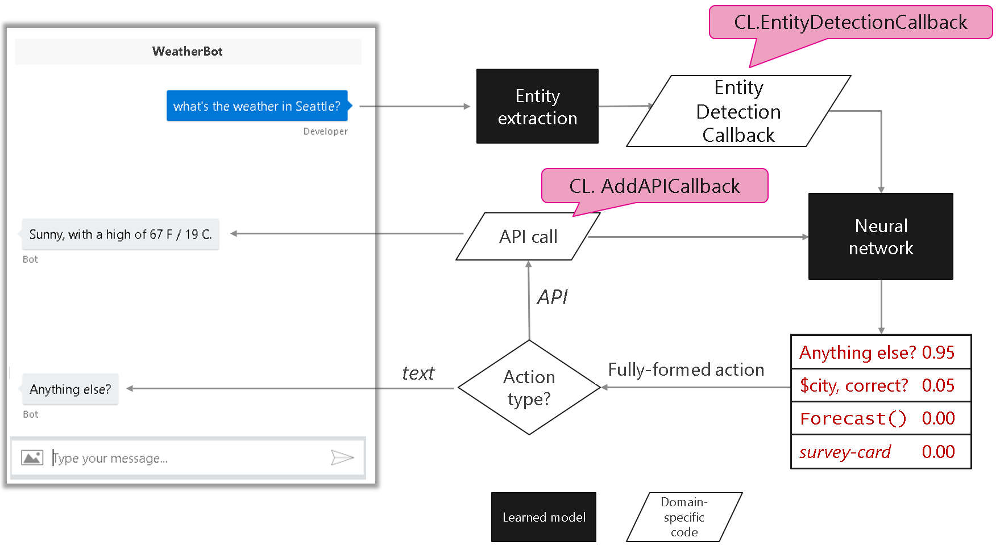
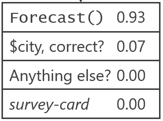

## Control flow

This document describes the control flow of the Conversation Learner (CL) as displayed in the below diagram.

1. User enters a term or phrase in the bot, for example, 'what's the weather in Seattle?'
1. CL passes the user input to a machine learning model that extracts entities
   - This model is build by Conversation Learner, and hosted by www.luis.ai
1. Any extracted entities, and the user's input text, are passed to the Entity Detection Callback method in the bot's code.
    - This code may set/clear/manipulate entity values
1. CL neural network then takes the output of the entity extraction and the user input, and scores all of the actions defined in the bot
   - In this example, the highest probability action is to provide the weather forecast:

     

1. The selected action, in this case, requires an API call to retrieve the weather forecast. 
1. This API, which had been registered using the CL.AddCallback method, is then invoked.  The result of this API is then returned to the user as a message -- for example, 'Sunny with a high of 67.'
1. The call is then made to the neural network to determine the next action based on the previous step.
1. The neural network then predicts the next set of possible actions, and the selected action is presented to the user, in this case, 'Anything else?'

## Next steps

> [!div class="nextstepaction"]
> [How to teach with Conversation Learner](./how-to-teach-cl.md)
