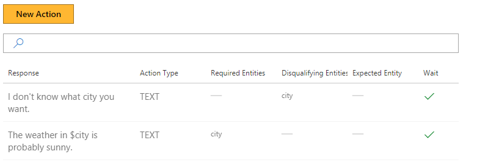
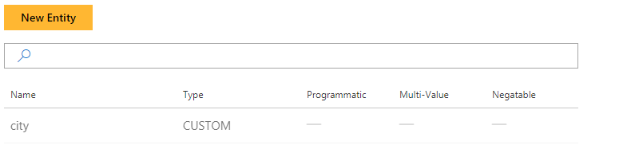

# Introduction to Entities

This tutorial introduces Entities, Disqualifying Entities, Required Entities and their usage within Conversation Learner.

## Video

## Requirements

This tutorial requires that the general tutorial Bot is running

	npm run tutorial-general

## Details

Entities capture the pieces of information that the Bot needs to perform its task, either through extraction from user utterances or assignment by custom code. Entities themselves can also constrain Action availability by being explicitly be classified as "Required" or "Disqualifying."

- Required Entities must be present in the Model's memory in order for the Action to be available
- Disqualifying Entities must *not* be present in the Model's memory in order for the action to be available

This tutorial focuses on Custom Entities. Pre-Trained, Multi-Value, Negatable Entities and Programmatic Entities are introduced in other tutorials.

## Steps

### Create the Model

1. In the Web UI, click "New Model."
2. In the "Name" field, type "IntroToEntities" and hit enter.
3. Click the "Create" button.

### Entity Creation

1. On the left panel, click "Entities", then the "New Entity" button.
2. Select "Custom Trained" for the "Entity Type."
3. Type "city" for the "Entity Name."
4. Click the "Create" button.

> [!NOTE]
> The 'Custom Trained' entity type means this entity can be trained, unlike other types of Entities.

### Create the Actions

1. On the left panel, click "Actions", then the "New Action" button.
2. In the "Bot's response..." field, type "I don't know what city you want."
3. In the "Disqualifying Entities" field, type "city."
4. Click the "Create" button.

> [!NOTE]
> Adding the "city" Entity to "Disqualifying Entities" would disqualify this Action from the Bot's consideration when the "city" Entity is defined in the Bot's memory.

Now, create a second Action.

1. On the left panel, click "Actions", then the "New Action" button.
2. In the "Bot's response..." field, type "The weather in the $city is probably sunny."
3. Click the "Create" button.

> [!NOTE]
> The "city" Entity has been added automatically in the Required Entities list by reference in the response.

### Train the Model

1. On the left panel, click "Train Dialogs", then the "New Train Dialog" button.
2. In the chat panel, where it says "Type your message...", type in "hello."
	- This simulates the user's side of the conversation.
3. Click the "Score Actions" button.
4. Select the response, "I don't know what city you want."
5. As the user, respond with, "Seattle".
6. Click the "Score Actions" button.
7. Select the response, "Weather in $city is probably sunny."
8. Click the "Save" button.

## Next steps

> [!div class="nextstepaction"]
> [Expected entity](./05-expected-entity.md)
