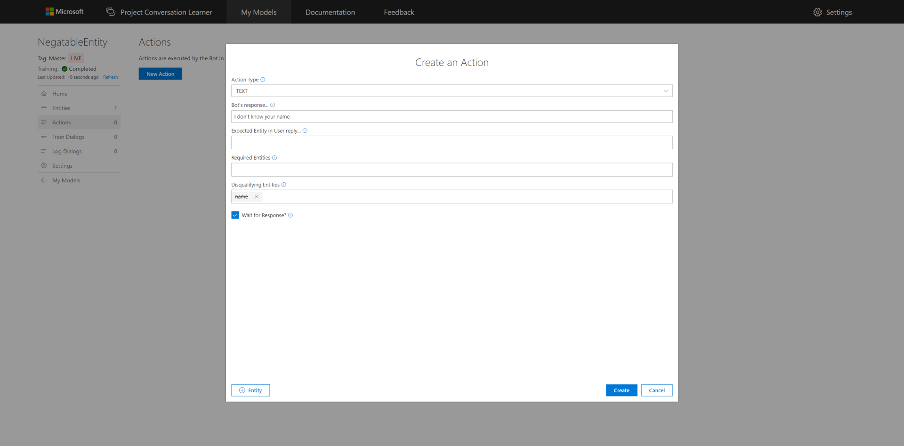
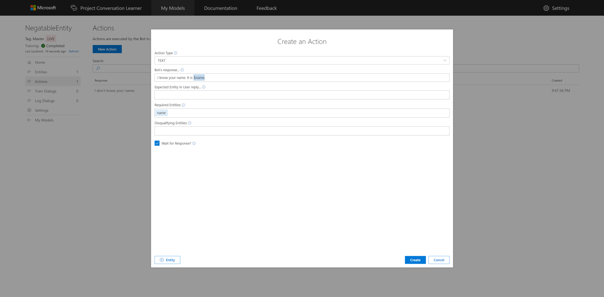
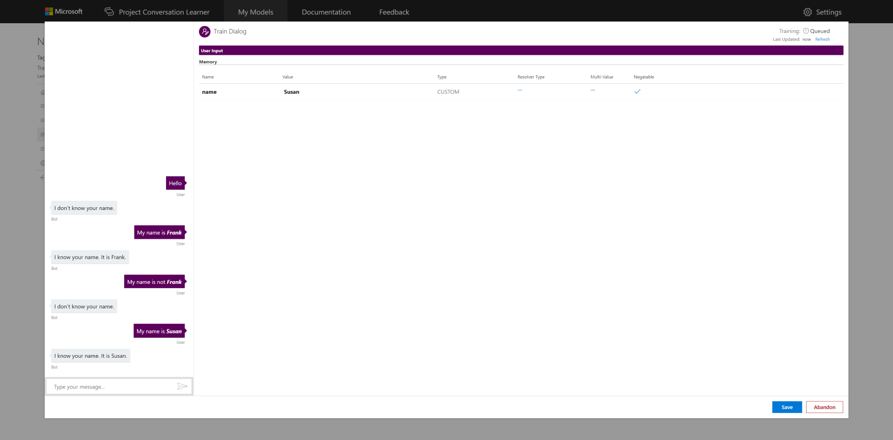

# How to use Negatable Entities with a Conversation Learner Model

This tutorial demonstrates the "Negatable" property of Entities.

## Video

## Requirements
This tutorial requires that the general tutorial Bot is running

	npm run tutorial-general

## Details
The "Negatable" property of an Entity enables you to label Both normal (positive) and negative instances of the Entity, teach based on positive and negative models and clear the value of an existing Entity. Entities with their "Negatable" property set are called Negatable Entities in Conversation Leaner.

## Steps

Start on the home page in the Web UI.

### Create the Model

1. Select **New Model**.
2. Enter **NegatableEntity** for **Name**.
3. Select **Create**.

### Entity Creation

1. Select **Entities** in the left panel, then **New Entity**.
2. Select **Custom Trained** for **Entity Type**.
3. Enter **name** for **Entity Name**.
4. Check **Negatable** to enable users to provide an entity value, or say something is *not* an entity value thereby deleting the matching entity value.
5. Select **Create**.

### Create the First Action

1. Select **Actions** in the left panel, then **New Action**.
2. Enter **I don't know your name.** for **Bot's Response...**.
3. Enter **name** for **Disqualifying Entitles**.
4. Select **Create**.

### Create the Second Action

1. Select **Actions** in the left panel, then **New Action**.
2. Enter **I know your name. It is $name.** for **Bot's Response...**.
3. Select **Create**.

> [!NOTE]
> The **name** Entity was automatically added as a **Required Entities** by reference in the response utterance.

Now you have two actions.

### Train the Model

1. Select **Train Dialogs** in the left panel, then **New Train Dialog**.
2. Enter **hello** for the user's utterance in the left chat panel.
3. Select **Score Actions**.
4. Select **I don't know your name.** from the Actions list. The percentile is 100% as the only valid Action based on the constraints.
5. Enter **My name is Frank** for the user's utterance in the left chat panel.
6. Highlight **Frank** then select **+name**. Negatable Entities have two instances: (+) plus adds or overwrites the value; (-) minus removes the value.
7. Select **Score Actions**. The **name** Entity now is defined as **Frank** in the Model's memory, so the **I know your name. It is $name** Action is available.
8. Select **I know your name. It is $name.** from the Actions list.
9. Enter **My name is not Frank.** for the user's utterance in the left chat panel.
10. Highlight **Frank** then select **-name** to clear the value from the **name** Entity.
11. Select **Score Actions**.
12. Select **I don't know your name.** from the Actions list.
13. Enter **My name is Susan.** for the user's third utterance in the left chat panel.
14. Highlight **Susan** then **+name** 

## Next steps

> [!div class="nextstepaction"]
> [Multi-value entities](./07-multi-value-entities.md)
