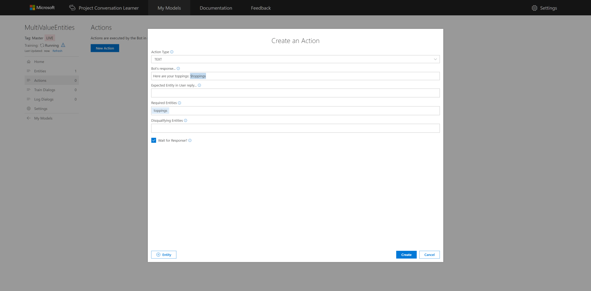
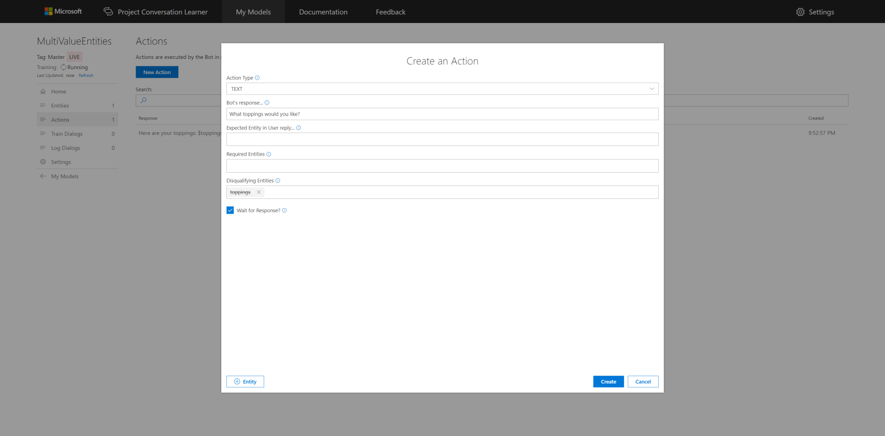
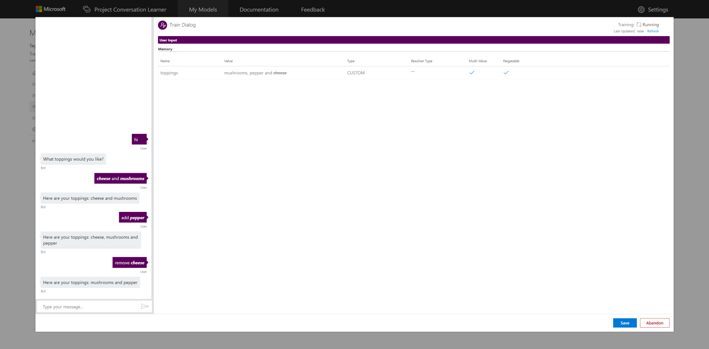

# How to use multi-value entities with a Conversation Learner model
This tutorial shows the Multi-value property of Entities.

## Video

## Requirements
This tutorial requires that the general tutorial Bot is running

	npm run tutorial-general

## Details
Multi-value Entities accumulate values in a list, rather than storing a single value.  These Entities are useful when users can specify more than one value. Toppings on a pizza for example.

Entities marked as Multi-value will have each recognized instance of the Entity appended to a list in the Bot's memory. Subsequent recognition appends to the Entity's value, rather than overwriting.

## Steps

Start on the home page in the Web UI.

### Create the Model

1. Select **New Model**.
2. Enter **MultiValueEntities** for **Name**.
3. Select **Create**.

### Entity Creation

1. Select **Entities** in the left panel, then **New Entity**.
2. Select **Custom Trained** for **Entity Type**.
3. Enter **toppings** for **Entity Name**.
4. Check **Multi-valued** to enable the Entity accumulate one or more values.
5. Check **Negatable**.
6. Select **Create**.

### Create the First Action

1. Select **Actions** in the left panel, then **New Action**.
2. Enter **Here are your toppings: $toppings** for **Bot's Response...**. The leading dollar sign indicates an Entity reference.
3. Select **Create**.

### Create the Second Action

1. Select **Actions** in the left panel, then **New Action**.
2. Enter **What toppings would you like?** for **Bot's Response...**.
3. Enter **toppings** for **Disqualifying Entitles**.
4. Select **Create**.

Now you have two actions.

### Train the Model

1. Select **Train Dialogs** in the left panel, then **New Train Dialog**.
2. Enter **hi** for the user's utterance in the left chat panel.
3. Select **Score Actions**.
4. Select **What toppings would you like?** from the Actions list. The percentile is 100% as the only valid Action based on the constraints.
5. Enter **cheese and mushrooms** for the user's utterance in the left chat panel.
6. Highlight **cheese** then select **+toppings**.
7. Highlight **mushrooms** then select **+toppings**.
8. Select **Score Actions**.
9. Select **Here are your toppings: $toppings** from the Actions list.
10. Enter **add pepper** for the user's next utterance in the left chat panel.
11. Highlight **pepper** then select **+toppings**.
12. Select **Score Actions**.
13. Select **Here are your toppings: $toppings** from the Actions list.
14. Enter **remove cheese** for the user's third utterance in the left chat panel.
15. Highlight **cheese** then select **-toppings**.
16. Select **Score Actions**.
17. Select **Here are your toppings: $toppings** from the Actions list.

## Next steps

> [!div class="nextstepaction"]
> [Pre-Trained entities](./08-pre-trained-entities.md)
