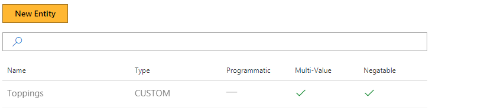
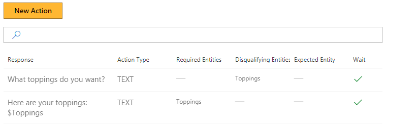

# How to use multi-value entities with a Conversation Learner model
This tutorial shows the Multi-value property of Entities.

## Video

## Requirements
This tutorial requires that the general tutorial bot is running

	npm run tutorial-general

## Details
Multi-value Entities accumulate values in a list, rather than storing a single value.  These Entities are useful when users can specify more than one value. Toppings on a pizza for example.

Entities marked as Multi-value will have each recognized instance of the Entity appended to a list in the Bot's memory. Subsequent recognition appends to the Entity's value, rather than overwriting.

## Steps

### Create the Model

1. In the Web UI, click "New Model."
2. In the "Name" field, type "MultiValueEntities" and hit enter.
3. Click the "Create" button.

### Entity Creation

1. On the left panel, click "Entities", then the "New Entity" button.
2. Select "Custom Trained" for the "Entity Type."
3. Type "toppings" for the "Entity Name."
4. Check the "Multi-valued" check-box.
	- Multi-value entities accumulate one or more values in the Entity.
5. Check the "Negatable" check-box.
	- The "Negatable" property was covered in another tutorial.
6. Click the "Create" button.

### Create the First Action

1. On the left panel, click "Actions", then the "New Action" button.
2. In the "Bot's response..." field, type "Here are your toppings: $toppings"
	- The leading dollar sign indicates an Entity reference
3. Click the "Create" button.

### Create the Second Action

1. On the left panel, click "Actions", then the "New Action" button.
2. In the "Bot's response..." field, type "What toppings would you like?"
3. In the "Disqualifying Entitles" field, type "toppings."
4. Click the "Create" button.

Now you have two actions.

### Train the Model

1. On the left panel, click "Train Dialogs", then the "New Train Dialog" button.
2. In the chat panel, where it says "Type your message...", type in "hi."
3. Click the "Score Actions" button.
4. Select the response, "What toppings would you like?"
	- The percentile is 100%, as the only valid Action based on the constraints.
5. In the chat panel, where it says "Type your message...", type in "cheese and mushrooms"
6. Click 'cheese', and choose the label "+toppings"
7. Click 'mushrooms', and choose the label "+toppings"
8. Click the "Score Actions" button.
9. Select the response, "Here are your toppings: $toppings"
10. In the chat panel, where it says "Type your message...", type in "add pepper"
11. Click 'pepper', and choose the label "+toppings"
12. Click the "Score Actions" button.
13. Select the response, "Here are your toppings: $toppings"
14. In the chat panel, where it says "Type your message...", type in "remove cheese"
15. Click 'cheese', and choose the label "-toppings"
16. Click the "Score Actions" button.
17. Select the response, "Here are your toppings: $toppings"

## Next steps

> [!div class="nextstepaction"]
> [Pre-Trained entities](./08-pre-trained-entities.md)
