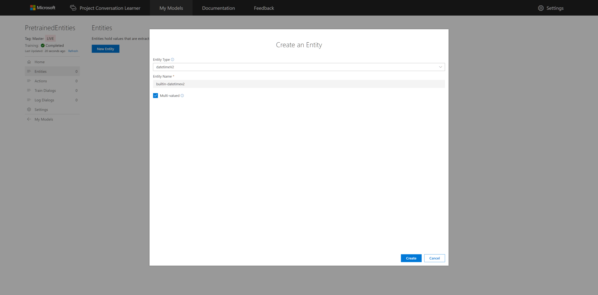
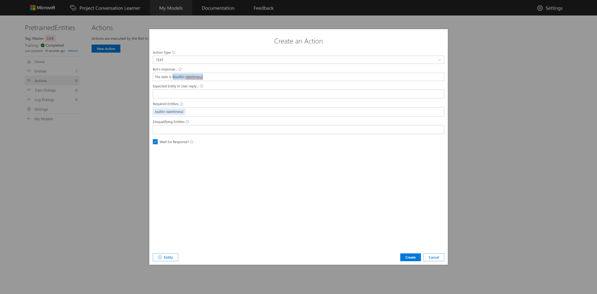
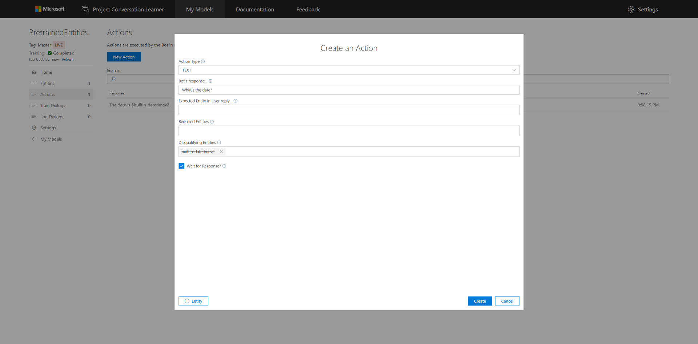
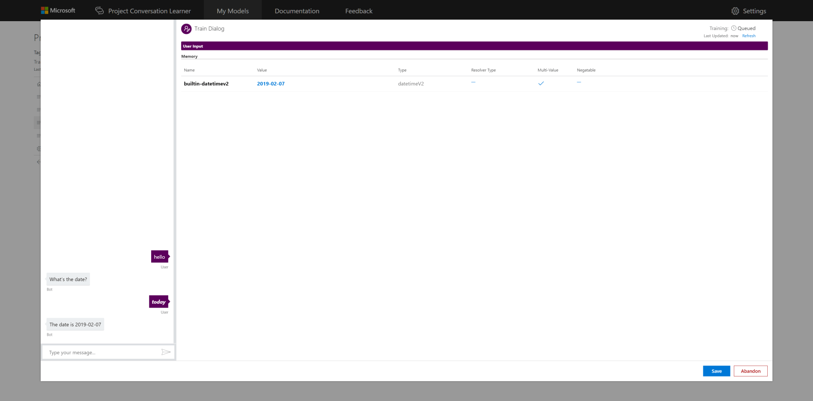

# How to add Pre-trained Entities
This tutorial shows how to add Pre-Trained Entities to your Conversation Learner Model.

## Video

## Requirements
This tutorial requires that the general tutorial Bot is running

	npm run tutorial-general

## Details

Pre-Trained Entities recognize common types of Entities, such as numbers, dates, monetary amounts, and others.  They work "out-of-the-box," do not require any training and their behavior cannot be changed unlike custom entities.  By default, Pre-Trained Entities are multi-valued, accumulating every identified instance of the Entity.

## Steps

Start on the home page in the Web UI.

### Create the Model

1. Select **New Model**.
2. Enter **PretrainedEntities** for **Name**.
3. Select **Create**.

### Entity Creation

1. Select **Entities** in the left panel, then **New Entity**.
2. Select **Pre-Trained/datetimeV2** for **Entity Type**.
3. Check **Multi-valued** to enable the Entity accumulate one or more values. Note, Pre-Trained Entities cannot be negatable.
4. Select **Create**.

1. Select **Actions** in the left panel, then **New Action**.
2. Enter **The date is $builtin-datetimev2** for **Bot's Response...**.
3. Select **Create**.

### Create the Second Action

1. Select **Actions** in the left panel, then **New Action**.
2. Enter **What's the date?** for **Bot's Response...**. Pre-Trained entities cannot be **Required Entities** as they are recognized by default for all utterances.
3. Enter **builtin-datetimev2** for **Disqualifying Entities**.
4. Select **Create**.

### Train the Model

1. Select **Train Dialogs** in the left panel, then **New Train Dialog**.
2. Enter **hello** for the user's utterance in the left chat panel.
3. Select **Score Actions**.
4. Select **What's the date?** from the Actions list
5. Enter **today** for the user's utterance in the left chat panel.
	- The **today** utterance is automatically recognized by pre-trained models in LUIS.
	- Hovering over values of Pre-Trained Entities shows additional data provided by LUIS.

## Next steps

> [!div class="nextstepaction"]
> [Entity Resolvers](./09-entity-resolvers.md)
