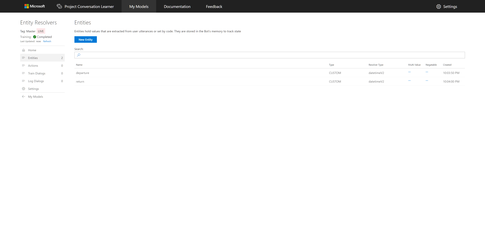
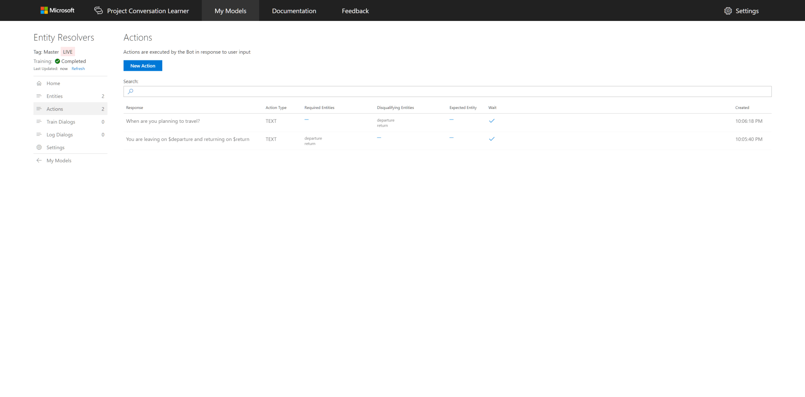
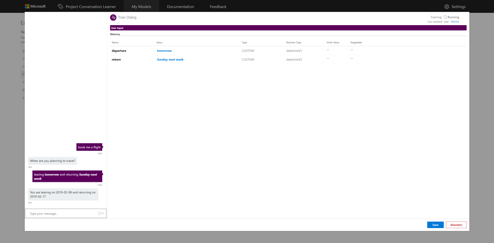

# Entity Resolvers

This tutorial shows how to use Entity Resolvers in Conversation Learner

## Video

## Requirements
This tutorial requires that the general tutorial Bot is running

	npm run tutorial-general

## Details

- Resolver Type is an optional property of Custom Entities.
- Entity Resolvers utilize the power of the pre-trained entity recognizers in LUIS to provide additional detail and clarity for your Custom Entity.

## Steps

Start on the home page in the Web UI.

### Create the Model

1. Select **New Model**.
2. Enter **Entity Resolvers** for **Name**.
3. Select **Create**.

### Create a pair of Entities

1. Select **Entities** in the left panel, then **New Entity**.
2. Enter **departure** for **Entity Name**.
3. Select **datetimeV2** for **Resolver Type**.
4. Select **Create**. Dismiss the informational popup by selecting **OK**.
5. Repeat steps 1-4 to create a second Entity named **return** with **datetimeV2** resolver type.

### Create a pair of Actions

1. Select **Actions** in the left panel, then **New Action**.
2. Enter **You are leaving on $departure and returning on $return** for **Bot's Response...**.
	- IMPORTANT - When typing in $[entityName] you need to hit enter or click on the entity in the drop down otherwise Conversation Learner will consider this to be text instead of an Entity.
	- Notice that the **Required Entities** field will also get these Entities and they cannot be removed. This prevents this action from becoming available until both required Entities are present.
3. Select **Create**.
4. Select **New Action** to create a second Action.
5. Enter **When are you planning to travel?** for **Bot's Response...**.
6. Enter **departure** and **return** for **Disqualifying Entities**. These tell our Bot to NOT take this action if either of these Entities contain a value.
7. Select **Create**.

### Training

1. Watch the **Training: [Status]** in the upper left corner for **Completed**.
	- You can click the "Refresh" link if this takes too long.
	- Training status "Completed" is necessary so that our Entity Resolvers work when we train the Model.

2. On the left panel, click "Train Dialogs", then click the "New Train Dialog" button.
3. Type in the first user utterance, "book me a flight". 
4. Click the "Score Actions" button.
5. Select the response, "When are you planning to travel?".
6. As the user, respond with, "leaving tomorrow and returning Sunday next week".
	- Notice how Conversation Learner has detected two "Pre-Trained date" Entities in that user turn.
7. In the "Entity Detection" panel, select the text "tomorrow" and label it as "departure"
8. Also label the text "Sunday next week" as "return"
9. Click the "Score Actions" button.
	- Notice how the "Memory" pane contains your departure and return dates.
	- Hover over each one and observe how the Entities are date objects which clearly capture the actual calendar date as opposed to "Sunday" or "tomorrow".
10. Select the "You are leaving on..." Bot response.
11. Click the "Save" button.

## Next steps

> [!div class="nextstepaction"]
> [Enum entities](./tutorial-enum-set-entity.md)
