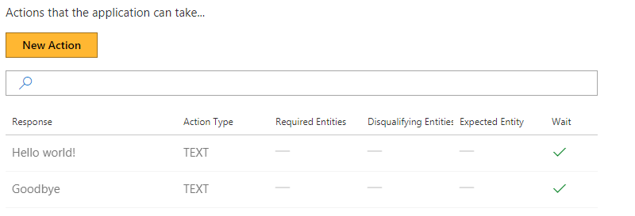
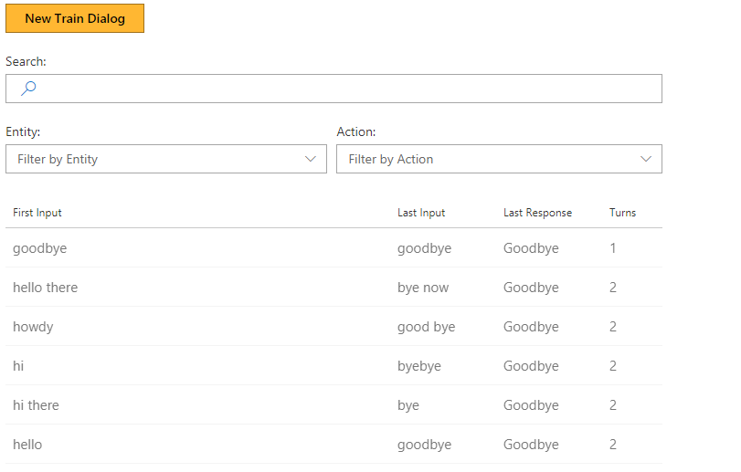

# How to create a "Hello World" model with Conversation Learner

This tutorial shows how to get started with Conversation Learner, including creating actions, teaching the Bot interactively, and making corrections of logged dialogs which come from end users.

## Video

## Requirements
If you haven't already, first ensure all setup steps have been completed, including creating a `.env` file with your LUIS authoring key.  See [Quickstart](https://github.com/Microsoft/ConversationLearner-Samples) for details.

This tutorial requires that the general tutorial Bot is running

	npm run tutorial-general

## Steps

Start on the home page in the Web UI.

### Create the Model
1. Click "New Model" button.
2. In the "Name" field, enter "Hello World"
3. Click "Create" button

You should now see the view of the model you created.

### Create an Action
1. Click "Actions" in the left pane.
2. Click "New Action" button.
	- An Action can be a text message that Conversation Learner returns to the user, an API call, or a card.
3. In "Bot's Response..." field type "Hello".
	- This is the response that the Bot will return.
4. Click "Create" button.

You have created the first Action that the Bot can perform, i.e. return a text response.

### Train Dialogs
This is where you Train the Model on how to respond to user utterances.

#### First Training Dialog

1. Click "Train Dialogs" on left pane.
2. Click "New Train Dialog" button.
3. Type "Hi" hit enter.
	- As an example of what the user might say in the beginning of a conversation.
4. Click "Score Actions" button.
5. Select "Hello".
	- You just completed one full turn in this example dialog. 
6. Enter "Goodbye".
7. Click "Score Actions" button.
8. Click "+ Action" button.
9. Enter 'Goodbye!' in "Bot's response..." field, then click "Create" button.
	- Notice that the Bot responded with that action you just created.
10. Click "Save" button. This will end and save this Training Dialog.

Now you have one Training Dialog in the Model, along with a single Entity and two Actions:

#### Second Training Dialog
Let's do one more training and see how the Bot responds.

1. Click "New Train Dialog" button.
2. Enter "Hi"
	- This is similar to the first dialog, and we expect to get a good score from the Bot.
3. Click "Score Action" button.
	- The position and score may not still be accurate enough and require additional teaching.
4. Select 'Hello'.
5. Enter 'bye'.
6. Click "Score Actions" button.
7. Select 'Goodbye!'
8. Click "Save" button.

### Log Dialogs
This is where you Test, View and Correct Conversations that you or real users have had with your Bot.

#### Test the Model as an End User
1. Click "Log Dialogs" on left pane
2. Click "New Log Dialog" button.
3. Enter "hello there"
4. Wait a short time, the Bot should respond automatically with "Hello"
5. Enter 'byebye'
6. Wait a short time, again the Bot should respond automatically with "Hello".
7. Click "Done Testing" button.

#### View and Correct a User Conversation
Using Log Dialogs, you can view the list of conversations users held with your Bot. You can also edit them in order to correct the Bot's responses and save the interactions as Training Dialogs. To do that:
1. In the grid, click on the log of the conversation.
2. Click on the last Bot action e.g. "Hello".
3. Select "Goodbye!" to correct the Bot.
4. Click "Save As Train Dialog" button.

## Next steps

> [!div class="nextstepaction"]
> [Wait and non-wait actions](./2-wait-vs-nonwait-actions.md)
