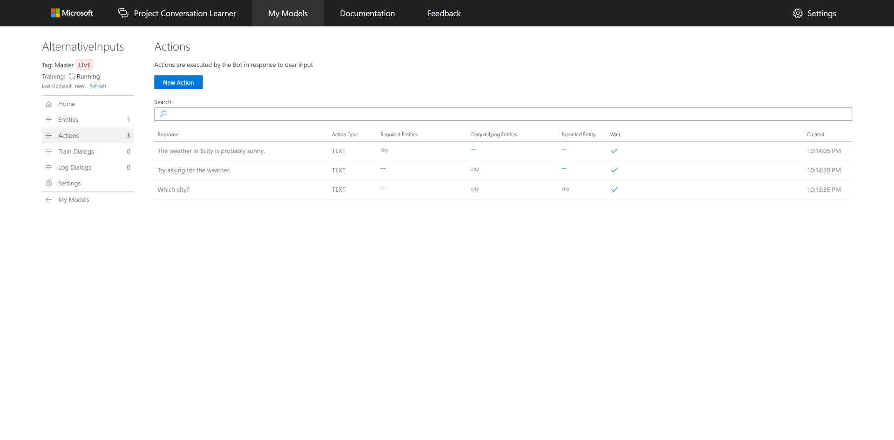
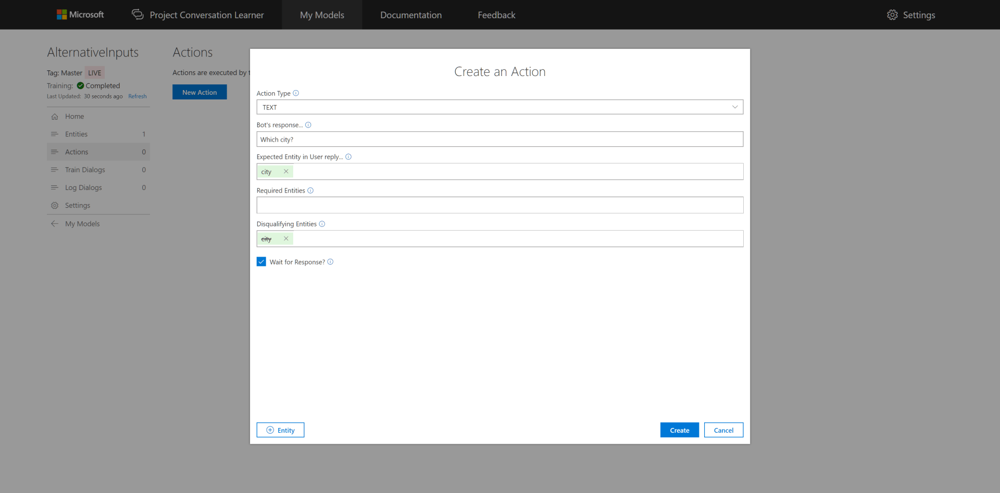
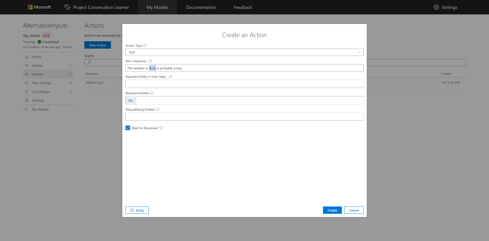
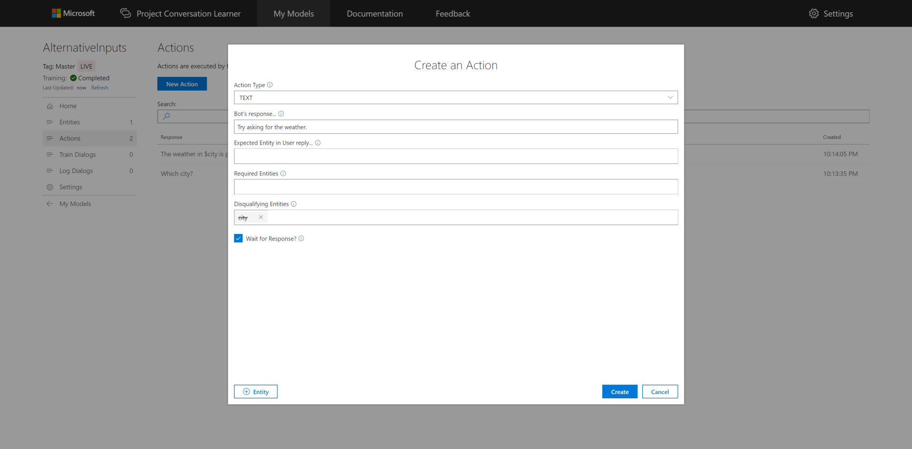
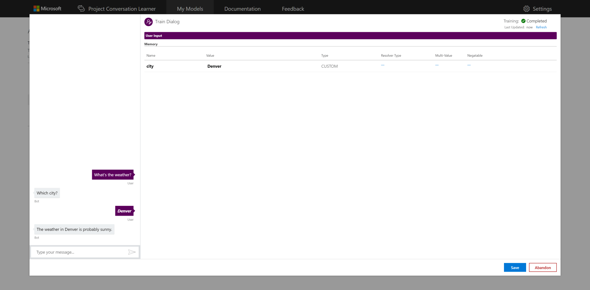
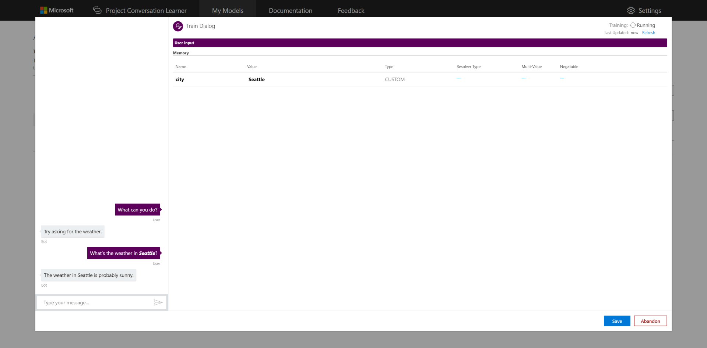
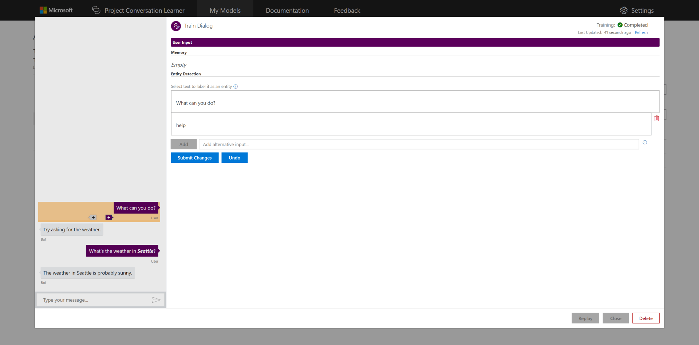
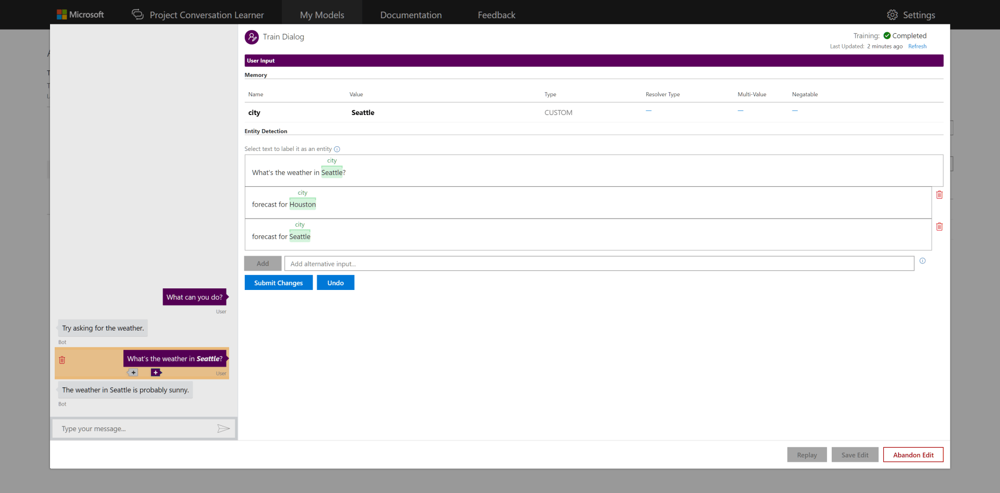
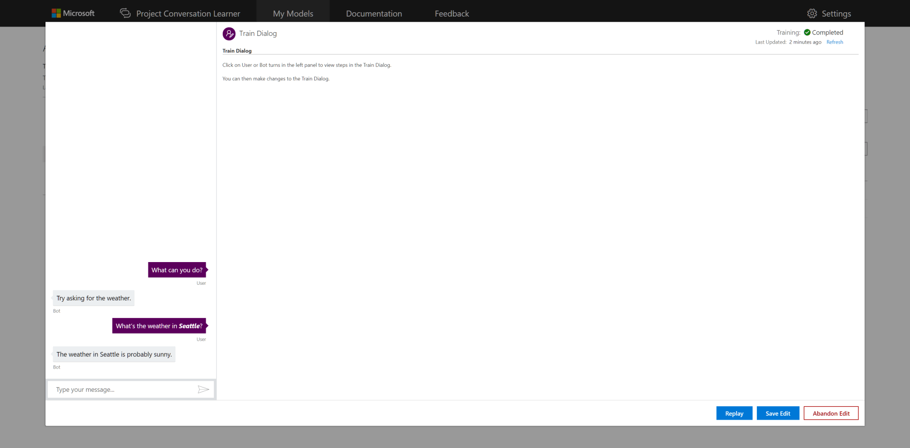
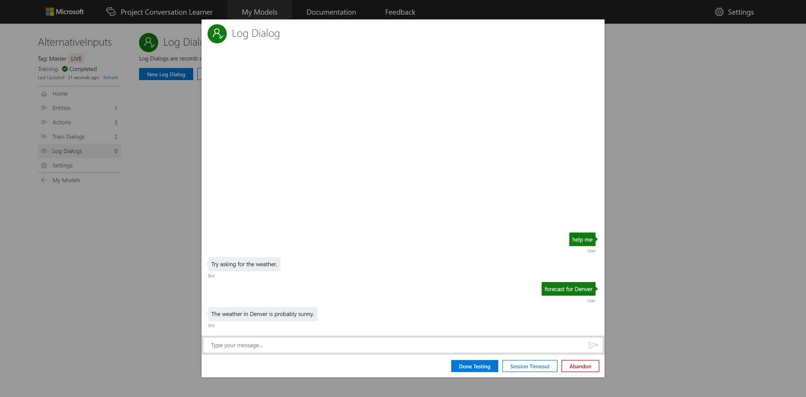

# How to use alternative inputs

This tutorial shows how to use the Alternative Inputs field for user utterances in the teaching interface.

## Video

## Requirements
This tutorial requires that the general tutorial bot is running

	npm run tutorial-general

## Details
Alternative inputs are alternate, semantically equivalent user utterances which the user might have said at a particular point in a training dialog. These alternative inputs allow you to more compactly specify variations of utterances without having to address each variation in separate training dialogs.

## Steps

### Create the Model

1. In the Web UI, click "New Model."
2. In the "Name" field, type "AlternativeInputs" and hit enter.
3. Click the "Create" button.

### Entity Creation

1. On the left panel, click "Entities", then the "New Entity" button.
2. Select "Custom Trained" for the "Entity Type."
3. Type "city" for the "Entity Name."
4. Click the "Create" button.

Now, let's create three actions.

### Create the First Action

1. On the left panel, click "Actions", then the "New Action" button.
2. In the "Bot's response..." field, type "Which city?"
3. In the "Expected Entity in User reply..." field, type "city."
4. In the "Disqualifying Entitles" field, type "city."
5. Click the "Create" button.

### Create the Second Action

1. On the left panel, click "Actions", then the "New Action" button.
2. In the "Bot's response..." field, type "The weather in $city is probably sunny."
3. Click the "Create" button.

### Create the Third Action

1. On the left panel, click "Actions", then the "New Action" button.
2. In the "Bot's response..." field, type "Try asking for the weather."
3. In the "Disqualifying Entitles" field, type "city."
4. Click the "Create" button.

You now have three actions.

### Train the Model

1. On the left panel, click "Train Dialogs", then the "New Train Dialog" button.
2. In the chat panel, where it says "Type your message...", type in "What's the weather?"
3. Click the "Score Actions" button.
4. Select the response, "Which city?"
5. In the chat panel, where it says "Type your message...", type in "Denver"
6. Click the "Score Actions" button.
7. Select the response, "The weather in Denver is probably sunny."
8. Click the "Submit Changes" button.

Let's train the model more by creating another train dialog.

### Second Model Train Dialog

1. On the left panel, click "Train Dialogs", then the "New Train Dialog" button.
2. In the chat panel, where it says "Type your message...", type in "What can you do?"
3. Click the "Score Actions" button.
4. Select the response, "Try asking for weather."
5. In the chat panel, where it says "Type your message...", type in "What's the weather in Seattle?"
6. Click "Seattle", then click "city" from the Entity List.
7. Click the "Score Actions" button.
8. Select the response, "The weather in Seattle is probably sunny."
9. Click the "Submit Changes" button.

### Third Model Train Dialog Using Alternative Input

1. On the left panel, click "Train Dialogs", then the "New Train Dialog" button.
2. In the chat panel, where it says "Type your message...", type in "help"
3. Click the "Score Actions" button.
	- The Model is uncertain to the best option, so it would choose the highest percentile by default.
4. Click the "Abandon Teaching" button, then "Confirm" button.

Let's better tune the system using alternative inputs. You can add alternative input while teaching or later.

1. On the left panel, click "Train Dialogs", then select "What can you do?" from the list of Train Dialogs.
1. Click the "What can you do?" utterance in the chat panel.
1. In the "Add alternative input..." field, type "help" and hit enter.
1. Click the "Save Changes" button.

Let's add another alternative input to handle Houston.

1. Click the "What's the weather in Seattle?" utterance in the chat panel.
1. In the "Add alternative input..." field, type "forecast for Houston" and hit enter.
   - The error message highlights the fact alternative inputs must be semantically equivalent and contain the same entities as the original utterance; not just the same values of entities. The presence of the same entities is required.
1. Click on "Houston" and select "city" from the Entities List.
1. In the "Add alternative input..." field, type "forecast for Seattle" and hit enter.
1. Click on "Seattle" and select "city" from the Entities List.
1. Click the "Save Changes" button.
1. Click the "Save Edit" button.

### Testing the Model

1. On the left panel, click "Log Dialogs", then the "New Log Dialog."
2. In the chat panel, where it says "Type your message...", type in "help me"
3. In the chat panel, where it says "Type your message...", type in "forecast for Denver"

## Next steps

> [!div class="nextstepaction"]
> [Log dialogs](./11-log-dialogs.md)
