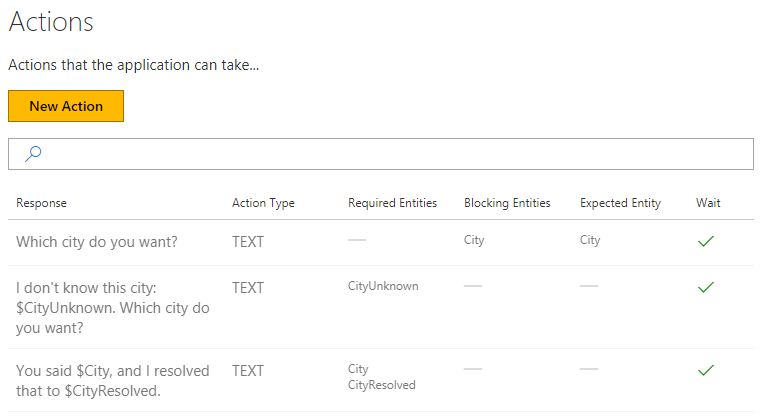

# How to use entity detection callback

This tutorial shows the entity detection callback, and illustrates a common pattern for resolving entities.

## Video

## Requirements
This tutorial requires that the `tutorialEntityDetectionCallback` bot is running.

	npm run tutorial-entity-detection

## Details
Entity detection callback enables using custom code to handle business rules related to entities. This demo uses callbacks and Programmatic Entities to resolve the city name entered by the user to a canonical name -- for example, resolving "the big apple" to "new york".

### Open the demo

In the model list, click on Tutorial-10-EntityDetectionCallback. 

### Entities

Three entities are defined in the model.

1. City is a custom entity that the user will provide as text input.
2. CityUnknown is a Programmatic Entity. This entity will get populated by the system. It will copy the user input if the system does not know which city it is.
3. CityResolved is the city that the system does know about. This entity will be city's canonical name for example 'the big apple' will resolve to 'new york'.

### Actions

Three actions are defined in the model.

1. The first action is 'Which city do you want?'
2. The second is 'I don't know this city, $CityUknown. Which city do you want?'
3. The third is 'You said $City, and I resolved that to $CityResolved.'

### Callback code

Let's look at the code. You can find the EntityDetectionCallback method in the C:\<installedpath>\src\demos\tutorialSessionCallbacks.ts file.

This function gets called after entity resolution has occurred.
 
- The first thing it will do is clear $CityUknown. $CityUknown will only persist for a single turn as it always gets cleared at the beginning.
- Then, get the list of cities that have been recognized. Take the first one, and attempt to resolve it.
- The function that resolves it (resolveCity) is defined further above in the code. It has a list of canonical city names. It finds the city name in the list, it returns it. Else, it looks in 'cityMap' and returns the mapped name. If it cannot find a city, it returns null.
- Finally, if the city has resolved to a name, we store it in $CityKnown entity. Else, clear what the user has said and populate $CityUknown entity.

### Train Dialogs

1. Click Train Dialogs, then New Train Dialog.
2. Type 'hello'.
3. Click Score Actions, and Select 'Which city do you want?'
2. Enter 'new york'.
	- The text is recognized as a city entity.
5. Click Score Actions
	- `City` and `CityResolved` have been populated.
6. Select 'You said $City, and I resolved that to $CityResolved'.
7. Click Done Teaching.

Add another example dialog:

1. Click New Train Dialog.
2. Type 'hello'.
3. Click Score Actions, and Select 'Which city do you want?'
2. Enter 'big apple'.
	- The text is recognized as a city entity.
5. Click Score Actions
	- `CityResolved` shows the effect of code running.
6. Select 'You said $City, and I resolved that to $CityResolved'.
7. Click Done Teaching.

Add another example dialog:

1. Click New Train Dialog.
2. Type 'hello'.
3. Click Score Actions, and Select 'Which city do you want?'
2. Enter 'foo'.
	- This is an example of a city the system does not know. 
5. Click Score Actions
6. Select 'I don't know this city, $CityUknown. Which city do you want?'.
7. Enter 'new york'.
8. Click Score Actions.
	- `CityUknown` has been cleared, and `CityResolved` is populated.
6. Select 'You said $City, and I resolved that to $CityResolved'.
7. Click Done Teaching.

## Next steps

> [!div class="nextstepaction"]
> [Session callbacks](./11-session-callbacks.md)
